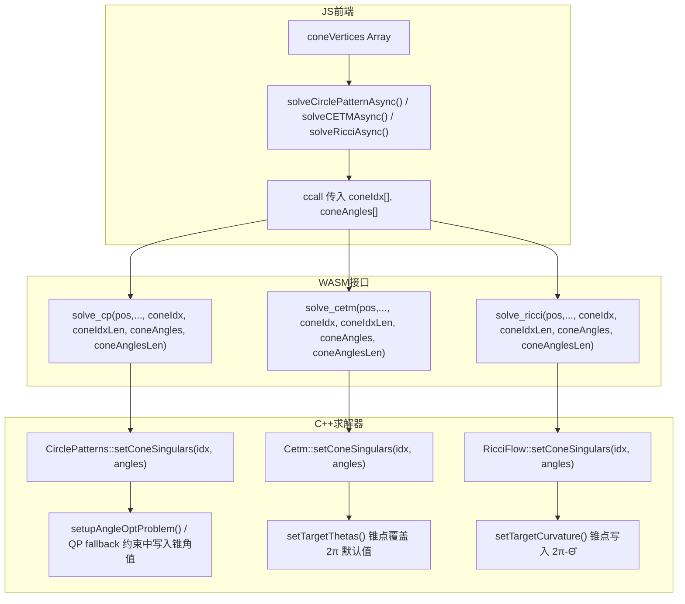

## 产品概述

在现有的 UV 展开工具中，为 CETM、CirclePatterns、RicciFlow 三个共形参数化求解器添加锥奇异点（cone singularity）支持。锥奇异点允许将高斯曲率集中到少数顶点上，从而大幅减少参数化的整体扭曲。

## 核心功能

- **锥奇异点参数传递**：C++ 求解器新增 `setConeSingulars()` 方法，接收锥顶点索引和目标锥角数组
- **CETM 锥点支持**：修改 `setTargetThetas()` 使锥顶点使用指定锥角值（如 4π、6π），非锥顶点保持默认 2π
- **CirclePatterns 锥点支持**：修改 MOSEK 角度优化约束和 QP fallback 路径中的顶点角度和约束，支持锥点自定义角度
- **RicciFlow 锥点支持**：修改 `setTargetCurvature()` 根据锥角计算目标曲率（K̄ = 2π - Θ̂）
- **WASM 接口扩展**：`solve_cp`、`solve_cetm`、`solve_ricci` 新增锥点参数
- **前端集成**：JS 端将用户选取/自动计算的锥顶点数据传入 WASM 求解器
- **向后兼容**：传入空锥点数组时行为完全不变

## 技术栈

- **C++ 求解器层**：C++17 + Eigen 3.x（线性代数）+ 自定义 Mesh/HalfEdge 数据结构
- **WASM 编译**：Emscripten (em++)，PowerShell 构建脚本
- **前端**：Vanilla JS + Three.js
- **锥奇异点理论**：离散共形几何中的锥度量（cone metric）

## 实现方案

### 理论转换关系

| 求解器 | 锥点操作 | 锥角 Θ̂=4π | 锥角 Θ̂=6π | 非锥顶点 |
| --- | --- | --- | --- | --- |
| CETM | 目标角度和 `thetas[v]` = Θ̂ | 4π | 6π | 2π |
| CirclePatterns | 顶点角度约束 = Θ̂ | 4π | 6π | 2π |
| RicciFlow | 目标曲率 `Ktarget[i]` = 2π - Θ̂ | -2π | -4π | 0 |


### 架构设计



### 关键设计决策

1. **每个求解器独立持有 `coneSingulars`**，而非放在基类 `Parameterization` 中，因为不同求解器对锥数据的解释不同（CETM/CP 直接存锥角；RicciFlow 需转换为曲率）
2. **空锥点数组 = 向后兼容**：不传锥点或传入空数组时，行为与当前完全一致
3. **MOSEK 和 QP fallback 两条路径都要修改**：CirclePatterns 在这两条代码路径中分别硬编码了 `2*M_PI`，必须都支持锥点

### 实现细节注意

- CirclePatterns 的 `setupAngleOptProblem()` 中顶点约束在 `setupAngleOptProblem()` 行 30-43 设置，修改前需先查 `coneSingulars`
- CirclePatterns 的 QP fallback 路径在 `computeAngles()` 行 167-176 中同样硬编码约束
- RicciFlow 的梯度公式 `∇E_i = K_i - K̄_i` 已正确使用 `Ktarget[i]`，无需改能量/梯度/海森计算，只需在 `setTargetCurvature()` 中正确赋值
- WASM 接口参数使用 `int*` + `int` + `double*` + `int` 四参数形式，与文档设计一致

## 目录结构

```
cpp/
├── conformal-parameterization/
│   └── uv_unwrap_simple/
│       ├── Cetm.h                  # [MODIFY] 添加 coneSingulars 成员和 setConeSingulars() 声明
│       ├── Cetm.cpp                # [MODIFY] 实现 setConeSingulars()，修改 setTargetThetas()
│       ├── CirclePatterns.h        # [MODIFY] 添加 coneSingulars 成员和 setConeSingulars() 声明
│       ├── CirclePatterns.cpp      # [MODIFY] 实现 setConeSingulars()，修改 MOSEK 和 QP 路径
│       ├── RicciFlow.h             # [MODIFY] 添加 coneSingulars 成员和 setConeSingulars() 声明
│       └── RicciFlow.cpp           # [MODIFY] 实现 setConeSingulars()，修改 setTargetCurvature()
├── build/
│   └── uv-unwrap-simple/
│       └── wasm_uv_unwrap_simple.cpp  # [MODIFY] solve_cp/solve_cetm/solve_ricci 添加锥点参数
uv-unwrap.html                       # [MODIFY] JS 端传递 coneVertices 数据到 WASM
```

## 关键代码结构

### 三个求解器的锥点成员变量（接口一致）

```cpp
// Cetm.h / CirclePatterns.h / RicciFlow.h 各添加：
#include <unordered_map>
#include <vector>

class Cetm / CirclePatterns / RicciFlow : public Parameterization {
public:
    void setConeSingulars(const std::vector<int>& coneIdx,
                          const std::vector<double>& coneAngles);
protected:
    std::unordered_map<int, double> coneSingulars;  // vertex_index → target_angle_sum
};
```

### WASM 接口新签名

```c
// wasm_uv_unwrap_simple.cpp
int solve_cp(double* pos, int posLen, int* faces, int faceLen, int optScheme,
             int* coneIdx, int coneIdxLen, double* coneAngles, int coneAnglesLen);
int solve_cetm(double* pos, int posLen, int* faces, int faceLen, int optScheme,
               int* coneIdx, int coneIdxLen, double* coneAngles, int coneAnglesLen);
int solve_ricci(double* pos, int posLen, int* faces, int faceLen, int optScheme,
                int* coneIdx, int coneIdxLen, double* coneAngles, int coneAnglesLen);
```