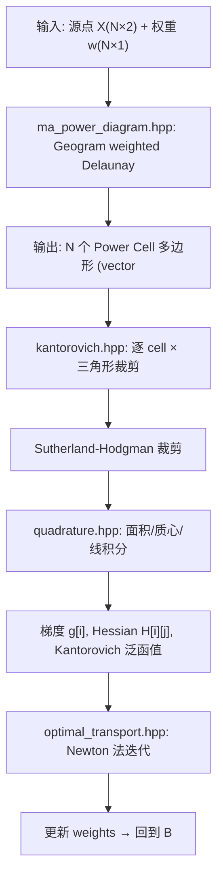

## 产品概述

用 Geogram 替换 CGAL 实现 MongeAmpere++ 库中的半离散最优传输（Semi-Discrete Optimal Transport），以最简单路径完成迁移。最终目标：通过 Emscripten 编译为 WASM，使最优传输计算能在浏览器中直接运行（semi-discrete-ot.html 页面）。

## 核心功能

- **Power Diagram 构建**：用 Geogram 的加权 Delaunay（weighted Delaunay）构建 Power Diagram，提取每个 site 的 Power Cell 为凸多边形
- **几何类型独立**：用简单的 Eigen 向量 + 自定义多边形/Segment 类型替换 CGAL 的 Point_2、Polygon_2、Segment_2 等
- **简化求交流程**：跳过原 BFS 传播裁剪算法（~300 行），改为"提取 Power Cell 多边形 → Sutherland-Hodgman 与密度三角形裁剪"的直白方式
- **WASM 编译**：CMake 添加 Emscripten 工具链，生成 .wasm + .js 供浏览器加载

## 技术栈

- **C++14**（沿用项目标准）
- **Eigen3** 用于线性代数（稀疏矩阵、向量）
- **Geogram** 替代 CGAL：`GEO::Delaunay2d` 加权 Delaunay 构建 Power Diagram
- **Emscripten** 交叉编译到 WASM
- **GMP/MPFR** 完全移除

## 实现方案

### 核心策略：用 Power Cell 多边形提取替代 BFS 传播求交

原代码的 `voronoi_triangulation_intersection_raw()` 是一个复杂的 BFS 算法，在 CGAL 的三角剖分数据结构上进行传播，边传播边用 radical_axis/bisector 裁剪。替换 CGAL 后必须跳过这个算法。

**新方案**：

1. Geogram 构建加权 Delaunay → 从对偶图提取每个 site 的 Power Cell 为凸多边形（`vector<Vec2>`）
2. 对每个 Power Cell 多边形，用 Sutherland-Hodgman 算法逐三角形裁剪
3. 裁剪结果直接用于面积/质心/线积分计算梯度与 Hessian

**性能说明**：BFS 传播的复杂度是 O(N * 平均 cell 边数 * 平均传播步数)，新方案的复杂度是 O(N * 密度三角形数 * 平均 cell 边数)。三角形数通常远大于 cell 传播步数，因此新方案有性能损耗。但作为原型和 WASM 演示场景完全可接受，后续可优化（如用空间索引加速三角形筛选）。

### 新增文件

**`include/MA/ma_geometry.hpp`** — 简单几何类型，零外部依赖

```
Vec2 { double x, y }    — 2D 向量（点、差向量）
Polygon = vector<Vec2>  — 多边形（按顺序排列的顶点）
Segment { Vec2 a, b }   — 线段
Line { Vec2 p, d }      — 直线（参数式）
```

提供：`dot`, `cross`, `squaredLength`, `midpoint`, `area(polygon)`, `lineLineIntersection`, `isLeft` 等基础函数。这些足够支撑 Power Cell 提取、Sutherland-Hodgman 裁剪、数值积分。

**`include/MA/ma_power_diagram.hpp`** — Geogram 包装

```cpp
// 输入: Nx3 矩阵 (x, y, weight), 输出: vector<Polygon> (每个 site 的 Power Cell)
vector<Polygon> compute_power_diagram(const Eigen::MatrixXd& points_weights);
```

内部使用 `GEO::Delaunay2d::create()` 构建加权 Delaunay，然后遍历对偶图提取每个 cell 的顶点。

### 修改文件

**`include/MA/quadrature.hpp`**：

- 将 `CGAL::Point_2<K>` 替换为 `Vec2`
- 将 `CGAL::Segment_2<K>` 替换为 `Segment`
- 将 `CGAL::Polygon_2<K>` 替换为 `Polygon`
- `CGAL::area(a,b,c)` → `area_triangle(a,b,c)`（用 cross product 实现）
- `sqrt(p.squared_length())` → `sqrt(squaredLength(p.a - p.b))`
- `CGAL::midpoint`, `CGAL::centroid` → 自实现

**`include/MA/kantorovich.hpp`**：

- 调用 `compute_power_diagram()` 替代 `make_regular_triangulation()`
- 对每个 Power Cell 多边形，遍历所有密度三角形做 Sutherland-Hodgman 裁剪
- 对裁剪后的 `Polygon` 计算：面积（梯度）、线积分（Hessian 非对角元）、二阶矩积分（Kantorovich 泛函值）

**`include/MA/common_rt.hpp`**：标记 deprecated，CGAL 类型定义不再需要

**`include/MA/predicates.hpp`**：标记 deprecated（radical_axis、power_distance 谓词不再需要）

**`include/MA/voronoi_triangulation_intersection.hpp`**：标记 deprecated（BFS 传播算法被替代）

**`CMakeLists.txt`**：

- 移除 `find_package(CGAL REQUIRED)`
- 添加 `find_package(geogram REQUIRED)`
- 移除 Boost 依赖（若仅用于 timer/chrono，可在 WASM 中用 `emscripten_get_now()` 替代）
- 补丁硬编码的 Eigen 路径，改为 `find_package(Eigen3)` 或条件设置
- 添加 Emscripten 平台判断：`if(EMSCRIPTEN)` 分支使用不同的编译/链接选项

### Emscripten 编译配置

```
if(EMSCRIPTEN)
  set(CMAKE_CXX_FLAGS "${CMAKE_CXX_FLAGS} -s WASM=1 -s ALLOW_MEMORY_GROWTH=1")
  set(CMAKE_EXECUTABLE_SUFFIX ".html")
  # 导出给 JS 调用的函数
  set(CMAKE_CXX_FLAGS "${CMAKE_CXX_FLAGS} -s EXPORTED_FUNCTIONS='[\"_solve_ot\"]'")
endif()
```

Geogram 官方已在 `cmake/platforms/emscripten.cmake` 中支持 Emscripten，只需 `-DCMAKE_TOOLCHAIN_FILE` 指向 Emscripten 即可。

## 架构设计



## 目录结构

```
cpp/MongeAmpere/
├── CMakeLists.txt                    # [MODIFY] CGAL→Geogram, +Emscripten 配置
├── include/
│   └── MA/
│       ├── ma_geometry.hpp           # [NEW] Vec2, Polygon, Segment 类型及基础运算
│       ├── ma_power_diagram.hpp      # [NEW] Geogram 加权 Delaunay 包装，提取 Power Cell 多边形
│       ├── kantorovich.hpp           # [MODIFY] 用新 power diagram + Sutherland-Hodgman 替换原 BFS 流程
│       ├── quadrature.hpp            # [MODIFY] CGAL 类型 → ma_geometry 类型
│       ├── common_rt.hpp             # [MODIFY] 标记 deprecated，CGAL typedef 不再需要
│       ├── predicates.hpp            # [MODIFY] 标记 deprecated
│       ├── voronoi_triangulation_intersection.hpp  # [MODIFY] 标记 deprecated
│       ├── functions.hpp             # [MODIFY] 适配新几何类型（barycentric, pl_function）
│       ├── optimal_transport.hpp     # [MINOR] 保持接口不变，依赖 kantorovich.hpp 适配
│       ├── voronoi_polygon_intersection.hpp  # [MODIFY] 适配新类型或标记 deprecated
│       └── polygon_intersection.hpp  # [MODIFY] 适配新类型或标记 deprecated
├── tests/
│   ├── CMakeLists.txt                # [MODIFY] 更新链接库 (CGAL→Geogram)
│   └── test_opttransport.cpp         # [MODIFY] 适配新 API
└── cmake/
    └── FindGeogram.cmake             # [NEW] Geogram 查找模块（如 Geogram 未自带）
```