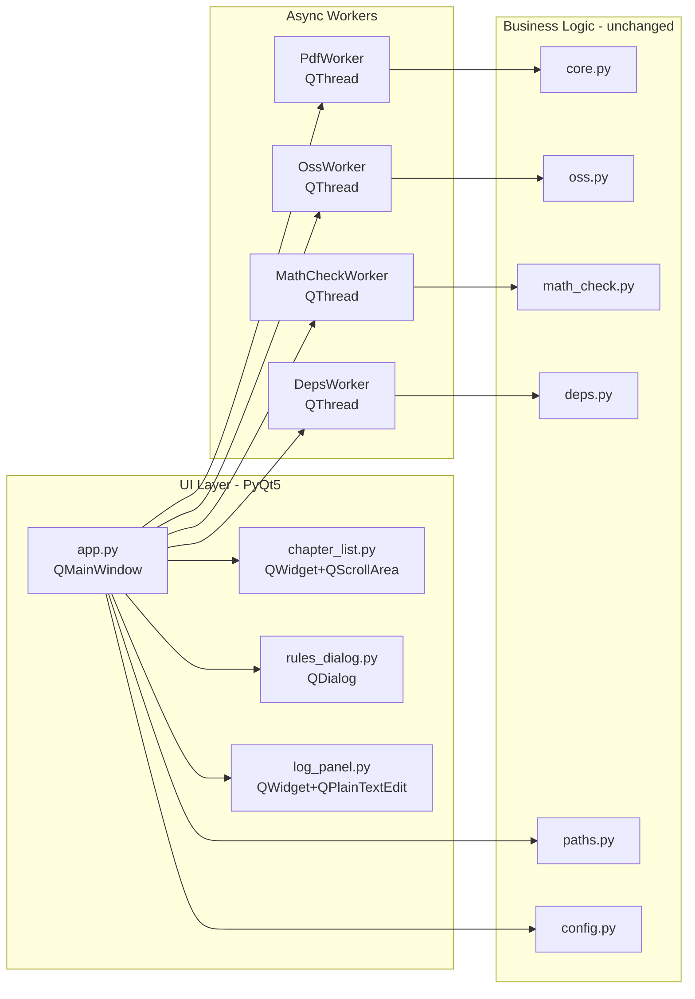

## 产品概述

将 PackPDF 文档整理工具的 UI 层从 Tkinter 迁移至 PyQt5，解决 macOS 上 _tkinter 不可用的问题，同时获得更现代的界面风格。核心业务逻辑（PDF 打包、OSS 图床上传、公式规范检查）完全不变。

## 核心功能

- **PDF 打包 Tab**：章节复选列表、文档标题/输出路径预览、单章/多章模式切换、pandoc/xelatex 依赖检测、生成 PDF 并打开
- **图床上传 Tab**：AccessKey 输入（Secret 密码遮盖）、记住密钥、扫描预览本地图片、上传至阿里云 OSS 并替换 Markdown 路径
- **公式检查 Tab**：目录选择、递归开关、检查结果弹窗（按规则分类展示错误/正确示例、问题明细列表）
- **运行日志面板**：INFO/WARN/ERROR 三色日志，支持清空，异步任务日志实时追加

## Tech Stack

- **UI 框架**: PyQt5 (Qt 5.15+)
- **语言**: Python 3.9+
- **业务模块（不变）**: oss2, PyPDF2, Pillow
- **项目管理**: 已有 requirements.txt、run.sh/run.bat

## Implementation Approach

### 整体策略

逐一替换 4 个 UI 文件，保持原有模块 import 路径和函数调用签名不变。主窗口 `app.py` 从 `tk.Tk` 子类改为 `QMainWindow`；3 个 UI 组件从 `ttk.Frame`/`tk.Toplevel` 改为 `QWidget`/`QDialog`；异步任务从 `threading.Thread` 改为 `QThread` + pyqtSignal。

### Tkinter → PyQt5 映射

| Tkinter | PyQt5 |
| --- | --- |
| `tk.Tk` | `QMainWindow` + `QApplication` |
| `ttk.Notebook` | `QTabWidget` |
| `ttk.LabelFrame` | `QGroupBox` |
| `ttk.Entry` + `tk.StringVar` | `QLineEdit` |
| `ttk.Checkbutton` + `tk.BooleanVar` | `QCheckBox` |
| `tk.Canvas` (scroll) + `ttk.Frame` | `QScrollArea` + `QWidget` |
| `scrolledtext.ScrolledText` | `QPlainTextEdit` |
| `messagebox.showinfo/showwarning/showerror/askyesno` | `QMessageBox` |
| `filedialog.askdirectory` | `QFileDialog.getExistingDirectory` |
| `threading.Thread` | `QThread` + `pyqtSignal` |
| `widget.after(0, callback)` | `pyqtSignal.emit()` from thread |
| `widget.pack()/grid()` | `QVBoxLayout` / `QHBoxLayout` / `QGridLayout` |


### 异步线程方案

使用 `QThread` 子类 + `pyqtSignal` 替代 `threading.Thread` + `self.after()`：

- 定义 `WorkerThread(QThread)`，通过 `finished = pyqtSignal(object)` 回传结果
- 线程内可调用 `log_signal.emit(msg, level)` 追加日志
- 主线程通过 `worker.finished.connect(on_done)` 接收完成通知
- 任务执行期间 `QPushButton.setEnabled(False)` 禁止重复提交

### 性能与可靠性

- 日志追加使用 `QPlainTextEdit.appendHtml()` 实现彩色，避免每次全量重绘
- `QScrollArea` 复选列表在 `resizeEvent` 中实现流式布局，复用 tkinter 版的 `_reflow` 算法
- 窗口几何、选择项通过 `AppConfig` 持久化到 `config.json`，时机为 `closeEvent`

## Architecture Design



## Directory Structure

```
Tools/PackPDF/
├── app.py                          # [REWRITE] QMainWindow 主窗口，3个Tab页+日志面板+异步工作线程
├── requirements.txt                # [MODIFY] 添加 PyQt5>=5.15
├── run.sh                          # [UNCHANGED] 入口脚本
├── run.bat                         # [UNCHANGED] 入口脚本
├── packpdf/
│   ├── config.py                   # [UNCHANGED] 配置读写
│   ├── core.py                     # [UNCHANGED] PDF打包核心
│   ├── oss.py                      # [UNCHANGED] OSS上传
│   ├── math_check.py               # [UNCHANGED] 公式检查
│   ├── paths.py                    # [UNCHANGED] 路径工具
│   ├── deps.py                     # [UNCHANGED] 依赖检测
│   ├── monograph.py                # [UNCHANGED] 专著构建
│   └── ui/
│       ├── __init__.py             # [UNCHANGED]
│       ├── chapter_list.py         # [REWRITE] QScrollArea 流式复选框章节列表
│       ├── rules_dialog.py         # [REWRITE] QDialog 检查报告 双Tab（规则+明细）
│       └── log_panel.py            # [REWRITE] QPlainTextEdit 三色日志面板
```

## Key Code Structures

### WorkerThread Base Class

```python
from PyQt5.QtCore import QThread, pyqtSignal

class WorkerThread(QThread):
    log_signal = pyqtSignal(str, str)  # (message, level: info|warn|error)
    finished_signal = pyqtSignal(object)  # result

    def _log(self, msg: str, level: str = 'info') -> None:
        self.log_signal.emit(msg, level)
```

### ChapterList Public API (保持不变)

```python
class ChapterList(QWidget):
    on_change: Callable[[], None] | None  # 构造参数
    def set_chapters(names: list[str], selected: set[str]) -> None: ...
    def get_selected() -> list[str]: ...
    def select_all() -> None: ...
    def select_none() -> None: ...
    def selected_set() -> set[str]: ...
```

### LogPanel Public API (保持不变)

```python
class LogPanel(QWidget):
    def clear() -> None: ...
    def append(msg: str, level: LogLevel) -> None: ...
    def info(msg: str) -> None: ...
    def warn(msg: str) -> None: ...
    def error(msg: str) -> None: ...
```