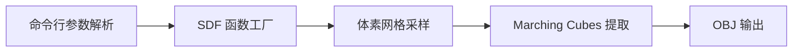

## 产品概述

在 `Tools/sdf_models/` 目录下实现一个纯 Python 脚本，用有符号距离场（SDF）表达高亏格曲面（high-genus surface），并通过手写的 Marching Cubes 算法将等值面转换为三角网格，输出 OBJ 文件。仅依赖 numpy 与 scipy，不引入 skimage/trimesh 等第三方库。

## 核心功能

- **SDF 定义（两种可切换模式）**
- torus 模式：多个环面（genus=1）做 CSG 并集（min），得到 genus=N 曲面。
- analytic 模式：含多个洞的解析隐式曲面，单场直接表达高亏格。
- **Marching Cubes 自实现**：内置标准 256 项三角表与 12 边表，对体素网格逐立方体判断等值面跨越，线性插值求边交点并生成三角形。
- **网格输出**：生成 OBJ 文件（顶点 `v` 与面 `f`，1-based 索引）。
- **命令行参数**：支持 `--mode`（torus/analytic）、`--genus`（亏格数）、`--res`（分辨率，默认 128）、`--out`（输出路径）等。

## 视觉与交互

脚本以命令行方式运行，输出为 OBJ 三角网格文件，可在任意 3D 查看器（如 MeshLab、Blender）中查看高亏格曲面形状；默认参数下网格规模适中（体素 128³，约数十万三角面）。

## 技术栈

- 语言：Python 3（命令行脚本）
- 数值计算：numpy 2.4.4、scipy 1.17.1（均已安装可用）
- 不新增第三方依赖（不安装 skimage、trimesh）
- 输出格式：OBJ（Wavefront）

## 实现方案

### 整体策略

单一脚本 `sdf_to_mesh.py`，采用「SDF 采样 → 自实现 Marching Cubes → OBJ 输出」三段式流程。核心是手写标准 MC 算法：对体素网格每个立方体，用 8 顶点场值与等值面（iso=0）比较生成 case 索引，查 edgeTable 确定活动边，线性插值求交点坐标，再查 triTable 生成三角形顶点序列。

### 关键设计决策

1. **SDF 与 MC 解耦**：将 SDF 定义为可调函数（`sdf_func(p: np.ndarray) -> np.ndarray`），MC 只依赖场值数组，便于扩展新曲面类型。模式切换通过函数工厂实现。
2. **torus 模式（genus=N）**：将 N 个环面沿一个圆周或主轴均匀分布，单个 torus SDF 用标准公式 `sdTorus(p) = norm([norm(p.xz)-R, p.y]) - r`，并集取 `min`，得到亏格为 N 的曲面。
3. **analytic 模式（单场多洞）**：采用经典 k 重旋转对称隐式环面族，例如 `(sqrt(x²+y²) - R)² + z² - r²` 在角度维度引入 k 重调制（如使用 cos(k·θ) 项），使单一场产生 genus=k 的多洞曲面，避免多物体并集。
4. **Marching Cubes 实现**：

- 内置标准 `edgeTable`（12 条边 → 立方体顶点对）与 `triTable`（256 项，每项顶点索引列表，-1 结束）。
- 体素网格：在包围盒 `[-1.2, 1.2]³`（略大于曲面）上生成 `(N+1)³` 顶点，`N³` 个立方体。
- 逐立方体计算 case 索引，用 `np.where`/向量化方式批量处理交点插值，平衡清晰度与性能。

5. **OBJ 输出**：直接输出插值得到的顶点与三角形（每条 MC 生成的三角形顶点已按 triTable 组织，无需全局去重即可得到闭合流形网格），面索引 1-based。

### 性能与复杂度

- 空间复杂度：O(N³) 存储场值数组（N=128 时约 2M 个 float，约 16MB，可接受）。
- 时间复杂度：O(N³) 遍历立方体；N=128 时约 2M 个立方体，纯 numpy 循环在数秒内完成。
- 优化点：SDF 采样用 numpy 向量化对整块网格批量计算；MC 主循环仅对跨越等值面的立方体（case!=0 且 !=255）处理，跳过完全内部/外部立方体以降低开销。
- 边界控制：包围盒需完整包裹曲面，确保等值面闭合；边界截断可能导致开放面，通过包围盒外扩余量规避。

## 实现注意事项

- **MC 表格正确性**：triTable/edgeTable 必须采用标准 Lorentz 方案，避免生成退化三角形或错位面；顶点序遵循右手定则以保证法向一致。
- **插值防除零**：边上两端场值相等时避免除零，回退取端点中点。
- **可复现性**：输出 OBJ 前打印顶点数、面数、亏格模式、分辨率等统计信息，便于验证。
- **日志与错误处理**：参数校验（genus 为正整数、mode 合法、res 为正整数），非法输入给出清晰报错；不输出敏感信息。
- **兼容性**：仅用 numpy/scipy 稳定 API，兼容 numpy 2.x。

## 架构设计

采用单一脚本内的分层结构（无需多文件，符合小型工具定位）：



- 参数解析层：`argparse` 定义 mode/genus/res/out 等参数。
- SDF 层：`make_torus_sdf(genus)` 与 `make_analytic_sdf(genus)` 返回向量化 SDF 函数。
- MC 层：`marching_cubes(field, spacing, origin)` 返回顶点数组与三角形索引数组。
- 输出层：`write_obj(verts, faces, path)` 写 OBJ 文件并打印统计。

## 目录结构

```
Tools/sdf_models/
└── sdf_to_mesh.py   # [NEW] 单文件脚本：SDF 定义 + 自实现 Marching Cubes + OBJ 输出
```

`Tools/sdf_models/` 当前为空，新建此脚本即可，无其他文件需改动。

# Agent Extensions

无。本任务为纯 Python 脚本实现，不需要调用任何 Skill、SubAgent 或 Integration。