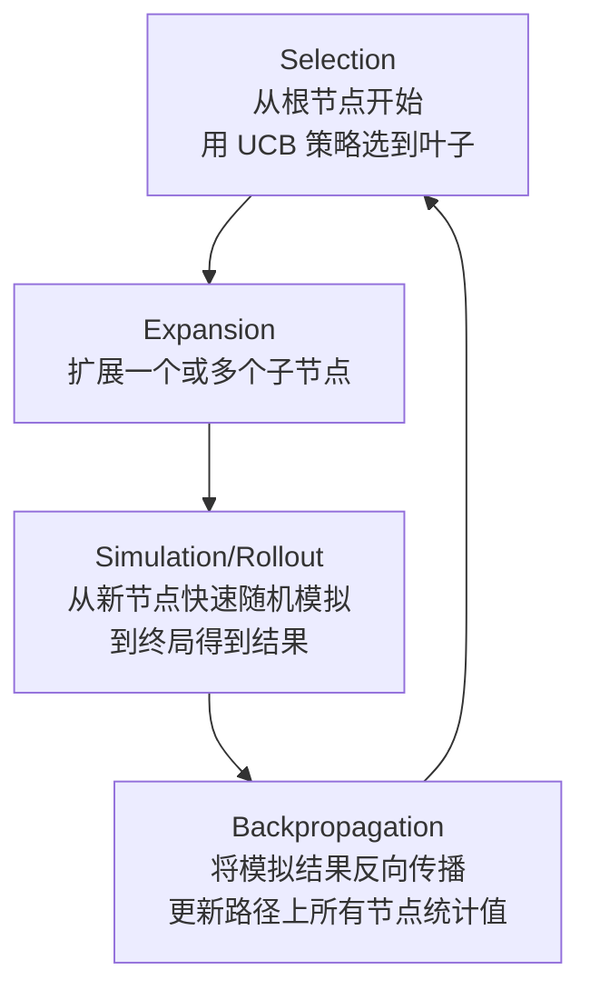
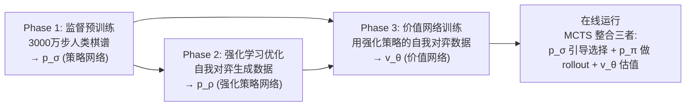

> **原始论文**：Silver et al., "Mastering the game of Go with deep neural networks and tree search", Nature 2016 (AlphaGo)
>
> 后续工作：AlphaGo Lee (2015), AlphaGo Fan (2017), AlphaGo Master (2017), **AlphaZero** (2018)

## 棋谱文件获取与解析

### SGF 文件格式

围棋棋谱的标准存储格式是 **Smart Game Format (.sgf)**：

```
(;GM[1]FF[4]SZ[19]
  PB[李世石]PW[AlphaGo]
  RE[B+R]   // 结果: 黑胜中盘告负
  ;B[pd];W[pp]    // B: 黑棋落子, W: 白棋落子
  ;B[dp];W[dc]
  ...
)
```

- 坐标编码：`a-s`（不含 `i`）对应 1-19 路，如 `pd` = 第 16 行第 4 列
- `;` 标记一步棋，`()` 表示根节点
- 可含注释 `C[...]`、变招分支等

### 解析库与数据源

```python
import sgf  # pip install sgf3 或 python-sgf

# 读取 SGF 文件
with open("game.sgf") as f:
    collection = sgf.parse(f.read())
    game = collection[0]

# 遍历棋步
for node in game.main_sequence_iter():
    color = 'B' if node.properties.get('B') else 'W'
    move = node.properties.get('B', node.properties.get('W'))[0]
    # move 如 'pd' -> 转换为 (15, 3) 坐标
```

### 主要数据集来源

| 数据源 | 规模 | 说明 |
|:-------|:-----|:-----|
| **GOBASE** | ~10 万+职业对局 | 最权威的职业棋谱数据库（部分需付费） |
| **KGS (KGS Server)** | 数百万级 | 在线对弈平台，含各段位棋手对局 |
| **Fox Go Server** | 百万级 | 日韩主要对弈服务器 |
| **CGOS** | 计算机对弈记录 | AI vs AI 对局，适合自我博弈数据 |

### 棋谱预处理要点

```
原始 SGF → 数据清洗 → 特征平面提取 → 训练样本生成

关键处理:
├── 坐标标准化：sgf坐标 → (row, col) 0~18
├── 过滤短对局：< 50 手的弃权/中断对局
├── 处理打劫规则：识别 ko 位置
├── 提取合法动作掩码：每步的 legal moves
└── 数据增强：旋转(×4) + 翻转(×2) = 8 种等价变换
```

### 特征平面设计

AlphaGo 将 $19 \times 19$ 的棋盘状态编码为 **$19 \times 19 \times K$** 的张量（特征平面栈）：

| 特征平面 | 数量 | 含义 |
|:---------|:-----|:-----|
| Stone color | 2 | 己方棋子位置、对方棋子位置 |
| Moves since last move | 2 | 己方/对方最近 1/2/4/8... 步是否下过 |
| Liberties | 8 | 有 1/2/3/4/5/6/7/≥8 口气的棋子 |
| Capture size | 8 | 提掉 1/2/3/4/5/6/7/≥8 子 |
| Self-atari size | 8 | 自身进入 1/2/3/4/5/6/7/≥8 子的打吃状态 |
| After-move liberty | 8 | 下完后剩余 1/2/3/4/5/6/7/≥8 口气 |
| Ladder capture | 1 | 征子（能否被征吃的判断） |
| Ladder escape | 1 | 征子逃逸 |
| Sensibleness | 1 | 是否不是明显坏棋（非填自己的眼） |
| Zobrist hash | ? | （可选）用于快速查重 |
| Color to play | 1 | 当前轮到谁（黑/白） |
| **总计** | **48** | 输入维度: $19 \times 19 \times 48$ |

---

## 原始的 MCTS 方法

在深度学习介入之前，**蒙特卡洛树搜索 (Monte Carlo Tree Search, MCTS)** 是计算机围棋的核心引擎。

### MCTS 四步骤

MCTS 通过反复迭代四个阶段来构建一棵搜索树：



#### Step 1: Selection（选择）

使用 **UCB1 (Upper Confidence Bound)** 策略平衡探索与利用：

$$\text{UCB1}(v_i) = \bar{Q}(v_i) + C_{puct} \cdot P(v_i) \cdot \frac{\sqrt{N(v)}}{1 + N(v_i)}$$

其中：
- $\bar{Q}(v_i)$：节点 $v_i$ 的平均行动价值
- $P(v_i)$：先验概率（来自策略网络的输出）
- $N(v)$：父节点访问次数
- $N(v_i)$：节点 $v_i$ 的访问次数
- $C_{puct}$：探索常数（AlphaGo 中设为 ~5）

**选择过程**：从根节点出发，每次选 UCB1 值最大的子节点，直到到达**叶节点**（未被充分展开的节点）。

#### Step 2: Expansion（扩展）

当叶节点的访问次数达到阈值时，为其创建子节点——即对所有**合法落子位置**创建对应的子节点。

#### Step 3: Simulation / Rollout（模拟）

对新扩展的节点进行**快速随机对弈**直到游戏结束（终局判定），得到结果 $z$：

$$z = \begin{cases} +1 & \text{黑胜} \\ -1 & \text{白胜} \\ 0 & \text{和棋/平局} \end{cases}$$

**纯随机 rollout 的局限**：
- 围棋状态空间约 $10^{170}$，纯随机几乎不可能走出好棋
- 改进：使用**轻量级的 pattern-based rollout policy**（快速手工规则 + 小型模式匹配）

#### Step 4: Backpropagation（回传）

将 rollout 结果沿搜索路径反向传播，更新每个经过节点的统计量：

$$\begin{aligned}
N(v) &\leftarrow N(v) + 1 \\
Q(v) &\leftarrow Q(v) + z \\
\bar{Q}(v) &= Q(v) / N(v)
\end{aligned}$$

### 最终决策

完成所有迭代后（如 1600 次），根据访问次数选择最终动作：

$$a^* = \arg\max_a N(\text{root}.child(a))$$

> 注意：选择的是**访问次数最多**的动作，而非 $Q$ 值最大的动作——因为高访问次数意味着经过了更多次的验证。

### UCT (Upper confidence bounds for Trees)

Kocsis & Szepesvári (2006) 提出，将 UCB1 应用于 MCTS 即得 **UCT 算法**：

$$\text{UCT}(v_i) = \bar{X}_i + C \sqrt{\frac{\ln n}{n_i}}$$

这是 AlphaGo 出现前计算机围棋程序（如 **CrazyStone**, **Zen**, **Pachi**, **Fuego**）的共同基础。

### 纯 MCTS 的瓶颈

| 问题 | 影响 |
|:-----|:-----|
| Rollout 质量差 | 随机模拟无法评估复杂战术（如杀棋、大模样） |
| 搜索深度受限 | 每次迭代只能走一次 selection，深层变化难触及 |
| 评价函数粗糙 | 仅靠胜负结果，无中间状态的精确估值 |
| 计算量大 | 达到人类水平需数百万次迭代 |

> **AlphaGo 的突破点**：用**深度神经网络**替代 rollout policy 和 evaluation function，同时用策略网络引导搜索方向。

---

## CNN 棋盘模式识别

### 为什么需要 CNN？

围棋棋盘本质上是一个 **$19 \times 19$ 的空间网格**，具有以下特点：

- **平移不变性**：角上的定式搬到边上也成立
- **局部性**：大多数棋的直接影响范围在周围几路内
- **层级模式**：基本眼形→小范围结构→大模样→全局形势

这与 CNN 的设计理念天然吻合。

### 策略网络 (Policy Network) $p_\sigma$

**任务**：给定棋盘状态 $s$，输出所有合法位置的**落子概率分布**：

$$p_\sigma(s, a) = P(a | s) = \text{Softmax}(f_\sigma(s)) \in [0,1]^{19 \times 19 + 1}$$

最后一维 `+1` 对应 **pass（虚手）** 动作。

#### 网络架构

```
Input: 19×19×K (特征平面栈)
  ↓
Convolution Layer:  filters=kernel_size×kernel_size, stride=1, padding=same
  ↓ (可选: 多个卷积层堆叠)
  ↓
ReLU Activation
  ↓ (重复 N 层)
  ↓
Fully Connected: 4096 units (或直接用 Global Average Pooling)
  ↓
Fully Connected: 19×19+1 units (362 维)
  ↓
Softmax → 362 维概率分布 (Σp = 1)
```

**AlphaGo 版本具体配置**：

| 层 | 类型 | 参数 | 输出尺寸 |
|:---|:-----|:-----|:---------|
| 0 | Input | - | $19 \times 19 \times 48$ |
| 1 | Conv | $5\times5$, 48 filters | $19 \times 19 \times 48$ |
| 2 | Conv | $5\times5$, 64 filters | $19 \times 19 \times 64$ |
| ... | ... | ... | ... |
| 12 | Conv | $3\times3$, 128 filters | $19 \times 19 \times 128$ |
| 13 | Conv | $3\times3$, 192 filters | $19 \times 19 \times 192$ |
| 14 | Conv | $1\times1$, 192 filters | $19 \times 19 \times 192$ |
| 15 | Softmax | 全连接 | $19 \times 19 + 1$ |

共 **13 层全卷积网络**（无池化层——因为空间信息至关重要）。

### 价值网络 (Value Network) $v_\theta$

**任务**：给定棋盘状态 $s$，预测当前局面对于**当前行棋方的期望胜率**：

$$v_\theta(s) \in [-1, +1] \quad (+1: 必胜, -1: 必败, 0: 五五开)$$

#### 架构差异（相比策略网络）

| | 策略网络 $p_\sigma$ | 价值网络 $v_\theta$ |
|:--|:---------------------|:----------------------|
| **输出** | 362 类概率（多分类） | 标量值（回归） |
| **末尾激活** | Softmax | Tanh |
| **最后卷积后** | Flatten → FC → FC(362) | Flatten → FC(256) → FC(1) → Tanh |
| **损失函数** | Cross Entropy | MSE Loss |
| **训练目标** | 匹配人类落子分布 | 预测实际胜负结果 |

### 监督学习预训练 (Supervised Learning)

**第一步**：先用**人类职业棋谱**做监督学习，给策略网络一个"好的起点"：

$$L_{SL}(\sigma) = -\sum_{(s,a)\in\mathcal{D}} \log p_\sigma(s, a)$$

其中 $\mathcal{D}$ 是从 KGS 等来源收集的 **3000 万步**棋谱数据。

**效果对比**：

| 方法 | 准确率 (Top-1) | Top-5 | 说明 |
|:-----|:---------------|:------|:-----|
| **线性分类器 (softmax on raw features)** | 18.3% | 38.1% | baseline |
| **2-layer NN** | 33.9% | 57.3% | 浅网络 |
| **CNN (AlphaGo's $p_\sigma$)** | **57.0%** | **85.6%** | 达到强业余段位水平 |
| **人类顶尖棋手** | ~55% | — | 参考基准 |

> 关键发现：仅靠监督学习，策略网络就已经达到了 **KGS 3-4 dan**（业余三四段）的水平！

### 快速走子策略 (Fast Rollout Policy $p_\pi$)

除了主策略网络 $p_\sigma$，AlphaGo 还使用了一个**更轻量的 rollout 策略**用于 MCTS 中的快速模拟：

| | 主策略网络 $p_\sigma$ | 快速走子 $p_\pi$ |
|:--|:---------------------|:-----------------|
| **用途** | 引导 MCTS 选择 + 扩展 | Rollout 阶段的快速模拟 |
| **架构** | 13 层 CNN | **线性 softmax**（或 1~2 层小型 CNN） |
| **特征** | 48 个特征平面 | 较少的手工特征模板 |
| **速度** | 较慢 (~ms/步) | **极快** (~μs/步) |
| **精度** | 高 | 较低（够用即可） |

$p_\pi$ 用**相同的监督学习方法**在棋谱上预训练，但模型容量刻意做小以换取速度。

---

## 强化学习方法

### AlphaGo 的完整训练 Pipeline

AlphaGo 的训练分为三个阶段，是**监督学习 + 强化学习 + 自我对弈**的组合：



### Phase 1: 监督学习（已在上一节详述）

$$\min_\sigma \mathbb{E}_{(s,a)\sim\mathcal{D}_{human}}[-\log p_\sigma(s,a)]$$

输出：**策略网络** $p_\sigma$

### Phase 2: 策略梯度强化学习

**目标**：让策略网络学会**赢棋**，而不仅仅是模仿人类。

#### 自我对弈数据生成

用当前的 $p_\sigma$ 作为玩家进行**自我对弈 (self-play)**：

$$\text{Self-play game } g: s_0 \xrightarrow{a_0 \sim p_\sigma} s_1 \xrightarrow{a_1 \sim p_\sigma} \cdots \xrightarrow{a_T} s_T \text{ (终局)}$$

每局产生奖励 $z_g \in \{-1, +1\}$（从当前行棋方视角）。

#### 策略梯度目标函数（类 REINFORCE）

用自我对弈的结果作为奖励信号，通过**策略梯度**优化：

$$\Delta\sigma \propto \sum_{t=0}^{T} \nabla_\sigma \log p_\sigma(s_t, a_t) \cdot z_g$$

**关键技巧 — 采样比例调整**：

为了防止自我对弈初期质量过低导致训练不稳定：

$$p_{sample}(a|s) = (1-\epsilon) \cdot p_\sigma(a|s) + \epsilon \cdot p_{uniform}(a|s)$$

$\epsilon$ 从 1.0（完全随机）逐步退火至 0。

#### 输出

强化学习后的策略网络记为 **$p_\rho$**（$\rho$ 表示 reinforced），其棋力已超越 $p_\sigma$ 和人类棋谱水平。

**棋力提升证据**：

| 策略 | 胜率 (vs. 随机) | 胜率 (vs. $p_\sigma$) | ELO Rating |
|:-----|:-----------------|:-----------------------|:------------|
| $p_\sigma$ (SL only) | ~80% | — | ~KGS 3d |
| $p_\rho$ (RL fine-tuned) | **~95%** | **~80%** | **远超人类顶级** |
| Pachi (纯 MCTS) | ~60% | < 20% | ~KGS 2d |

### Phase 3: 价值网络训练

**问题**：策略网络只告诉"该往哪下一步"，不回答"现在局势如何"。MCTS 需要一个**状态评估器**来剪枝搜索树。

#### 训练数据构建

用 $p_\rho$ 进行大量自我对弈，从每局中**均匀采样不同时间步的状态**作为训练样本：

$$\mathcal{D}_{value} = \{(s_i, z_{g(i)})\}, \quad s_i \text{ 来自第 } i \text{ 局的第 } t \text{ 步, } z_{g(i)} \text{ 为该局最终结果}$$

**重要细节 —— 去相关处理**：

同一对局中的相邻状态高度相关，直接全部用于训练会导致**严重的过拟合**（网络记住整局棋而非学会评估）。解决方案：

- 每局**只随机采样 1 个状态**
- 使用 **data augmentation**（8 种对称变换）
- 总计约 **3000 万独立状态**

#### 回归训练

$$\min_\theta \mathbb{E}_{(s,z)\sim\mathcal{D}_{value}}[(v_\theta(s) - z)^2]$$

#### 价值网络的惊人能力

| 方法 | 预测准确率 (胜/负) | 说明 |
|:-----|:---------------------|:-----|
| **随机猜测** | 50% | baseline |
| **用 $p_\sigma$ 的胜率近似** | ~55% | 粗糙估计 |
| **$v_\theta$ (AlphaGo value net)** | **~67%** | 从单一局面预测整局胜负！ |

67% 听起来不高，但在围棋这种信息不完全且超长序列决策问题中，**单看一帧就能以 67% 正确率预测最终胜负**是非常强的能力。这意味着价值网络捕捉到了人类难以言说的深层棋理。

### Phase 4: MCTS 集成

最终的 **AlphaGo 在线对弈系统**将三个网络整合进 MCTS：

```
AlphaGo MCTS 结构:

                    ┌─→ Root (当前局面 s₀)
                    │      │
                    │   Selection (UCT with PUCT)
                    │      │
                    │   Leaf Node Reached?
                    │   ├── Yes → Evaluate leaf:
                    │   │         ├─ v_θ(leaf_state) → 直接估值
                    │   │         └─ p_σ(leaf_state) → 获取先验概率 P
                    │   │         → 扩展子节点
                    │   │         → 开始 Rollout: p_π 快速模拟到终局 → 结果 r
                    │   │         → 叶节点总价值 = λ·v_θ + (1-λ)·r
                    │   │              (αGo Lee: λ=0.5)
                    │   └── No → 继续向下选择
                    │
                    Backpropagate: 更新路径上所有 Q, N 值
                    │
                 Repeat ×1600 times
                    │
               a* = argmax N(child)  ← 最终落子
```

#### 关键公式整合

$$\bar{V}(s_L) = \lambda \cdot v_\theta(s_L) + (1-\lambda) \cdot \mathbb{E}[z | \text{rollout from } s_L \text{ using } p_\pi]$$

$$Q(s,a) = \frac{1}{N(s,a)} \sum_{i=1}^{N(s,a)} V(s'_i) \quad \text{（子节点的平均估值）}$$

$$U(s,a) = Q(s,a) + C_{puct} \cdot P(s,a) \cdot \frac{\sqrt{\sum_b N(s,b)}}{1+N(s,a)} \quad \text{（选择公式）}$$

---

## 综合

### AlphaGo 各版本演进

| 版本 | 时间 | 里程碑 | 技术特点 |
|:-----|:-----|:--------|:---------|
| **AlphaGo Fan** | 2015.10 | 以 5:0 战胜欧洲冠军樊麾二段 | 首次公开亮相 |
| **AlphaGo Lee** | 2016.03 | **4:1 战胜李世石九段** | 震撼世界；使用了上述完整 pipeline |
| **AlphaGo Master** | 2017初 | 网上 60:0 横扫中日韩顶尖棋手 | 单机器 4 TPU；引入更多 RL 迭代 |
| **AlphaGo Zero** | 2017.10 | **从零自学，100:0 碾压 AlphaGo Lee** | 无需人类棋谱；统一网络；残差架构 |
| **AlphaZero** | 2018 | **通用框架：围棋/国际象棋/日本将棋均超越人类** | 终极形态 |

### AlphaGo Lee 的硬件配置

| 组件 | 规格 | 数量 |
|:-----|:-----|:-----|
| **CPU** | Intel Xeon | 1208 cores |
| **GPU (策略/价值网络推理)** | NVIDIA Tesla K40 | 176 台 |
| **TPU (自我对弈训练)** | Google custom ASIC | 未公开（推测数十台） |
| **分布式计算集群** | — | 约 1920 个 CPU/GPU 线程并行 MCTS |
| **功耗** | — | 约 1 MW |

### AlphaGo Zero 的革命性改进

AlphaGo Zero 相比原版 AlphaGo 做了**根本性的简化**：

```
AlphaGo (Lee):                         AlphaGo Zero:
────────────────────                  ────────────────────
1. 人类棋谱 SL 训练                     ❌ 完全不需要
2. 策略网络 + 价值网络 分离             ✅ 合并为单一 f_θ 网络
3. 策略网络 + 快速 rollout 并行         ❌ 去掉 rollout，只用价值头
4. 手工设计的特征平面                   ✅ 仅用黑白两色棋子 + 历史 7 步 + 轮次
5. 普通 CNN                            ✅ ResNet (20/40 blocks)
6. UCB/PUCT 选择                        ✅ 改进的 UCB (加入虚拟损失/dirtual loss)
```

**Zero 的训练过程**：

$$\text{Day 1: 随机 → Day 3: 超越 Fan → Day 21: 超越 Lee → Day 40: 超越 Master}$$

**零人类知识输入**，仅靠：
1. 围棋规则（合法落子判断）
2. 自我对弈
3. 一个神经网络

### AlphaZero 通用化

AlphaGo Zero 的思想被推广到其他完美信息博弈：

| 游戏 | AlphaZero 训练时长 | ELO 提升 | 备注 |
|:-----|:---------------------|----------|:-----|
| **围棋 (19×19)** | ~40 天 | 超越 AlphaGo Zero | |
| **国际象棋** | ~4 小时 | **超越 Stockfish 8**（引擎版） | Stockfish 用 αβ 搜索 + 手工评估函数 |
| **日本将棋 (Shogi)** | ~2 小时 | **超越 Elmo** | 同上 |
| **一般化** | 统一算法 | 三项全能 | 同一套代码、同一个网络架构 |

### 核心技术遗产

AlphaGo 系列留下的深远影响：

#### 1. MCTS + Deep Learning 范式

$$\pi(a|s) = N(s,a)^{1/\tau} \quad (\tau: \text{温度参数})$$

这一范式已被广泛复制于：
- **扑克**：Pluribus/Libratus (Texas Hold'em)
- **星际争霸**：AlphaStar
- **卡牌游戏**：DouZero (斗地主)
- **数学证明**：Lean Copilot

#### 2. 自我对弈 (Self-Play) 作为数据引擎

> **无需人类标注数据**——智能体自己生成的经验就是最好的训练材料。

这一思想催生了：
- **OpenAI Five**（Dota 2）：180 年自我对弈等效经验
- **MuZero**：甚至不需要已知规则，从像素中学出模型再自我对弈
- **EfficientZero**：在 Atari 上仅需 100k 环境交互就超越人类

#### 3. 价值引导搜索 (Value-Guided Search)

将**长期规划**（MCTS 搜索）与**直觉评估**（神经网络估值）结合，解决了传统规划方法中的**评估函数瓶颈**：

| 时代 | 评估方式 | 局限 |
|:-----|:---------|:-----|
| 传统 AI (Deep Blue) | **人工设计的评估函数**（材料分 + 位置加成） | 无法覆盖复杂局面 |
| 纯 MCTS (pre-2015) | **Rollout 结果** | 噪声大、方差高 |
| **AlphaGo 系列** | **神经网络估值** | 低偏差、端到端可微 |

#### 4. 探索-利用的最优平衡

PUCT 公式中的 $C_{puct}$ 参数体现了深刻的数学洞察：

$$U(s,a) = Q(s,a) \underbrace{+ C \cdot P(a|s) \cdot \frac{\sqrt{n_s}}{1+n_{sa}}}_{\text{探索项：先验概率越高、探索越少，则越倾向于尝试}}$$

- $Q$ 代表**利用 (exploitation)**：历史经验表明这个动作好不好
- 第二项代表**探索 (exploration)**：策略网络认为这个动作有多大潜力
- 两者的平衡由 $C$ 控制，且随 $n_{sa}$ 增长自动衰减（置信度越高，越信任 $Q$）

### 局限性与开放问题

| 问题 | 说明 |
|:-----|:-----|
| **计算成本极高** | AlphaGo Lee 每步约需数千万次 MCTS 迭代，单机无法复现 |
| **不可解释性** | 神经网络的下法往往超出人类理解（如 vs 李世石 "God Move 37"） |
| **泛化到不完美信息博弈困难** | 隐藏信息（如对手手牌）使得 MCTS 的确定性假设失效 |
| **对环境依赖强** | 自我对弈要求环境可高速仿真；现实世界的机器人控制无法如此高效地 self-play |
| **Sample efficiency** | 即使是 AlphaZero 也需要海量自我对弈才能收敛 |

### 延伸阅读路线

```
入门:
├── Silver, D. et al. "Mastering the game of Go..." Nature 2016  ← AlphaGo 原始论文 ⭐⭐⭐
│
进阶:
├── Silver, D. et al. "Mastering the game of Go without human knowledge" Nature 2017  ← AlphaGo Zero ⭐⭐⭐
├── Silver, D. et al. "A general reinforcement learning algorithm that masters chess, shogi, and Go" Science 2018  ← AlphaZero ⭐⭐⭐
│
前沿:
├── Schrittwieser, J. et al. "Mastering Atari, Go, Chess and Shogi by Planning with a Learned Model" 2020  ← MuZero ⭐⭐⭐
├── Ye, H. et al. "Mastering Atari Games with Sample-Efficient MCTS" ICLR 2022  ← EfficientZero
│
理论基础:
├── Kocsis, Szepesvári "Bandit based Monte-Carlo Planning" ECML 2006  ← UCT 原论文
├── Browne et al. "A Survey of Monte Carlo Tree Methods" IEEE TCIAIG 2012  ← MCTS 综述
└── Sutton, Barto "Reinforcement Learning: An Introduction" Ch. 2  ← MDP 基础
```
