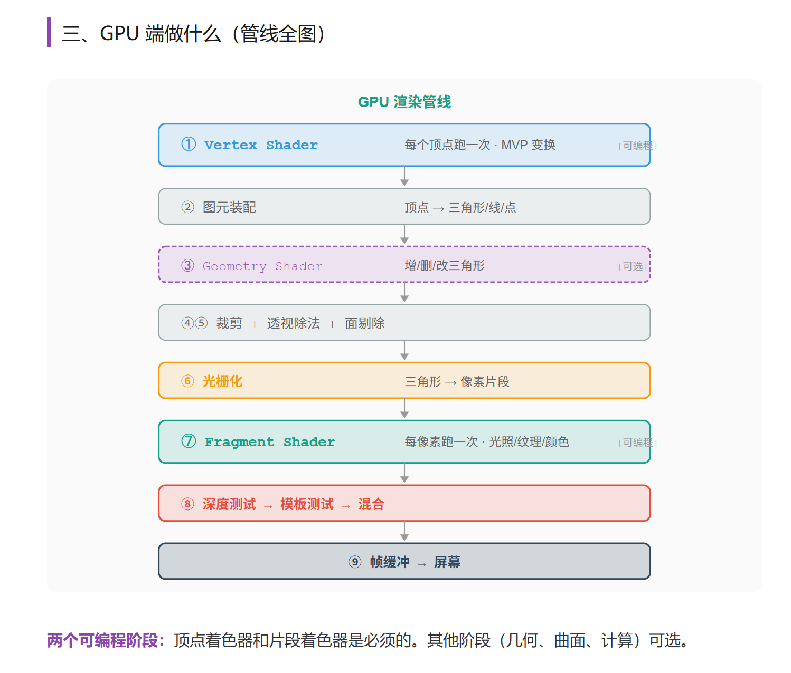

### 力扣DSA

* LeetCode 股票问题手写实现
* 对MonteCarlo的理解

### Unity

* 所做过的关于性能优化的案例(Unity)

* C#委托的理解

* C#的装箱与拆箱

* 做过什么游戏系统，遇到过什么难解决的问题如何解决

* 你们游戏中的光照和阴影

* **什么叫 Canvas 重建？（UICanvas Rebuild）**

  **当 Canvas 下的 UI 发生变化时，Unity 需要重新整理这批 UI 的显示数据，这件事就可以先理解成 Canvas 重建。**

  你可以把它想成：

  原本这一批 UI 已经组织好了，
  但其中某些元素一变，原来的结果可能就不能直接用了，于是系统要重新处理一遍。

  这件事真正值得注意的地方，不在于“它会不会发生”，
  而在于：

  **它影响的范围，经常比直觉里想得更大。**

  比如同样是改一个文本：

  - 如果它在一个独立的小 Canvas 里，影响通常比较有限
  - 如果它在一个很大的主界面 Canvas 里，影响可能就会被放大很多

  所以 Canvas 重建不是单纯看“你改了什么”，还要看：

  **你改的东西，处在什么边界里。**

* UGUI 坐标系的理解

问题描述：3D游戏中的怪物死亡会随机掉落一个宝箱，当有宝箱掉落时需要实现一个 UI 宝箱效果，从怪物当时所在的屏幕坐标处飞到游戏的宝箱 UI 上，然后宝箱计数加1。 

解决思路：宝箱的动画属于 UI层 的东西，需要在 UI 坐标系上进行；需要将怪物的 3D世界坐标 转换成 2D的UI坐标。为了解决以上问题，我们先来了解一下UGUI中涉及到的坐标系，我把这些坐标系总结为三个类型：屏幕坐标系，UI逻辑坐标系和UI世界坐标系。

### 音视频

* 旋转矩阵的推导->投影矩阵的推导

* 对OES纹理的理解

* C++移动语义的理解

* VAO，VBO的理解

* EGL是什么，怎么用的

  
  
  
  
  
  
  
  
  三维重建

* 用CUDA写过什么算子