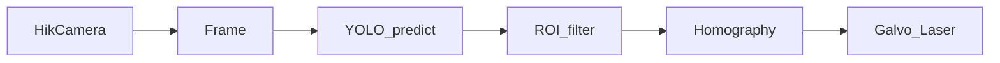
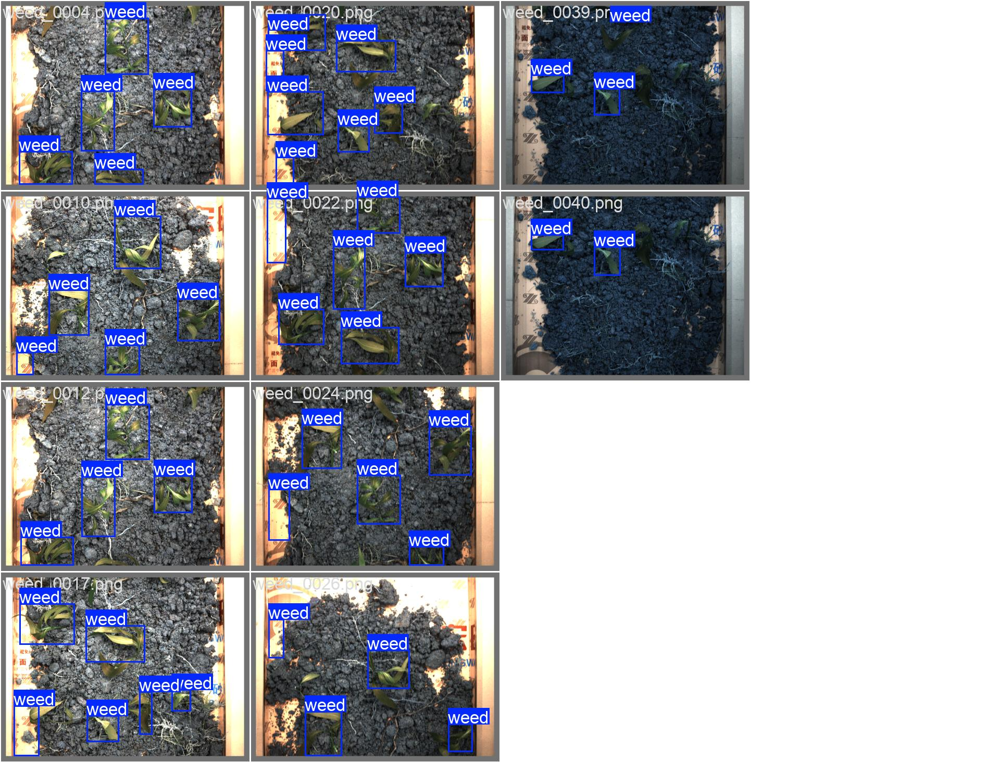

# YOLO 杂草模型重训练指南

项目使用 [Ultralytics YOLO](https://github.com/ultralytics/ultralytics) 做实时杂草检测，推理入口为：

- `workers/realtime_workers.py` — GUI 杂草检测线程
- `hik_realtime_detect.py` — 命令行实时检测

默认模型为 `model/new.pt`，推理参数 `conf=0.25`、`imgsz=640`（见 `runtime_config.json`）。

**为何需要重训练：**

1. 旧模型类别为 `ridderzuring`（欧洲特定植物），**与现场杂草场景不匹配**
2. 无针对本相机角度、光照、土壤背景的训练数据，泛化能力差
3. 推理时有硬编码 ROI（`x: 750–2030, y: 185–1850`），模型需在全图上先检准，再由 ROI 筛选目标

**检测类别：** 单类 `weed`（杂草，不区分种类）

---

## 流程概览

```
采集图片 → 标注 → 划分 train/val → 训练 → 验证 → 部署到 model/new.pt
```

| 步骤 | 脚本 | 输出 |
|------|------|------|
| 1. 采集 | `collect_dataset.py` | `dataset/raw/weed_*.png` |
| 2. 标注 | LabelImg / Roboflow 等 | `dataset/labels/raw/*.txt` |
| 3. 划分 | `split_dataset.py` | `dataset/images/{train,val}/` |
| 4. 训练 | `train_weed.py` | `runs/detect/weed_v1/weights/best.pt` |
| 5. 验证部署 | `validate_weed.py --deploy` | `model/new.pt` + 更新 `conf` |

---

## 环境准备

```bash
pip install -r requirements.txt
```

主要依赖：`ultralytics>=8.4`、`opencv-python`、`numpy`

训练建议使用带 NVIDIA GPU 的环境；无 GPU 可加 `--device cpu`（速度较慢）。

---

## 第 1 步：采集训练图片

```bash
python collect_dataset.py
python collect_dataset.py --list-devices
python collect_dataset.py --no-gui          # 无预览窗口（headless OpenCV 环境）
python collect_dataset.py --sn YOUR_CAMERA_SN
```

**操作说明：**

- 连接海康相机，实时预览画面
- 按 `S` 或空格保存当前帧
- 按 `Q` 或 `ESC` 退出

**若提示 OpenCV 无 GUI 支持：** 脚本会自动切换到无预览模式，在终端按 `S`/空格保存。也可显式加 `--no-gui`。若要恢复预览窗口：

```bash
pip uninstall opencv-python-headless -y
pip install -U opencv-python
```

（注意：`easyocr` 等包可能依赖 headless 版，卸载后若冲突可继续使用 `--no-gui` 采集。）

**采集建议：**

- 使用与作业时**同一台相机**、相同安装高度和焦距
- 目标 **300–500 张以上**（越多越好）
- 覆盖不同光照（晴/阴、早晚）、土壤状态（湿/干）
- 杂草大小多样：幼苗、成株、贴近作物
- 包含约 **20–30% 无杂草** 的负样本，减少误检
- 保留全图，采集阶段无需裁剪 ROI

图片命名格式：`weed_0001.png`、`weed_0002.png` …

---

## 第 2 步：标注数据

### 推荐工具

| 工具 | 说明 |
|------|------|
| [LabelImg](https://github.com/HumanSignal/labelImg) | 本地免费，直接导出 YOLO 格式 |
| [Roboflow](https://roboflow.com) | 在线协作，自动划分与增强 |
| [CVAT](https://www.cvat.ai) | 适合大量图片、团队标注 |

### 标注规则

- **单类别**：class id = `0`，名称 = `weed`
- 框要紧贴杂草轮廓；幼苗可框整株
- 不要框作物、阴影、土块（无杂草图片留空即可，作为负样本）
- 导出格式：**YOLO**（每图一个 `.txt`，内容为归一化 `class cx cy w h`）

### 标签存放位置（二选一）

1. **推荐**：图片在 `dataset/raw/`，标签在 `dataset/labels/raw/`（与图片同名 `.txt`）
2. 标签与图片同目录：`dataset/raw/*.txt`

### LabelImg 设置

1. 打开 `dataset/raw` 目录
2. 格式选 **YOLO**
3. 保存目录设为 `dataset/labels/raw`
4. 创建类别 `weed`（或仅使用 class 0）

---

## 第 3 步：划分 train / val

```bash
python split_dataset.py
python split_dataset.py --val-ratio 0.2 --seed 42
python split_dataset.py --move   # 移动而非复制（默认复制）
```

默认按 **8:2** 随机划分到：

```
dataset/
  data.yaml
  images/
    train/
    val/
  labels/
    train/
    val/
```

`dataset/data.yaml` 内容：

```yaml
path: dataset
train: images/train
val: images/val

names:
  0: weed
```

---

## 第 4 步：训练模型

```bash
python train_weed.py
python train_weed.py --model yolo12n.pt --epochs 150 --batch 8
python train_weed.py --model yolo12l.pt --batch 4 --device 0
```

### 常用参数

| 参数 | 默认值 | 说明 |
|------|--------|------|
| `--model` | `yolo11n.pt` | 预训练权重 |
| `--epochs` | `100` | 训练轮数 |
| `--imgsz` | `640` | 输入尺寸（需与推理一致） |
| `--batch` | `16` | 批大小，按显存调整 |
| `--patience` | `20` | 早停 patience |
| `--name` | `weed_v1` | 实验名称 |

### 模型选型

| 权重 | 速度 | 精度 | 适用 |
|------|------|------|------|
| `yolo11n.pt` / `yolo12n.pt` | 快 | 一般 | 实时性优先 |
| `yolo12l.pt` | 慢 | 较高 | 小杂草、精度优先 |

**不建议**在旧 `model/new.pt`（ridderzuring）上继续训练，场景与类别均不匹配。

### 训练输出

- 最佳权重：`runs/detect/weed_v1/weights/best.pt`
- 训练曲线与指标：同目录下 `results.png`、`confusion_matrix.png` 等

### 关注指标

- `mAP50`：IoU=0.5 时的平均精度
- `mAP50-95`：更严格的综合指标
- 若 `mAP50 < 0.6`，通常需补充数据或改善标注质量

---

## 第 5 步：验证与部署

```bash
# 验证 mAP + 目视检查
python validate_weed.py --weights runs/detect/weed_v1/weights/best.pt --save-predict

# 满意后部署到默认模型路径
python validate_weed.py --weights runs/detect/weed_v1/weights/best.pt --deploy

# 自定义置信度与部署路径
python validate_weed.py --weights runs/detect/weed_v1/weights/best.pt --deploy --conf 0.35 --deploy-path model/weed_v1.pt
```

`--deploy` 会：

1. 将 `best.pt` 复制为 `model/new.pt`（或 `--deploy-path` 指定路径）
2. 根据验证 mAP 自动建议并更新 `runtime_config.json` 中的 `detection.conf`

### 部署后使用

```bash
# 命令行
python hik_realtime_detect.py --model model/new.pt

# GUI（calibrate_main.py）
set MODEL_PATH=model/new.pt
```

---

## 与现有检测流程的关系



- 推理代码不区分类别，所有检测框均视为杂草目标
- ROI 在 `workers/realtime_workers.py` 中硬编码，取 ROI 内置信度最高的框
- 新模型替换后，若 ROI 外漏检多，需调整 ROI 或扩大采集时覆盖该区域

---

## 数据量参考

| 阶段 | 图片数 | 预期效果 |
|------|--------|----------|
| 最小可用 | 200–300 | 基本能检，易漏检 |
| 推荐 | 500–1000 | 现场可用 |
| 较好 | 1000+ | 多场景稳定 |

**标注质量比数量更重要**：100 张精准标注优于 500 张粗糙标注。

---

## 常见问题

### 漏检多

- 增加小杂草、逆光、模糊场景样本
- 尝试更大模型：`python train_weed.py --model yolo12l.pt`
- 适当降低 `conf`（如 0.2）

### 误检多

- 增加无杂草土面、作物近景等负样本
- 提高 `conf`（如 0.35–0.5）

### 框位置偏移

- 检查标注是否贴边
- 确认训练与推理 `imgsz` 均为 640

### 训练报错「训练集或验证集为空」

- 确认已标注并运行 `python split_dataset.py`
- 检查 `dataset/images/train` 和 `dataset/images/val` 是否有图片

### 训练很慢

- 使用 GPU：`python train_weed.py --device 0`
- 减小 `--batch` 或使用更小模型 `yolo11n.pt`

---

## 相关文件索引

| 文件 | 说明 |
|------|------|
| `collect_dataset.py` | 海康相机采图 |
| `split_dataset.py` | 划分 train/val |
| `train_weed.py` | 训练脚本 |
| `validate_weed.py` | 验证与部署 |
| `dataset/data.yaml` | 数据集配置 |
| `requirements.txt` | Python 依赖 |
| `runtime_config.json` | 运行时 `detection.conf` |
| `workers/realtime_workers.py` | GUI 推理与 ROI |
| `hik_realtime_detect.py` | CLI 实时检测 |

---

## 快速命令备忘

```bash
# 完整流程（在项目根目录执行）
python collect_dataset.py
# → LabelImg 标注 dataset/raw
python split_dataset.py
python train_weed.py
python validate_weed.py --weights runs/detect/weed_v1/weights/best.pt --save-predict --deploy
```

---

### 训练结果


