## 原始测试数据

采用这种主体较为集中的草

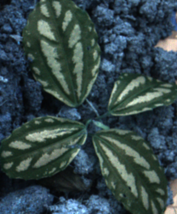

数据原始采集张数：98，采集不同曝光和增益的数据进行训练，小车多次来回删除相似图像

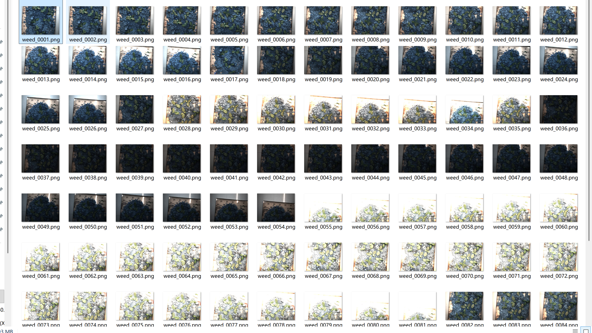


### **yolo目标检测无法解决当前的问题**

yolo的不足，无法准确识别根部。根部识别难点：有时图像是不完整的，先出现叶子后面出现根部，如何确定一个完整对象之后再打击根部？并且多处叶子识别框相互重叠

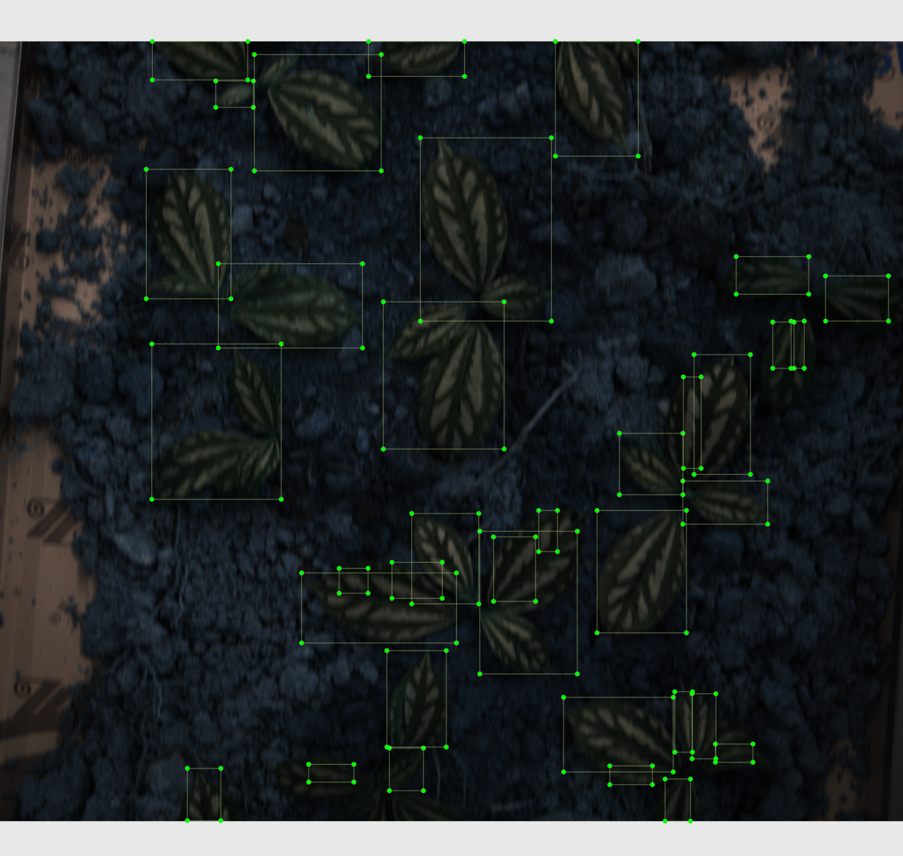

考虑采用实例分割模型，更能精准定位到中心根部

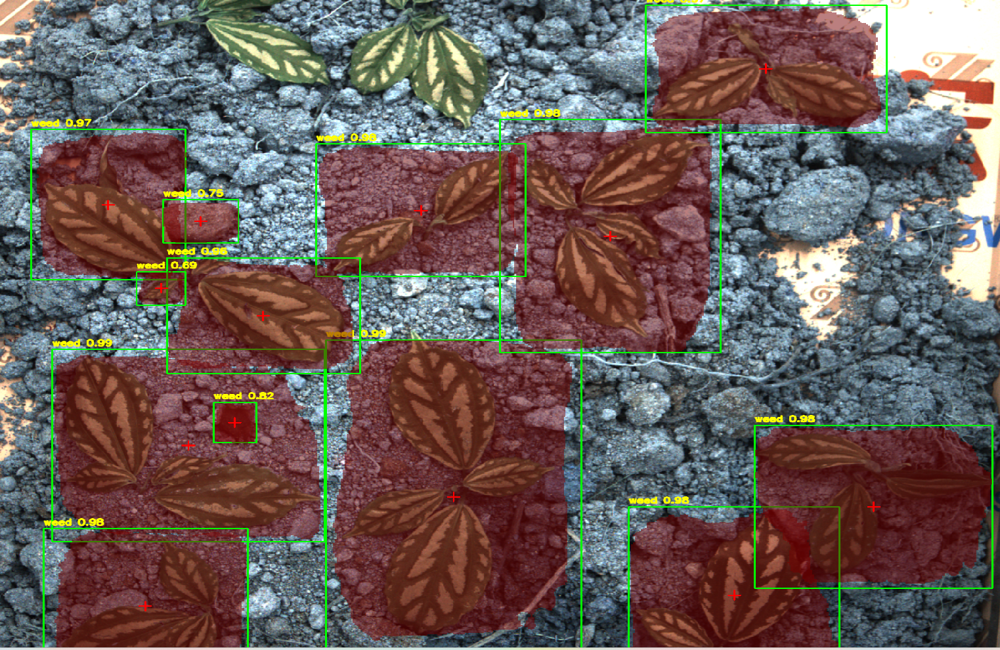


## 实例分割模型理论

#### MaskRCNN -经典简单

两阶段可能无法实时：1.候选区域生成（Region Proposal） 2.目标分类、边界框精修与掩码预测

### 

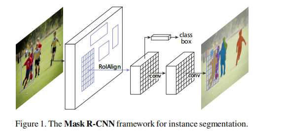

#### ROIAlign

虚线网格表示特征图，实线表示一个 RoI（本例中分为 2×2 的格子），每个格子内的圆点表示 4 个采样点。ROIAlign 通过特征图上邻近网格点的双线性插值来计算每个采样点的值。RoI、其格子划分以及采样点所涉及的所有坐标均不进行量化。

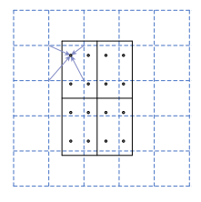

#### **Head Architecture**

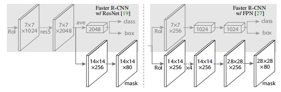

我们扩展了 Faster R-CNN 的两种现有头部结构 [左/右图分别对应 ResNet C4 和 FPN 骨干网络的头部，均添加了 mask 分支。数字表示空间分辨率与通道数。箭头表示 conv、deconv 或 fc 层（conv 保持空间尺寸，deconv 增大空间尺寸）。

除输出层为 1×1 卷积外，其余卷积均为 3×3；反卷积为 2×2、步长 2；隐层使用 ReLU [31] 激活。

*左图*：'res5' 表示 ResNet 的第五阶段，为简化起见，我们将其第一个卷积调整为在 7×7 的 RoI 上以步长 1 操作（而非原文 中的 14×14 / 步长 2）。

*右图*：'×4' 表示四个连续卷积层的堆叠。


## 数据标注

只有用labelImg标注给yolo训练的矩形框

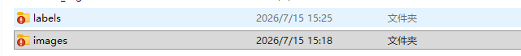


**一、将四边形视为特殊多边形**

1.原来用LabelImg标注的bounding box要转化为多边形，BBOX -> POLY

```shell
python bbox2poly.py --labels-dir dataset/labels --out-dir dataset/labels_seg
```

2.YOLO 多边形分割格式 → COCO JSON 格式

```shell
python yolo_poly_to_coco.py --labels-dir dataset/labels_seg --out-dir dataset/coco
```

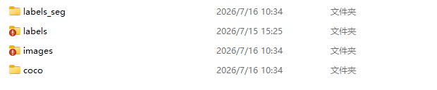

用yolo识别框直接训练MaskRCNN结果

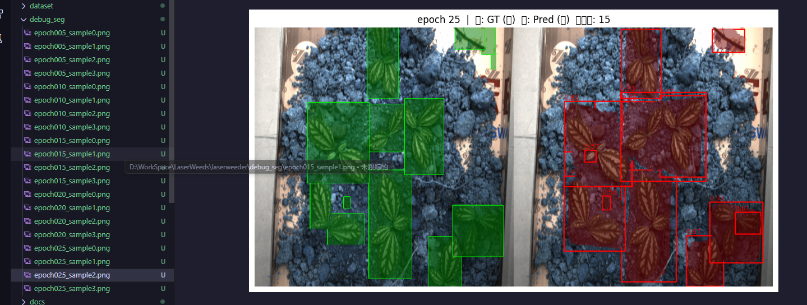

**二、LabelMe 手工标注**

淘宝外包：一个目标0.4元，100张图，平均每图6个目标，100 * 6 * 0.4 = 240元


**三、SAM3大模型标注**

需要科学上网

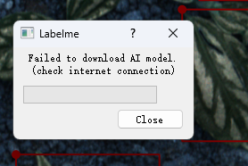

<<<<<<< HEAD
直接画框就可以实现自动化标注


=======
1.LabelMe的 AI BOX

2.datasets/process/auto_annote/ 下面脚本

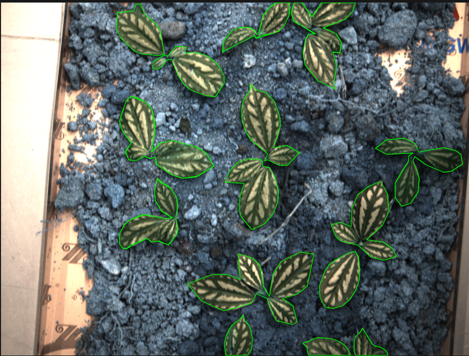
>>>>>>> 6ff8f423 (更新叙述)

## 训练MaskRCNN

### 环境配置

| 项目 | 详情                                     |
| ---- | ---------------------------------------- |
| GPU  | NVIDIA GeForce RTX 4060 Laptop，8GB 显存 |
| CUDA | PyTorch 12.1 / 驱动 12.7                 |
| CPU  | i5-13500H                                |
| 模型 | Mask R-CNN ResNet-50 FPN（COCO 预训练）  |

### 训练参数

| 参数       | 值                      |
| ---------- | ----------------------- |
| 训练集     | 79 张，640×640          |
| 验证集     | 19 张，640×640          |
| Batch Size | 2（训练）/ 1（验证）    |
| Epochs     | 80（早停 patience=15）  |
| 优化器     | SGD，lr=0.001，余弦退火 |
| 每轮迭代   | ~40 次训练 + 19 次验证  |

### 时间估算

- 单 epoch 耗时：约 40~60 秒
- 跑满 80 epoch 理论时长：约 **55~80 分钟**
- 考虑到早停机制（patience=15），实际大概率在 30~50 epoch 收敛：
  
  > **实际预估：35~50 分钟**

### 运行

```shell
python train_maskrcnn.py
```

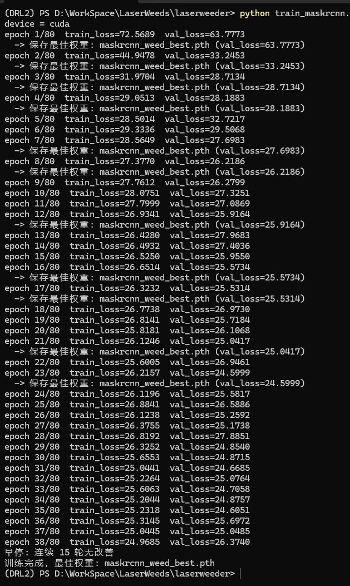

## 推理
**## 五、脚本 3：****`infer_maskrcnn.py`****（推理与可视化）**

```shell
  python infer_maskrcnn.py --weights maskrcnn_weed_best.pth --image dataset/images/weed_0001.png

  python infer_maskrcnn.py --weights maskrcnn_weed_best.pth --dir dataset/images --out vis_out

```

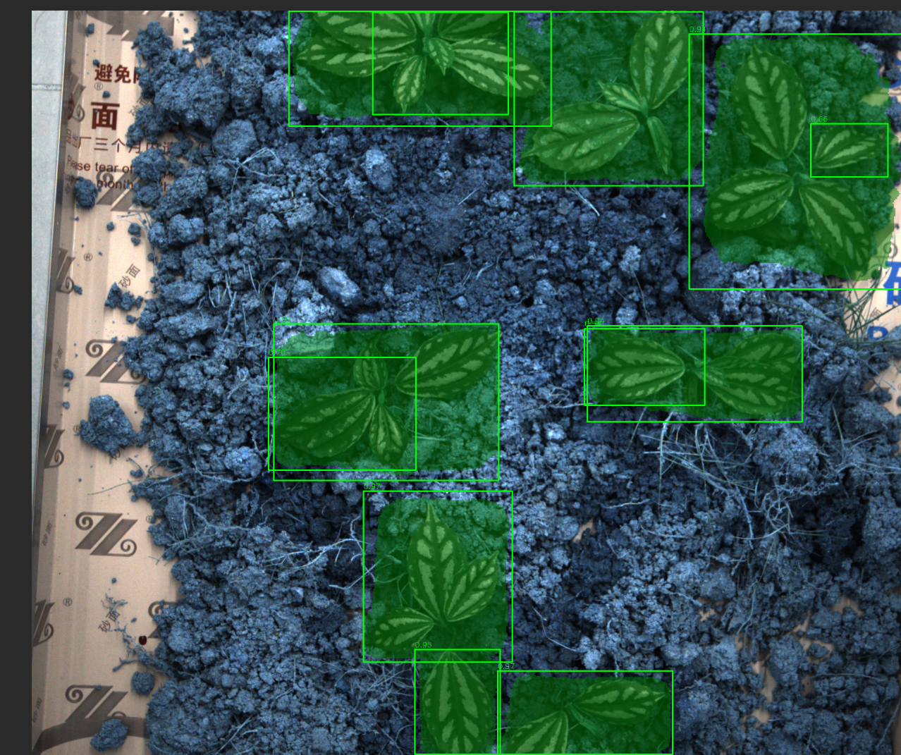

**实时帧率太低了**,首次测试帧率不到1(FPS < 1)

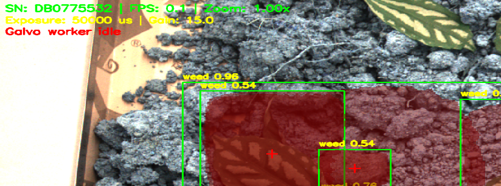

## YOLOv8-实时性好

我的GPU配置可以将batch达到16

```shell
python train_yolov8_seg.py --model yolov8n-seg.pt --epochs 100 --batch 16 --patience 20 --name segment/weed_seg_sam3 --device 0
```

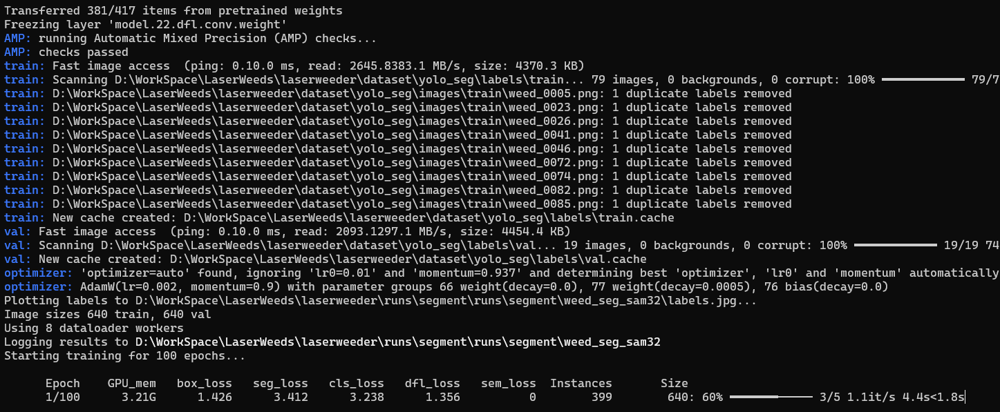

训练时间20min足够

 python hik_realtime_yolov8_seg.py --weights runs\segment\runs\segment\weed_seg_sam3\weights\best.pt --conf 0.25

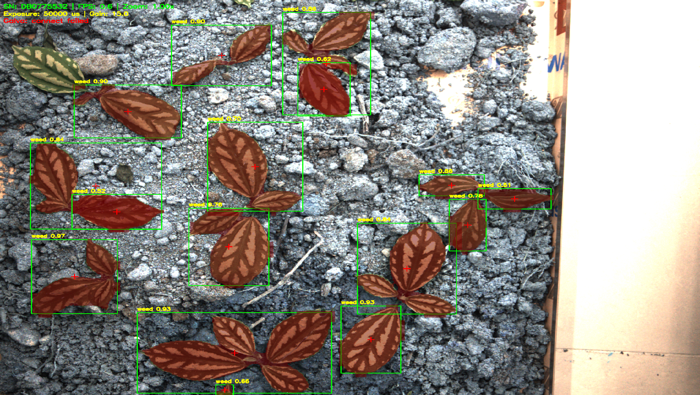

初始帧率能达到 0.6 FPS,还是太慢了。


## 问题

漏检现象

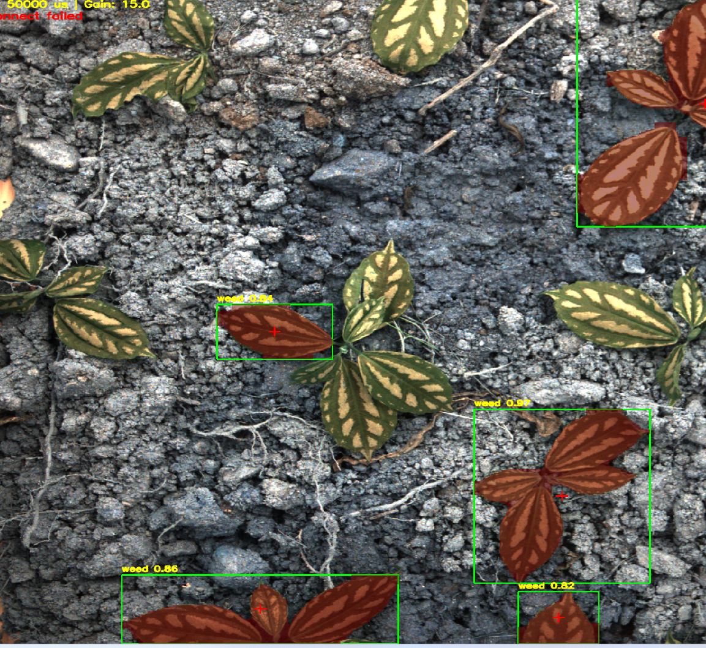

粘连现象
