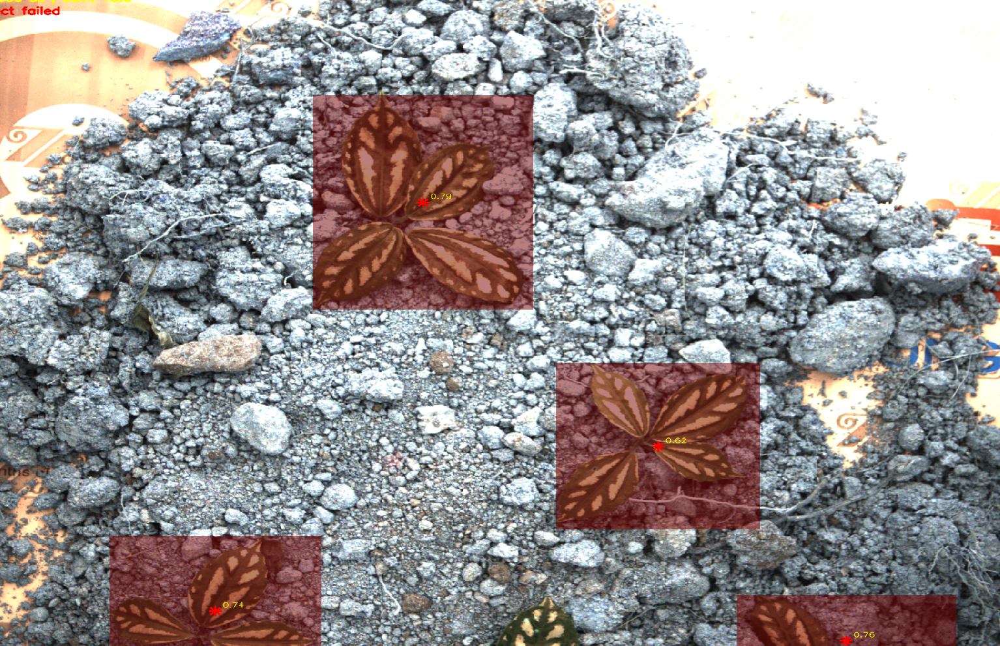
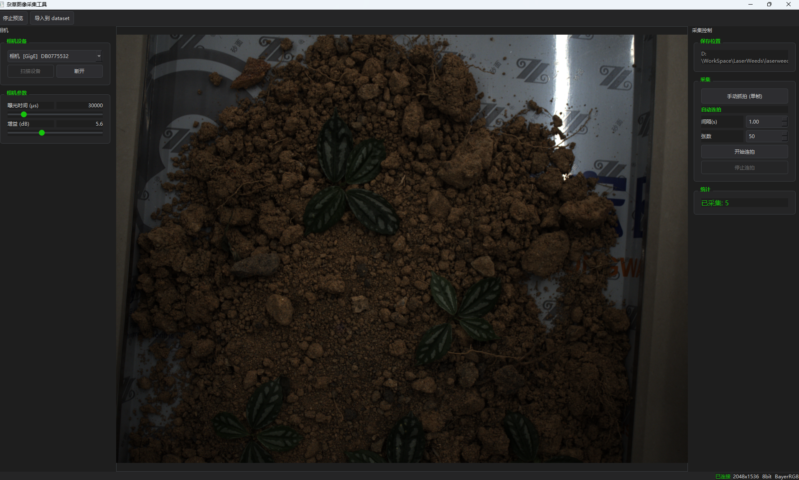
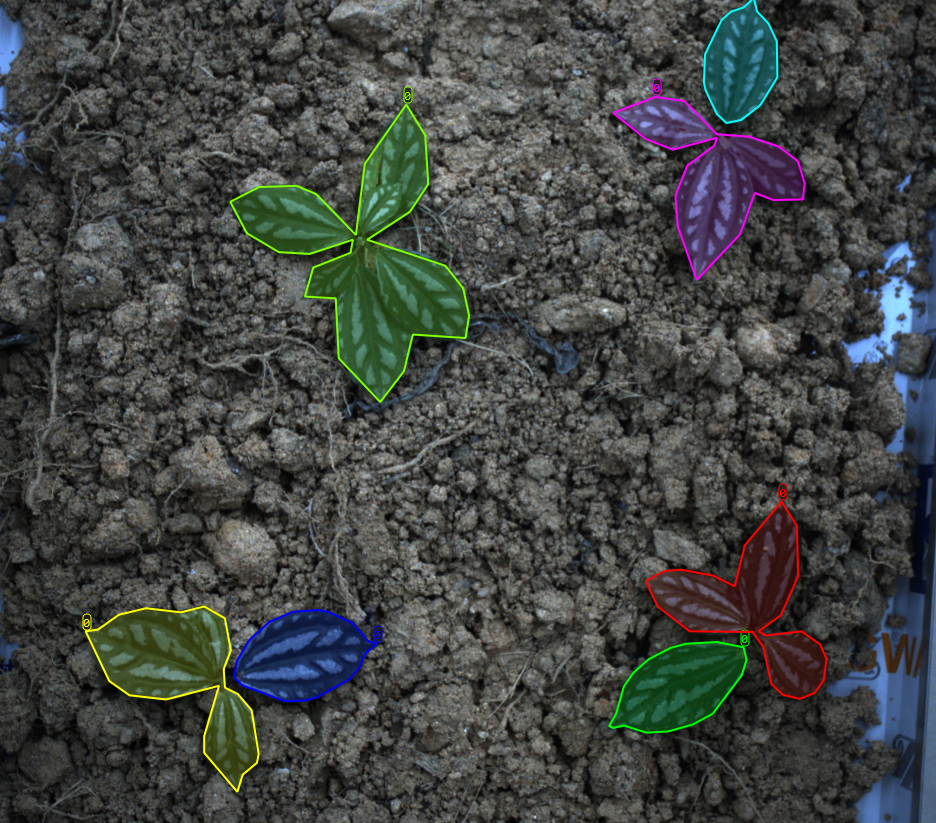
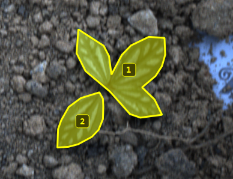
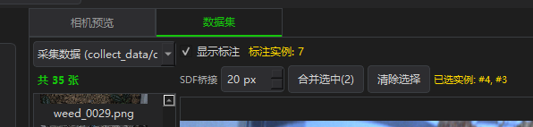
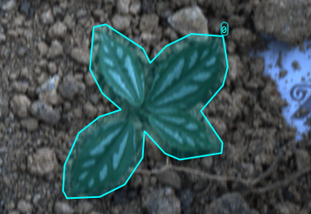
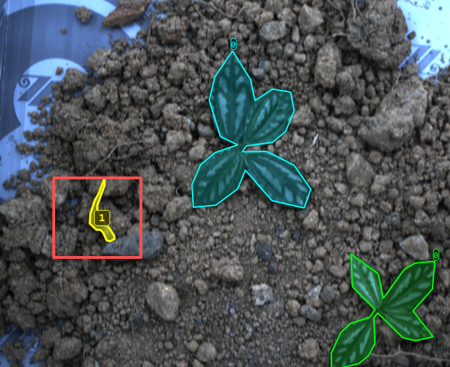
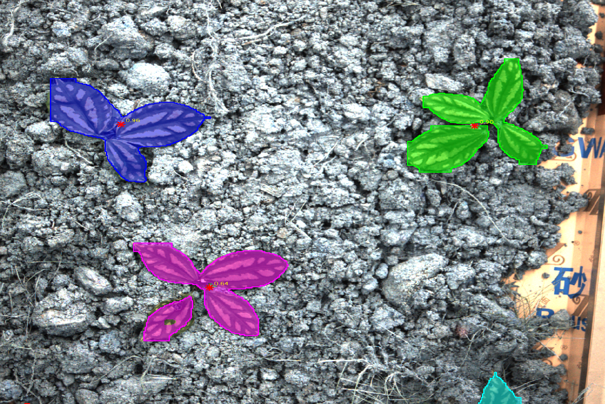

更新了一批后完全不一样了，是否是由于过拟合了？

## 开发采集工具与标注工具

重新进行训练，为方便采图，开发一个采图gui工具

我的标注需求，labelme和labelimg无法满足。

## 自动标注数据的优化(数据清理)

大模型输出的实例，需要对相近实例进行合并。

### SDF合并邻近

### 清理掉小干扰噪声

## 问题

### 同一检测目标忽隐忽现

## 知识蒸馏(Distill)

大模型Sam3标注，小模型yolov8训练

## 预训练

 YOLOv8 本身已带 COCO 预训练主干 yolo11n.pt / yolov8n.pt 的 backbone 已经在百万级 COCO 图像上训练过，通用边缘/纹理/形状特征已经很好。

识别效果

