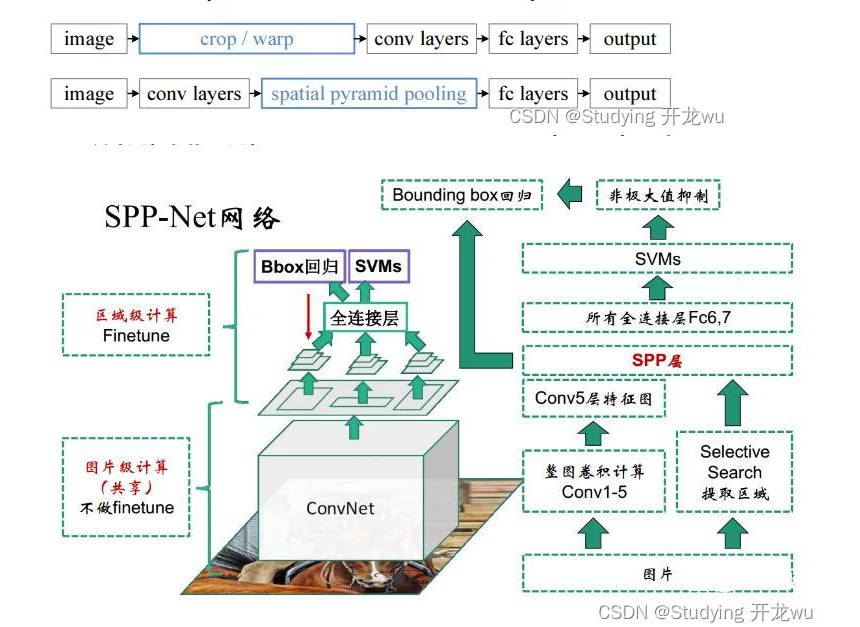
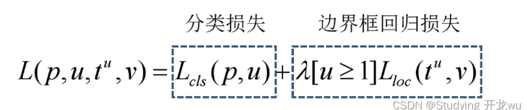

实例分割基于目标检测，目标检测有两种基本流派。**两阶段算法**先选框然后再进行分类代表有Fast RCNN，Faster RCNN；**单阶段算法**直接进行端到端的检测：代表有SSD,YOLO

## 两阶段算法

两阶段算法先进行阶段一：**区域候选（Region Proposal）**确定感兴趣区域（ROI），再进行阶段二：**在候选区域上预测边界框坐标和类别**。这种方法虽然创新，但对计算资源要求高，并且推理阶段延迟较大。

### 开山之作RCNN(2015)

RCNN = Selective Search + CNN提取特征 +SVM分类

#### 候选区域选择:Selective Search

最传统的方法，RCNN使用，通过逐层聚类。

选择性搜索是用于目标检测的区域提议算法，它计算速度快，具有很高的召回率，基于颜色，纹理，大小和形状兼容计算相似区域的分层分组。Selective Search算法主要包含两个内容：Hierarchical Grouping Algorithm、Diversification Strategies。

Hierarchical Grouping Algorithm,用贪心算法对区域进行迭代分组: 计算所有邻近区域之间的相似性； 两个最相似的区域被组合在一起； 计算合并区域和相邻区域的相似度； 重复2、3过程，直到整个图像变为一个地区。

Diversification Strategies,这个部分讲述作者提到的多样性的一些策略，使得抽样多样化，主要有下面三个不同方面： (1)利用各种不同不变性的色彩空间； (2)采用不同的相似性度量； (3)通过改变起始区域。此部分比较简单，不详细介绍，作者对比了一些初始化区域的方法，发现方法效果最好

### CNN提取特征 +SVM分类

在RCNN中，使用selective search方法在原始图像上生成近2000个Region Proposal，然后resize到固定尺寸，输入到CNN网络中，也就是说一张原始图片要进行2000次前向推理计算，存在着大量的重复**冗余计算**。

#### 一个直接改进SPPNet

SPPNet的主要贡献在于：**共享卷积计算和Spatial Pyramid Pooling(空间金字塔池化)**，使得每张图片只需要进行一次CNN网络的前向推理计算。在RCNN中需要图像块resize到固定大小，难免会有变形和失真。

第一行是RCNN的流程，需要将每一个图像块输入到网络中。
第二行是SPP方法，大大减小了计算量。具体实现方法和过程下面将进行详细阐述。

---

### FastRCNN&FasterRCNN

### 候选区域选择:RPN

网络是Faster RCNN的主要改进点，利用RPN网络直接生成检测框，极大的提高了检测速度。

**RPN的作用是用来提取候选框的，类似于前面介绍的RCNN的第一步Selective Search**。**它的网络结构基于神经网络，但是输出的是包含二元softmax和[bbox回归](https://zhida.zhihu.com/search?content_id=100542298&content_type=Article&match_order=2&q=bbox回归&zhida_source=entity)的多任务模型。**RPN网络的输入是前面CNN output的feature maps。我们在[feature map](https://zhida.zhihu.com/search?content_id=100542298&content_type=Article&match_order=6&q=feature+map&zhida_source=entity)上做一个大小为3x3的滑窗操作, 得到一个channel是256维的特征图，尺寸与input的特征图相同，维度是256*H*W。对这个256维的向量，我们分别做两次1x1卷积操作，一个得到2k score, 一个得到4k coordinates。这个2k score只区分是不是目标，输出候选区域属于前景（物体）和背景的分数，这里注意，这里的分类只区分是否包含目标，至于所包含目标的类别，是Faster-RCNN最后的分类网络干的事情。4k coordinates指的是对原图坐标的偏移。

那么这个k又是什么东西呀？这里有一个anchor的概念，也是RPN的核心之一。论文预先设定好生成9个anchors。我们前面说到对于feature map, 我们有一个3*3的滑窗操作。对于每次滑窗所划到的3x3的区域，就以该区域中心点为坐标，生成9个anchor。anchor它的本质是，将相同尺寸的输入，得到不同尺寸的输出。它们的中心相同，但是有不同的长宽比和尺度。这9个anchor，中心坐标一样，但是大小各不相同，如下图：

而上文提到的k就是anchors的数量，所以2k个分数就是9个anchors的共18个分数，36个坐标。对于每个anchor， 计算anchor与ground-truth bounding boxes的IoU，大于0.7则判定为有目标，小于0.3则判定为背景，介于0.3-0.7，则设为0，不参与训练

这么说完可能还是有点模糊，我们来看看RPN的代价函数：

代价函数有两部分，对应着RPN的两条路线，即是否包含目标和bbox的坐标与anchor坐标的回归误差。

### ROI pooling :划归为统一大小的框

FastRCNN提出,它的**输入是特征图，输出则是大小固定**的channel x H x W的vector。ROI Pooling是**将一个个大小不同的region proposals，映射成大小固定的(W x H）的矩形框**。它的作用是根据region proposals的位置坐标在特征图中将相应区域池化为固定尺寸的特征图，以便进行后续的分类和输出回归框操作。它可以加速处理速度。

ROI Pooling有两个输入，一个是图片进入CNN后的特征图，另一个是区域的边框。ROI 的输出是一个**region_nums x channels x W x H**的向量。

**RoI可以看成是SPP的简化版本**，原版SPP是多尺度池化后进行concat组成新特征，而RoI只使用一个尺度，可以将任意维度的特征矩阵缩放成固定维度。论文中的具体做法是，把高和宽都平均分为7*7的小块，然后在每一个小块做max pooling操作，channel维度不变，这样做能使输出维度固定，同时RoI Pooling不是多尺度的池化，梯度回传非常方便，为fine-tune卷积层提供了条件。（SPP Net不能fine-tune卷积层）

### **多任务损失函数**

### 实例分割Mask-RCNN

在目标检测的基础上，**并联增加了第三个头**——掩码分支（Mask Head）。这个分支通常是一个小型的 FCN（全卷积网络），专门负责在提取到的 ROI（感兴趣区域）特征上预测像素级的二值掩码。

两阶段可能无法实时：1.候选区域生成（Region Proposal） 2.目标分类、边界框精修与掩码预测

#### ROIAlign

虚线网格表示特征图，实线表示一个 RoI（本例中分为 2×2 的格子），每个格子内的圆点表示 4 个采样点。ROIAlign 通过特征图上邻近网格点的双线性插值来计算每个采样点的值。RoI、其格子划分以及采样点所涉及的所有坐标均不进行量化。

#### **Head Architecture**

我们扩展了 Faster R-CNN 的两种现有头部结构 [左/右图分别对应 ResNet C4 和 FPN 骨干网络的头部，均添加了 mask 分支。数字表示空间分辨率与通道数。箭头表示 conv、deconv 或 fc 层（conv 保持空间尺寸，deconv 增大空间尺寸）。

除输出层为 1×1 卷积外，其余卷积均为 3×3；反卷积为 2×2、步长 2；隐层使用 ReLU [31] 激活。

*左图*：'res5' 表示 ResNet 的第五阶段，为简化起见，我们将其第一个卷积调整为在 7×7 的 RoI 上以步长 1 操作（而非原文 中的 14×14 / 步长 2）。

*右图*：'×4' 表示四个连续卷积层的堆叠。
