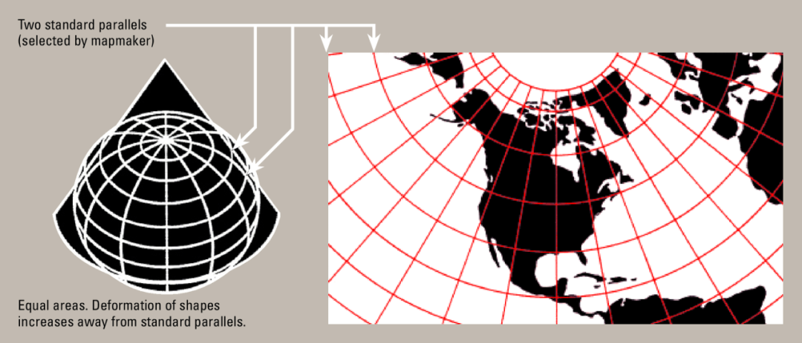
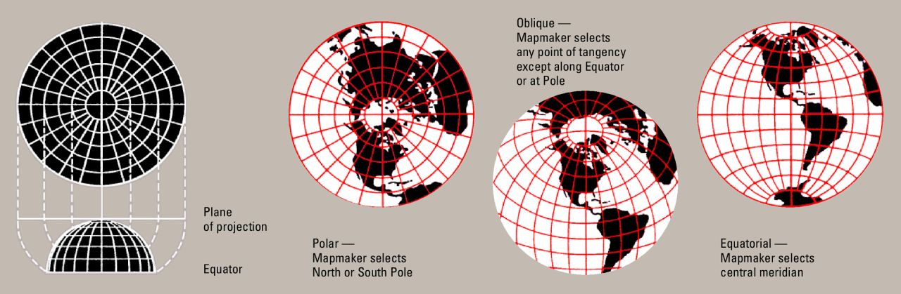
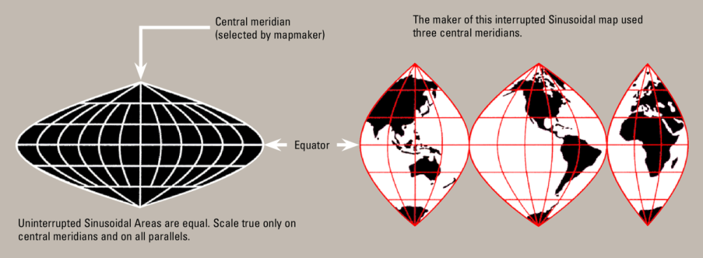
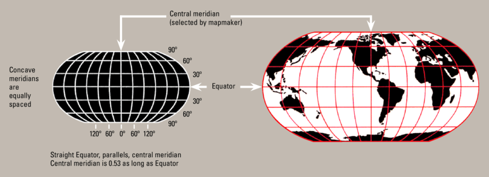
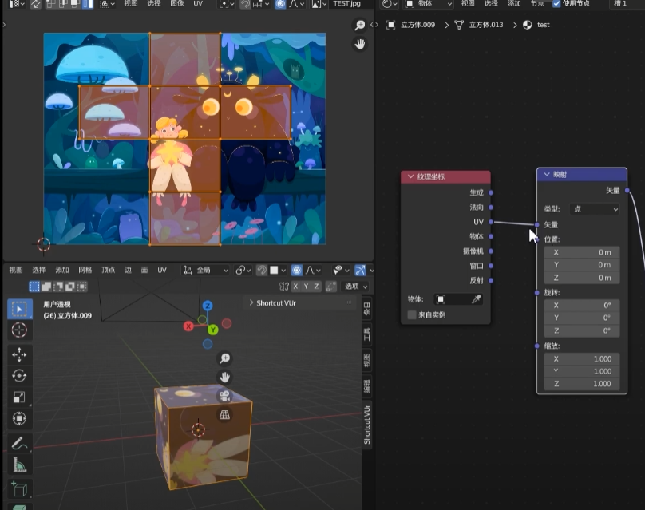

<!--more-->

### 曲面展平(参数化)

**曲面展开**是指建立三维曲面与二维平面区域之间的一一对应映射。用数学语言描述：设 $S \subset \mathbb{R}^3$ 是一张三维曲面，$\Omega \subset \mathbb{R}^2$ 是平面区域，参数化即寻找映射：
$$
f: S \to \Omega
$$
使得 $f$ 是**双射（一一对应）**，且具有某种"良好"性质（如保持角度、面积等）。

为了解决这个问题我们要从数学上找到一个**展平映射**$f:R^3\rightarrow R^{2}$，使得三维空间中曲面的点与二维空间中的点是相对应，这个更加低维的空间可以认为是该曲面的参数域，所以曲面的展平也称为曲面的**参数化(Parameterization)**。

参数化的核心矛盾在于：**曲面的高斯曲率决定了它能否被无扭曲地展平**。

根据 **Theorema Egregium（绝妙定理）**，高斯曲率是内蕴量，不能通过等距变换改变。因此：

- **高斯曲率为零**的曲面（如柱面、锥面）可以无扭曲地展平
- **高斯曲率非零**的曲面（如球面）**不可能**无扭曲地展平

这意味着，对于一般曲面，参数化必然引入**扭曲**。算法设计的目标就是：**在满足约束的前提下，最小化扭曲**。

计算机中所有3D物体的表面都是由许多小三角形拼在一起表示的，这样的三角形组成的网格称为**三角形网格(Mesh)** 记作
$$
M=\{V,E,F |V,E,F为网格的顶点,边,面\}
$$

## 地图投射

下面我们看一个常见的直观例子，如下图所示这种绘制世界地图的**“墨卡托投影法”**。基本方法是假想在球面内部有一个光源，而球面外部包围着一个圆柱面,光线将球面的点投射到圆柱面上,再将圆柱面展开。

**“墨卡托投影“映射是有扭曲的**,比如我们看地图会发现俄罗斯比非洲面积还要大

但是实际上俄罗斯面积只有非洲大陆面积的一半左右

这种方法牺牲面积大小，保留角度和形状(也称为共形映射)沿着赤道不会发生扭曲，越靠近极点的地方面积扭曲就越大。

**尽可能减小扭曲**是要达成的重要目标，我们要尽可能保证三维曲面展平到平面上后其细节信息不会造成太大的失真。

我们可以定义一个能量$E(f)$，用来度量映射$f$的扭曲程度,从而可以将参数化问题建模为一个抽象的几何最优化问题,之后的工作就是尽可能找到"好"的能量，找到更快更稳定的收敛方法。

$$
\min_{f \in PL}\, E(f)，\quad f\text{ 满足约束条件}
$$
接下来我们会看到如何定义具体的能量，以及如何对这些能量进行数值优化。

### 其他的地图投影方法

地图投影泛指将地球表面展平以便绘制地图方法，其核心就是将球面上的点转换为平面上的点。由于投影方式的不同，所形成的世界地图“长相”也大相径庭。

**圆锥****投影**

**方位投影**

**伪圆柱投影**

**折衷投影**

## 应用

**纹理贴图**：是一种计算机图形学技术，设计师可以在二维空间进行模拟物体的表面纹理与细节信息的设计，再通过计算机手段将其投影到3D模型表面，从而赋予模型/角色更有深度的视觉体验。在游戏相关的领域中，纹理贴图经常被用来对3D场景和对象进行上色及纹理填充等。

**肠镜地图**：通过CT扫描获取到腹部断层图像，然后用多视角几何的方法重建三维直肠曲面后，为了方便医生的观察，最后将这个直肠曲面平展到平面上，像看地球仪一样观察曲折的肠道。使用这种方法，设备和病患没有接触，不需要麻醉，不会诱导并发症。

