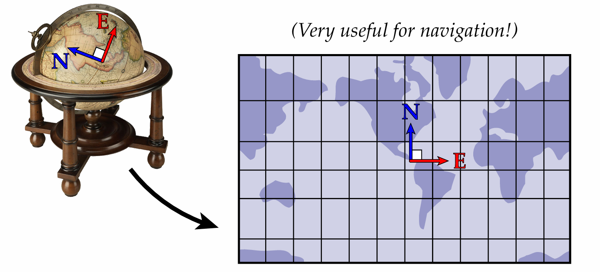

<!--more-->

### 曲面展平(参数化)

如何将一个三维空间中的曲面摊平到二维的平面上？有时为了方便观察研究人们会将地球仪的表面展平。这在生活经验中看起来似乎不太起眼的问题，但是却蕴含着无限的几何与拓扑的奥秘。

为了解决这个问题我们要从数学上找到一个**展平映射**$f:R^3\rightarrow R^{2}$，使得三维空间中曲面的点与二维空间中的点是相对应，这个更加低维的空间可以认为是该曲面的参数域，所以曲面的展平也称为曲面的**参数化(Parameterization)**。用更高的数学观点来看，3D曲面本质上是2D流形，参数化就是找到3D曲面在2D平面上的**嵌入(embedding)**。

为了先对这个问题有一个初步的了解，先考虑下最简单的情况，即最简单的三维曲面—球面。如下图所示这种绘制世界地图的“墨卡托投影法”。基本方法是假想在球面内部有一个光源，而球面外部包围着一个圆柱面,光线将球面的点投射到圆柱面上,再将圆柱面展开。

**“墨卡托投影“映射是有扭曲的**,比如我们看地图会发现俄罗斯比非洲面积还要大

但是实际上俄罗斯面积只有非洲大陆面积的一半左右

这种方法牺牲面积大小，保留角度和形状(也称为共形映射)沿着赤道不会发生扭曲，越靠近极点的地方面积扭曲就越大。

**尽可能减小扭曲**是要达成的重要目标，我们要尽可能保证三维曲面展平到平面上后其细节信息不会造成太大的失真。想象下如果CT扫描后的直肠曲面展平后观察到的病灶变形严重的话(肿瘤块被放大或缩小)那这样的映射是不可用的。

### **一个简单的展平算法**

在开始我们的探索之前，我们先根据直觉，构想一个简单的算法。假设三角网格$M$是有弹性的即每一条边都视为是一个弹簧的话，网格的边界是一个橡皮筋。那么我们可以在外部施加力将边界固定下来, 由于三角网格的边会对力进行传导，那内部的点也会跟着改变。

假设我们把三角网格的边界固定到一个圆周上

为了简化处理，假设对于内部某个顶点$v \in V_{int}$作用在它身上的力是均衡的，那它将会位于其邻居顶点所构成区域的质心位置，这样自然就形成了一个方程了。

1. 将$M$中的顶点集$V$进行编号(用数字代表顶点) $V=\{1,2,3,...n\}$,并划分为内点集和边界点集即 $V = V_{int} \cup V_{bnd}$
2. 对内部顶点$v \in V_{int}$,设$N_v$为其邻居顶点集，则由于$v$位于质心位置则有$x_v = \frac 1 {|N_v|} \Sigma_{u \in N_v}x_u$
3. 对边界顶点$v \in V_{bnd}$,将边界点也进行排序并且$v$的序号$i_v$，由于边界点定在圆周上那么$x_{i_v}=(rcos({\theta_{i_v}}),rsin({\theta_{i_v}}))\\$

上面的式子实际上可以表示成实**稀疏线性系统**$Ax=b,A=\{a_{ij}\}_{n*n}\\$(u,v两个坐标)

1. 对任意的$v \in V_{int}$ , $A(v,u) = \begin{cases}  1 &，  u=v \\ -\frac 1 {|N_v|}&， u \in N_v \\ 0 &，其它\end{cases} $
2. 对任意的$v \in V_{bnd}$, $A(v,u) = \begin{cases}  1 &，  u=v \\  0 &，其它\end{cases} $，其边界序号为$i_v$ ,则$b_{i_v} = (rcos({\theta_{i_v}})，rsin({\theta_{i_v}}) )$

对上述线性方程的求解，如果矩阵$A$的规模不是很大，可以直接$Gauss-Seidal$方法迭代求解，如果$A$的规模很大的话要对$A$进行分解(如Cholesky分解)后求解，在后面文章中我们将会详细讨论这个线性方程数值求解问题。

最后可以得到如下图的展平结果

在展平的表面上贴上一层棋盘格，可以直观地观察到扭曲的大小。

事实上，虽然上面的算法我们做了一系列的假设，但是算法的正确性还是有严格的数学保证(解是存在的，并且是有良好性质的)，这个正确性保证来自于图论(Graph Theory)中的**Tutte嵌入定理**(参考文献[1])。

### 算法的不足与改进方向

上面的算法虽然正确性是有保证的，但是缺陷也是很明显的就是扭曲太大了(同时角度和面积的变形都很大)。

由于我们的平均权重只考虑到网格的组合性质(没有使用到关于坐标位置等几何信息),所以对于几何上比较复杂的网格模型不可避免会有比较大的扭曲,[2]中优化了权重将几何信息引入从而缓解了这部分造成的扭曲。

这个方法需要我们先固定一个凸多边形边界，那么如果原来的3D模型边界与我们所指定边界如果差别比较大的话（比如“非凸”的边界），那就不可避免的会有比较大的扭曲变形，比较好的当然是算法根据3D模型的特征自动寻找一个比较符合的边界,后面介绍的算法只需要固定两个顶点就会找到一个比较好的边界,并且尽可能减少角度的变形)

### 共形映射(Conformal Mapping)

我们可以回头再看下墨卡托映射，它虽然会使得不同国家的面积发生变形，但是形状一定是没有发生变化的，这对于制作地图来说，保持角度是很重要的，否则根据地图导航将会南辕北辙。

这种能保持角度的映射可以很好的保持图像不失真，我们称之为保角映射(Angle Preserving)，这种类型的映射我们可以认为至少是不错的所以是值得研究的。

数学上任意两个平面区域之间都是存在这样的一个保角变换的，在高等数学理论中称这类保持角度的映射为**共形映射**，有如下**黎曼映照定理**保证了这种映射是一定存在的。

 设 $\Omega \subset \mathbb{C}$ 是单连通开集，$\Omega \neq \mathbb{C}$。对任意 $z_0 \in \Omega$，存在唯一全纯双射 $f : \Omega \to \mathbb{D}$ 

满足：  $f(z_0) = 0 , f'(z_0) > 0$ 其中$\mathbb{D} = \{ z \in \mathbb{C} , |z|<1 \}$。

数学上已经理论上保证了存在性，接下来就是设计算法来求解这样的映射，我们所要用到的工具就是**最优化**以及**微分几何**的相关知识。

### 

## 附录

### 1.三角网格
计算机中所有3D物体的表面都是由许多小三角形拼在一起表示的，这样的三角形组成的网格称为**三角网格(Mesh)** 记作$M=\{V,E,F |V,E,F为网格的顶点,边,面\}$

**拓扑圆盘**是具有单个边界"开口网格曲面"，比如这个简化版("抽象")的大卫头像

#### 三角网格的**半边结构**

.obj文件记录了三角网的基本数据（顶点，边，面），另外用于记录三角网格的文件还有.off和.stl等
对于三角网格(Mesh)这种对象，要想高效实施在其上的算法，该给它设计怎样的数据结构呢？要想到我们的算法会经常在这个数据上做哪些操作呢？我们需要快速索引以下信息:与顶点相邻的边，顶点所在的三角面，一个三角面上顶点，一个三角面上的边

**三角网格的几何库** ：Geometry Central ,LibIGL, GeoGram

### 2.Tutte嵌入定理
将三角网格(Mesh)看成是一个图(graph)的话，定理说明只要将边界点固定在一个凸多边形上，并且内部的点是其邻居的凸组合(上面算法设置内点位于邻居质心)就能形成一个符合约束的参数化（无自交，全局单射）

### 3.医学上的应用
比如通过CT扫描获取到腹部断层图像，然后用多视角几何的方法重建三维直肠曲面后，为了方便医生的观察，最后将这个直肠曲面平展到平面上。（使用这种方法，设备和病患没有接触，不需要麻醉，不会诱导并发症）

## **参考文献**

[1] Tutte, W. T. (1963). *How to draw a graph*. Proceedings of the London Mathematical Society.

[2] Floater, M. S. (1997). *Parametrization and smooth approximation of surface triangulations*. CAGD.

