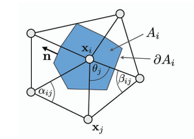

## 3.1 分片线性映射

在三角网格的设定下，我们所求的映射 $f: M \to \mathbb{R}^2$ 将三维网格 $M \subset \mathbb{R}^3$ 映射到平面。只需为每个顶点 $v \in V$ 找到一组 $\mathbb{R}^2$ 坐标（常称为 **UV 坐标**），映射 $f$ 便完全确定。

首先回顾三角形**重心坐标（Barycentric Coordinate）**的概念：

重心坐标 $\alpha$ 可以认为是小三角形与大三角形之间的**面积比**
$$
\alpha = \frac{A_i}{A_T} = \frac{\left( (\mathbf{x} - \mathbf{x}_j) \cdot \frac{(\mathbf{x}_k - \mathbf{x}_j)^\perp}{\|\mathbf{x}_k - \mathbf{x}_j\|} \right) \|\mathbf{x}_k - \mathbf{x}_j\|}{2 A_T} = \frac{(\mathbf{x} - \mathbf{x}_j) \cdot (\mathbf{x}_k - \mathbf{x}_j)^\perp}{2 A_T}
$$

其中 $A_t$ 是三角形有向面积，$2A_t = (x_iy_j - y_ix_j) + (x_jy_k - y_jx_k) + (x_ky_i - y_kx_i)$。有了 $u, v$ 两方向的梯度后便可组合成 Jacobian 矩阵（见下一节）。

以重心坐标作为插值权重，分段线性映射可以表达为各顶点函数值关于重心坐标的线性组合：
$$
f(x) = \alpha f_i + \beta f_j + \gamma f_k
$$

### 3.2 映射的Laplace算子

将**梯度算子$\nabla$**作用于式(2)可得
$$
\nabla f(\mathbf{x}) = f_i \nabla \alpha + f_j \nabla \beta + f_k \nabla \gamma

\\\nabla \alpha = \frac{(\mathbf{x}_k - \mathbf{x}_j)^\perp}{2A_T},\quad \nabla \beta = \frac{(\mathbf{x}_i - \mathbf{x}_k)^\perp}{2A_T},\quad \nabla \gamma = \frac{(\mathbf{x}_j - \mathbf{x}_i)^\perp}{2A_T}
$$

因此
$$
\nabla f(\mathbf{x}) = f_i \frac{(\mathbf{x}_k - \mathbf{x}_j)^\perp}{2A_T} + f_j \frac{(\mathbf{x}_i - \mathbf{x}_k)^\perp}{2A_T} + f_k \frac{(\mathbf{x}_j - \mathbf{x}_i)^\perp}{2A_T}
$$

**Laplace算子**定义为其**梯度的散度** 
$$
\Delta f = \operatorname{div}\,\nabla f
$$
在我们熟悉的 $\mathbb{R}^2$ 中，上式简化为 $\Delta f = f_{xx} + f_{yy}$。那么在三角形网格上如何定义 Laplace 算子？

### 3.3 三角网格上的Laplace算子

1.将网格看成是图，从而图的Laplace算子也能用来定义网格的Laplace算子(Uniform Laplacian)
$$
\Delta f(v_i) = \frac{1}{|\mathcal{N}_1(v_i)|} \sum_{v_j \in \mathcal{N}_1(v_i)} (f_j - f_i)
$$

2.上面的定义方式仅考虑网格的连接性,没有考虑顶点的几何分布特性，所以更常用的是下面这种定义

对于下面的顶点的小领域$A_i$采用Mixed Voronoi Cell

根据散度定理(Divergence Theorem,又称高斯定理)
$$
\int_{A_i} \operatorname{div} \mathbf{F}(\mathbf{u})\,\mathrm{d}A = \int_{\partial A_i} \mathbf{F}(\mathbf{u}) \cdot \mathbf{n}(\mathbf{u})\,\mathrm{d}s
$$
那么对于Laplace算子则有

$$
\int_{A_i} \Delta f(\mathbf{u}) \,\mathrm{d}A = \int_{A_i} \operatorname{div} \nabla f(\mathbf{u}) \,\mathrm{d}A = \int_{\partial A_i} \nabla f(\mathbf{u}) \cdot \mathbf{n}(\mathbf{u}) \,\mathrm{d}s
$$

$\mathbf{n}$ 的朝向向外。下图为三角形 $T$ 上与边 $(\mathbf{x}_i,\mathbf{x}_j)$、$(\mathbf{x}_i,\mathbf{x}_k)$ 相关的局部记号（点 $\mathbf{a},\mathbf{b}$ 及法向等）。

对每一个部分分别进行计算
$$
\begin{aligned}
\int_{\partial A_i \cap T} \nabla f(\mathbf{u}) \cdot \mathbf{n}(\mathbf{u})\,\mathrm{d}s
&= \nabla f(\mathbf{u}) \cdot (\mathbf{a} - \mathbf{b})^\perp
=\frac{1}{2}\, \nabla f(\mathbf{u}) \cdot (\mathbf{x}_j -\mathbf{x}_k)^\perp
\end{aligned}
$$

将之前计算的导数代入进去则有
$$
\begin{aligned}
\int_{\partial A_i \cap T} \nabla f(\mathbf{u}) \cdot \mathbf{n}(\mathbf{u})\,\mathrm{d}s
={} & (f_j - f_i)\,\frac{(\mathbf{x}_i - \mathbf{x}_k)^\perp \cdot (\mathbf{x}_j - \mathbf{x}_k)^\perp}{4A_T}  + (f_k - f_i)\,\frac{(\mathbf{x}_j - \mathbf{x}_i)^\perp \cdot (\mathbf{x}_j - \mathbf{x}_k)^\perp}{4A_T}
\end{aligned}
$$

记 $\gamma_j,\gamma_k$ 分别为顶点 $v_j,v_k$ 处的内角。由
$$
A_T = \tfrac{1}{2}\sin\gamma_j \,\|\mathbf{x}_j - \mathbf{x}_i\|\,\|\mathbf{x}_j - \mathbf{x}_k\| = \tfrac{1}{2}\sin\gamma_k \,\|\mathbf{x}_i - \mathbf{x}_k\|\,\|\mathbf{x}_j - \mathbf{x}_k\|
$$

以及
$$
\cos\gamma_j = \frac{(\mathbf{x}_j - \mathbf{x}_i)\cdot(\mathbf{x}_j - \mathbf{x}_k)}{\|\mathbf{x}_j - \mathbf{x}_i\|\,\|\mathbf{x}_j - \mathbf{x}_k\|},\qquad \cos\gamma_k = \frac{(\mathbf{x}_i - \mathbf{x}_k)\cdot(\mathbf{x}_j - \mathbf{x}_k)}{\|\mathbf{x}_i - \mathbf{x}_k\|\,\|\mathbf{x}_j - \mathbf{x}_k\|}
$$
可得
$$
\int_{A_i} \Delta f(\mathbf{u})\,\mathrm{d}A = \frac{1}{2} \sum_{v_j \in \mathcal{N}_1(v_i)} (\cot \alpha_{ij} + \cot \beta_{ij})(f_j - f_i)
$$

从而对 Laplace–Beltrami 算子的离散化可取为
$$
\Delta f(v_i) := \frac{1}{2A_i} \sum_{v_j \in \mathcal{N}_1(v_i)} (\cot \alpha_{ij} + \cot \beta_{ij})(f_j - f_i)
$$

## 映射的Dirichlet能量

调和映射满足 $\Delta u = 0, \Delta v = 0$，可以看作是将坐标函数的光滑性最大化——因为 Laplace 算子度量了函数的"不规则程度"（线性函数的 Laplacian 为零）。

映射的 Dirichlet 能量定义为映射梯度的 $L^2$ 范数：
$$
E_D = \frac{1}{2}\int_X|\nabla f|^2dA
$$

故调和映射满足 $\Delta u = 0$，与 Dirichlet 能量极小相关。

#### 基于Dirichlet能量最小化的展平算法

