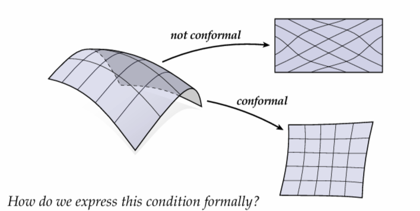
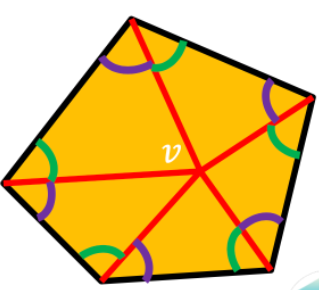

###  共形映射 (Conformal Mapping)

如图将一个三维人脸曲面映射到平面圆盘上。我们在人脸曲面任意画两条相交曲线，这两条曲面上的曲线被映射到平面上的两条曲线，空间曲线的交点被映成平面曲线的交点，在交点处，空间曲线的夹角等于平面曲线的夹角。这两条空间曲线任意选取，其夹角都被映射完美保持。

这种能保持角度的映射可以很好的保持图像不失真，我们称之为保角映射(Angle Preserving)，这种类型的映射我们可以认为至少是不错的所以是值得研究的。

我们可以回头再看下墨卡托映射，它虽然会使得不同国家的面积发生变形，但是形状一定是没有发生变化的，这对于制作地图来说，保持角度是很重要的，否则根据地图导航将会南辕北辙。

数学上任意两个平面区域之间都是存在这样的一个保角变换的，在高等数学理论中称这类保持角度的映射为**共形映射**，有如下**黎曼映照定理**保证了这种映射是一定存在的。

 设 $\Omega \subset \mathbb{C}$ 是单连通开集，$\Omega \neq \mathbb{C}$。对任意 $z_0 \in \Omega$，存在唯一全纯双射 $f : \Omega \to \mathbb{D}$ 

满足：  $f(z_0) = 0 , f'(z_0) > 0$ 其中$\mathbb{D} = \{ z \in \mathbb{C} , |z|<1 \}$。

数学上已经理论上保证了存在性，接下来就是设计算法来求解这样的映射。

### 直观的方法-ABF算法

三角网格是由成千上万的三角形组合而成的，那么如果两个三角网格的每对三角形都尽可能相似的话，那么两个三角网格也可以认为是“相似”的，所以我们尝试着让每个小三角形都尽可能保持相似的从而保持整体的形状 ，这种从三角形角度考虑出发的方法称为**ABF（Angle Based Flattening）**算法

设$\alpha_i^0$，$\alpha_i$分别为三角网格展开前后的某个内角值，那它们的映射前后的差值就是$(\alpha_i - \alpha_i^0)^2$，对所有的角度累加，从而得到一个二次优化$E=\Sigma(\alpha_i - \alpha_i^0)^2$ ，约束条件如下：

(1) 由于角度发生改变了，所以对于每个三角形我们要让内角和保持为$\pi$, 即$\Sigma_{\alpha_i\in t}{\alpha_i}=\pi$ 

(2) 另外由于是展平到了平面上，所以对于内部每个顶点v，与它连接角度的角度和为$2\pi$,即$\Sigma_{\alpha_i\in v}=2\pi$

(3) 如下图,对于每个顶点v,其1-邻域两个对角$\beta_i与\gamma_i$满足如下关系$\prod \frac {sin_{\beta_i}} {sin\gamma_i}=1$

上面约束优化问题虽然可以通过Lagrange乘子法转化为无约束优化问题进行求解，但是由于约束(3)中含有非线性条件所以是不容易求解的，一种思路是将约束(3)进行**线性化**后再求解。

实际上保角映射并不是说保三角网格的内角，而是保持的是曲面内两条相交线夹角的不变，所以上面方法并没有很好的保角性质。

### **LSCM算法**

通过高等数学中复变函数的理论来构造一个能量$E$,并求解其最优化。

令复数$U=u+iv,X=x+iy$，那么显然$U(X)$就是一个复函数，复函数是共形的当且仅当其满足的**Cauchy-Riemann方程**
$$
{\partial u}/{\partial x} = {\partial v}/{\partial y} \\ {\partial u}/{\partial y} = -{\partial v}/{\partial x}
\tag{CR}
$$
并结合前面推导的Jacobian矩阵可得下式
$$
{\partial U}/{\partial x} + i{\partial U}/{\partial y} = \frac{i}{2A_t}(W_{t_i},W_{t_j},W_{t_k}){\begin{pmatrix}u_i\\u_j\\u_k\end{pmatrix}}, \quad
其中\begin{cases}W_{t_i} = (x_k - x_j)+i(y_k-y_j)\\
W_{t_j} = (x_i - x_k)+i(y_i-y_k)\\
W_{t_k} = (x_j - x_i)+i(y_j-y_i)\\
\end{cases}
\tag{3}
$$

那么对于每个三角形$T_i$可以通过如下方法定义一个能量来衡量其不满足共形性的程度

$$
C(T_i) = {||{{\partial U}/{\partial x}}+i{{\partial U}/{\partial y}}||}^2 A_{T_j}=\frac {1} {4A_T}{|(W_{j1},W_{j2},W_{j3})(U_{j1},U_{j2},U_{j3})|}^2
$$
将所有三角形能量进行累加$E_{lscm} = \Sigma_{i=1}^{n} C(T_i)$，可以认为是关于复数$U=(U_1,U_2,...,U_n)^T$的二次型$E_{lscm} = C(U=(U_1,U_2,...,U_n)^T)=U^*CU = ||MU||^2$
$$
M=(m_{ij})是|F|\times|V|稀疏矩阵，
m_{ij} = \begin{cases}W_{j,T_i},如果v_j属于三角形T_i \\ 0\end{cases}
\tag{4}
$$
如果不加限制那么会得到平凡解(trivial),即$U=0$的常映射。

要想得到非平凡解需要固定一部分点(pin点)，即固定某些$U$的值，所以可以将$U$分块为$(U_f^T,U_p^T)^T$其中$U_f$是自由的点，$U_p$是固定

同样的将$M$分解$M =(M_f \ M_p)$,其中$M_f$的形状是$|F|*(|V|-p)$
$$
||MU||^2=||MfUf+MpUp||^2
$$
复矩阵$M$的实部与虚部进行分解$M=M^{re}+iM^{im}$,那么可以将上式转为求解如下的**实最小二乘**
$$
\begin{aligned}
C(x) = ||Ax-b||^2,
A={\begin{pmatrix}{M_f^{Re}}&{-M_f^{Im}}\\{M_f^{Im}}&{M_f^{Re}}\end{pmatrix} },
b=-{\begin{pmatrix}{M_p^{Re}}&{-M_p^{Im}}\\{M_p^{Im}}&{M_p^{Re}}\end{pmatrix} }{\begin{pmatrix}U_p^{Re}\\U_p^{Im}\end{pmatrix}}
\end{aligned}\tag{5}
$$
其中矩阵A的大小为$2|F|\times 2(|V| -p)$，并且$b\in R^{2|F|},x\in R^{2|V|-p}$ 

可以证明当固定点个数大于等于2时($p\geq2$)，矩阵A满秩，方程有唯一解

**LSCM 共形能量 = Dirichlet 能量 − 参数域有向面积**。

实际上LSCM能量，可以表达为映射对于Cauchy-Riemann公式的残差值，即$E_{lscm} = \int_X |{\nabla u}^ \perp  - \nabla v|^2 dA$

将上式展开，那么LSCM所计算的能量极小等价于Dirichlet能量极减去面积项（见下图及公式提取）：

$$
\begin{aligned}
E_{\text{LSCM}}(\mathbf{u}) 
&= \int_{\chi} \frac{1}{2}\Bigl( \nabla u^{\perp} \!\cdot\! \nabla u^{\perp} + \nabla v \!\cdot\! \nabla v - 2\,\nabla u^{\perp} \!\cdot\! \nabla v \Bigr)\,dA \\[4pt]
&= \int_{\chi} \frac{1}{2}\Bigl( \nabla u \!\cdot\! \nabla u + \nabla v \!\cdot\! \nabla v - 2\,\nabla u \times \nabla v \Bigr)\,dA \\[4pt]
&= E_D(\mathbf{u}) - A(\mathbf{u})
\end{aligned}
$$

**共形能量的原始定义**（Cauchy-Riemann 残差的 $L^2$ 范数）：
$$
E_C(F) = \frac{1}{2}\int_D \bigl|(\nabla u)^{\perp} - \nabla v\bigr|^2 \, dA \tag{7}
$$

**Dirichlet 能量**：
$$
E(F) = \frac{1}{2}\int_\Omega \bigl(|\nabla u|^2 + |\nabla v|^2\bigr) \, dA \tag{4}
$$

**关键展开式**：
$$
\begin{aligned}
\bigl|(\nabla u)^{\perp} - \nabla v\bigr|^2
&= \bigl((\nabla u)^{\perp} - \nabla v\bigr) \cdot \bigl((\nabla u)^{\perp} - \nabla v\bigr) \\
&= (\nabla u)^{\perp} \!\cdot\! (\nabla u)^{\perp} + \nabla v \!\cdot\! \nabla v - 2(\nabla u)^{\perp} \!\cdot\! \nabla v \\
&= |\nabla u|^2 + |\nabla v|^2 - 2\,\nabla u \times \nabla v
\end{aligned}
$$

**最终关系**：
$$
\boxed{E_C(F) = E_D(F) - A} \tag{8}
$$

其中 $A = \displaystyle\int_D (\nabla u \times \nabla v)\,dA$ 为参数域的有向面积。

> 这意味着最小化 LSCM 共形能量等价于**在固定边界条件下最小化 Dirichlet 能量**（面积项 $A$ 在边界固定时为常数）。

**参考文献**

[1] L. Liu, L. Zhang, Y. Xu, C. Gotsman, and S. J. Gortler. 2008. A local/global approach to mesh parameterization. *Computer Graphics Forum* 27, 5 (2008), 1495–1504.

[1] B. Lévy, S. Petitjean, N. Ray, and J. Maillot, "Least Squares Conformal Maps for Automatic Texture Atlas Generation," *ACM Trans. Graph.*, vol. 21, no. 3, pp. 362–371, Jul. 2002, doi: 10.1145/566654.566590.

