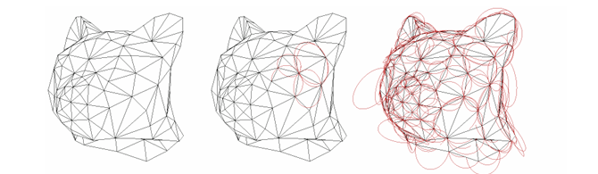
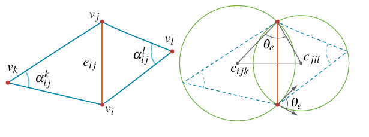
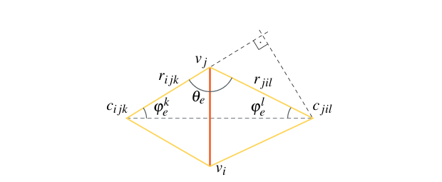
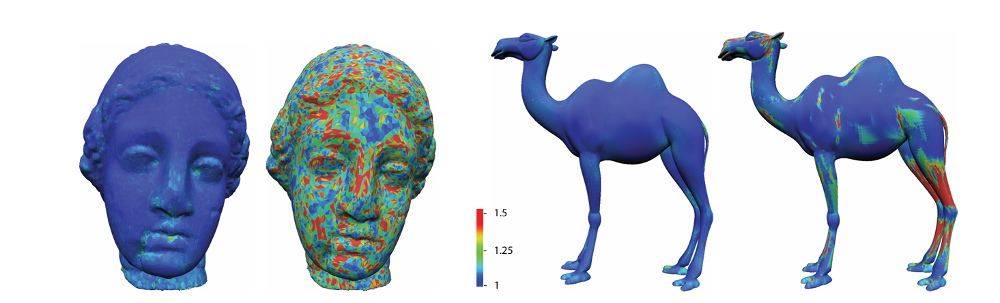
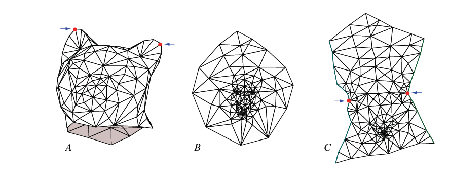
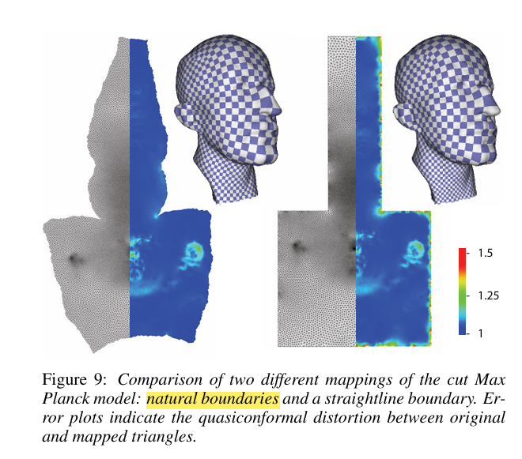
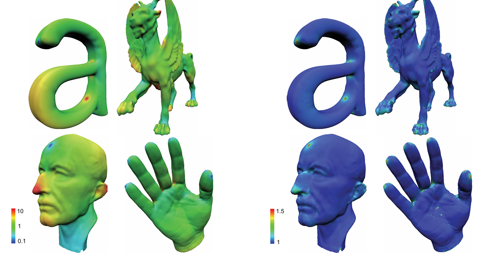

## 圆填充与共形几何
圆是共形几何的基本构建单元，**圆填充可以用来近似共形映射（Thurston）**，共形映射保持角度和圆不变：

- 共形映射将**圆映射为圆**

- 保持两个圆之间的**相交角度**不变

  
  
> *"If it is triangulated, circle pack it!"* — 三角剖分即圆填充。

有了这样的认识，我们便可以构造对共形映射的数值逼近算法——用大量的圆对曲面进行填充，然后寻找一个映射，使这些圆在映射后仍然保持圆形。如果映射对所有圆都能做到这一点，它就具有很好的共形性。

### Circle Packing与Circle Pattern

**Circle Packing（圆填充）** 是指在平面（或曲面）上排布一组圆，使得相邻的圆**外切（相切不重叠）**，并且它们的切点关系与给定的图的邻接关系完全一致。对于一个三角网格而言，每个顶点对应一个圆，若两顶点之间有边相连，则对应的两个圆相切。这样便建立了**图的组合结构**与**平面几何配置**之间的对应。

三角网格与圆填充对应的存在性由KAT定理保证，Stephenson 等人实现了三角网格上实现 Circle Packing 的算法，但 Circle Packing 有一个本质局限：**它只考虑了三角网格的连接性质，而没有充分考虑其几何性质（如原始三角形的角度信息）。**也就是说，Circle Packing 的参数化结果仅由图的拓扑结构决定，对原始几何的还原精度有限。

而**Circle Pattern** 是 Circle Packing 的推广。与 Circle Packing 要求圆与圆**相切**不同，Circle Patterns 允许相邻圆以**任意给定角度相交**，从而将原始三角网格的几何信息（内角）编码进圆的配置中。

所有三角形的**外接圆**可以认为是对它的一个**圆图案（Circle Pattern）**

- 每个三角形有一个外接圆
- 相邻三角形的外接圆以一定角度相交
- 相交角度 $\theta_e$ 称为**边权值（edge weight）**

> **边权值定义**：
> $$
> \forall e_{ij} \in E:\, \theta_e = \begin{cases} \displaystyle \pi - \alpha_{ij}^k - \alpha_{ij}^l & \text{for interior edges} \\[8pt] \displaystyle \pi - \alpha_{ij}^k & \text{for boundary edges} \end{cases}
> $$

Circle Pattern 算法的目标是**求这组边权值以及对应的圆半径**，从而得到完整的圆配置，即参数化结果。

## 基于Circle Pattern的展平算法

### 算法基本步骤

**输入**：三维三角网格

1. **求可行边权值 $\theta_e$**：二次优化，使 $\theta_e$ 接近原始几何值并满足 **Coherent Angle System 约束**
2. **变分求圆半径**：对 $\rho_i = \log r_i$ 求解凸优化问题
3. **布局**：根据圆半径和相交角度，在平面上重建圆配置，得到参数化坐标

**预处理**（可选）：Intrinsic Local Delaunay 边翻转

**全局参数化**（可选）：引入锥奇异点，处理拓扑复杂的网格

### 1.求可行边权值 $\theta_e$

---

**Circle Patterns 存在性定理**：

> 对于给定边权值 $\theta_e$（共形变换下保持不变）和一个抽象三角网格即单纯复形（Simplicial Complex），其 CirclePattern 存在当且仅当 **Coherent Angle System** 存在。

**Coherent Angle System** 是对抽象三角网格赋予一组符合下面约束的角度值 $\hat{\alpha}_{ij}^k$

**1. 正性约束**：所有角度值都大于0，$$\hat{\alpha}_{ij}^k > 0$$

**2. 三角形内角和约束**：对每个三角形 $t = (i,j,k)$，三个内角之和等于 $\pi$，$$\hat{\alpha}_{ij}^k + \hat{\alpha}_{jk}^i + \hat{\alpha}_{ki}^j = \pi$$

**3. 边权值约束**：对每条内部边 $e = (i,j)$，两侧三角形中的对应角满足：$$\hat{\alpha}_{ij}^k + \hat{\alpha}_{ij}^l = \pi - \theta_e$$

从而，求 Coherent Angle System 等价于求解一个具有 $3|F|$ 个变量、$|F|+|E|$ 个等式约束的线性可行域。

对于空间中给定的三维三角网格，其原始的 $\theta_e$（由网格的实际几何决定）如果不满足 Coherent Angle System 的约束，即无法直接找到合适的圆填充。因此，需要在尽量接近原始角度值的前提下，寻找满足约束的可行 $\theta_e$，这导出如下**二次优化问题**：

> **二次优化目标函数**：
> $$
> Q(\hat{\alpha}) = \sum \left| \hat{\alpha}_{ij}^k - \alpha_{ij}^k \right|^2
> $$

满足**Coherent Angle System约束**

> - **positivity（正性约束）**：$\displaystyle \forall \hat{\alpha}_{ij}^k : \hat{\alpha}_{ij}^k > 0$
>
> - **local Delaunay condition（局部 Delaunay 条件）**：$\displaystyle \forall e_{ij} \in E_\text{int} : \hat{\alpha}_{ij}^k + \hat{\alpha}_{ij}^l < \pi$
>
> - **triangle sum condition（三角形内角和条件）**：$\displaystyle \forall t_{ijk} \in T : \hat{\alpha}_{ij}^k + \hat{\alpha}_{jk}^i + \hat{\alpha}_{ki}^j = \pi$
>
> - **vertex sum condition（顶点角度和条件）**：$\displaystyle \forall v_k \in V_\text{int} : \sum_{t_{ijk}\ni v_k} \hat{\alpha}_{ij}^k = 2\pi$

### 变分法求圆半径

在得到 Coherent Angle System 后，需要通过变分方法求解每个圆的半径，从而确定完整的圆配置。

令 $\rho_{ijk} = \log r_{ijk}$（对圆半径取对数），其中 $r_{ijk}$ 是顶点 $i$ 在三角形 $(i,j,k)$ 中的对应圆半径。

通过几何关系，角度可以表示为：

$$
\alpha_{ij}^k = \alpha(\rho_i, \rho_j, \rho_k) = \arccos\left(\frac{r_i^2 + r_j^2 - r_k^2}{2r_i r_j}\right)
$$
构造能量泛函：

$$
E(\rho) = \sum_{t} \left(\mathcal{L}(\alpha_{ij}^k) + \mathcal{L}(\alpha_{jk}^i) + \mathcal{L}(\alpha_{ki}^j)\right) - \sum_e \theta_e \cdot \log r
$$
其中 $\mathcal{L}(\cdot)$ 是 **Lobachevsky 函数**：

$$
\mathcal{L}(x) = -\int_0^x \log|2\sin t| \, dt
$$
能量泛函的梯度条件给出：

$$
\frac{\partial E}{\partial \rho_i} = K_i = 0
$$
即每个顶点的离散曲率为零（对于平坦参数化）。

**kite 角度 $\varphi_e^k$ 的计算**：
$$
\varphi_e^k = \begin{cases} \displaystyle f_e(x) = \operatorname{atan2}(\sin\theta_e,\, e^x - \cos\theta_e) & e \in E_\text{int} \\[8pt] \displaystyle \pi - \theta_e & e \in E_\text{bdy} \end{cases}
$$
其中 $x = \rho_{ijk} - \rho_{jil}$。
**平坦性约束（非线性方程组）**：
$$
\forall t \in T:\, 0 = 2\pi - \sum_{e \in t} 2\varphi_e^t
$$

这一变分方法的理论基础来自 **Bobenko** 的变分原理,并依据 **Rivin 定理**(理想双曲四面体的二面角与 Circle Pattern 的边权值之间存在对偶关系)

## 三、算法的预处理与锥奇异点

### Intrinsic Local Delaunay 预处理

在正式求解前，可以先对原始三维三角网格进行 **Intrinsic Local Delaunay** 预处理：

> 在不改变网格抽象三角网格结构的前提下，通过边翻转操作使网格在内蕴度量意义下满足 Delaunay 条件。

对每条内部边 $e$，需要满足**局部 Delaunay（Local Delaunay）条件**：

$$
\alpha_{ij}^k + \alpha_{ij}^l \leq \pi
$$

Circle Pattern 要求满足 Delaunay 三角剖分的**空圆条件**。否则某个顶点可能位于另一个三角形外接圆内，与 Circle Patterns 的定义相违背。局部 Delaunay 是 Delaunay 三角剖分空圆性质的等价条件，因此优化后得到的配置自然满足 Delaunay 性质。这一预处理步骤能够显著减小参数化结果的扭曲。

###  锥奇异点

在网格参数化中，当网格因为种种原因无法被摊平到平面上时，我们会在原始网格上选取一些锥奇异点（下文中也称锥点），并用连接锥奇异点和边界的割 缝将网格割开，得到一个可以摊平在平面上的网格.上图给出了一个锥奇异点被称为“锥”的形象的解释，即我们可以将参数化得到的网格在锥点附近的部分卷起来得到一个锥状的曲面.

对于拓扑非平凡的曲面（如亏格$g>0$ 的闭合曲面）或者带边界的复杂形状，**不可能让所有顶点都平坦（$K_i=0$）**。高斯曲率必须"有地方去"。而**锥奇异点**是高斯曲率被集中赋予非零值的特殊点：

$$
K_i = 2\pi - \sum_{\text{face } f \ni i} \alpha_i^f\\
其中 \alpha_i^f 为顶点 i 在面 f 中的角度。
$$

**高斯–博内定理**给出了整体曲率与拓扑之间的约束：
$$
\sum_i K_i = 2\pi \chi\\
其中 \chi 为曲面的欧拉示性数
$$

  通过引入锥奇异点，可以极大地减少参数化扭曲：

  - 算法自动将高斯曲率集中到少数几个顶点（锥奇异点）
  - 其余区域保持平坦（高斯曲率为 0）
  - 从而在整体上最小化保角扭曲

  

  在 Circle Pattern 算法中，只需在变分能量中加入对锥奇异点处目标角度的额外约束：

$$
\sum_{f \ni i} \alpha_i^f = 2\pi k_i\\
  其中 k_i 为目标角度亏量系数（通常 k_i \in \mathbb{Z}^+）。
$$

引入锥奇异点后，可用 Dijkstra 算法将锥奇异点与边界点连接，得到曲面的割线。

  #### 边界条件

  - **自由边界**：边界圆的半径自由变化，参数化结果的边界形状由算法自动确定

    > **自然边界条件（Natural Boundary Condition）**：
    > $$
    > \forall v_k \in V_\text{bdy} :\, \sum_{t_{ijk}\ni v_k} \hat{\alpha}_{ij}^k < 2\pi
    > $$

  - **指定边界**：边界圆满足给定的形状约束（如映射到矩形或圆形边界）

    > **指定边界曲率条件（Prescribed Boundary Curvature）**：
    > $$
    > \forall v_k \in V_\text{bdy} :\, \sum_{t_{ijk}\ni v_k} \hat{\alpha}_{ij}^k = \pi - \kappa_k
    > $$

  

#### 算法效果对比

与 ABF算法的对比实验，Circle Pattern 方法的扭曲明显更小

   

  ### 参考文献

  - Bobenko, A. I., & Springborn, B. A. (2004). *Variational principles for circle patterns and Koebe's theorem*. Transactions of the AMS.
  - Stephenson, K. (2005). *Introduction to Circle Packing*. Cambridge University Press.
