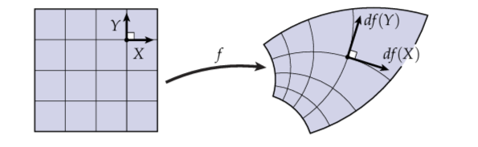

###  共形等价与共形因子

设$S$是一个嵌入在$ \mathbb{R}^3$的曲面(二维流形)，其上配有黎曼度量$g$。另外设 $u:S \to \mathbb{R}$是一个定义在曲面$S$上的标量函数。那么可以证明 $\widetilde{g} = e^{2u}g$ 也是 $S$ 上的黎曼度量，且由 $\widetilde{g}$ 诱导的角度与 $g$ 一致——即两者**共形等价**。这里的标量函数 $u$ 称为**共形因子（conformal factor）**。

共形映射在每个点的局部区域的所有方向的向量都是统一(uniform)的放缩，这个统一的放缩系数就是共形因子。数学上，共形映射满足：

$$
df(X) \cdot df(Y) = \lambda\langle X,Y\rangle
\\\lambda = e^{2u} 是局部放缩系数。
$$

而共形因子连接的两个度量$\widetilde{g}$与$g$是**共形等价(conformal equivalent)**

**Yamabe方程**

共形因子$u$影响度量，而新度量又诱导出新的高斯曲率$\widetilde{K}$,其关系可以用Yamabe方程进行描述

$$
\Delta u=e^{2u} \widetilde{K} - K
$$
Yamabe方程描述了在共形变换下高斯曲率的变化，可以采用等温坐标的方法来证明Yamabe方程（详见《计算共形几何》507页)

**离散化**

三角网格$M = (V,E,T)$的度量可以自然地定义为边集$E$的标量函数$l:E \to R$，而共形因子$u$定义顶点集$V$上,$u:S \to R$。如果$M$的两个度量$l$与$\widetilde{l}$(也就是两组边长)是共形等价的,可以得到以下关系式。

$对于任意边e_{ij} \in E,\quad \widetilde{l_{i,j}}=e^{\frac{(u_i+u_j)}{2}}l_{i,j} \tag{2}$

可以证明对于三角网格，Yamabe方程可**简化成以下（线性）泊松方程**$\Delta\phi =\widetilde{K} - K$

由于有$\widetilde{K}$是展平后的高斯曲率，所以有$\widetilde{K} = 0$,所以等价于如下的**Poisson方程**

$\Delta\phi = - K \tag{3}$

求UV坐标

有了共形因子就可以得到源三角网格与目标三角网格边集间的缩放系数

l=l'eu

由了边长后可以确定三角网格的角度数据，根据余弦定理，三角形 $(v_i, v_j, v_k)$ 中顶点 $v_i$ 处的对角 $\alpha_{jk}^i$ 为：

$$\alpha_{jk}^i = 2\tan^{-1}\sqrt{\frac{(l_{ij}+l_{jk}-l_{ki})(l_{jk}+l_{ki}-l_{ij})}{(l_{ki}+l_{ij}-l_{jk})(l_{jk}+l_{ki}+l_{ij})}}$$

有了边长和角度就可以确定目标三角网格的顶点位置即UV坐标(BFS即可)

**锥奇异点的计算**

**锥度量 (Cone Metric)**：三角网格 $M$ 上的锥度量 $g$ 是具有零离散高斯曲率的度量（除了一组称为 **锥点 (cones)** 的顶点 $C = \{c_i\}$ 外），其锥角 $\alpha_i > 0$。在锥点的邻域内，曲面等价于一个以 $c_i$ 为顶点、锥角为 $\alpha_i$ 的锥面。关于该度量的高斯曲率是 delta 函数 $K_i \delta(p - c_i)$，其中 $K_i = 2\pi - \alpha_i$。

metric与curvature的变化规律就是 **Ricci Flow**

> **a) 物理直觉 (Physical Intuition)**：Ricci flow 具有简单的物理解释。给定一个具有黎曼度量的曲面，**度量诱导高斯曲率函数**。如果度量改变，则高斯曲率也将相应地改变。我们通过以下方式对度量进行变形：在每个点，我们局部地缩放度量，使得缩放因子与该点的曲率成正比。经过变形后，曲率将被改变。我们重复变形过程，因此度量和曲率都将演化，就像**热扩散过程**一样。最终，高斯曲率函数将在任何地方都变为常数。如果曲面是单连通的，那么它最终变成球面（这个证明的基本思想是 Poincaré 猜想）。

曲面的Ricci flow是设计Riemann度量的重要工具

> **b) 动机 (Motivations)**：**Surface Ricci flow 是设计黎曼度量的强大工具**，这样的度量在曲面上诱导用户定义的高斯曲率函数，并且许多共形（即角度保持）变换到原始度量的方法可以在工程领域中被表述为寻找具有某些期望属性的度量，其中 Ricci flow 可以被直接利用。

> **Curvature Flow（曲率流）**：将 $u$ 视为时间的函数，在能量 $E$ 的负梯度下演化：
>
> $$
> \partial_t u = -2\,\text{grad}\,E = (\widetilde{K} - K)
> $$
>
> （为简化起见，假设 $M$ 没有边界。）我们可以将 $u^* = \text{argmin}_u E(u)$ ——我们使用牛顿法计算——视为此曲率流的稳态解，给定目标曲率。利用 $\partial_t \widetilde{K} = \partial_u \widetilde{K} \cdot \partial_t u$ 和公式 (10)，我们还发现曲率的演化由以下方程控制：
>
> $$
> \partial_t \widetilde{K} = \widetilde{\Delta}(\widetilde{K} - \widetilde{K})
> $$
>
> 其中 $\widetilde{\Delta}$ 表示由 $u(t)$ 诱导的离散度量的（正半定）**cot-Laplace 算子**。
>
> **关键结果**：当 $\widetilde{K} = 0$ 时，该流被 Luo [2004] 考虑为 **Yamabe flow 的离散版本**。他证明了该流是变分的，但没有给出能量公式，也没有意识到 cot-Laplace 算子出现在 $\widetilde{K}$ 的演化方程中。Jin et al. [2007] 使用 Chow 和 Luo [2003] 的离散 Ricci flow 定义的不同离散曲率流构成了该方法的基础。
>
> **对于二维黎曼流形，Yamabe flow 与 Ricci flow 相同**。我们的显式变分 formulation 为曲面上的离散 Ricci flow 提供了一种新方法。

在二维黎曼流形，Yamabe flow等价于Ricci flow

归一化定理

> **定理 1 (Uniformization Theorem / 单值化定理)**：设 $(S, \mathbf{g})$ 是具有黎曼度量 $\mathbf{g}$ 的紧致二维曲面，则存在一个与 $\mathbf{g}$ 共形的度量 $\tilde{\mathbf{g}}$，使得其高斯曲率处处为常数；该常数是 $\{+1, 0, -1\}$ 之一。我们称这样的度量为 $S$ 的 **uniformization metric**。
>
> 根据 Gauss-Bonnet 定理 (Eq. 13)，常曲率的符号必须匹配曲面 Euler 数 $\chi(S)$ 的符号：$\chi(S) > 0$ 时为 $+1$，$\chi(S) = 0$ 时为 $0$，$\chi(S) < 0$ 时为 $-1$。
>
> 因此，**我们可以将任意闭曲面用其 uniformization metric 嵌入到三个标准曲面之一**：
> - **球面 $\mathbb{S}^2$**：亏格为零且 Euler 数为正的曲面
> - **平面 $\mathbb{E}^2$**：亏格为一且 Euler 数为零的曲面（环面）
> - **双曲空间 $\mathbb{H}^2$**：高亏格且 Euler 数为负的曲面
>
> 相应地，正 Euler 数的曲面具有**球面几何**；零 Euler 数的曲面具有**欧几里得几何**；负 Euler 数的曲面具有**双曲几何**。

**CETM算法**

求解(3)式相当于$|V|$个方程，$|V|$个未知数，由**Gauss-Bonnet方程**的约束可以消去一个自由度，从而构成一个$|V|个未知数，|V|-1个方程$的线性系统，求解这个线性系统等价于求下面凸能量的最小值：

$$
E(u) = \sum_{t_{ijk}\in T} \left(f(\tilde{\lambda}_{ij},\tilde{\lambda}_{jk},\tilde{\lambda}_{ki}) - \frac{\pi}{2}(u_i+u_j+u_k)\right) + \frac{1}{2}\sum_{v_i\in V} \widehat{\Theta}_i\,u_i \quad (7)
$$

其中 $$\lambda_{ij} := 2\log l_{ij}$$ 是**对数边长 (logarithmic lengths)**。进一步两边取对数后变形：

$$
\tilde{\lambda}_{ij} = \lambda_{ij} + u_i + u_j
$$

函数 $f(\tilde{\lambda}_{ij}, \tilde{\lambda}_{jk}, \tilde{\lambda}_{ki})$ 的定义为：

$$
\begin{aligned}
f(\tilde{\lambda}_{ij},\tilde{\lambda}_{jk},\tilde{\lambda}_{ki}) =& \\
\frac{1}{2}\Bigl(&\tilde{\alpha}^i_{jk}\tilde{\lambda}_{jk}+\tilde{\alpha}^j_{ki}\tilde{\lambda}_{ki}+\tilde{\alpha}^k_{ij}\tilde{\lambda}_{ij}\Bigr) \\ 
&+ \Pi(\tilde{\alpha}^i_{jk})+\Pi(\tilde{\alpha}^j_{ki})+\Pi(\tilde{\alpha}^k_{ij}), \quad (8)
\end{aligned}
$$

> **关于 $$\Pi(\cdot)$$：Milnor–Lobachevsky 函数**
>
> 上式中的 $$\Pi(\cdot)$$ 即 **Milnor 的 Lobachevsky 函数**（也称 Clausen 函数），是双曲几何和共形参数化理论中的核心工具函数。其定义为：
>
> $$
> \Pi(\theta) = \Lambda(\theta) = -\int_0^\theta \log|2\sin u|\, du
> $$
>
> **关键性质**：
> $$
> \begin{aligned}
&\text{1. 周期性：} \Pi(\theta + \pi) = \Pi(\theta) \\
&\text{2. 奇函数：} \Pi(-\theta) = -\Pi(\theta) \\
&\text{3. 倍角关系：} \frac{1}{2}\Pi(2\theta) = \Pi(\theta) + \Pi(\theta + \tfrac{\pi}{2}) \\
&\text{4. 严格凹性：在 } (0,\pi) \text{ 上严格凹（保证凸优化的唯一解）} \\
&\text{5. 导数：} \Pi'(\theta) = -\log(2\sin\theta)
> \end{aligned}
> $$
>
> **在本算法中的作用**：
> - 在 CETM 能量泛函中，$$\Pi(\tilde{\alpha}^i_{jk})$$ 等项将三角形的对数角度变量与双曲体积联系起来
> - 其**严格凹性**保证了能量函数的**凸性**，从而确保牛顿迭代的收敛性和解的唯一性
> - 几何上，$$\sum_i \Pi(\alpha_i)$$ 表示以角度 $$\{\alpha_i\}$$ 为二面角的**理想双曲四面体的体积**（Milnor 定理）
>
> 该函数最早由 Lobachevsky 在研究双曲几何时引入，后由 John Milnor 在其经典论文 *"Hyperbolic geometry: The first 150 years"* (1982) 中系统阐述。在 Circle Pattern / CETM 算法体系中，它是连接 2D 共形参数化与 3D 双曲几何的桥梁。

> **CETM 与圆填充方法 (Circle Patterns) 的深层联系**
>
> CETM 算法和圆填充方法看似是两种不同的共形参数化方案，但它们共享同一**双曲几何根源**：**理想双曲四面体的体积公式**。
>
> **共同的核心对象**：
>
> | | **CETM (本节)** | **Circle Patterns** |
> |---|---|---|
> | 2D 基本单位 | 三角形 $(v_i, v_j, v_k)$ | Kite 四边形（两三角形拼接） |
> | 3D 对偶对象 | 理想双曲四面体（以 $\tilde{\alpha}^i_{jk}$ 为二面角） | 理想双曲四面体（以 Kite 角度 $\varphi_e^k$ 为二面角） |
> | 能量函数中的核心项 | $\Pi(\tilde{\alpha}^i_{jk})$（Lobachevsky 函数） | $\Lambda(\varphi_e^k)$（Lobachevsky 函数，记法不同） |
> | 凸性来源 | $\Pi(\theta)$ 在 $(0,\pi)$ 上严格凹 | 同上 |
> | 优化变量 | 对数边长 $\tilde{\lambda}_{ij} = \lambda_{ij} + u_i + u_j$ | 圆半径的对数 $x_i = \log r_i$ |
>
> **为什么两者都会出现双曲四面体？**
>
> 关键在于 **Rivin 定理**（1996）：一个角度集合 $\{\theta_1, \ldots, \theta_n\}$ 可以作为某个理想双曲多面体的**内二面角**，当且仅当围绕每个顶点的角度和为 $2\pi$、且满足某些线性约束。这意味着：
>
> - **在 CETM 中**：三角网格的每个三角形对应一个理想双曲四面体，三个对角 $\tilde{\alpha}^i_{jk}, \tilde{\alpha}^j_{ki}, \tilde{\alpha}^k_{ij}$ 恰好是该四面体的三个二面角，而第四个"无穷远"顶点的存在保证了体积的良定义性。能量项 $\sum \Pi(\tilde{\alpha})$ 就是这些四面体的**总体积之和**。
>
> - **在 Circle Patterns 中**：每个 Kite 四边形同样对应一个理想双曲四面体，Kite 的四个角度（两个原始角度 + 两个互补角度）构成四面体的四组二面角。Bobenko–Springborn 变分原理的能量函数同样是这些四面体的体积之和。
>
> **统一的视角**：
>
> 两种算法都可以理解为：
> 1. 将 2D 三角网格的每个面/边 **提升 (lift)** 到 $\mathbb{H}^3$ 中的一个理想双曲四面体
> 2. 以所有四面体的**体积之和**作为能量函数
> 3. 利用 Lobachevsky 函数的**严格凹性**保证凸优化有唯一解
> 4. 通过**牛顿迭代**求解最优参数
>
> 这种"2D 问题 → 3D 双曲几何 → 凸优化"的模式是现代离散共形几何的核心范式之一，由 Bobenko, Pinkall, Springborn [2006] 和 Ben-Chen, Gotsman, Bunin [2008] 分别从不同路径独立发现并形式化。
>
> > - 

**梯度计算**

能量函数 $E$ 关于 $u_i$ 的偏导数为：

$$
\partial_{u_i}E = \frac{1}{2}\left(\widehat{\Theta}_i - \sum_{t_{ijk}\ni v_i} \tilde{\alpha}^i_{jk}\right)
$$

**Hessian 矩阵**

$$(\text{Hess } E \cdot \delta u)_i = \frac{1}{2}(\Delta \delta u)_i = \frac{1}{4}\sum_{e_{ij}\ni v_i} w_{ij}\,(\delta u_i - \delta u_j), \quad (10)$$

其中 $w_{ij} = \cot\tilde{\alpha}_{ij}^k + \cot\tilde{\alpha}_{ij}^l$（对于内部边），对于边界边只取一个 cot 项。

可以证明其 Hessian 矩阵是半正定的

**参考文献**：

- Bobenko, A.I., Pinkall, U., Springborn, B. (2006). *Discrete conformal maps and ideal hyperbolic polyhedra.*
- Ben-Chen, M., Gotsman, C., Bunin, G. (2008). *Conformal Flattening by Curvature Prescription and Metric Scaling
