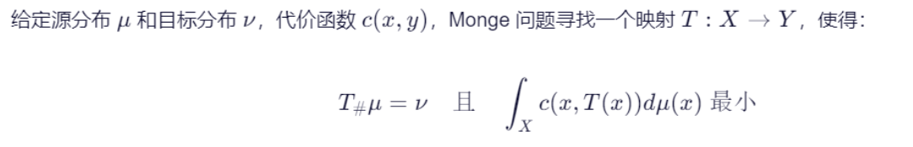

> **从参数化到最优传输的动机**：本书前四章专注**保角参数化**——保持角度、最小化角度扭曲。但在纹理映射、表面采样、焦散透镜设计等应用中，我们需要的是**保面积映射**——将曲面上均匀分布的质量无重叠地传输到目标区域。最优传输（Optimal Transport）理论正是解决这一问题的最优雅框架：它告诉我们如何在最小化总传输代价的前提下，将一个分布最优地映射为另一个分布。本章将从 Monge 的原始问题出发，逐步引入 Kantorovich 的松弛形式、对偶理论、Brenier 定理，最终建立保面积映射与最优传输之间的深刻等价关系。

## 引子：保面积映射与最优传输映射

给定源区域上的测度 $$\mu$$ 和目标区域上的测度 $$\nu$$（满足质量守恒 $$\int d\mu = \int d\nu$$），我们希望找到一个映射 $$T$$ 将 $$\mu$$ "搬运"为 $$\nu$$，同时最小化总传输代价。这正是最优传输的核心问题。

---

## Monge 问题（1781）

> **Monge 问题（原始形式）**：给定两个概率测度 $$\mu$$（定义在 $$X$$ 上）和 $$\nu$$（定义在 $$Y$$ 上），以及代价函数 $$c(x,y)$$（表示将单位质量从 $$x$$ 运到 $$y$$ 所需的代价），求映射 $$T: X \to Y$$ 使得：
>
> $$
> \min_{T} \int_X c(x, T(x)) \, d\mu(x) \quad \text{s.t.} \quad T_{\#}\mu = \nu
> $$
>
> 其中 $$T_{\#}\mu = \nu$$ 是**推前（push-forward）条件**，即对任意可测集 $$B \subseteq Y$$：
> $$
> \nu(B) = \mu(T^{-1}(B))
> $$

Monge 问题的本质困难在于：$$T$$ 必须是**映射**（每个 $$x$$ 只能映射到唯一一个 $$y$$），这意味着质量不允许分裂。这导致问题**非凸且可能无解**。

---

## Kantorovich 问题（1942）

> **Kantorovich 松弛**：将映射要求放宽为**传输计划（transport plan）** $$\pi$$——一个定义在乘积空间 $$X \times Y$$ 上的联合概率测度。$$\pi(x,y)$$ 表示从 $$x$$ 运往 $$y$$ 的质量份额：
>
> $$
> \min_{\pi \in \Pi(\mu,\nu)} \int_{X \times Y} c(x,y) \, d\pi(x,y)
> $$
>
> 其中 $$\Pi(\mu,\nu)$$ 是所有边缘分布分别为 $$\mu$$ 和 $$\nu$$ 的联合概率测度的集合：
> $$
> \Pi(\mu,\nu) = \left\{ \pi \mid \pi_x = \mu,\; \pi_y = \nu \right\}
> $$

Kantorovich 的松弛使得问题变为**无穷维线性规划**：
- 目标函数关于 $$\pi$$ 是线性的
- 约束集 $$\Pi(\mu,\nu)$$ 是凸集
- 因此**解存在**（在弱拓扑下）

---

## Kantorovich 对偶

线性规划自然引出对偶问题。对偶变量的经济解释为"价格函数"——$$\phi(x)$$ 是在 $$x$$ 处买入的价格，$$\psi(y)$$ 是在 $$y$$ 处卖出的价格。最大利润条件要求 $$\psi(y) - \phi(x) \leq c(x,y)$$（否则有无风险套利）。

> **对偶问题（Kantorovich Duality）**：
>
> $$
> \min_{\pi \in \Pi(\mu,\nu)} \int c \, d\pi \;=\; \sup_{(\phi,\psi)} \left\{ \int_X \phi \, d\mu + \int_Y \psi \, d\nu \;\mid\; \phi(x) + \psi(y) \leq c(x,y) \right\}
> $$

其中满足不等式约束的函数对 $$(\phi,\psi)$$ 称为 **Kantorovich 势（Kantorovich Potential）**。$$\psi$$ 可通过 $$c$$-变换由 $$\phi$$ 确定。

### $$c$$-变换

> **定义（$$c$$-变换）**：给定函数 $$\psi: Y \to \mathbb{R}$$，其 $$c$$-变换定义为：
>
> $$
> \psi^c(x) = \inf_{y \in Y} \left[ c(x,y) - \psi(y) \right]
> $$
>
> 类似地，$$\phi$$ 的 $$c$$-变换为：
> $$
> \phi_c(y) = \inf_{x \in X} \left[ c(x,y) - \phi(x) \right]
> $$

（$$\psi^c$$ 给出了在已知目标地价格 $$\psi(y)$$ 和运费 $$c(x,y)$$ 时，在 $$x$$ 处的最优买入价。）

### 内积代价下的凸共轭（Legendre 变换）

当代价函数为内积形式 $$c(x,y) = \langle x, y \rangle$$ 时，$$c$$-变换退化为经典的 **Legendre 变换（凸共轭）**：

> $$
> \phi^*(y) = \sup_{x} \left[ \langle x, y \rangle - \phi(x) \right]
> $$

> 约束 $$\phi(x) + \psi(y) \leq \langle x, y \rangle$$ 等价于 $$\psi(y) \leq \phi^*(y)$$。
>
> 在最优解处，$$\psi = \phi^*$$（对偶变量互为凸共轭）。

---

## Brenier 定理（1987/1991）

针对最重要的**二次代价函数** $$c(x,y) = \frac{1}{2}\|x - y\|^2$$，Brenier 给出了最优传输映射的显式结构：

> **Brenier 定理**：对于绝对连续的 $$\mu$$（$$\mu \ll \mathcal{L}^d$$），二次代价下的最优传输映射 $$T$$ 存在且唯一，且可表示为某个凸函数 $$\phi$$ 的梯度：
>
> $$
> T(x) = \nabla \phi(x), \quad \phi \text{ 是凸函数}
> $$
>
> 这个凸函数 $$\phi$$ 称为 **Brenier 势（Brenier Potential）**。

### Monge-Ampère 方程

推前条件 $$T_{\#}\mu = \nu$$ 在 $$T = \nabla \phi$$ 下可写为：

> $$
> \nu(\nabla\phi(x)) \cdot \det(D^2\phi(x)) = \mu(x)
> $$

这个非线性二阶偏微分方程就是 **Monge–Ampère 方程**，它是最优传输理论和保面积参数化的核心方程。

### 解的结构

综上，二次代价下的最优传输问题可归结为：

> 存在唯一的凸函数 $$\phi$$（Brenier 势），使得：
>
> - $$T = \nabla \phi$$ 是唯一的最优传输映射
> - $$\phi$$ 满足 Monge-Ampère 方程 $$\det(D^2\phi) \cdot \nu(\nabla\phi) = \mu$$
> - $$\phi^*$$（$$\phi$$ 的凸共轭）是 Kantorovich 对偶问题的解

---

## 扭曲条件（Twist Condition）

对于更一般的代价函数 $$c(x,y)$$，Brenier 结论的推广需要所谓的**扭曲条件**：

> **定义（Twist Condition）**：代价函数 $$c$$ 满足扭曲条件，若映射：
> $$
> y \mapsto \nabla_x c(x,y)
> $$
> 对每个固定的 $$x$$ 是单射。

这也意味着在最优传输中，$$\nabla_x c(x,y)$$ 唯一确定了 $$y$$，从而保证了传输映射 $$T$$ 的存在性：

> $$
> T(x) = \arg\min_y \left[ c(x,y) - \psi(y) \right] \quad \text{或等价地} \quad T(x) = \nabla c(x, \cdot)^{-1}(\nabla \phi(x))
> $$

其中 $$\phi$$ 是 Kantorovich 势。

---

## 小结：最优传输的数学结构

| 层次 | 对象 | 条件 | 难度 |
|:---|:---|:---|:---|
| Monge | 映射 $$T$$ | $$T_{\#}\mu = \nu$$ | 非凸，可能无解 |
| Kantorovich | 传输计划 $$\pi$$ | $$\pi \in \Pi(\mu,\nu)$$ | 线性规划，解存在 |
| Kantorovich 对偶 | 势函数 $$(\phi,\psi)$$ | $$\phi(x)+\psi(y) \leq c(x,y)$$ | 对偶 LP |
| Brenier（二次代价） | 凸势 $$\phi$$ | $$T = \nabla\phi$$ | MA 方程 |

Kantorovich 势可视作"价格函数"——类似于物理中"力是势能的负梯度"，**传输方向由势函数的梯度决定**：

下一节我们将进入具体的数值解法。
