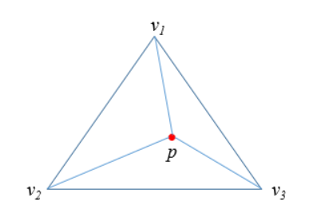
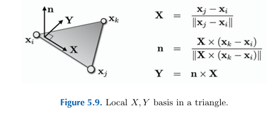

### **三角网格上的分片线性映射**

在三角网格的设定下，那么我们要求的映射$f$又可以写成这样$$f:M \rightarrow R^{2},\text M{是R^{3}中的三角网格}$$，而另外一方面要构造这样映射$f$只要对顶点集$V$找到一组$R^2$的坐标(一般称为”**UV坐标**“如下图所示）即可。

我们先来看下三角形**重心坐标(Barycentric Coordinate)**的概念,

有了重心坐标的值之后那么插值的权重采用重心坐标权重就是合理的，那么分段线性映射就可以表达为每个顶点函数值的线性组合，其中系数就是该点在三角形局部坐标系下的重心坐标$f(x) = \alpha f_i + \beta f_j + \gamma f_k$

### 映射的Jacobian矩阵

对于每一个三角面片，我们可以首先建立一个如下的局部坐标系，二维坐标来表示其中的点那就是说如何在每个三角形上建立起局部·坐标系。如下图所示，假设我们选取三角形$T=[x_i,x_j,x_k]$,那么我们以某个顶点$x_i$为原点以某个边$[x_i,x_j]$为$X$轴，然后按照右手定则建立坐标系。

对于每一个三角面片$t$我们可以合理地假设映射$f$在其上的作用可以是一个简单的线性函数$f_t$,可以设$f_t(x) = J_tx + b_t$。

其中$J_t$是Jacobian矩阵，是对映射局部形变情况的描述，在后面我们在对其进行仔细的研究。$b_t$平移量对于参数化映射来说并没有影响，直接设为0

分片线性映射$f$的Jacobian矩阵如下


$$J_t ={\begin{pmatrix}{{\partial u}/{\partial x}}&{{\partial u}/{\partial y}}\\{{\partial v}/{\partial x}}&{{\partial v}/{\partial y}}\end{pmatrix} }= {\begin{pmatrix}{u_j-u_i}&{u_k-u_i}\\{v_j-u_i}&{v_k-v_i}\end{pmatrix} }{\begin{pmatrix}{x_j-x_i}&{x_k-x_i}\\{y_j-y_i}&{y_k-y_i}\end{pmatrix}^{-1}}\tag{1} $$


2阶矩阵可以直接求逆
$$
A = \begin{pmatrix} a & b \\ c & d \end{pmatrix}, \quad
A^{-1} = \frac{1}{ad - bc} \begin{pmatrix} d & -b \\ -c & a \end{pmatrix}
\quad \text{（当 } ad - bc \ne 0 \text{）}
$$
对公式(1)代数变形可以得到下面的展开形式


$$
\begin{aligned}
{\begin{pmatrix}{{\partial u}/{\partial x}}\\{{\partial u}/{\partial y}}\end{pmatrix} }=\frac{1}{2A_t}{\begin{pmatrix}{y_j-y_k}&{y_k-y_i}&{y_i-y_j}\\{x_k-x_j}&{x_i-x_k}&{x_j-x_i}\end{pmatrix} }
{\begin{pmatrix}u_i\\u_j\\u_k\end{pmatrix} }\\
{\begin{pmatrix}{{\partial v}/{\partial x}}\\{{\partial v}/{\partial y}}\end{pmatrix} }=\frac{1}{2A_t}{\begin{pmatrix}{y_j-y_k}&{y_k-y_i}&{y_i-y_j}\\{x_k-x_j}&{x_i-x_k}&{x_j-x_i}\end{pmatrix} }
{\begin{pmatrix}v_i\\v_j\\v_k\end{pmatrix} }
\end{aligned}
\tag{2}

其中$A_t$是三角形面积，可以通过叉积求得$2A_t=(x_iy_j-y_ix_j)+(x_jy_k-y_jx_k)+(x_ky_i-y_kx_i)$
$$
**翻转与Jacobi矩阵**

映射$f$ 是无翻转的(flip free)，映射后三角形的定向是不能翻转的，否则也会有错乱的情况

**分段线性映射的奇异值**

对分段线性映射$f$的Jacobian矩阵$J_t$进行SVD分解 ,$$J_t=U\Sigma V^T,\Sigma={\begin{pmatrix}{\sigma_1}&{0}\\{0}&{\sigma_2}\end{pmatrix} } $$,奇异值$\sigma1 , \sigma2$分别描述映射在正交两个方向上的拉伸程度，如下图所示

根据分解后的奇异值$\sigma1 , \sigma2$，对映射扭曲进行度量

（1）若$\sigma1 = \sigma2$ 则这两个三角形是相似三角形，则映射是保角映射

（2）进一步若$\sigma1 = \sigma2 =1$ 则这两个三角形只是发生了旋转

当然不是什么映射都可以，必须满足一定的**约束**

1.映射$f$ 是局部单射的(Locally Injective)，即映射之后内部的三角形的边是不能相交的

2. 映射$f$ 是无翻转的(flip free)，映射后三角形的定向是不能翻转的，否则也会有错乱的情况

3.映射$f$ 是双射的(Bijecive), 映射后的边界是不能相交的

## 分片线性映射的梯度

分段线性函数

$$
f(\mathbf{x}) = \alpha f_i + \beta f_j + \gamma f_k
$$
将梯度算子作用于其上可得

$$
\nabla_{\mathbf{x}} f(\mathbf{x}) = f_i \nabla_{\mathbf{x}} \alpha + f_j \nabla_{\mathbf{x}} \beta + f_k \nabla_{\mathbf{x}} \gamma
$$
由重心坐标 $\alpha$ 的面积比表示，

$$
\alpha = \frac{A_i}{A_T} = \frac{\left( (\mathbf{x} - \mathbf{x}_j) \cdot \frac{(\mathbf{x}_k - \mathbf{x}_j)^\perp}{\|\mathbf{x}_k - \mathbf{x}_j\|} \right) \|\mathbf{x}_k - \mathbf{x}_j\|}{2 A_T} = \frac{(\mathbf{x} - \mathbf{x}_j) \cdot (\mathbf{x}_k - \mathbf{x}_j)^\perp}{2 A_T}
$$

进而

$$
\nabla_{\mathbf{x}} \alpha = \frac{(\mathbf{x}_k - \mathbf{x}_j)^\perp}{2A_T},\quad \nabla_{\mathbf{x}} \beta = \frac{(\mathbf{x}_i - \mathbf{x}_k)^\perp}{2A_T},\quad \nabla_{\mathbf{x}} \gamma = \frac{(\mathbf{x}_j - \mathbf{x}_i)^\perp}{2A_T}
$$
因此

$$
\nabla_{\mathbf{x}} f(\mathbf{x}) = f_i \frac{(\mathbf{x}_k - \mathbf{x}_j)^\perp}{2A_T} + f_j \frac{(\mathbf{x}_i - \mathbf{x}_k)^\perp}{2A_T} + f_k \frac{(\mathbf{x}_j - \mathbf{x}_i)^\perp}{2A_T}
$$

## 分片线性映射的Laplace算子

#### Dirichlet能量

对于一个**实映射**,定义其Dirichlet能量为其梯度的$L2$范数
$$
E_D = \frac{1}{2}\int_X|\nabla u|^2dA
$$
可以用Dirichlet能量来衡量映射的平滑性(如一个映射是调和的,则其Dirichlet能量为0)

在三角网格定义域上，该能量的**离散化**如下

$$
E_D = \Sigma_{he_{ij}} cot(\alpha_{ij})(u_i - u_j)^2
$$
Laplace算子，定义为梯度的散度 $\operatorname{div}\,\nabla u$。在 $\mathbb{R}^2$ 上 $\Delta u = u_{xx} + u_{yy}$，故调和映射满足 $\Delta u = 0$，与 Dirichlet 能量极小相关。

> The Laplacian measures the **regularity (or irregularity) of a function.** For instance, for a linear function the Laplacian is equal to zero. **Therefore, minimizing the Laplacian of $u$ and $v$ results in smooth parametric coordinates;** in other words, this also minimizes the distortion of the parameterization. The Laplacian can be generalized to curved surfaces, and the …

对于定义在任二维曲面$S$上的信号$f$,则其Laplace定义为该信号梯度的散度$\Delta_Sf = -div_S \nabla_Sf$，

下面我们看下在离散的三角网格上Laplace算子是怎么样的，在三角网格上Laplaces算子也称为**Laplace-Beltrami算子**

#### 图(Graph)上的Laplace算子

**离散化**，即如何对于三角网格(Mesh)定义Laplace算子呢？

1.将网格看成是图，从而图的Laplace算子也能用来定义网格的Laplace算子(Uniform Laplacian)

$$
\Delta f(v_i) = \frac{1}{|\mathcal{N}_1(v_i)|} \sum_{v_j \in \mathcal{N}_1(v_i)} (f_j - f_i)
$$

#### Laplace-Beltrami算子

2.上面的定义方式仅考虑网格的连接性,没有考虑顶点的几何分布特性，所以更常用的是下面这种定义（Cotangent formula）

对于下面的顶点的小领域$A_i$采用Mixed Voronoi Cell

根据散度定理(Divergence Theorem,又称高斯定理)

$$
\int_{A_i} \operatorname{div} \mathbf{F}(\mathbf{u})\,\mathrm{d}A = \int_{\partial A_i} \mathbf{F}(\mathbf{u}) \cdot \mathbf{n}(\mathbf{u})\,\mathrm{d}s
$$
那么对于Laplace算子则有

$$\int_{A_i} \Delta f(\mathbf{u}) \,\mathrm{d}A = \int_{A_i} \operatorname{div} \nabla f(\mathbf{u}) \,\mathrm{d}A = \int_{\partial A_i} \nabla f(\mathbf{u}) \cdot \mathbf{n}(\mathbf{u}) \,\mathrm{d}s$$

$\mathbf{n}$ 的朝向向外。下图为三角形 $T$ 上与边 $(\mathbf{x}_i,\mathbf{x}_j)$、$(\mathbf{x}_i,\mathbf{x}_k)$ 相关的局部记号（点 $\mathbf{a},\mathbf{b}$ 及法向等）。

对每一个部分分别进行计算

$$
\begin{aligned}
\int_{\partial A_i \cap T} \nabla f(\mathbf{u}) \cdot \mathbf{n}(\mathbf{u})\,\mathrm{d}s
&= \nabla f(\mathbf{u}) \cdot (\mathbf{a} - \mathbf{b})^\perp
=\frac{1}{2}\, \nabla f(\mathbf{u}) \cdot (\mathbf{x}_j -\mathbf{x}_k)^\perp
\end{aligned}
$$

将之前计算的导数代入进去则有

$$
\begin{aligned}
\int_{\partial A_i \cap T} \nabla f(\mathbf{u}) \cdot \mathbf{n}(\mathbf{u})\,\mathrm{d}s
={} & (f_j - f_i)\,\frac{(\mathbf{x}_i - \mathbf{x}_k)^\perp \cdot (\mathbf{x}_j - \mathbf{x}_k)^\perp}{4A_T}  + (f_k - f_i)\,\frac{(\mathbf{x}_j - \mathbf{x}_i)^\perp \cdot (\mathbf{x}_j - \mathbf{x}_k)^\perp}{4A_T}
\end{aligned}
$$

记 $\gamma_j,\gamma_k$ 分别为顶点 $v_j,v_k$ 处的内角。由

$$
A_T = \tfrac{1}{2}\sin\gamma_j \,\|\mathbf{x}_j - \mathbf{x}_i\|\,\|\mathbf{x}_j - \mathbf{x}_k\| = \tfrac{1}{2}\sin\gamma_k \,\|\mathbf{x}_i - \mathbf{x}_k\|\,\|\mathbf{x}_j - \mathbf{x}_k\|
$$

以及

$$
\cos\gamma_j = \frac{(\mathbf{x}_j - \mathbf{x}_i)\cdot(\mathbf{x}_j - \mathbf{x}_k)}{\|\mathbf{x}_j - \mathbf{x}_i\|\,\|\mathbf{x}_j - \mathbf{x}_k\|},\qquad \cos\gamma_k = \frac{(\mathbf{x}_i - \mathbf{x}_k)\cdot(\mathbf{x}_j - \mathbf{x}_k)}{\|\mathbf{x}_i - \mathbf{x}_k\|\,\|\mathbf{x}_j - \mathbf{x}_k\|}
$$
可得

$$
\int_{A_i} \Delta f(\mathbf{u})\,\mathrm{d}A = \frac{1}{2} \sum_{v_j \in \mathcal{N}_1(v_i)} (\cot \alpha_{ij} + \cot \beta_{ij})(f_j - f_i)
$$

从而对 Laplace–Beltrami 算子的离散化可取为

$$
\Delta f(v_i) := \frac{1}{2A_i} \sum_{v_j \in \mathcal{N}_1(v_i)} (\cot \alpha_{ij} + \cot \beta_{ij})(f_j - f_i)
$$

**扭曲能量**
另外我们希望映射的扭曲是尽可能小的，我们可以定义一个能量$E(f)$，用来度量映射$f$的扭曲程度,从而可以将参数化问题建模为一个抽象的几何最优化问题,之后的工作就是尽可能找到“好”的能量，找到更快更稳定的收敛方法。
$$
min_{f \in PL}\ E(f) ，f满足约束条件
$$
接下来我们会看到如何定义具体的能量，以及如何对这些能量进行数值优化。