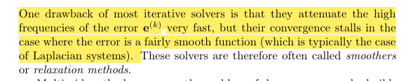
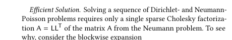
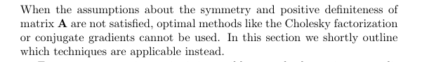

## 线性方程组 $Ax=b$

我们先不讨论方程的解存在性问题，假设解是存在的，我们考虑数值求解的算法

本文仍按「迭代法 $\rightarrow$ 共轭梯度 $\rightarrow$ 直接分解」的路线展开，重点是：先用最直观的方法建立直觉，再过渡到更高效、更稳定的工程解法。

### Jacobi 与 Gauss-Seidal 方法

都是迭代方法

将方程Ax=b展开
$$
\begin{aligned}
a_{1,1}x_1 + a_{1,2}x_2 + \cdots + a_{1,n}x_n &= b_1,\\
a_{2,1}x_1 + a_{2,2}x_2 + \cdots + a_{2,n}x_n &= b_2,\\
\vdots \quad & \vdots\\
a_{n,1}x_1 + a_{n,2}x_2 + \cdots + a_{n,n}x_n &= b_n.
\end{aligned}
$$

#### Jacobi 方法
$$
x_i^{(k+1)}=\frac{1}{a_{ii}}\left(b_i-\sum_{j\ne i} a_{ij}x_j^{(k)}\right)
$$

#### 并行化优化为 Gauss-Seidel
$$
x_i^{(k+1)}=\frac{1}{a_{ii}}\left(
b_i-\sum_{j=1}^{i-1}a_{ij}x_j^{(k+1)}-\sum_{j=i+1}^{n}a_{ij}x_j^{(k)}
\right)
$$

可以证明如果矩阵是对角占优的，那么将收敛

直观理解：Jacobi 每步都使用旧解更新，结构简单、易并行；Gauss-Seidel 会立刻复用新分量，通常收敛更快，但天然偏串行。

#### CG 方法（Conjugate gradients）

线性方程解，等价于二次型的最优化
$$
\Phi(x)=\frac{1}{2}x^T A x-b^T x
$$

#### 梯度下降路径的选择是关键
$$
\begin{aligned}
\kappa(A) &= \frac{\lambda_{\max}(A)}{\lambda_{\min}(A)} \quad (A.4),\\
x^{(k)} &= \arg\min_{x\in \mathcal{K}^{(k)}} \Phi(x),\qquad 
\mathcal{K}^{(k)} = \operatorname{span}\{p^{(0)},\ldots,p^{(k-1)}\}\quad (A.5),\\
p^{(j)T}A p^{(i)} &= 0,\quad i\ne j,\\
\nabla\Phi &= A x^{(k)} - b = -r^{(k)}.
\end{aligned}
$$

这里的关键不是“盲目沿负梯度前进”，而是在逐步扩展的 Krylov 子空间里寻找最优方向，从而避免普通梯度下降常见的锯齿路径。

#### 算法
$$
\begin{aligned}
k&=0, \quad r^{(0)}=p^{(0)}=Ax^{(0)}-b,\\
\text{while }&\left(\|Ax^{(k)}-b\|\le \epsilon\right)\ \text{and }\left(k<k_{\max}\right),\\
\alpha&=\frac{r^{(k)T}r^{(k)}}{p^{(k)T}Ap^{(k)}},\\
x^{(k+1)}&=x^{(k)}+\alpha p^{(k)},\\
r^{(k+1)}&=r^{(k)}-\alpha A p^{(k)},\\
\beta&=\frac{r^{(k+1)T}r^{(k+1)}}{r^{(k)T}r^{(k)}},\\
p^{(k+1)}&=r^{(k+1)}+\beta p^{(k)},\\
k&\leftarrow k+1.
\end{aligned}
$$

实现时通常配合如下停止准则：

- 相对残差 $\|r^{(k)}\|/\|b\| < \epsilon$
- 达到最大迭代次数 $k_{\max}$
- 连续若干步残差下降幅度很小（提前停止）

#### 迭代法的不足



对参数化问题而言，这类“高频误差先被快速抹平、低频误差收敛慢”的现象很常见，因此单纯迭代法在高精度阶段会变慢。

#### 稀疏对称矩阵的 sparse Cholesky 分解 $A=LL^T$
$$
Ax=b \Leftrightarrow LL^T x=b \Leftrightarrow 
\begin{cases}
Ly=b,\\
L^T x=y.
\end{cases}
$$


$$
\begin{bmatrix}
A_{II} & A_{IB}\\
A_{BI} & A_{BB}
\end{bmatrix}
=
\begin{bmatrix}
L_{II} & 0\\
L_{BI} & L_{BB}
\end{bmatrix}
\begin{bmatrix}
L_{II}^T & L_{BI}^T\\
0 & L_{BB}^T
\end{bmatrix}
\quad (7)
$$

上面的块形式可以理解为：先对系统做结构化重排，再利用稀疏性做分块消元，减少填充并提升分解效率。

#### 如果矩阵不是稀疏对称的，则无法使用



#### 其他分解包括 LU 分解等，但效率不如 Cholesky 分解
$$
Ax=b \Leftrightarrow LUx=b \Leftrightarrow 
\begin{cases}
Ly=b,\\
Ux=y.
\end{cases}
$$

工程里常见的经验是：

- 对称正定优先 Cholesky（更快、更省内存）
- 非对称或不定矩阵转用 LU / QR
- 超大规模问题优先考虑“预条件 + 迭代法”


### Poisson方程

Poisson 方程定义为 $\Delta a = b$，Laplace 方程是其中 $b=0$ 的特殊情况，是一种椭圆型偏微分方程。

Poisson 方程在自然界中应用广泛，比如热的扩散。限定了边界后，一般边界条件有 Dirichlet 条件与 Neumann 条件。

**Dirichlet 条件**（式 (3)）：

$$
\begin{aligned}
\Delta a &= \phi \quad \text{on } M,\\
a &= g \quad \text{on } \partial M.
\end{aligned}
\qquad (3)
$$

**Neumann 条件**（式 (4)）：

$$
\begin{aligned}
\Delta a &= \phi \quad \text{on } M,\\
\frac{\partial a}{\partial n} &= h \quad \text{on } \partial M.
\end{aligned}
\qquad (4)
$$

在三角网格上，对式 (3) 进行离散，得到线性方程组

$$
Aa = P\phi.
$$

其中 $A \in \mathbb{R}^{|V| \times |V|}$ 为 **cotan-Laplace 矩阵**。非对角元与对角元常用 cotangent 权表示为

$$
A_{ij} = -\frac{1}{2}\left(\cot\beta_p^{ij} + \cot\beta_q^{ij}\right),
$$

$$
A_{ii} = -\sum_{ij \in E} A_{ij}.
$$

$P$ 是 Mass 矩阵，在展平的场景下可设 $P = E$。将网格顶点分为内部点与边界点，可对矩阵 $A$ 分块。**Neumann 边界**条件下的 Poisson 问题可写为分块形式（式 (5)）：

$$
\begin{bmatrix}
A_{II} & A_{IB} \\
A_{IB}^T & A_{BB}
\end{bmatrix}
\begin{bmatrix}
a_I \\ a_B
\end{bmatrix}
=
\begin{bmatrix}
\phi_I \\ \phi_B - h
\end{bmatrix}.
\qquad (5)
$$

对于 **Dirichlet 条件**有 $a_B = g \in \mathbb{R}^{|B|}$，消去边界未知量后得到仅关于内部变量的方程（式 (6)）：

$$
A_{II}\, a_I = \phi_I - A_{IB}\, g.
\qquad (6)
$$

因此数值上同样通过 **稀疏线性系统** 求解离散 Poisson 方程。


## Appendix

### A. 解的存在性

$b=0$ 为齐次线性方程组

$b\ne 0$ 非齐次线性方程组

解的存在唯一性，非线性方程组相容性问题 $r(A|b)=r(A)$

## Eigen库

适用于大规模稀疏系统（如 PDE 离散、图问题），主要是使用直接法，这些方法都是Eigen自带的无需引用其他三方包

在参数化任务中，如果矩阵装配正确但数值结果不稳定，建议优先检查三件事：边界条件是否合理、矩阵是否满足预期性质（如 SPD）、以及是否做了适当的缩放/预处理。

| 求解器             | 适用矩阵 | 依赖 | 特点                     |
| ------------------ | -------- | ---- | ------------------------ |
| **SimplicialLDLT** | 对称正定 | 内置 | 轻量，适合 2D 问题       |
| **SimplicialLLT**  | 对称正定 | 内置 | 比 LDLT 更快但更不稳定   |
| **SparseLU**       | 任意方阵 | 内置 | 基于 SuperLU，支持非对称 |
| **SparseQR**       | 任意矩阵 | 内置 | 用于最小二乘，内存高     |

```C++
#include <Eigen/Sparse>
#include <Eigen/SparseLU>

Eigen::SparseMatrix<double> A(n, n);
// ... fill A ...

Eigen::VectorXd b(n);
// ... fill b ...

Eigen::SparseLU<Eigen::SparseMatrix<double>> solver;
solver.compute(A);

if (solver.info() != Eigen::Success) {
    std::cerr << "Decomposition failed!" << std::endl;
    return -1;
}

Eigen::VectorXd x = solver.solve(b);
```

