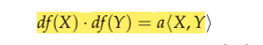
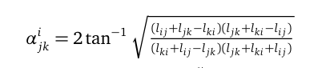
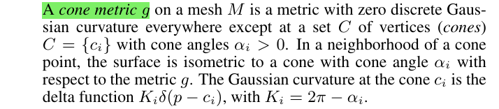
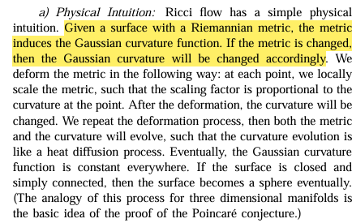
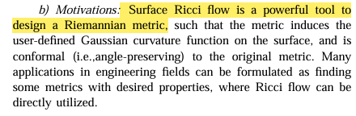
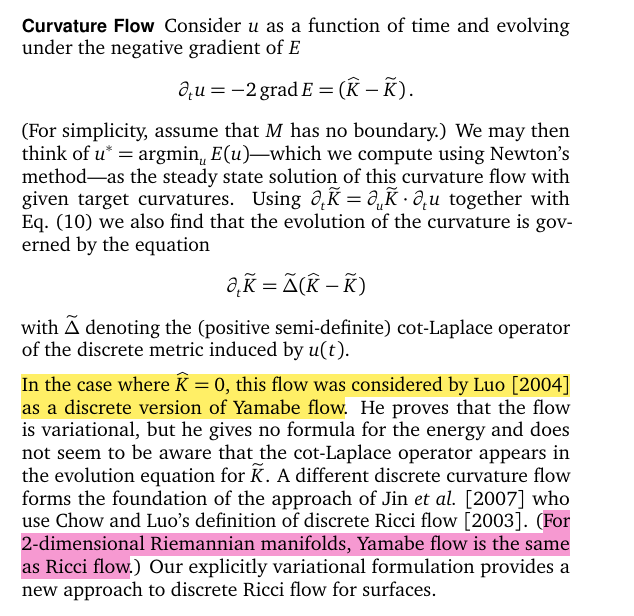
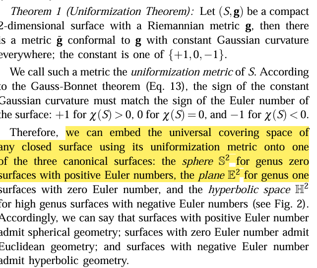
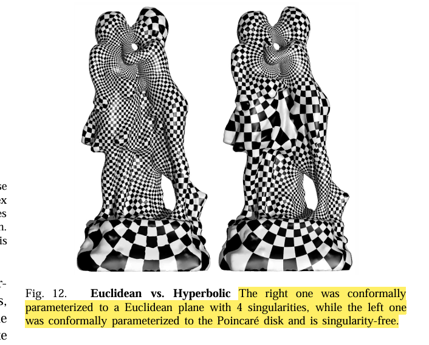

前面我们看到只要让曲面内部的点高斯曲率为零，即可将曲面展平。

###  共形等价与共形因子

设$S$是一个嵌入在$ \mathbb{R}^3$的曲面(二维流形)，其上配有黎曼度量$g$。另外设 $u:S \to \mathbb{R}$是一个定义在曲面$S$上的标量函数。那么可以证明$\widetilde{g} = e^{2u}g$也是$S$上的黎曼度量，由度量$\widetilde{g}$诱导的角度与度量$g$诱导的角度是相等的，标量函数$u$称为**共形因子(conformal factor)**，共形因子是

共形映射在每个点的局部区域的所有方向的向量都是统一(uniform)的放缩，这个统一的放缩系数就是共形因子

a = eU

而共形因子连接的两个度量$\widetilde{g}$与$g$是**共形等价(conformal equivalent)**

**Yamabe方程**

共形因子$u$影响度量，而新度量又诱导出新的高斯曲率$\widetilde{K}$,其关系可以用Yamabe方程进行描述

$$\Delta u=e^{2u} \widetilde{K} - K\tag{1}$$

Yamabe方程描述了在共形变换下高斯曲率的变化，可以采用等温坐标的方法来证明Yamabe方程（详见《计算共形几何》507页)

**Yamabe离散化**

三角网格$M = (V,E,T)$的度量可以自然地定义为边集$E$的标量函数$l:E \to R$，而共形因子$u$定义顶点集$V$上,$u:S \to R$。如果$M$的两个度量$l$与$\widetilde{l}$(也就是两组边长)是共形等价的,可以得到以下关系式。

$对于任意边e_{ij} \in E,\quad \widetilde{l_{i,j}}=e^{\frac{(u_i+u_j)}{2}}l_{i,j} \tag{2}$

可以证明对于三角网格，Yamabe方程可**简化成以下（线性）泊松方程**$\Delta\phi =\widetilde{K} - K$

由于有$\widetilde{K}$是展平后的高斯曲率，所以有$\widetilde{K} = 0$,所以等价于如下的**Poisson方程**

$\Delta\phi = - K \tag{3}$

求UV坐标

有了共形因子就可以得到源三角网格与目标三角网格边集间的缩放系数

l=l'eu

由了边长后可以确定三角网格的角度数据

有了边长和角度就可以确定目标三角网格的顶点位置即UV坐标

选定一个原点通过BFS

**锥奇异点的计算**

[1] Conformal Flattening by Curvature Prescription  and Metric Scaling   Mirela Ben-Chen, Craig Gotsman and Guy Bunin

metric与curvature的变化规律就是Ricci flow

曲面的Ricci flow是设计Riemann度量的重要工具

在二维黎曼流形，Yamabe flow等价于Ricci flow

归一化定理

**CETM算法**

求解(3)式相当于$|V|$个方程，$|V|$个未知数，由**Gauss-Bonnet方程**的约束可以消去一个自由度，从而构成一个$|V|个未知数，|V|-1个方程$的线性系统，求解这个线性系统等价于求下面凸能量的最小值

其中是对数边长(logarithmic lengths)

进一步两边取对数后变形

这个能量的梯度

其Hessian矩阵

可以证明其Hessian矩阵是半正定的

#### 参数域形状可控性的研究

本篇文章就是从如何**改变参数域形状**的角度入手，实现了一种可**实时**的高效编辑参数域形状共形参数化算法

可不可以展平后通过平面变形的方法来对形状进行编辑呢？(破坏了pipeline的一致性)

到底能对形状做出什么程度的变形呢？限制肯定是有的。黎曼映射定理是说任意两个拓扑圆盘之间存在共形映射，但并不是说能从一个形状进行任意变形并且还能保持共形性

由复分析理论中关于全纯函数的知识，共形映射是共轭调和映射对组成（conjugate  harmonic pair）,所以求解共形映射就是求解这样一对调和映射对$f = a + bi$

**Cherrier 方程**

Cherrier 方程就是带边流形上的Yamabe方程

$$ \begin{array} { r c l c l } { { \Delta u } } & { { = } } & { { K - e ^ { 2 u } \widetilde { K } } } & { { \mathrm { o n } } } & { { M } } \\ { { \frac { \partial u } { \partial n } } } & { { = } } & { { \kappa - e ^ { u } \widetilde { \kappa } } } & { { \mathrm { o n } } } & { { \partial M } } \end{array} $$

该式等价于

对(1)进行积分

Omega是离散网格的角盈。

同样对(2)进行积分可得

其中定义在边界上得h称为Neumann值

**Poincaré-Steklov operator(Poisson方程边界条件转换)**

BFF算法的输入分两种：（1）共形放缩因子$u$  (2)边界角度$\widetilde k$，分别对应了两种边界条件

Dirichelt to Neumann

Neumann to Dirichlet

**Hibert变换**

计算出了Neumann值h

对于调和函数，边界延拓到内部

算法流程

直接编辑

#### Ricci流

曲面**Ricci流**的是求解**Yamabe方程**的强有力方法，其关键思路是黎曼度量随时间演化，演化速率正比于当前的高斯曲率$dg/dt = -2Kg$，最后收敛到常值。

ricci流是通过曲率构造黎曼度量的强有力的工具，ricci流是根据曲率对曲面的Riemann度量进行共形变换，使得曲率能像热流一样在曲面上进行扩散。

Discrete Ricci flow这篇工作将将球面空间/欧式空间/双曲三种空间的ricci流进行统一表达和求解的计算框架

共形变换与circle packing

任意二维流形都可以归结为几个共形类中，而Ricci流解决了"How to"的问题，所有Riemann曲面都可以通过ricci流收敛到到常曲率

在平滑曲面上的ricci流,类比温度流

- Ricci flow收敛性：**陈-罗定理**（Chow-Luo Theorem）为离散曲面上的Ricci流提供了关键的理论保证：在离散Ricci流下，曲率演化是收敛的，并且能实现任意给定的目标曲率（只要满足高斯-博内定理约束）。

对于离散化需要借助circle packing来定义度量

为什么用不直接用边长来刻画

所以，回到你的核心疑问：**之所以不直接用三角网格的边长作为度量来实现Ricci流，是因为边长是一个“刚性”的参数，它无法自然地参数化共形结构，且会导致数值实现上不可行的带约束优化问题。而圆填充的半径，是一个“柔性”的参数，它完美地捕捉了离散共形类，并将离散Ricci流转化为一个优雅、无约束、理论完备的凸优化过程。**

算法迭代过程

有些情况下在在双曲空间中展开要比在欧式空间中展开效果要好

