## 一、从圆填充到共形几何：基本思想

### 1.1 圆是共形几何的基本构建单元

在共形几何中，**共形映射（conformal mapping）** 保持两件事不变：角度和圆。具体来说：

- 共形映射将**圆映射为圆**
- 保持两个圆之间的**相交角度**不变

有了这样的认识，我们便可以构造对共形映射的数值逼近算法——用大量的圆对曲面进行填充，然后寻找一个映射，使这些圆在映射后仍然保持圆形。如果映射对所有圆都能做到这一点，它就具有很好的共形性。这便是 Circle Packing 与 Circle Patterns 两类算法的共同出发点。

---

## 二、Circle Packing：从组合到几何

### 2.1 什么是 Circle Packing

**Circle Packing（圆填充）** 是指在平面（或曲面）上排布一组圆，使得相邻的圆**外切（相切不重叠）**，并且它们的切点关系与给定的图的邻接关系完全一致。

对于一个三角网格而言，每个顶点对应一个圆，若两顶点之间有边相连，则对应的两个圆相切。这样便建立了**图的组合结构**与**平面几何配置**之间的对应。

### 2.2 几何结构与组合结构的对应

三角网格与圆填充的对应关系是离散几何中的核心联系之一：

- **顶点** → **圆心**
- **边** → **两圆相切（切点位于边上）**
- **面（三角形）** → **三圆的公切三角形**

由此可见，Circle Packing 实际上将一个抽象的图（组合结构）"实现"为一个具体的几何配置。

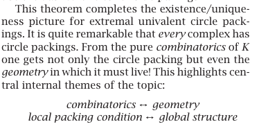

### 2.3 Koebe–Andreev–Thurston 定理

**Koebe–Andreev–Thurston（KAT）定理** 是 Circle Packing 理论的核心，它给出了圆填充存在性与唯一性的保证：

> **每一个有限的、简单连通的平面图**（无重边、无自环的平面嵌入图）**都存在唯一的（在Möbius变换意义下）对应圆填充**。

这一定理最早由 Koebe（1928）证明，后由 Thurston（1978）重新发现并推广。推广到三角面后，即为 Circle Patterns 的存在性基础。

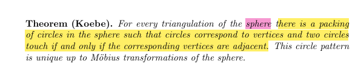

**Koebe 定理**（1936）的另一形式：任意有限连通平面图都存在一个圆填充表示，且其对偶图也存在圆填充。

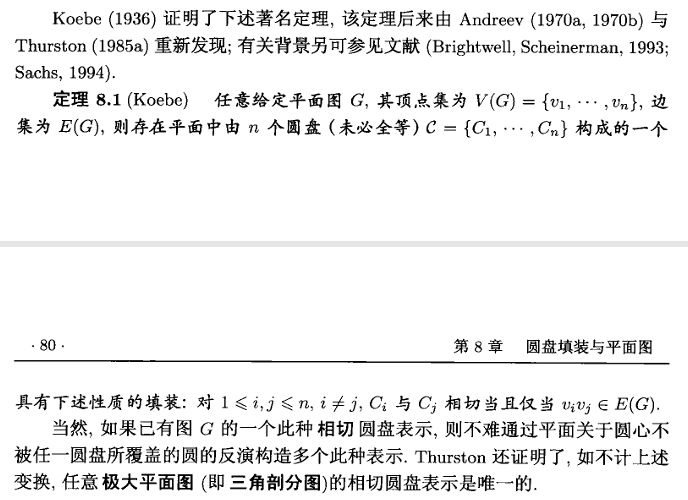

### 2.4 Thurston 的曲率流算法

Thurston 提出了一种迭代算法来计算 Circle Packing：

> **圆填充可以用来近似共形映射**

其核心思路是通过调整每个圆的半径，使得每个内部顶点处的"角度亏量"（即围绕该顶点的圆的夹角之和与 $2\pi$ 的差，称为**离散曲率**）趋向于零。这一过程类似于曲率流，最终收敛到一个满足曲率平衡的圆填充配置。

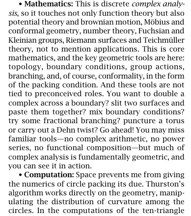

离散曲率定义为：

$$K_i = 2\pi - \sum_{j \in N(i)} \theta_j$$

其中 $\theta_j$ 是顶点 $i$ 周围第 $j$ 个三角形中该顶点的角度。

### 2.5 Circle Packing 的局限性

Stephenson 等人实现了三角网格上的 Circle Packing 算法，但 Circle Packing 有一个本质局限：

> **它只考虑了三角网格的连接性质，而没有充分考虑其几何性质（如原始三角形的角度信息）。**

也就是说，Circle Packing 的参数化结果仅由图的拓扑结构决定，对原始几何的还原精度有限。Circle Patterns 算法正是为了克服这一局限而提出的。

---

## 三、Circle Patterns：几何性质的精确保持

### 3.1 从 Circle Packing 到 Circle Patterns

**Circle Patterns** 是 Circle Packing 的推广。与 Circle Packing 要求圆与圆**相切**不同，Circle Patterns 允许相邻圆以**任意给定角度相交**，从而将原始三角网格的几何信息（内角）编码进圆的配置中。

Circle Patterns 算法将网格视为：

- **顶点** → **圆心**
- **边** → **两圆相交角度（边权值 $\theta_e$）**

参数化过程就是寻找一组圆半径，使得这些圆的相交模式**恰好满足每个面的闭合条件**。这种方法在离散层面上更忠实于共形几何的连续理论。

### 3.2 Delaunay 三角网格与圆填充

对于 Delaunay 三角网格，所有三角形的**外接圆**可以认为是对它的一个**圆图案（Circle Pattern）**：

- 每个三角形有一个外接圆
- 相邻三角形的外接圆以一定角度相交
- 相交角度 $\theta_e$ 称为**边权值（edge weight）**

Circle Patterns 算法的目标是求这组边权值以及对应的圆半径，从而得到完整的圆配置，即参数化结果。

注意：Circle Patterns 要求满足 Delaunay 三角剖分的**空圆条件**。否则某个顶点可能位于另一个三角形外接圆内，与 Circle Patterns 的定义相违背。

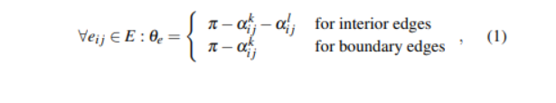

### 3.3 抽象三角网格与 Coherent Angle System

**抽象三角网格（Abstract Triangulation）** 是只定义连接关系的纯组合对象，也称为**单纯复形（Simplicial Complex）**。它仅依赖顶点、边、面之间的关联关系，不依赖任何具体的几何嵌入（坐标、距离、角度等）。展平前后，三角网格的抽象三角网格是一致的。

**Circle Patterns 问题的存在性定理**：

> 对于给定边权值 $\theta_e$（共形变换下保持不变）和一个抽象三角网格，**其 CirclePattern 存在当且仅当 Coherent Angle System 存在**。

**Coherent Angle System** 是对抽象三角网格赋予一组角度值 $\hat{\alpha}_{ij}^k$，满足：

**1. 正性约束**：

$$\hat{\alpha}_{ij}^k > 0$$

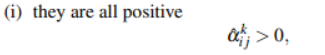

**2. 三角形内角和约束**：对每个三角形 $t = (i,j,k)$，三个内角之和等于 $\pi$：

$$\hat{\alpha}_{ij}^k + \hat{\alpha}_{jk}^i + \hat{\alpha}_{ki}^j = \pi$$

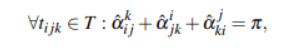

**3. 边权值约束**：对每条内部边 $e = (i,j)$，两侧三角形中的对应角满足：

$$\hat{\alpha}_{ij}^k + \hat{\alpha}_{ij}^l = \pi - \theta_e$$

从而，求 Coherent Angle System 等价于求解一个具有 $3|F|$ 个变量、$|F|+|E|$ 个等式约束的线性可行域。

### 3.4 变分法求圆半径

在得到 Coherent Angle System 后，需要通过变分方法求解每个圆的半径，从而确定完整的圆配置。

令 $\rho_{ijk} = \log r_{ijk}$（对圆半径取对数），其中 $r_{ijk}$ 是顶点 $i$ 在三角形 $(i,j,k)$ 中的对应圆半径。

通过几何关系，角度可以表示为：

$$\alpha_{ij}^k = \alpha(\rho_i, \rho_j, \rho_k) = \arccos\left(\frac{r_i^2 + r_j^2 - r_k^2}{2r_i r_j}\right)$$

构造能量泛函：

$$E(\rho) = \sum_{t} \left(\mathcal{L}(\alpha_{ij}^k) + \mathcal{L}(\alpha_{jk}^i) + \mathcal{L}(\alpha_{ki}^j)\right) - \sum_e \theta_e \cdot \log r$$

其中 $\mathcal{L}(\cdot)$ 是 **Lobachevsky 函数**：

$$\mathcal{L}(x) = -\int_0^x \log|2\sin t| \, dt$$

能量泛函的梯度条件给出：

$$\frac{\partial E}{\partial \rho_i} = K_i = 0$$

即每个顶点的离散曲率为零（对于平坦参数化）。

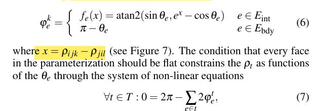

这一变分方法的理论基础来自 **Bobenko** 的变分原理（基于 Lobachevsky 函数）和 **Colin de Verdière** 的工作，并与 **Rivin 定理**（理想双曲四面体与圆图案的对偶性）有深刻联系：

- **Rivin 定理**：理想双曲四面体的二面角与 Circle Pattern 的边权值之间存在对偶关系
- **Lobachevsky 函数**：双曲几何中的体积计算工具，出现在变分公式中
- **Bobenko 变分原理**：将 Circle Pattern 的求解转化为一个凸优化问题，保证解的唯一性

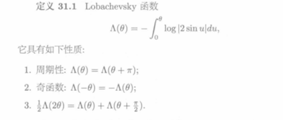

---

## 四、空间三角网格上的 CirclePatterns 算法

### 4.1 原始网格 $\theta_e$ 的可行性问题

对于空间中给定的三维三角网格，其原始的 $\theta_e$（由网格的实际几何决定）可能不满足 Coherent Angle System 的约束，即无法直接找到合适的圆填充。

因此，需要在尽量接近原始角度值的前提下，寻找满足约束的可行 $\theta_e$，这导出如下**二次优化问题**：

$$\min_{\{\theta_e\}} \sum_e (\theta_e - \theta_e^{\text{orig}})^2$$

**约束条件**：

1. 每个三角形内角和等于 $\pi$
2. 每个角度大于 0
3. 每条边的角度满足边权值约束

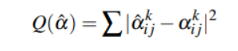

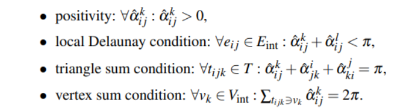

优化后得到的三角形配置，由于满足局部 Delaunay 条件（等价于空圆性质），自然构成 Delaunay 三角剖分。

### 4.2 局部 Delaunay 条件

对每条内部边 $e$，需要满足**局部 Delaunay（Local Delaunay）条件**：

$$\alpha_{ij}^k + \alpha_{ij}^l \leq \pi$$

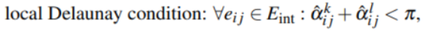

局部 Delaunay 是 Delaunay 三角剖分空圆性质的等价条件，因此优化后得到的配置自然满足 Delaunay 性质。

### 4.3 边界条件

算法支持两种边界条件：

- **自由边界**：边界圆的半径自由变化，参数化结果的边界形状由算法自动确定
  
  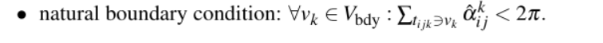

- **指定边界**：边界圆满足给定的形状约束（如映射到矩形或圆形边界）
  
  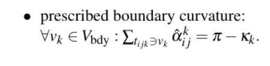

对于边界顶点，曲率约束修改为：

$$K_i = 2\pi - \phi_i$$

其中 $\phi_i$ 是边界处的外角。

### 4.4 Intrinsic Local Delaunay 预处理

在正式求解前，可以先对原始三维三角网格进行 **Intrinsic Local Delaunay** 预处理：

> 在不改变网格抽象三角网格结构的前提下，通过边翻转操作使网格在内蕴度量意义下满足 Delaunay 条件。

这一预处理步骤能够显著减小参数化结果的扭曲。

---

## 五、全局参数化与锥奇异点

### 5.1 从局部圆盘到全局参数化

上述方法仅适用于**拓扑圆盘**（即具有单连通域拓扑的网格片段）。对于拓扑更复杂的模型（如球状、亏格大于 0 的曲面），需要通过**割线（cuts）** 将网格切开为拓扑圆盘，然后对各片分别参数化并拼合到一个图卡（Atlas）中。

手动寻找合适割线往往繁琐，而**锥奇异点**的引入使这一过程可以自动化进行。

### 5.2 锥奇异点

展平后，曲面上几乎处处的高斯曲率为 0（平坦），而**锥奇异点**是高斯曲率被集中赋予非零值的特殊点：

$$K_i = 2\pi - \sum_{\text{face } f \ni i} \alpha_i^f$$

其中 $\alpha_i^f$ 为顶点 $i$ 在面 $f$ 中的角度。

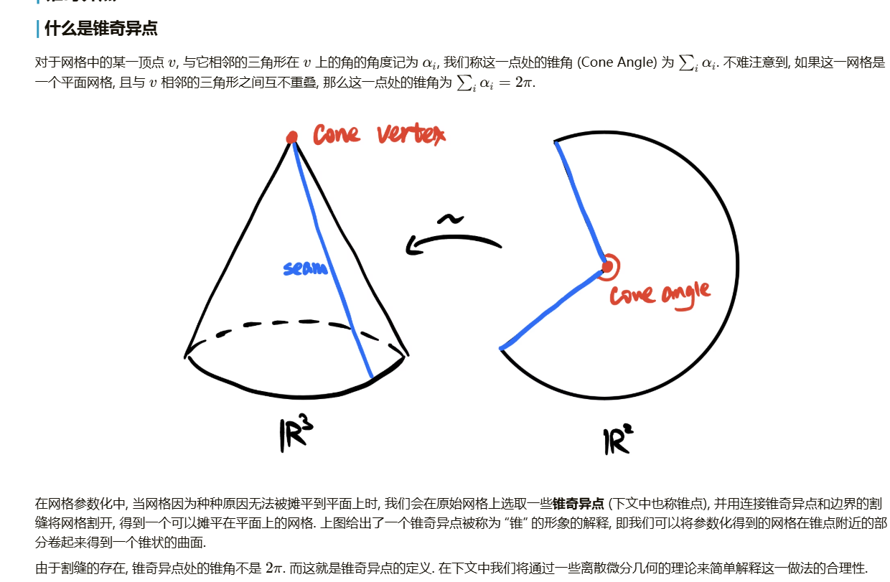

**高斯–博内定理**给出了整体曲率与拓扑之间的约束：

$$\sum_i K_i = 2\pi \chi$$

其中 $\chi$ 为曲面的欧拉示性数。这意味着锥奇异点的引入受到拓扑约束，不能任意设置。

### 5.3 锥奇异点的作用

通过引入锥奇异点，可以极大地减少参数化扭曲：

- 算法自动将高斯曲率集中到少数几个顶点（锥奇异点）
- 其余区域保持平坦（高斯曲率为 0）
- 从而在整体上最小化保角扭曲

在 CirclePatterns 算法中，只需在变分能量中加入对锥奇异点处目标角度的额外约束：

$$\sum_{f \ni i} \alpha_i^f = 2\pi k_i$$

其中 $k_i$ 为目标角度亏量系数（通常 $k_i \in \mathbb{Z}^+$）。

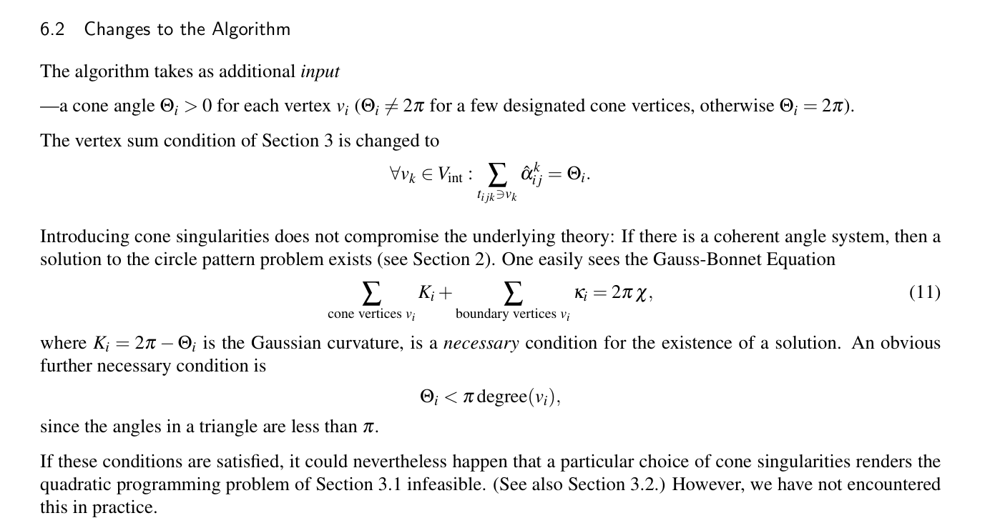

### 5.4 与 ABF 算法的对比

与 ABF（Angle Based Flattening）算法的对比实验（用 quasi-conformal 度量扭曲）表明，CirclePatterns 方法的扭曲明显更小：

---

## 六、延伸：极小曲面的 Circle Patterns

### 6.1 极小曲面简介

**极小曲面**是平均曲率处处为零（$H = 0$）的正则曲面，典型例子包括正螺面（Helicoid）和悬链面（Catenoid）——两者之间还存在等距变换。

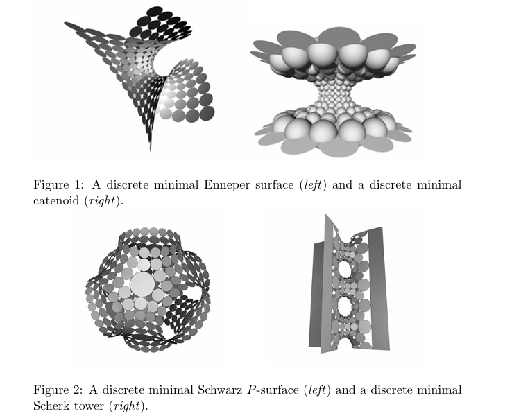

**Plateau 问题**：给定空间中一条封闭曲线，是否存在以它为边界的极小曲面？肥皂膜给出了直观的物理实现。

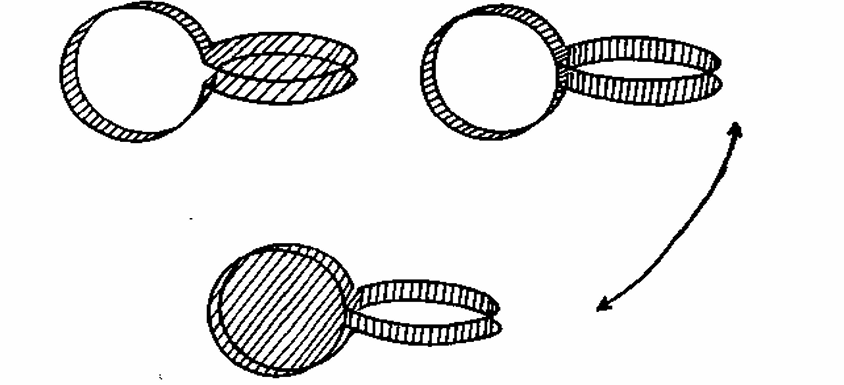

**极小曲面的微分几何定义**：正则曲面，平均曲率 $H = 0$。

**对于 $z = f(x,y)$，Lagrange 给出极小曲面方程**：

$$(1 + f_y^2)f_{xx} - 2f_x f_y f_{xy} + (1 + f_x^2)f_{yy} = 0$$

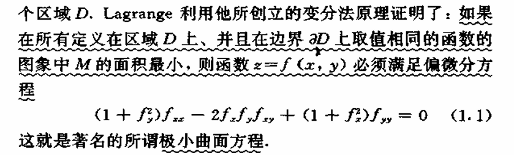

### 6.2 极小曲面的 Weierstrass–Enneper 表示

极小曲面与复分析有深刻联系。在**等温参数坐标（Isothermal Coordinates）** 下，曲面的第一基本形式满足：

$$ds^2 = \lambda^2(du^2 + dv^2)$$

即 $E = G, F = 0$，这正是参数化为共形映射的条件。

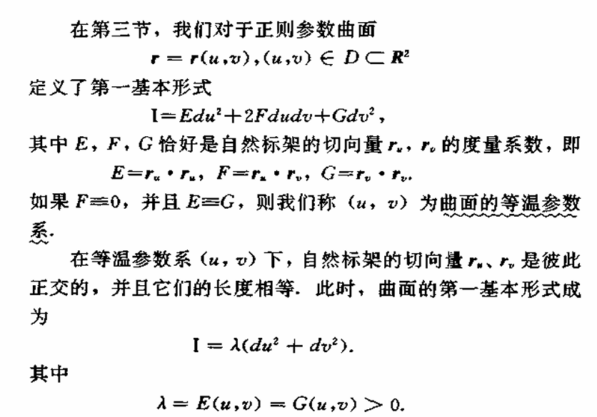

**Weierstrass–Enneper 表示**利用复变函数理论给出极小曲面的参数化公式：

$$X(u,v) = \text{Re}\int(1-g^2, i(1+g^2), 2g) \cdot f \, dz$$

其中 $f$ 是全纯函数，$g$ 是 meromorphic 函数。

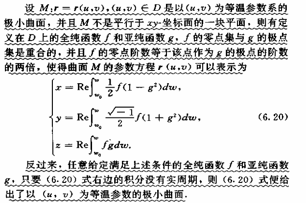

**共形结构与极小曲面的关系**：

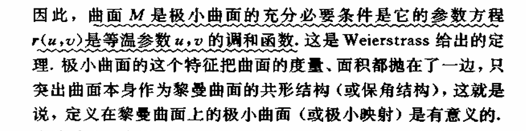

### 6.3 离散极小曲面与 S-等温曲面

在离散几何中：

- **离散 S-等温曲面**是由**正交相交的圆（或球）** 构成的曲面
- 极小曲面是等温曲面的一个子类
- **Christoffel 变换**给出离散等温曲面之间的对偶：极小曲面是其高斯映射的 Christoffel 对偶

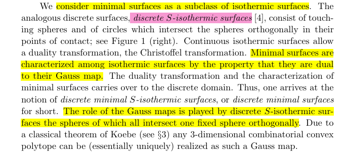

**总体逻辑流程**：

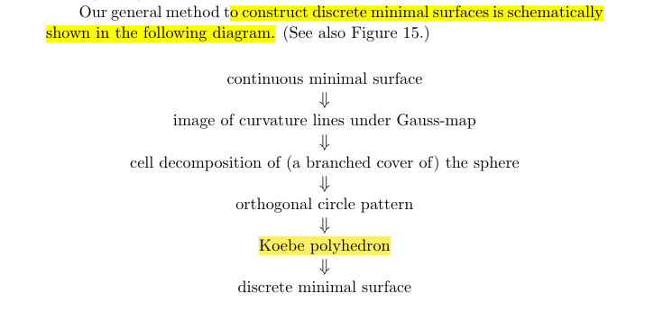

#### 基本定义

**等温曲面的定义**：

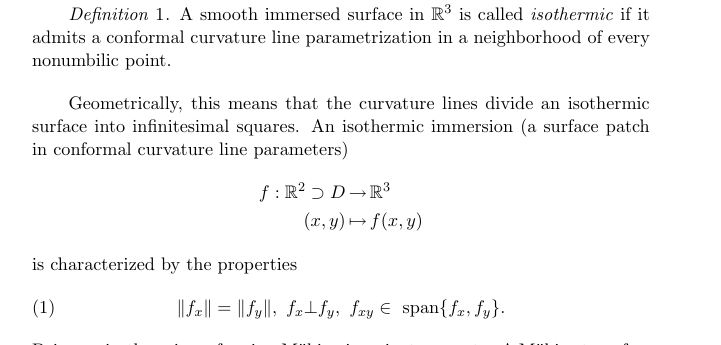

**离散等温曲面**：

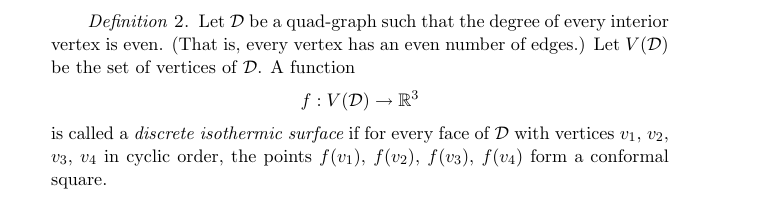

**Christoffel 变换**：

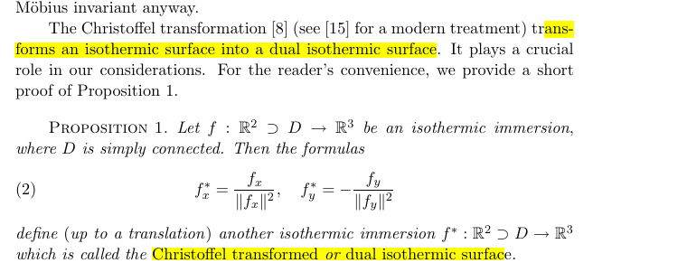

基本构型 **S-quad-graph**：

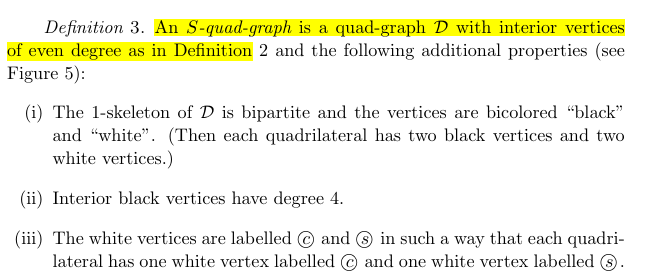

**离散 S-等温曲面**：

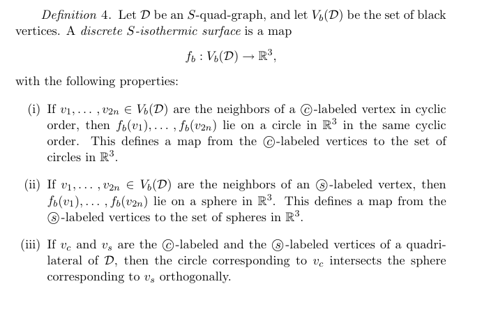

所以几何结构（曲面）就变成了组合结构（图）：

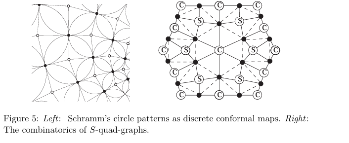

关键结论：**4 个空间中的圆相切，则存在一个球面将它们"串"起来**（即 4 圆共球面）：

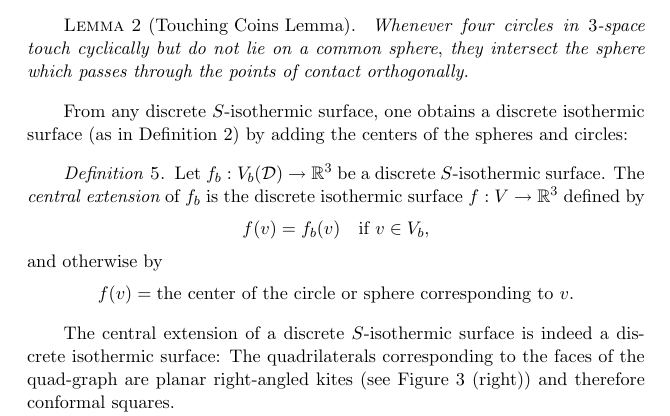

**推论**：

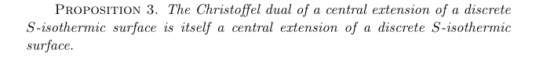

圆填充与三角化的对应：

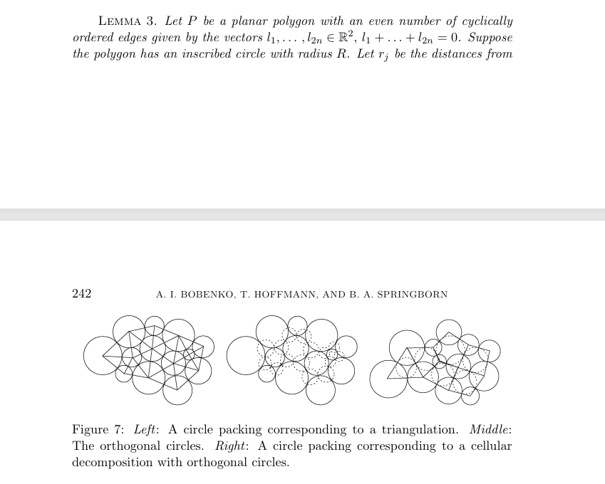

### 6.4 Koebe 多边形

圆填充的基本定理：**Koebe 定理**：

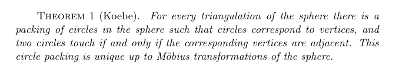

Koebe 多边形与离散 S-等温曲面关系：

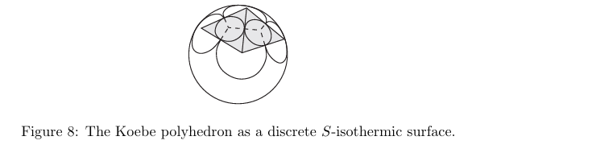

**定理 2**：Koebe 定理限定在球面的推广：

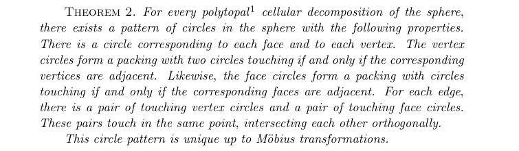

**定理 3**：在三维空间曲面的推广：

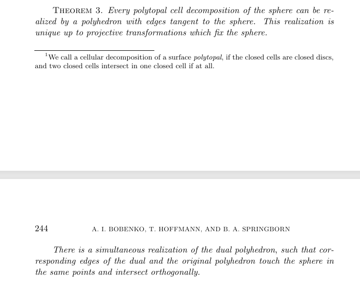

### 6.5 离散最小曲面

**Christoffel 对偶定理**：

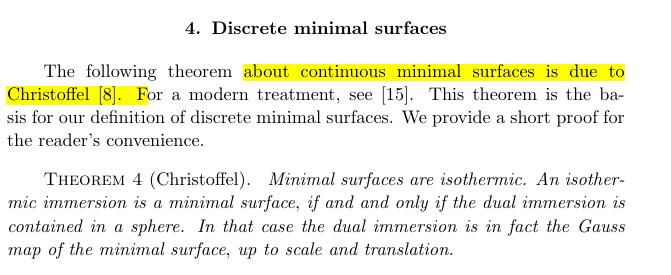

S-等温曲面与离散极小曲面的关系：

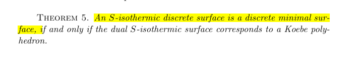

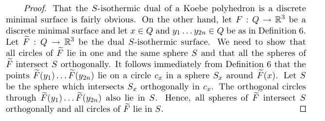

### 6.6 Weierstrass 表示

离散 Weierstrass 表示：

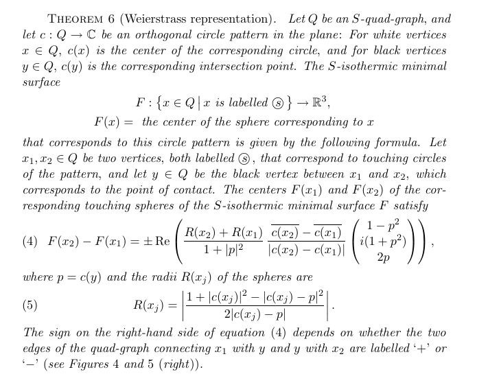

最后以此证明离散极小曲面的收敛性：

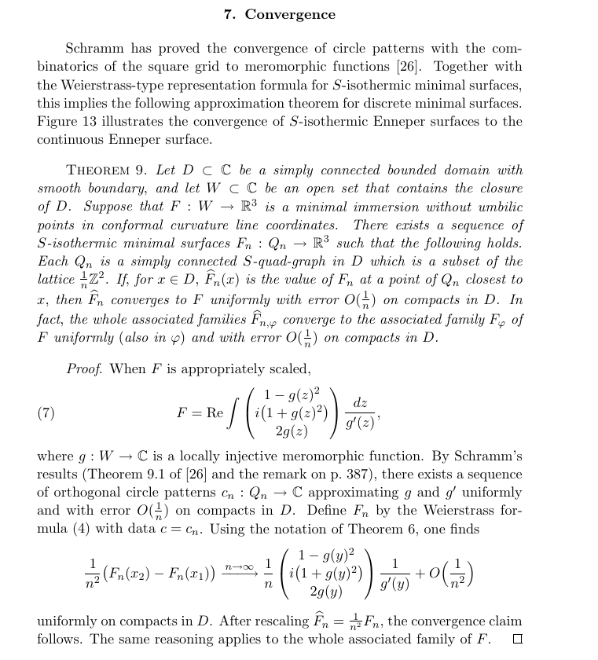

Enneper 曲面的收敛序列：

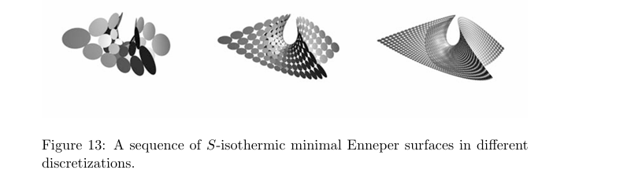

### 6.7 推论

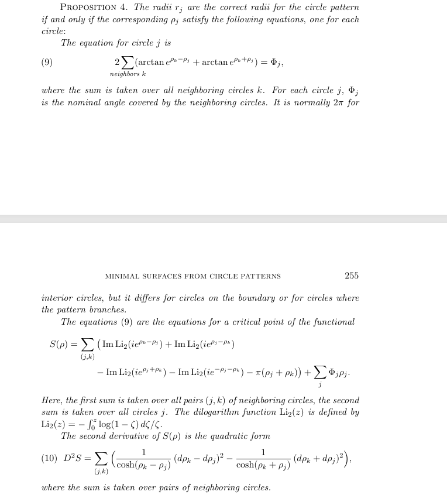

---

## 七、Circle Packing 的其他应用

### 7.1 折纸设计中的 Circle Packing

Circle Packing 在折纸设计中有重要应用：

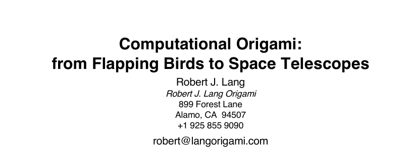

折纸展开图（crease pattern）中，纸张折叠后形成的各个"树状构型（tree structure）"对应圆填充中的各个圆：

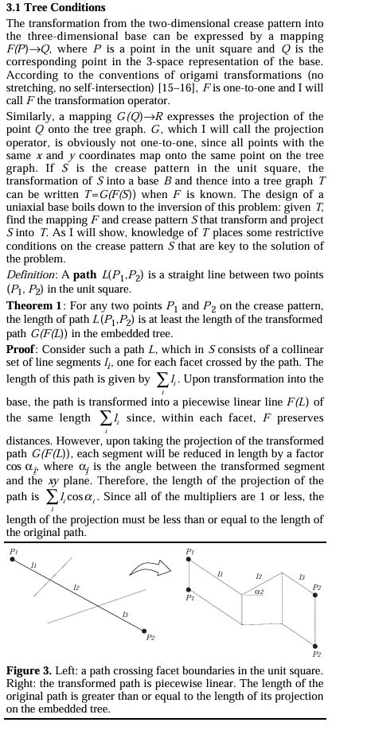

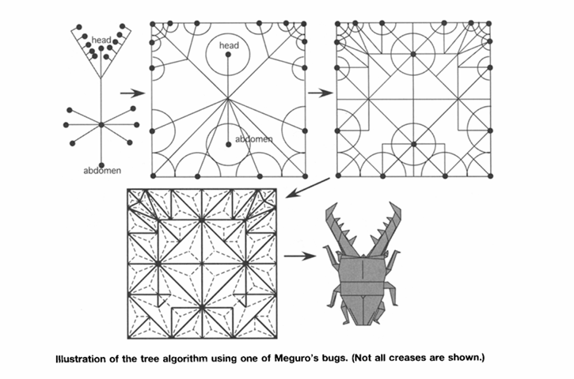

通过求解圆填充问题，可以自动生成折叠出给定形状所需的展开图。Robert Lang 的 TreeMaker 算法即基于此原理。

相关理论还涉及 **Circle-River 设计**——Demaine 等人证明了这一设计问题是 **NP-完全**的：

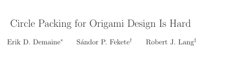

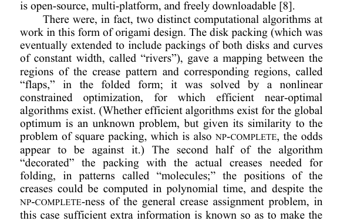

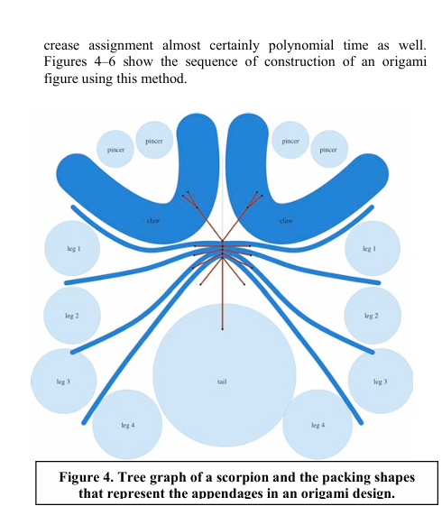

### 7.2 组合几何中的最密填装

Circle Packing 在组合几何中对应**圆的最密填装问题**：


在平面上，正六边形排列（蜂窝结构）给出最密圆填装，填装密度为：

$$\rho = \frac{\pi}{2\sqrt{3}} \approx 90.7\%$$


在有界区域中，最密填装问题通常是 NP-难的：


组合几何中的其他相关问题：


---

## 八、CirclePatterns 算法总结与评价

### 8.1 算法流程概述

1. **输入**：三维三角网格
2. **预处理**（可选）：Intrinsic Local Delaunay 边翻转
3. **求可行边权值 $\theta_e$**：二次优化，使 $\theta_e$ 接近原始几何值并满足 Coherent Angle System 约束
4. **变分求圆半径**：对 $\rho_i = \log r_i$ 求解凸优化问题
5. **布局**：根据圆半径和相交角度，在平面上重建圆配置，得到参数化坐标
6. **全局参数化**（可选）：引入锥奇异点，处理拓扑复杂的网格

### 8.2 与其他参数化算法的对比

| 算法 | 核心方法 | 特点 |
|:---:|:---|:---|
| **LSCM** | 最小二乘共形映射（线性） | 快速，但有扭曲 |
| **SCP** | 谱方法 | 全局最优，但计算量大 |
| **ABF/ABF++** | 角度优化（非线性） | 质量高，但需迭代 |
| **Circle Patterns** | 离散共形几何（变分） | 理论最严谨，无翻转，质量最高 |

与 ABF 算法的对比实验（用 quasi-conformal 度量扭曲）表明，CirclePatterns 方法的扭曲明显更小。

### 8.3 CirclePatterns 的优点

1. **理论保证强**：可证明避免翻转，得到全局唯一解（在变分框架下）
2. **质量极高**：保角性极佳，且在二维可实现**严格的可嵌入性**（无自交）
3. **灵活性**：通过调整目标角度，可实现从纯保角到保面积的连续过渡
4. **深刻的几何意义**：与双曲几何、极小曲面、离散微分几何都有联系

### 8.4 一句话定位

> 如果说 LSCM 是"用线性代数近似解决几何问题"，SCP 是"用谱方法寻找更好的全局解"，那么 **Circle Patterns** 则是"从离散几何的根源出发，精确重构几何属性"。它是一个更优雅、理论更坚实但实现也更复杂的工具，代表了高质量参数化算法的研究方向。

---

## 参考文献

- Bobenko, A. I., & Springborn, B. A. (2004). *Variational principles for circle patterns and Koebe's theorem*. Transactions of the AMS.
- Stephenson, K. (2005). *Introduction to Circle Packing*. Cambridge University Press.
- Koebe, P. (1936). Kontaktprobleme der konformen Abbildung.
- Thurston, W. P. (1978). *The geometry and topology of 3-manifolds*.
- Bobenko, A. I., & Pinkall, U. (1999). Discretization of surfaces and integrable systems.
- Demaine, E. D., et al. (2000). *Folding a Better Checkerboard*.
- Rivin, I. (1994). *Euclidean structures on simplicial surfaces and hyperbolic volume*.
- Colin de Verdière, Y. (1991). *Un principe variationnel pour les empilements de cercles*.
