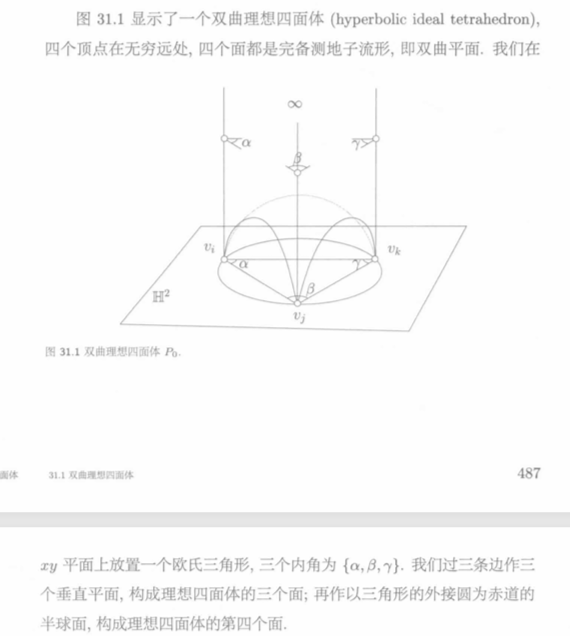
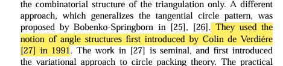
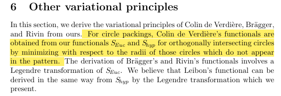
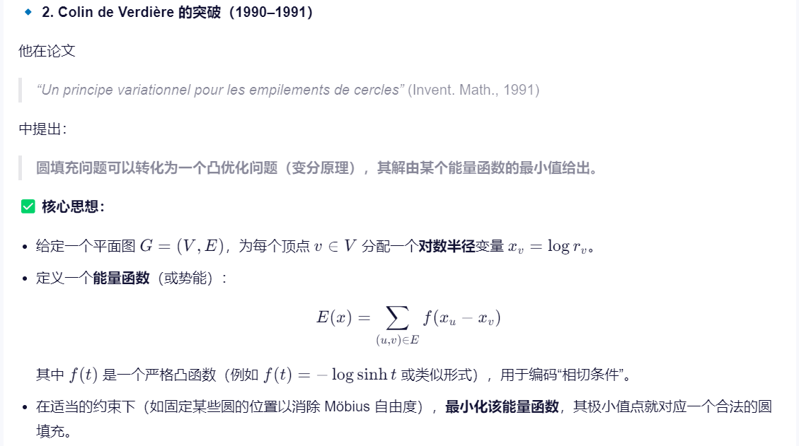

Rivin定理，理想双曲四面体与圆图案之间的对偶

> **Theorem (Rivin)**. Let $\Sigma$ be a polytopal cellular decomposition of the sphere. Suppose an angle $\theta_e$, with $0 < \theta_e < \pi$, is assigned to each edge $e$. There exists an **ideal** hyperbolic polyhedron which is combinatorially equivalent to $\Sigma$, and with exterior dihedral angles $\theta_e$, if and only if the following condition holds: For every cocycle $\gamma$ of edges, $\sum_{e \in \gamma} \theta_e \geq 2\pi$, with equality if **and only if** $\gamma$ is the boundary of a single vertex.
>
> This **ideal** hyperbolic polyhedron is unique up to isometry.

双曲理想四面体与圆图案（Circle Patterns）之间存在着非常深刻的对偶关系。简单来说，一个理想的双曲多面体（如四面体）的几何形状，唯一地决定了球面上一个特定组合结构的圆图案，反之亦然。这个桥梁性的发现主要由 William Thurston 提出。

### 核心桥梁：从多面体到圆的对偶性

这种联系的本质是"对偶"。下表清晰地展示了两者之间的对应关系：

$$
\begin{array}{lll}
\text{在双曲理想多面体中} & & \text{在球面圆图案中} \\
\hline
\text{每一个面} & \longleftrightarrow & \text{对应一个圆} \\
\text{每一条边} & \longleftrightarrow & \text{对应两个圆的交点} \\
\text{边的二面角} & \longleftrightarrow & \text{圆的外夹角 (Exterior Intersection Angle)} \\
\text{多面体的理想顶点 (位于无穷远处)} & \longleftrightarrow & \text{圆图案中的空隙 (Interstice)，即所有圆未覆盖的一个点}
\end{array}
$$

具体来说，给定一个三维双曲空间中的凸多面体，包含其各个面的"定向双曲平面"的边界，会在无穷远球面（可视为我们通常的球面）上形成一系列圆。这些圆的组合结构（即谁和谁相交）恰好是原多面体的对偶多面体的组合结构。

---

## Theorem (Koebe) — 球面圆填充定理

**Koebe 定理（Koebe, 1936）**

> For every triangulation of the **sphere**, there is a **packing of circles in the sphere** such that circles correspond to vertices and two circles touch if and only if the corresponding vertices are adjacent. This circle pattern is unique up to Möbius transformations of the sphere.

**中文表述：**

对于球面的每一个三角剖分，都存在球面上的一种**圆填充（circle packing）**，使得：

- 每个圆对应一个顶点
- 两个圆相切 **当且仅当** 对应的两个顶点相邻

这种圆填充模式在球面的 **Möbius 变换**意义下是唯一的。

### 关键概念

| 术语                  | 说明                                                 |
| --------------------- | ---------------------------------------------------- |
| Triangulation         | 三角剖分：将曲面划分为三角形网格                     |
| Circle Packing        | 圆填充：一组互不相交（或相切）的圆                   |
| Möbius Transformation | 默比乌斯变换：保角变换 $z \mapsto \frac{az+b}{cz+d}$ |
| Adjacent vertices     | 相邻顶点：共享同一条边的两个顶点                     |

---

## Theorem (Rivin) — 双曲多面体与圆填充

**Rivin 定理（Rivin, 1996）**

> Let $\Sigma$ be a polytopal cellular decomposition of the sphere. Suppose an angle $\theta_e$, with $0 < \theta_e < \pi$, is assigned to each edge $e$. There exists the **ideal hyperbolic polyhedron** which is combinatorially equivalent to $\Sigma$, and with exterior dihedral angles $\theta_e$,** if and only if** the following condition holds: For every cocycle $\gamma$ of edges, $\sum_{e \in \gamma} \theta_e \geq 2\pi$, with equality **if and only if** $\gamma$ is the boundary of a single vertex.

**中文表述：**

设 $\Sigma$ 是球面的一个**多面体胞腔分解**。若对每条边 $e$ 分配一个角度 $\theta_e$（满足 $0 < \theta_e < \pi$），则存在一个与 $\Sigma$ 组合等价的**理想双曲多面体**，且其外二面角为 $\theta_e$，**当且仅当**以下条件成立：

$$\forall \text{ 边的余圈 } \gamma: \quad \sum_{e \in \gamma} \theta_e \geq 2\pi$$

等号成立 **当且仅当** $\gamma$ 是单个顶点的边界。

### 关键概念

| 术语                             | 说明                                                     |
| -------------------------------- | -------------------------------------------------------- |
| Polytopal Cellular Decomposition | 多面体胞腔分解：将球面分解为凸多面体的组合结构           |
| Ideal Hyperbolic Polyhedron      | 理想双曲多面体：所有顶点都在无穷远处的双曲空间中的多面体 |
| Exterior Dihedral Angle          | 外二面角：沿边的两面之间的外角                           |
| Cocycle / 余圈                   | 图论中边集的一个子集，表示"切割"图的结构                 |
| Combinatorially Equivalent       | 组合等价：具有相同的面-边-顶点关联关系                   |

### 条件的几何意义

该条件的本质是**角度和约束**：

- 对任意边的余圈（cut set），其上分配的角度之和不小于 $2\pi$
- 这保证了对应的双曲几何结构的可实现性
- 当余圈恰好是某顶点的星形邻域边界时，角度和等于 $2\pi$

---

## 两定理的联系

Koebe 定理和 Rivin 定理都建立了**离散几何结构**与**圆填充**之间的深刻联系：

```
Koebe 定理:  球面三角剖分  ←→  球面圆填充
                  ↓               ↓
Rivin 定理:  多面体分解    ←→  理想双曲多面体 (通过边角分配)
```


### 以理想四面体为例

对于一个理想的双曲四面体（四个顶点都在无穷远处）：

1. 它有 **4 个面**，因此在对应的圆图案中，球面上会有 **4 个圆**。
2. 它有 **6 条边**，这意味着这 4 个圆在球面上两两相交，共有 **6 个交点**。
3. 四面体每条棱的二面角，恰好等于球面上对应两个圆在交点处的外夹角。

因此，决定一个理想双曲四面体形状的 **6 个二面角**，就等价于决定了球面上一个由 4 个圆构成的图案的 **6 个相交角**。著名的 **Rivin 定理**严格刻画了什么样的二面角组合能够构成一个理想的凸双曲多面体，这也等价于刻画了什么样的相交角组合能在球面上实现一个对应的圆图案。

### 重要工具：变分原理

这个理论不仅优美，而且可计算。Bobenko 和 Springborn 在此基础上建立了一个变分原理。

- **核心思想**：寻找满足给定相交角的圆图案（或对应的理想多面体）的问题，可以转化为一个**凸优化问题**
- **目标函数**：该优化问题的目标函数具有清晰的几何意义——它可以被解释为某个相关理想双曲多面体的**体积**
- **意义**：这为解决圆图案和多面体的存在性、唯一性及构造问题提供了强大而实用的工具

总结来说，**双曲理想多面体（如四面体）与球面圆图案通过"对偶性"紧密相连，其角度数据一一对应**。以 Rivin 定理为理论保证，并通过变分原理这一工具，我们可以在两个领域之间自由转换并解决几何构造问题。

如果你对 Bobenko-Springborn 变分原理的具体形式，或如何从一个给定的圆图案角度出发构造出具体的双曲四面体模型感兴趣，我可以为你进一步解释。

---

## 双曲理想四面体

三维双曲空间 $$\mathbb{H}^3 = \{(x,y,z) | z > 0\}$$，配有双曲度量

$$ds^2 = \frac{dx^2 + dy^2 + dz^2}{z^2}$$

$xy$ 平面是无穷远平面。双曲测地线是和 $xy$ 平面垂直的直线或者半圆弧，双曲测地平面是赤道在 $xy$ 平面上的半球或者者和 $xy$ 平面相垂直的平面。



*图 31.1 显示了一个双曲理想四面体 (hyperbolic ideal tetrahedron)，四个顶点在无穷远处，四个面都是完备测地子流形，即双曲平面。*

$xy$ 平面上放置一个欧氏三角形，三个内角为 $\{\alpha,\beta,\gamma\}$。我们过三条边作三个垂直平面，构成理想四面体的三个面；再作以三角形的外接圆为赤道的半球面，构成理想四面体的第四个面。

> **定理 31.1 (Milnor [27])**. 双曲理想四面体的体积为
> $$
> V(P_0) = V(\alpha,\beta,\gamma) = \Lambda(\alpha) + \Lambda(\beta) + \Lambda(\gamma),
> $$
> 这里 $\Lambda(\theta)$ 是 Lobachevsky 函数。

---

## Lobachevsky 函数

> **定义 31.1** Lobachevsky 函数
> $$
> \Lambda(\theta) = -\int_0^\theta \log|2\sin u|\, du,
> $$
>
> 它具有如下性质：
> 1. **周期性**: $$\Lambda(\theta) = \Lambda(\theta + \pi)$$;
> 2. **奇函数**: $$\Lambda(-\theta) = -\Lambda(\theta)$$;
> 3. $$\frac{1}{2}\Lambda(2\theta) = \Lambda(\theta) + \Lambda(\theta + \frac{\pi}{2})$$.

---

## Bobenko 的变分法

> **Theorem 3.** Let $\Sigma$ be an oriented cellular surface, let $\theta^* \in (0,\pi)^E$ be a function on the non-oriented edges, and let $\Phi \in (0,\infty)^{F_{\Sigma}}$ be a function on the faces.
>
> A Euclidean circle pattern, which is combinatorially equivalent to $\Sigma$, which has interior intersection angles $\theta^*$, and has cone (or boundary) angles $\Phi_f$ in the centers of the circles exists, **if and only if** the following two conditions are satisfied.
>
> **(i)**
> $$
> \sum_{f \in F} \Phi(f) = \sum_{e \in E} 2\theta^*(e) \tag{5}
> $$
>
> **(ii)** If $F'$ is a nonempty subset of the face set $F$, $F' \neq F$, and $E'$ is the set of all edges incident with any face in $F'$, then
> $$
> \sum_{f \in F'} \Phi(f) < \sum_{e \in E'} 2\theta^*(e). \tag{6}
> $$
>
> The Euclidean circle pattern is unique up to similarity.
>
> A corresponding hyperbolic circle pattern in a surface of constant curvature $-1$ with cone-singularities exists, **if and only if** inequality (6) holds for all nonempty subsets $F' \subset F$, including $F$ itself. The hyperbolic circle pattern is unique up to isometry.

---

## Coherent Angle System

> **Proposition 4.** *A coherent angle system exists if and only if the conditions of theorem 3 hold.*
>
> *Proof.* It is easy to see that these conditions are necessary. To prove that they are sufficient, we apply the feasible flow theorem of network theory. Let $(N,X)$ be a network (i.e. a directed graph), where $N$ is the set of nodes and $X$ is the set of branches. For any subgraph $N' \subset N$ let $ex(N')$ be the set of branches having their initial node in $N'$ but not their terminal node. Let $im(N')$ be the set of branches having their terminal node in $N'$ but not their initial node. Assume that there is a lower capacity bound $a_x$ and an upper capacity bound $b_x$ associated with each branch $x$, with $-\infty \leq a_x \leq b_x \leq \infty$.

---

## Colin de Verdière 的突破（1990–1991）

他在论文 *"Un principe variationnel pour les empilements de cercles"* (Invent. Math., 1991) 中提出：

圆填充问题可以转化为一个**凸优化问题（变分原理）**，其解由某个能量函数的最小值给出。

### 核心思想

- 给定一个平面图 $$G = (V,E)$$，为每个顶点 $$v \in V$$ 分配一个对数半径变量 $$x_v = \log r_v$$
- 定义一个**能量函数（或势能）**：
  $$
  E(x) = \sum_{(u,v)\in E} f(x_u - x_v)
  $$
  其中 $$f(t)$$ 是一个**严格凸函数**（例如 $$f(t) = -\log\sinh t$$ 或类似形式），用于编码"相切条件"
- 在适当的约束下（如固定某些圆的位置以消除 Möbius 自由度），**最小化该能量函数**，其极小值点就对应一个合法的圆填充

---

## 其他变分原理

本节推导 Colin de Verdière、Brägger 和 Rivin 的变分原理。对于圆填充，Colin de Verdière 的泛函可以通过最小化 **不在模式中出现的那些正交相交圆的半径** 来从我们的泛函 $$S_{Euc}$$ 和 $$S_{hyp}$$ 得到。Brägger 和 Rivin 泛函的推导涉及 $$S_{Euc}$$ 的 Legendre 变换。我们认为 Leibon 的泛函可以通过 $$S_{hyp}$$ 的 Legendre 变换以相同的方式推导出来。

本文思路引自 Colin





- **Koebe 定理**（1936）：任意有限连通平面图都存在一个圆填充表示。
- 传统证明依赖复分析（共形映射）或几何构造（如 Thurston 的迭代算法）。



### 引用

Variational principles for circle patterns and Koebe's theorem

Kenneth Stephenson, *Introduction to Circle Packing*, Cambridge Univ. Press, 2005.
