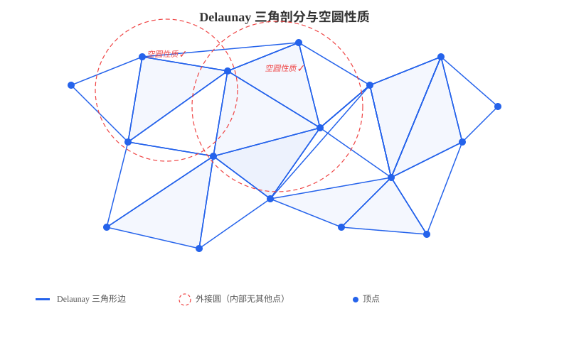
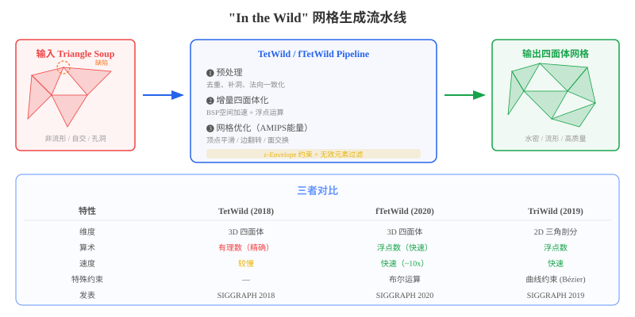
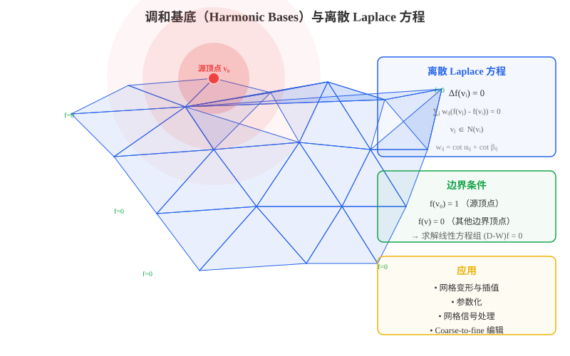

### 三角网格生成

#### Delaunay 三角剖分

**Delaunay 三角剖分**是计算几何中最基础的三角网格生成方法之一。给定平面上的一个点集 $P = \{p_1, p_2, \ldots, p_n\}$，Delaunay 三角剖分满足以下核心性质：

> **空圆性质（Empty Circumcircle Property）**：对三角剖分中的任何一个三角形，其外接圆内部不包含点集中的任何其他点。

数学上，如果三角形 $\triangle p_i p_j p_k$ 的外接圆为 $C$，则：

$$\forall\, p_l \in P \setminus \{p_i, p_j, p_k\},\quad p_l \notin \text{int}(C)$$



**Delaunay 三角剖分的关键特性：**

| 特性 | 说明 |
|:---|:---|
| **唯一性** | 一般位置（无四点共圆）下，Delaunay 三角剖分唯一 |
| **最大化最小角** | 在所有三角剖分中，Delaunay 三角剖分最大化最小内角（避免"扁平"三角形） |
| **对偶性** | Delaunay 三角剖分与 Voronoi 图互为对偶 |
| **局部最优性** | 任何不满足 Delaunay 性质的四边形可通过边翻转变（edge flip）为 Delaunay |

**经典构造算法：**

1. **Incremental Insertion（增量插入法）**：逐点插入，每次插入后通过边翻转恢复 Delaunay 性质。时间复杂度 $O(n \log n)$（期望）
2. **Bowyer-Watson Algorithm**：通过外接圆检测找到需要删除的三角形，然后重新连接。时间复杂度 $O(n^2)$（最坏），$O(n \log n)$（期望）
3. **Divide and Conquer（分治法）**：将点集递归分成两半，分别三角剖分后合并。时间复杂度 $O(n \log n)$

**三维扩展**：Delaunay 三角剖分在三维空间中自然扩展为**四面体剖分**（Tetrahedralization），同样满足空球性质——每个四面体的外接球内部不包含其他点。

---

#### Ruppert 算法（Delaunay Refinement）

**Ruppert 算法**（1995，Jim Ruppert）是**二维质量网格生成**领域的里程碑工作。它从一个初始的约束 Delaunay 三角剖分（CDT）出发，通过**逐步插入 Steiner 点**来改善网格质量。

**核心思想**：给定一个**平面直线图（Planar Straight-Line Graph, PSLG）** 和一个角度约束 $\theta_{\min}$，算法通过 Delaunay 细化生成满足所有约束的高质量三角网格。


**算法流程：**

```
输入: PSLG G, 最小角度约束 θ_min
输出: 质量三角网格 T

1. 计算 G 的约束 Delaunay 三角剖分 (CDT)
2. while 存在质量不满足要求的三角形 do:
   a. 找到外接圆中包含其他点的"瘦"三角形（违反角度约束）
   b. 或找到外接圆直径过大且包含边界段的"大"三角形
   c. 在该三角形的外接圆圆心处插入 Steiner 点
   d. 更新 Delaunay 三角剖分（通过边翻转）
3. return T
```

**关键机制——保护圆（Encroachment）**：

为了防止边界段被"吞掉"，算法引入了**边界保护机制**：

> **子段保护**：如果一个三角形的外接圆圆心落在某个输入子段的"直径球"内，则不在该圆心插入点，而是**在该子段的中点处分裂子段**。

**理论保证：**

| 性质 | 说明 |
|:---|:---|
| **角度下界** | 所有三角形最小角 $\geq \min(20.7°, \theta_{\min})$ |
| **网格尺寸** | 生成顶点数 $O(n + m^2)$，其中 $n$ 为输入顶点数，$m$ 为输入子段数 |
| **终止性** | 算法必定终止（通过有界性证明） |
| **最优性** | 在最坏情况下网格规模接近最优 |

**Shewchuk 的改进**（2002）：

Jonathan Shewchuk 对 Ruppert 算法做了重要推广：
- 将角度下界提高到 **$26.5°$**（去掉子段交叉的假设后）
- 支持更复杂的输入（包括洞和非流形边）
- 提供了**精炼的理论分析框架**，统一了 Chew 和 Ruppert 的方法
- 实现为开源工具 **Triangle**，至今仍是最广泛使用的二维网格生成器

---

#### TetGen（三维 Delaunay 网格生成）

**TetGen**（Hang Si，2005）是**三维四面体网格生成**领域的标杆工具，由魏茨曼研究所（WIAS）开发。它将 Ruppert 的 Delaunay 细化思想扩展到三维空间，能够处理任意多面体域（Polyhedral Domain）。


**核心算法——三维 Delaunay 细化**：

三维情况比二维复杂得多，主要挑战包括：
- 二维中"瘦三角形"的概念在三维中需要新的质量度量（如**半径-边比**）
- **Sliver（扁平四面体）**是三维特有的退化单元——它们可能半径-边比很好，但体积接近零

**TetGen 的算法框架：**

1. **增量 Delaunay 四面体化**
   - 使用 Bowyer-Watson 算法的三维扩展
   - 时间复杂度 $O(n^2)$（最坏），实践中接近 $O(n \log n)$

2. **约束 Delaunay 四面体化**
   - 通过**边恢复（Edge Recovery）** 和**面恢复（Face Recovery）** 确保输入边界被保留
   - 引入 Steiner 点来恢复不可见的约束

3. **Delaunay 细化**
   - **质量指标**：使用**半径-边比**（radius-edge ratio）$\rho = R / l_{\min}$，其中 $R$ 为外接球半径，$l_{\min}$ 为最短边长度
   - **坏四面体检测**：$\rho > \rho_0$（通常 $\rho_0 = 2$）的四面体需要细化
   - **Sliver 消除**：通过额外的优化步骤（如**加权 Delaunay 细化**或**优化驱动的 Smoothing**）消除扁平四面体

4. **网格优化**
   - **Laplace Smoothing**：移动顶点以改善单元质量
   - **Edge/Face Swapping**：通过拓扑变换改善网格质量

**TetGen 的质量保证**：

$$\forall \text{ tetrahedron } T:\quad \frac{R}{l_{\min}} \leq \rho_0$$

| 特性 | 说明 |
|:---|:---|
| **输入格式** | PLY, OFF, STL, NODE/ELE, PLC |
| **输出格式** | 四面体网格、Voronoi 图、凸包 |
| **网格质量** | 有界的半径-边比，无 Sliver（优化后） |
| **规模限制** | 可处理数百万量级的四面体 |

---

#### "In the Wild" 网格生成：TetWild / fTetWild / TriWild

传统网格生成方法（如 TetGen）要求输入是"干净"的——水密、流形、无自交。然而在实际应用中，从三维扫描、CAD 导出、网络下载等渠道获取的网格往往是**"野生"的（in the wild）**：可能包含非流形边、自相交面片、孔洞、重复面片等各种缺陷。NYU 的 Daniele Panozzo 团队（Yixin Hu, Teseo Schneider 等）提出了一系列突破性的工作，实现了**对任意输入网格的无条件鲁棒网格生成**。



##### TetWild：无条件鲁棒的四面体网格生成

**TetWild**（Hu et al., SIGGRAPH 2018）是这一方向的奠基工作，其核心贡献在于：

> **给定任意三角面片集合（triangle soup），无需用户交互，自动生成分析就绪（analysis-ready）的高质量四面体网格。**

**核心设计——ε-Envelope（包络）**：

TetWild 引入了**特征包络（feature envelope）** 的概念，这是其鲁棒性的关键：

$$\text{Envelope}_\epsilon(\partial \Omega) = \{ x \in \mathbb{R}^3 : d(x, \partial \Omega) \leq \epsilon \}$$

其中 $\epsilon$ 是用户设定的容差参数。TetWild 保证：
1. **输入面片保留**：所有输入三角形（经修复后）都在输出四面体网格的面中被保留
2. **包络约束**：输出网格的边界面位于输入表面网格的 $\epsilon$-包络内
3. **质量保证**：所有四面体满足有界的 AMIPS 能量（见下文）

**算法流水线**：

```
输入: Triangle Soup（任意三角面片集合）
输出: 高质量四面体网格

1. 预处理（Preprocessing）
   - 去除重复面片和退化面片
   - 一致化法向量
   - 识别并修复自相交区域

2. 四面体化（Tetrahedralization）
   - 使用有理数运算（exact arithmetic）确保鲁棒性
   - 基于 BSP 树（Binary Space Partitioning）加速空间查询
   - 增量插入输入三角形的边和面

3. 网格优化（Mesh Improvement）
   - 使用 AMIPS 能量作为质量度量
   - 顶点平滑（Smoothing）
   - 边翻转（Edge Flip）和面交换（Face Swap）
   - 边分裂（Edge Split）和边折叠（Edge Collapse）
   - 过滤违反包络约束的无效元素
   - 迭代直到所有四面体满足质量阈值
```

**AMIPS 能量（Approximated Minimal Isotropic Sigmoidal Energy）**：

TetWild 使用 AMIPS 能量作为四面体质量的统一度量。对于四面体 $T$，其 AMIPS 能量为：

$$E_{\text{AMIPS}}(T) = \frac{|T|^{2/3}}{3} \sum_{i=1}^{3} \sigma_i + \frac{3}{\sigma_i} - 4$$

其中 $\sigma_i$ 是 Jacobi 矩阵的奇异值。AMIPS 能量的性质：
- **下界为 3**（对应正四面体）
- **值越大质量越差**
- **可微**，便于梯度优化
- **各向同性**（isotropic），不偏向任何特定方向

**TetWild 的理论保证**：

| 保证 | 说明 |
|:---|:---|
| **无条件终止** | 算法对任何输入都保证终止 |
| **水密输出** | 输出网格一定是封闭的、流形的 |
| **有界质量** | 所有四面体的 AMIPS 能量有上界 |
| **几何逼近** | 输出面与输入面的 Hausdorff 距离 $\leq \epsilon$ |

**TetWild 的局限**：
- 使用**有理数算术**（rational arithmetic），计算开销较大
- 运行速度相对较慢
- 有理数坐标的网格在转换为浮点坐标后**可能不再是有效的**

---

##### fTetWild：快速的鲁棒四面体网格生成

**fTetWild**（Hu, Schneider, Wang et al., SIGGRAPH 2020）是 TetWild 的加速版本，在保持鲁棒性的同时大幅提升了速度。

**核心改进——用浮点运算替代有理数运算**：

fTetWild 的关键洞察是：通过**交错构建与优化**的策略，可以在全程使用**浮点运算**的同时保持鲁棒性，无需代价高昂的有理数精确计算。

> **核心思想**：不是先插入所有三角形再全局优化，而是**每插入一个输入三角形后立即进行局部优化**，始终保持一个合法的浮点四面体网格。

**增量交错流水线**：

```
不同于 TetWild 的 "先插入 → 后优化"：

TetWild:  [插入全部三角形] → [全局优化]
fTetWild: [插入△₁] → [局部优化] → [插入△₂] → [局部优化] → ...
```

这个交错策略带来两个关键优势：
1. **保持网格有效性**：每次局部优化后，网格始终是合法的浮点四面体网格
2. **避免精度累积**：局部问题在局部解决，不会累积成全局的数值退化

**fTetWild vs TetWild 详细对比**：

| 维度 | TetWild | fTetWild |
|:---|:---|:---|
| **算术精度** | 有理数（精确但昂贵） | 浮点数（快速） |
| **速度** | 基准 | **~10x 加速** |
| **网格有效性** | 有理数坐标有效，浮点转换后可能无效 | **浮点坐标直接有效** |
| **输入面片保留** | 保证所有面片都被保留 | 实际中几乎全部保留（理论上不保证） |
| **新增功能** | — | 布尔运算（并/交/差）、背景尺寸场、开放边界平滑 |
| **质量保证** | AMIPS 能量有界 | 同样的质量保证 |
| **大规模数据集** | Thingi10K 测试通过 | Thingi10K 全部成功 |

**布尔运算**：

fTetWild 新增了对多个输入网格直接执行布尔运算的能力：

```bash
# 并集
./fTetWild -i mesh1.obj mesh2.obj -o union --op 0
# 交集
./fTetWild -i mesh1.obj mesh2.obj -o intersection --op 1
# 差集
./fTetWild -i mesh1.obj mesh2.obj -o difference --op 2
```

这使得 fTetWild 特别适合 CAD/CAE 工作流中的几何处理。

**关键参数**：

| 参数 | 含义 | 默认值 |
|:---|:---|:---|
| `-l, --lr` | 理想边长（= 包围盒对角线 × l） | 0.05 |
| `-e, --epsr` | 包络厚度（= 包围盒对角线 × e） | 1e-3 |
| `--stop-energy` | AMIPS 能量停止阈值 | 10 |
| `--max-its` | 最大优化迭代次数 | 80 |
| `--bg-mesh` | 外部背景网格（局部尺寸控制） | — |

---

##### TriWild：鲁棒的二维约束三角剖分

**TriWild**（Hu, Schneider, Gao et al., SIGGRAPH 2019）是 "In the Wild" 框架的二维版本，支持带有**曲线约束**的鲁棒三角剖分。

**核心特性——曲线约束**：

与传统的二维约束 Delaunay 三角剖分（只能处理直线段约束）不同，TriWild 能够直接处理**参数曲线**（如 Bézier 曲线）作为约束：

| 约束类型 | 输入格式 | 说明 |
|:---|:---|:---|
| **线性约束** | `.obj`（线段集合） | 传统 PSLG |
| **曲线约束** | `.json`（Bézier 曲线） | 参数曲线作为约束边界 |

**算法流程**：

```
输入: 线段集合 + Bézier 曲线集合
输出: 满足约束的高质量三角网格

1. 曲线采样：将 Bézier 曲线离散为高密度线段
2. 构建 ε-Envelope：确保采样后的线段在包络内逼近原始曲线
3. 增量三角剖分：交错插入线段和局部优化
4. AMIPS 能量优化：保证三角形质量
5. 输出：线性网格或高阶网格（保留曲线信息）
```

**特征包络与曲线逼近**：

TriWild 使用**相对特征包络参数** `feature-envelope-r` 控制曲线逼近精度：

$$d_{\text{Hausdorff}}(\text{output}, \text{input curves}) \leq \epsilon$$

其中 $\epsilon$ 由用户设定的相对容差决定：
- 线性约束默认：`feature-envelope-r = 1e-3`
- 曲线约束默认：`feature-envelope-r = 2e-3`

**输出模式**：

TriWild 支持两种输出模式：
1. **线性网格**（`--output-linear-mesh`）：将曲线约束近似为直线段的三角剖分
2. **高阶网格**：在三角形的边上存储曲线参数信息，实现精确的曲线表示

**TriWild 的意义**：

TriWild 解决了二维约束三角剖分中长期存在的一个问题——如何鲁棒地处理曲线约束。传统方法需要先将曲线离散为大量小线段（可能导致网格过密或约束丢失），而 TriWild 通过包络机制在精度和效率之间取得了良好的平衡。

---

##### Wild Meshing 家族的统一框架

TetWild、fTetWild、TriWild 共同构成了 **"Wild Meshing"** 家族，其统一的核心理念是：

> **不再要求输入是"完美"的几何体，而是在算法内部自动处理所有输入缺陷，对用户完全透明。**

**统一的设计原则**：

1. **ε-Envelope 作为几何逼近的核心约束**：所有方法都使用包络约束来控制输出与输入的偏差
2. **AMIPS 能量作为质量度量**：统一的能量函数驱动网格优化
3. **浮点运算 + 局部优化 = 鲁棒性**：fTetWild 和 TriWild 证明了浮点运算配合局部优化可以达到与精确算术同等的鲁棒性
4. **无条件终止**：对任何输入都保证算法终止
5. **黑盒分析**：用户只需提供几何模型和容差参数，无需了解网格生成的内部细节

**与其他方法的对比**：

| 方法 | 输入要求 | 鲁棒性 | 速度 | 质量保证 |
|:---|:---|:---|:---|:---|
| **TetGen** | 干净的水密网格 | ❌ 对缺陷输入可能失败 | 快 | 角度/半径-边比有界 |
| **CGAL 3D Mesh** | 干净的 PSLG | ❌ 需要预处理 | 中等 | Delaunay 质量保证 |
| **TetWild** | 任意 triangle soup | ✅ 无条件鲁棒 | 较慢（有理数） | AMIPS 有界 |
| **fTetWild** | 任意 triangle soup | ✅ 无条件鲁棒 | ✅ 快（浮点） | AMIPS 有界 |
| **TriWild** | 线段 + 曲线 | ✅ 无条件鲁棒 | 快 | AMIPS 有界 |

**参考文献**：

- Hu, Y., Zhou, Q., Gao, X., Jacobson, A., Zorin, D., & Panozzo, D. (2018). [Tetrahedral meshing in the wild](https://dl.acm.org/doi/10.1145/3197517.3201353). *ACM Trans. Graph.* (SIGGRAPH)
- Hu, Y., Schneider, T., Wang, B., Zorin, D., & Panozzo, D. (2020). [Fast tetrahedral meshing in the wild](https://dl.acm.org/doi/10.1145/3386569.3392385). *ACM Trans. Graph.* (SIGGRAPH)
- Hu, Y., Schneider, T., Gao, X., Zhou, Q., Jacobson, A., Zorin, D., & Panozzo, D. (2019). [TriWild: Robust triangulation with curve constraints](https://cs.nyu.edu/~yixinhu/triwild.pdf). *ACM Trans. Graph.* (SIGGRAPH)

---

### 三角网格的光顺与简化

#### 三角网格的调和基底（Harmonic Bases）

**调和基底**是三角网格处理中的重要工具，广泛应用于网格变形、参数化和信号处理。



**调和函数的定义**：在离散三角网格上，一个顶点函数 $f: V \to \mathbb{R}$ 是**调和的**，当且仅当它在每个内部顶点处满足**离散 Laplace 方程**：

$$\Delta f(v_i) = \sum_{v_j \in N(v_i)} w_{ij}(f(v_j) - f(v_i)) = 0, \quad \forall\, v_i \in V_{\text{interior}}$$

其中 $w_{ij}$ 是边 $(v_i, v_j)$ 上的权重（常用**余切权重**（cotangent weights））：

$$w_{ij} = \frac{1}{2}(\cot \alpha_{ij} + \cot \beta_{ij})$$

$\alpha_{ij}$ 和 $\beta_{ij}$ 分别是边 $(v_i, v_j)$ 所在两个三角形中对边的两个角。

**调和基底的构造**：

给定网格 $M$ 的顶点集 $V = V_B \cup V_I$（$V_B$ 为边界顶点，$V_I$ 为内部顶点），调和基底的构造等价于求解线性方程组。将 Laplacian 矩阵分块：

$$\mathbf{L} = \begin{pmatrix} \mathbf{L}_{BB} & \mathbf{L}_{BI} \\ \mathbf{L}_{IB} & \mathbf{L}_{II} \end{pmatrix}$$

对每个边界顶点 $v_k \in V_B$，定义调和基底 $\phi_k$ 满足：
- **边界条件**：$\phi_k(v_k) = 1$，$\phi_k(v_j) = 0$（$v_j \in V_B \setminus \{v_k\}$）
- **调和条件**：$\mathbf{L}_{II} \mathbf{f}_I = -\mathbf{L}_{IB} \mathbf{f}_B$

解出内部顶点的值后，即得到一组调和基函数 $\{\phi_1, \phi_2, \ldots, \phi_{|V_B|}\}$。

**调和基底的应用**：

1. **网格变形（Mesh Deformation）**：通过操控边界顶点位置，利用调和基底插值内部顶点，实现平滑的变形效果
2. **参数化（Parameterization）**：将网格映射到平面时，使用调和映射保证角度畸变最小化
3. **网格信号处理**：调和基底提供了网格上的正交分解框架
4. **Coarse-to-fine 编辑**：在低分辨率的调和基底空间中编辑，再重建到原始网格

---

#### QEM（二次误差度量简化）

**QEM（Quadric Error Metrics）** 是 Garland 和 Heckbert（1997）提出的经典网格简化方法，通过**边折叠（Edge Collapse）** 迭代简化网格，每次折叠选择引入误差最小的边。


**核心思想——二次误差度量**：

对网格上的每个顶点 $v = [v_x, v_y, v_z, 1]^T$，定义其**二次误差**为到其所有相邻平面距离的平方和。

给定一个平面 $ax + by + cz + d = 0$（满足 $a^2 + b^2 + c^2 = 1$），点 $v$ 到该平面的距离平方为：

$$D^2(v, \mathbf{p}) = (\mathbf{p}^T v)^2$$

其中 $\mathbf{p} = [a, b, c, d]^T$。用齐次坐标表示为二次型：

$$D^2(v, \mathbf{p}) = v^T \mathbf{K}_p v$$

其中 $\mathbf{K}_p = \mathbf{p} \mathbf{p}^T$ 是一个 $4 \times 4$ 的对称矩阵（称为**基本二次型**）。

**顶点的累积二次误差**：

$$\mathbf{Q}(v) = \sum_{\mathbf{p} \in \text{planes}(v)} \mathbf{K}_p$$

**边折叠的代价**：

当折叠边 $(v_1, v_2)$ 到新顶点 $\bar{v}$ 时，误差为：

$$\Delta(\bar{v}) = \bar{v}^T (\mathbf{Q}_1 + \mathbf{Q}_2) \bar{v}$$

最优新顶点位置 $\bar{v}^*$ 通过解以下方程获得：

$$\frac{\partial \Delta}{\partial \bar{v}} = 2(\mathbf{Q}_1 + \mathbf{Q}_2) \bar{v} = 0$$

即求合并后矩阵的零空间。实践中常使用矩阵的伪逆。

**算法流程：**

```
1. 对所有顶点计算初始 Q
2. 对所有边 (v1, v2) 计算折叠代价 Δ = v̄ᵀ(Q1+Q2)v̄
3. 将所有边按代价从小到大放入优先队列
4. while 优先队列非空 and 需要继续简化:
   a. 取出代价最小的边
   b. 折叠该边，更新相邻边的代价
   c. 重新插入优先队列
5. return 简化后的网格
```

**QEM 的优势**：
- 时间复杂度 $O(n \log n)$，效率极高
- 误差度量具有几何意义——面积加权的距离平方和
- 能较好地保持网格的全局形状特征

---

#### 三角网格作为信号通过用谱分解方法进行三角网格简化

将三角网格视为定义在图上的信号，利用**图信号处理（Graph Signal Processing）** 和**谱图理论（Spectral Graph Theory）** 的方法进行简化，是近年来网格处理的重要方向。


**从网格到图信号**：

给定三角网格 $M = (V, E, F)$，构造其**图 Laplacian 矩阵** $\mathbf{L}$：

$$\mathbf{L} = \mathbf{D} - \mathbf{W}$$

其中 $\mathbf{D}$ 是度矩阵，$\mathbf{W}$ 是邻接权重矩阵。常用**余切 Laplacian**：

$$L_{ij} = \begin{cases} -\frac{1}{2}(\cot \alpha_{ij} + \cot \beta_{ij}) & \text{if } (i,j) \in E \\ \sum_{k \in N(i)} \frac{1}{2}(\cot \alpha_{ik} + \cot \beta_{ik}) & \text{if } i = j \\ 0 & \text{otherwise} \end{cases}$$

**特征值分解**：

对 Laplacian 矩阵进行特征值分解：

$$\mathbf{L} \mathbf{f}_k = \lambda_k \mathbf{f}_k, \quad k = 1, 2, \ldots, |V|$$

其中 $0 = \lambda_1 \leq \lambda_2 \leq \cdots \leq \lambda_{|V|}$。

**特征值的几何含义**：

| 特征值 | 含义 | 对应的网格特征 |
|:---|:---|:---|
| $\lambda_1 = 0$ | 常量信号 | 平移（无几何意义） |
| $\lambda_2$ | Fiedler 值 | 网格的"刚度"，大尺度形状变化 |
| $\lambda_3 \sim \lambda_k$ | 中低频 | 全局弯曲、扭转等宏观几何特征 |
| $\lambda_k \sim \lambda_{|V|}$ | 高频 | 局部细节、噪声、微小凹凸 |

这类似于傅里叶分析——低频分量对应平滑的全局结构，高频分量对应局部细节和噪声。

**谱简化方法**：

**核心思想**：保留低频特征向量（编码全局几何结构），丢弃高频特征向量（编码局部细节），从而实现网格简化。

具体步骤：

1. **特征值分解**：计算 $\mathbf{L}$ 的前 $k$ 个最小特征值及其特征向量 $\{\mathbf{f}_1, \ldots, \mathbf{f}_k\}$
2. **信号投影**：将网格顶点坐标矩阵 $\mathbf{X} \in \mathbb{R}^{|V| \times 3}$ 投影到低频子空间
   $$\mathbf{X}_{\text{approx}} = \sum_{i=1}^{k} \mathbf{f}_i (\mathbf{f}_i^T \mathbf{X})$$
3. **重建简化网格**：利用投影后的信号重建几何形状
4. **重网格化（可选）**：在简化后的几何上重新生成均匀三角网格

**谱方法的变体**：

- **Spectral Mesh Simplification**（Karni & Gotsman, 2000）：将网格坐标投影到低维 Laplacian 特征空间，在频域中截断后重建
- **Spectral Compression**（Karni & Gotsman, 2000）：利用前几个非平凡特征向量作为编码基底，实现有损压缩
- **Spectral Geometry Processing**（Vallet & Lévy, 2008）：统一的谱域网格处理框架，支持滤波、简化、去噪等操作

**谱方法的优势与局限**：

| 优势 | 局限 |
|:---|:---|
| 理论优美，有坚实的数学基础 | 特征值分解计算量大（$O(n^3)$） |
| 能自动区分全局结构和局部细节 | 需要全局计算，不支持增量式处理 |
| 多尺度分析能力强 | 对非均匀网格效果可能不理想 |
| 可与压缩、去噪等操作统一处理 | 大规模网格（>100K 顶点）需要近似方法 |

**大规模网格的加速方法**：

对于大规模网格，直接进行完整的特征值分解代价过高，常用近似方法包括：
- **Lanczos 算法**：迭代计算前若干个特征值和特征向量
- **LOSA（Locally Optimal Block Preconditioned Conjugate Gradient）**：大规模稀疏矩阵的部分特征值求解
- **Nyström 方法**：基于采样点的低秩近似
- **分块谱方法**：将网格分块后分别做谱分析，再合并结果
