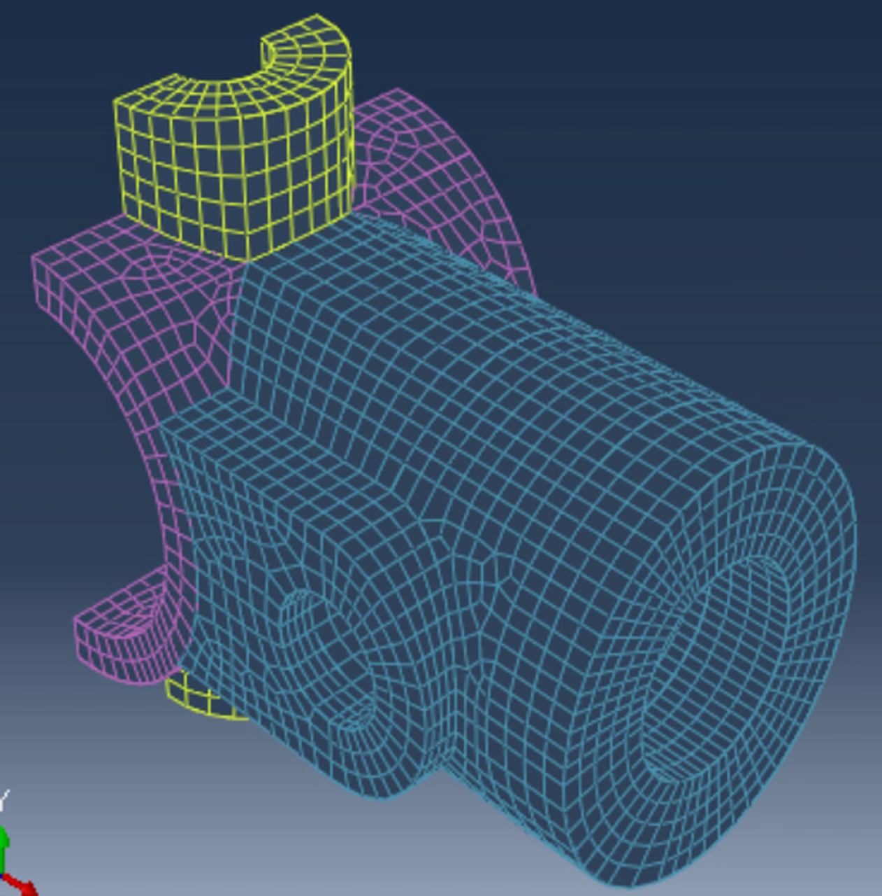
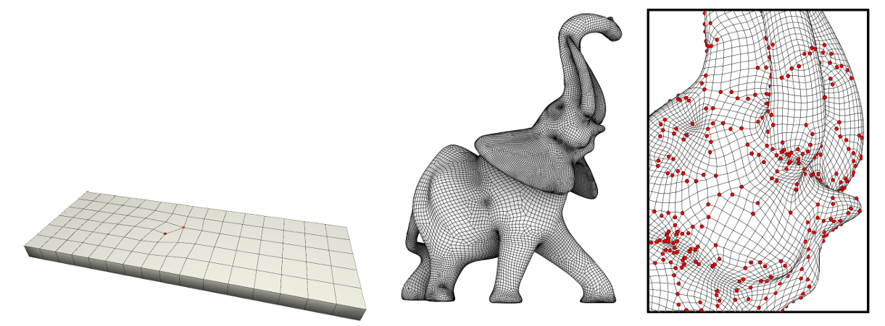
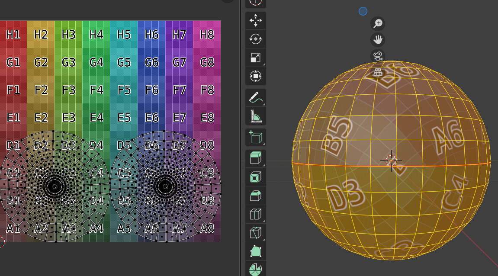
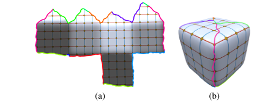
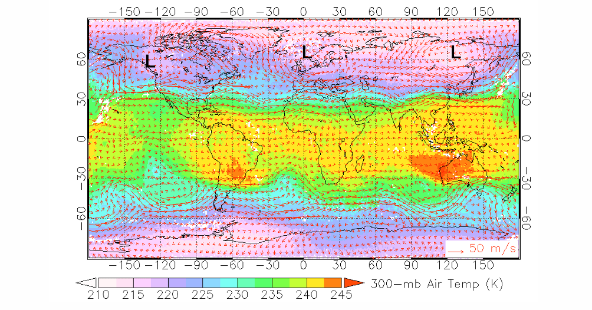
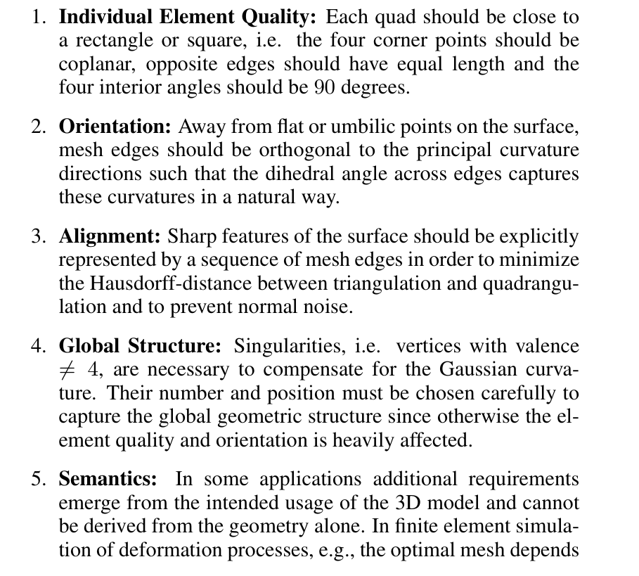

前面我们看到用来表达三维物体几何的三角形网格，不过三角网格是不规则的，**四边形网格(Quad Mesh)**天然支持定义**全局一致的局部坐标系**（u/v 方向），能够有效对齐并保持纹理或材料属性在主方向上的连续性与结构一致性，更好地捕捉到物体的几何特征。

四边形网格的张量积结构也可以用于高阶表面建模，如用于CAD/CAM中的NURBS样条以及动画电影中的网格细分。

对于四边形网格，其度不等于4的结点称为**奇异点(Singular)**，显然这些奇点的多少直接决定了四边形网格化的质量，而这些奇点的分布也决定了四边形网格的结构。对于一个复杂形状的四边形网格不可能完全没有奇异点，而是在允许少量奇异点的前提下，让整体尽量连续、尽量规则。顾险峰老师用黎曼几何的理论揭示了四边形网格化可以容许怎样的奇异点配置。

我们看到通过两组整体上连续、局部上相互正交的**参数线**可以构成四边形网格，所以可以考虑先求得参数化后来诱导出四边形网格。后面的思路将是，先设计向量场(主曲率场或者用户设计)，然后再提取出全局参数化，最后通过全局参数化的参数线提取出四边形网格。

#### 全局参数化

前面我们看到的展平过程都只是针对拓扑圆盘的，对于拓扑更加复杂的曲面，需要先通过切割线将曲面切成一个个小patch，然后逐个展平到平面上，将这些小patch拼到一个区域上即称为图集(atlas)

**全局参数化**是将曲面整体展平到一个平面上，避免了patch间的拼接问题，提供了更连续的参数化结果。

#### 全局无缝参数化

全局无缝参数化直观上看就是在接缝两端能正好对齐。更确切的说，参数线在跨越割缝后仍然只发生整数平移和 $90^\circ$ 旋转。

全局无缝参数化的条件可以形式化如下，设$u$是接缝一边的参数化坐标，$u'$是接缝另外一边的参数化坐标，则可定义**转移函数(transition function)**将接缝两边进行对齐。
$$
\mathbf{u'} = g(\mathbf{u}) = R_{90}^i\mathbf{u}+(j,k)^T 其中i,j,k \in \mathbb{Z},R_{90}是90度旋转矩阵
$$

一个全局参数化通常不是单独一个映射，而是一组局部参数化$(\varphi ,\varphi',...)$以及它们之间的**转移函数**。 曲面太复杂时，很难一次性铺平成一个平面区域，于是就需要多个重叠 chart 共同描述整个曲面。局部都能用平面坐标表示，全局则通过 chart 之间的转移函数粘起来

#### 基于向量场的全局参数化

向量场是定义在整体曲面上，是描述曲面全局几何的重要工具。动物身上包裹的毛发可以认为是一种向量场，每个人的头发就构成了一个向量场,有的人头上有发旋而有的人头上却没有。地球上风的分布也是一个向量场

按照向量场上的点搭载向量的不同，可以如下分类，让四边形网格的边与标架场**cross  field(4-Rosy field)**的向量相贴合，从而用户通过设计向量场从而让四边形网格的边贴合曲面的表面特征。

最简单的**cross field**的例子自然就是主曲率方向场 :它描述了曲面局部弯曲最强和最弱的两个正交方向，但这里马上会遇到两个困难：

1. 主曲率方向只在一般位置上定义良好，在脐点 `umbilic` 附近会退化。
2. 即使每个局部区域都能定义方向，想把它们拼成全局一致的参数化也并不容易。

所以向量场设计和全局参数化，本质上是在处理**“局部方向信息如何变成全局结构”**这个问题。

### Appendix

#### 衡量四边形网格的质量

