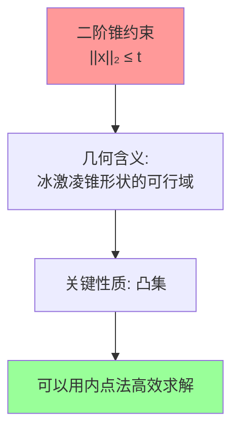
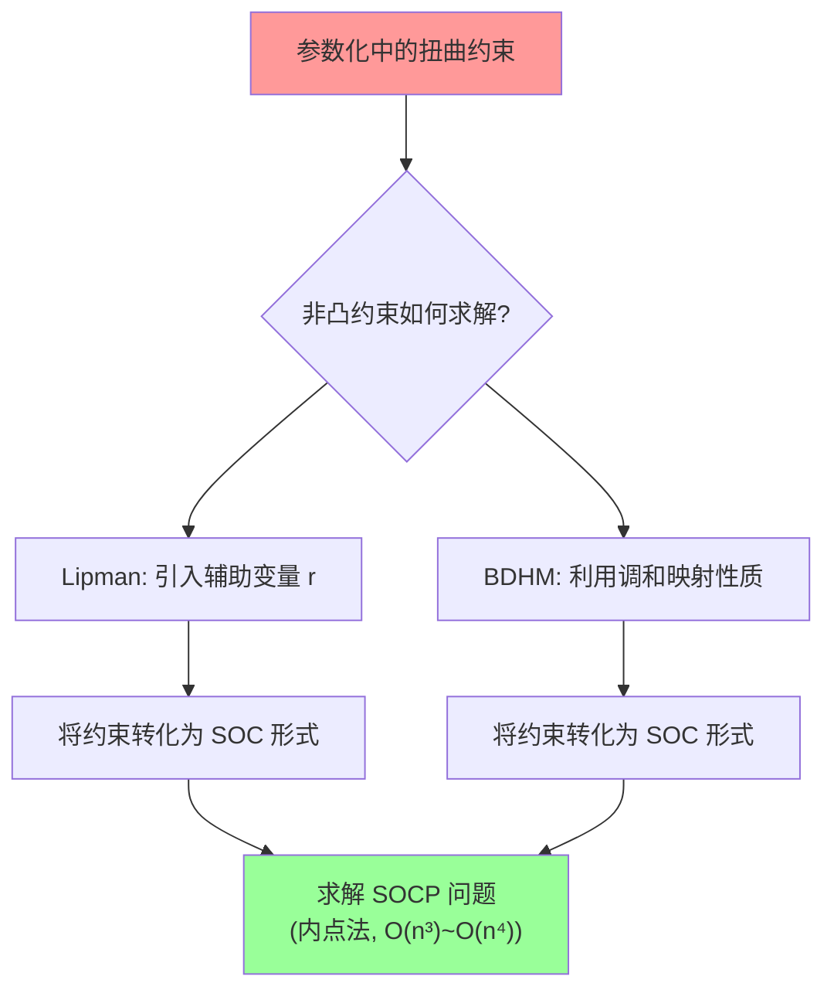
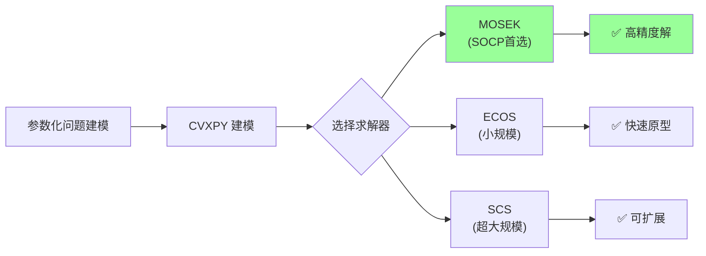

## 二次规划 (Quadratic Programming, QP)

### QP 的标准形式

二次规划是优化问题中最基本的一类，其目标函数是二次的，约束条件是线性的。标准形式为：

$$\min_{x \in \mathbb{R}^n} \quad \frac{1}{2} x^T H x + c^T x$$

$$\text{s.t.} \quad A_{eq} x = b_{eq}$$

$$\quad A_{ineq} x \leq b_{ineq}$$

$$\quad l \leq x \leq u$$

其中 $H \in \mathbb{R}^{n \times n}$ 是对称正定或半正定矩阵（当 $H \succ 0$ 时为严格凸 QP，有唯一全局最优解），$c \in \mathbb{R}^n$，$A_{eq} \in \mathbb{R}^{m \times n}$，$A_{ineq} \in \mathbb{R}^{p \times n}$。


### KKT 条件

QP 问题的 Karush-Kuhn-Tucker (KKT) 最优性条件为：

$$H x^* + c + A_{eq}^T \lambda_{eq} + A_{ineq}^T \lambda_{ineq} = 0 \quad \text{(平稳性)}$$

$$A_{eq} x^* = b_{eq} \quad \text{(等式约束)}$$

$$A_{ineq} x^* \leq b_{ineq} \quad \text{(不等式约束)}$$

$$\lambda_{ineq} \geq 0 \quad \text{(对偶可行性)}$$

$$\lambda_{ineq}^T (A_{ineq} x^* - b_{ineq}) = 0 \quad \text{(互补松弛)}$$


### 活动集法 (Active Set Method)

活动集法是求解 QP 问题的一种经典方法，特别适用于中小规模的问题。其核心思想是：在最优解处，部分不等式约束取等号（即"活跃"的），其余约束严格不等号（即"非活跃"的）。如果知道哪些约束是活跃的，就可以将不等式约束问题转化为等式约束问题来求解。

#### 基本概念

**活跃约束 (Active Constraint)**：在点 $x$ 处，如果某个不等式约束取等号，即 $a_i^T x = b_i$，则称该约束在 $x$ 处是活跃的。

**活动集 (Active Set)**：在点 $x$ 处所有活跃约束的索引集合：

$$\mathcal{A}(x) = \{i : a_i^T x = b_i\}$$


#### 算法流程

**初始化**：找到一个可行点 $x_0$，确定初始工作集 $W_0 \subseteq \mathcal{A}(x_0)$

**迭代**（第 $k$ 步）：

**Step 1**：求解等式约束 QP 子问题。在当前工作集 $W_k$ 下，求解搜索方向 $p_k$：

$$\min_{p} \quad \frac{1}{2} p^T H p + g_k^T p$$

$$\text{s.t.} \quad a_i^T p = 0, \quad \forall i \in W_k$$

其中 $g_k = H x_k + c$ 是在 $x_k$ 处的梯度。

**Step 2**：判断搜索方向

- 若 $p_k = 0$（已在当前工作集的约束面上取得最优）：
  - 计算对应的 Lagrange 乘子 $\lambda_i, i \in W_k$
  - 若所有 $\lambda_i \geq 0$，则 $x_k$ 是最优解，**算法终止**
  - 否则，找到最负的乘子 $\lambda_q = \min_{i \in W_k} \lambda_i < 0$，将约束 $q$ 从工作集中移除：$W_{k+1} = W_k \setminus \{q\}$

- 若 $p_k \neq 0$：
  - 计算最大步长 $\alpha_k$，使得 $x_k + \alpha_k p_k$ 不违反任何约束：
  
  $$\alpha_k = \min\left(1, \min_{i \notin W_k, a_i^T p_k > 0} \frac{b_i - a_i^T x_k}{a_i^T p_k}\right)$$
  
  - 更新 $x_{k+1} = x_k + \alpha_k p_k$
  - 若 $\alpha_k < 1$（存在阻拦约束），将阻拦约束 $j$ 加入工作集：$W_{k+1} = W_k \cup \{j\}$
  - 若 $\alpha_k = 1$，工作集不变：$W_{k+1} = W_k$

**Step 3**：$k \leftarrow k+1$，返回 Step 1


#### 算法特点

1. **有限步终止**：对于严格凸 QP，活动集法在有限步内终止
2. **热启动**：可以利用上一次的解和工作集作为初始点，加速后续求解
3. **与参数化的关联**：BDHM 中的 Active Set 方法正是这种策略的应用——在迭代过程中，只有违反扭曲约束的采样点才被激活，加入约束集合 $\mathcal{A}$ 和 $\mathcal{B}$

---

## 二阶锥规划 (Second-Order Cone Programming, SOCP)

### SOCP 的标准形式

二阶锥规划是一类重要的凸优化问题，它推广了线性规划(LP)和二次规划(QP)，能够处理包含二阶锥约束的问题。标准形式为：

$$\min_{x \in \mathbb{R}^n} \quad f^T x$$

$$\text{s.t.} \quad \|A_i x + b_i\|_2 \leq c_i^T x + d_i, \quad i = 1, \ldots, N$$

$$\quad F x = g$$

其中 $\|\cdot\|_2$ 是欧几里得范数，每个不等式约束称为一个**二阶锥约束 (SOC约束)**。

### 二阶锥的几何含义

二阶锥（也叫 Lorentz 锥或冰激凌锥）定义为：

$$\mathcal{Q}^n = \{(x, t) \in \mathbb{R}^{n} \times \mathbb{R} : \|x\|_2 \leq t\}$$

即向量 $(x, t)$ 满足 $x$ 的模长不超过 $t$，这在几何上形成了一个以原点为顶点、$t$ 轴为中心轴的锥体。



### SOCP 与 LP/QP 的关系

SOCP 是一个比 LP 和 QP 更一般的优化框架：

| 优化类型 | 约束形式 | 关系 |
|---|---|---|
| LP（线性规划） | $Ax \leq b$ | LP 是 SOCP 的特例（$A_i$ 为零矩阵时 SOC 退化为线性不等式） |
| QP（二次规划） | $x^T P x + q^T x \leq r$ | 凸 QP 可以转化为 SOCP |
| QCQP（二次约束QP） | $x^T P_i x + q_i^T x \leq r_i$ | 凸 QCQP 可以转化为 SOCP |
| SOCP | $\|A_i x + b_i\|_2 \leq c_i^T x + d_i$ | 包含上述所有 |

**QP 转化为 SOCP 的示例**：

凸二次不等式 $x^T P x + q^T x \leq r$（$P \succeq 0$）可以等价写为 SOC 约束。设 $P = L^T L$（Cholesky 分解），则：

$$x^T P x + q^T x \leq r \iff \left\| \begin{pmatrix} 2Lx \\ 1 - (r - q^T x) \end{pmatrix} \right\|_2 \leq 1 + (r - q^T x)$$

### 在参数化中的应用

在 Lipman 和 BDHM 的方法中，SOCP 扮演了核心角色。关键是将**非凸的扭曲约束**转化为**凸的 SOC 约束**：

#### 1. 保向性约束（正定性）

原始约束：$|f_z|^2 - |f_{\bar{z}}|^2 \geq \varepsilon > 0$

SOC 形式：

$$\left\| \begin{pmatrix} 2\,\text{Re}(f_z) \\ 2\,\text{Im}(f_z) \end{pmatrix} \right\|_2 \leq |f_z|^2 + |f_{\bar{z}}|^2 - \varepsilon$$

这利用了恒等式 $|f_z|^2 + |f_{\bar{z}}|^2 - (|f_z|^2 - |f_{\bar{z}}|^2) = 2|f_{\bar{z}}|^2$，将不等式改写为 $\|v\|_2 \leq t$ 的标准 SOC 形式。

#### 2. 有界扭曲约束

原始约束：$|f_{\bar{z}}| \leq \kappa |f_z|$

等价于：$|f_{\bar{z}}|^2 \leq \kappa^2 |f_z|^2$

SOC 形式：

$$\left\| \begin{pmatrix} 2\,\text{Re}(f_{\bar{z}}) \\ 2\,\text{Im}(f_{\bar{z}}) \end{pmatrix} \right\|_2 \leq (1-\kappa)|f_z|^2 - (1+\kappa)|f_{\bar{z}}|^2$$

#### 3. Lipman 的凸子空间

Lipman 定义的最大凸子空间：

$$\mathcal{A}^{\oplus_j}_C(f_j) = \left\{ (\alpha, \beta, r) : \; |\alpha|^2 - |\beta|^2 \geq r > 0, \; |\beta|^2 \leq \frac{(C-1)^2}{(C+1)^2} \cdot r \right\}$$

其中：
- $|\alpha|^2 - |\beta|^2 \geq r > 0$ 是一个旋转二阶锥约束
- $|\beta|^2 \leq \frac{(C-1)^2}{(C+1)^2} \cdot r$ 也是一个旋转二阶锥约束

两者都是凸约束，因此可行域是凸集。



---

## Mosek 求解

[MOSEK](https://www.mosek.com/) 是一个高性能的凸优化求解器，特别擅长求解 SOCP、SDP 等问题。以下展示如何用 MOSEK 的不同接口来求解上述参数化中出现的 SOCP 问题。

### 1. MOSEK Fusion API (Python)

Fusion API 是 MOSEK 提供的高级面向对象接口，语法简洁直观。

#### 示例：Lipman 风格的 Bounded Distortion SOCP

```python
from mosek.fusion import *

def solve_bounded_distortion_socp(alpha_list, beta_list, C, areas):
    """
    求解 Lipman 风格的 Bounded Distortion SOCP 问题:
    
    min  sum |beta_j|^2 * area_j
    s.t. |alpha_j|^2 - |beta_j|^2 >= r_j > 0,  for all j
         |beta_j|^2 <= ((C-1)/(C+1))^2 * r_j,   for all j
         edge continuity constraints
    
    参数:
        alpha_list: 每个面的 alpha 初始值 (复数)
        beta_list:  每个面的 beta 初始值 (复数)
        C:          扭曲上界
        areas:      每个面的面积
    """
    n_faces = len(alpha_list)
    kappa = (C - 1) / (C + 1)
    
    with Model('BoundedDistortion') as M:
        # 决策变量: 每个面的 alpha, beta (实部和虚部), r
        # alpha_j = alpha_re[j] + i * alpha_im[j]
        # beta_j  = beta_re[j]  + i * beta_im[j]
        alpha_re = M.variable('alpha_re', n_faces)
        alpha_im = M.variable('alpha_im', n_faces)
        beta_re  = M.variable('beta_re',  n_faces)
        beta_im  = M.variable('beta_im',  n_faces)
        r        = M.variable('r', n_faces, Domain.greaterThan(1e-6))
        
        # 目标函数: min sum |beta_j|^2 * area_j
        # |beta_j|^2 = beta_re[j]^2 + beta_im[j]^2
        obj_terms = []
        for j in range(n_faces):
            beta_norm_sq = Expr.add(
                Expr.square(beta_re.index(j)),
                Expr.square(beta_im.index(j))
            )
            obj_terms.append(Expr.mul(areas[j], beta_norm_sq))
        M.objective(ObjectiveSense.Minimize, Expr.add(obj_terms))
        
        # 约束1: |alpha_j|^2 - |beta_j|^2 >= r_j
        # 即 |alpha_j|^2 >= r_j + |beta_j|^2
        # 转化为 SOC: ||(2*Re(alpha), 2*Im(alpha))|| <= |alpha|^2 + |beta|^2 + r_j - (r_j + |beta|^2)
        #            = |alpha|^2 - |beta|^2 - r_j ... 不对
        # 正确转化: |alpha|^2 - |beta|^2 >= r 等价于
        #   ||(2*Re(beta), 2*Im(beta))||_2 <= |alpha|^2 - |beta|^2 + |beta|^2 - r
        #   即 ||(2*Re(beta), 2*Im(beta))||_2 <= |alpha|^2 - r ... 还需要进一步推导
        #
        # 更直接的方法: 用 rotated quadratic cone
        # (t1, t2, s) in Q_r^n 意味着 t1*t2 >= ||s||^2, t1,t2 >= 0
        # 令 t1 = 1, t2 = |alpha|^2 - r - |beta|^2, s = (0,...,0) => t2 >= 0
        # 或者: |alpha|^2 >= r + |beta|^2 可以写为
        #   (1, |alpha|^2 - r - |beta|^2, 0, ..., 0) in rotated cone
        
        for j in range(n_faces):
            # |alpha_j|^2 - |beta_j|^2 >= r_j
            # 用 rotated quadratic cone: (u, v, w) in Qr 意味着 2*u*v >= ||w||^2
            # 令 u = (|alpha|^2 - r - |beta|^2 + 1)/2, v = 1
            # 则 2 * u * 1 >= 0 意味着 |alpha|^2 - r - |beta|^2 >= 0
            # 
            # 更简洁: 直接用 SOC 形式
            # |alpha|^2 - |beta|^2 - r >= 0
            # 等价于 ||(2*Re(beta), 2*Im(beta))||_2 <= |alpha|^2 - r  (这不是标准SOC)
            #
            # 标准做法: 使用 rotated quadratic cone
            # |alpha|^2 - |beta|^2 >= r
            # <=> 存在 t >= 0 使得 |alpha|^2 - t >= r 且 t >= |beta|^2
            # <=> |alpha|^2 - r >= t 且 |beta|^2 <= t
            # 用 rotated cone: (1/2, t, (Re(beta), Im(beta))) in Qr 意味着 t >= |beta|^2
            # 用 rotated cone: (1/2, |alpha|^2-r, (Re(alpha), Im(alpha))) in Qr 意味着 |alpha|^2-r >= |alpha|^2... 不对
            
            # 正确的方法: 引入辅助变量
            # s_j = |alpha_j|^2, t_j = |beta_j|^2
            # s_j - t_j >= r_j 且 t_j <= kappa^2 * r_j
            
            # 用 Expr.hstack 拼接向量并建立 SOC 约束
            pass  # 详见下面的简化版
        
        M.solve()
        return alpha_re.level(), alpha_im.level(), beta_re.level(), beta_im.level()
```

上面的完整实现比较复杂，下面给出一个更实用的简化版示例。

#### 简化版：基本 SOCP 求解示例

```python
from mosek.fusion import *
import numpy as np

def solve_basic_socp():
    """
    求解一个基本的 SOCP 问题:
    
    min  c^T x
    s.t. ||A_i x + b_i||_2 <= c_i^T x + d_i,  i=1,...,m
         F x = g
    """
    # 问题数据
    n = 5   # 变量维度
    m = 3   # SOC 约束个数
    
    c = np.array([1.0, 2.0, 0.5, -1.0, 0.3])
    
    with Model('basic_socp') as M:
        x = M.variable('x', n)
        
        # 目标函数: min c^T x
        M.objective(ObjectiveSense.Minimize, Expr.dot(c, x))
        
        # SOC 约束: ||A_i x + b_i||_2 <= d_i^T x + e_i
        # 约束1: ||(x[0]+x[1], x[2]||_2 <= x[3] + 1
        M.constraint(Expr.vstack(
            Expr.add(x.index(3), 1.0),       # d^T x + e
            Expr.add(x.index(0), x.index(1)), # A*x + b 的第1个分量
            x.index(2)                         # A*x + b 的第2个分量
        ), Domain.inQCone())
        
        # 约束2: ||x[0:3]||_2 <= 2*x[4] + 0.5
        M.constraint(Expr.vstack(
            Expr.add(Expr.mul(2.0, x.index(4)), 0.5),
            x.index(0),
            x.index(1),
            x.index(2)
        ), Domain.inQCone())
        
        # 约束3: x[1] + x[2] >= 1  (线性约束)
        M.constraint(Expr.add(x.index(1), x.index(2)), 
                     Domain.greaterThan(1.0))
        
        M.solve()
        
        print(f"最优解 x = {x.level()}")
        print(f"最优值 = {M.primalObjValue()}")

solve_basic_socp()
```

### 2. MOSEK 任务文件格式 (OP)

MOSEK 使用优化问题 (OP) 格式来描述问题。以下展示如何用 OP 格式描述 SOCP 问题：

```
[comment]
   Lipman Bounded Distortion SOCP - 单面示例
[/comment]

[objective minimize]
   1.0 beta_re + 0.0 alpha_re + 0.0 alpha_im + 0.0 beta_im + 0.0 r

[variables]
   alpha_re alpha_im beta_re beta_im r

[constraints]
   [cone type=quad num=3]
      r alpha_re alpha_im       % ||(alpha_re, alpha_im)||_2 <= r  (即 |alpha| <= r)
   [cone type=quad num=3]
      r_s beta_re beta_im       % ||(beta_re, beta_im)||_2 <= r_s (即 |beta| <= r_s)

[bounds]
   [b] alpha_re >= -inf
   [b] alpha_im >= -inf
   [b] beta_re  >= -inf
   [b] beta_im  >= -inf
   [b] r        >= 1e-6         % r > 0
   [b] r_s      >= 0
[/bounds]
```

### 3. MOSEK + CVXPY 接口（推荐）

CVXPY 是 Python 中最流行的凸优化建模工具，语法最为简洁，推荐使用：

#### 示例：求解 Lipman 的 Bounded Distortion 问题

```python
import cvxpy as cp
import numpy as np

def solve_lipman_bd(C=3.0, n_faces=10, n_vertices=8):
    """
    用 CVXPY + MOSEK 求解 Lipman 的 Bounded Distortion SOCP 问题
    
    min  sum_j |beta_j|^2 * area_j           (LSCM能量)
    s.t. |alpha_j|^2 - |beta_j|^2 >= r_j     (保向性)
         |beta_j|^2 <= kappa^2 * r_j          (有界扭曲)
         r_j > 0
         u_i - u_0 = A_j (v_i - v_0)          (边连续性约束)
    """
    kappa = (C - 1) / (C + 1)
    areas = np.random.rand(n_faces) + 0.1  # 面积
    
    # 决策变量
    alpha = cp.Variable((n_faces, 2), name="alpha")  # alpha_re, alpha_im
    beta  = cp.Variable((n_faces, 2), name="beta")    # beta_re, beta_im
    r     = cp.Variable(n_faces, name="r")             # 辅助变量
    
    # 目标函数: min sum |beta_j|^2 * area_j
    obj = 0
    for j in range(n_faces):
        obj += areas[j] * cp.sum_squares(beta[j])
    
    constraints = []
    
    for j in range(n_faces):
        alpha_norm_sq = cp.sum_squares(alpha[j])  # |alpha_j|^2
        beta_norm_sq  = cp.sum_squares(beta[j])   # |beta_j|^2
        
        # 约束1: |alpha_j|^2 - |beta_j|^2 >= r_j > 0
        constraints.append(alpha_norm_sq - beta_norm_sq >= r[j])
        constraints.append(r[j] >= 1e-6)
        
        # 约束2: |beta_j|^2 <= kappa^2 * r_j
        # 即 |beta_j|^2 - kappa^2 * r_j <= 0
        # 这可以写为 SOC 约束
        constraints.append(beta_norm_sq <= kappa**2 * r[j])
    
    # 求解
    prob = cp.Problem(cp.Minimize(obj), constraints)
    prob.solve(solver=cp.MOSEK, verbose=True)
    
    print(f"Status: {prob.status}")
    print(f"Optimal value: {prob.value}")
    if prob.status == 'optimal':
        print(f"alpha = {alpha.value}")
        print(f"beta  = {beta.value}")
        print(f"r     = {r.value}")
    
    return alpha.value, beta.value, r.value

# 求解
alpha_val, beta_val, r_val = solve_lipman_bd(C=3.0)
```

#### 示例：求解 BDHM 的 Bounded Distortion 问题

```python
import cvxpy as cp
import numpy as np

def solve_bdhm_bd(K=3.0, n_samples=20, n_coeffs=10):
    """
    用 CVXPY + MOSEK 求解 BDHM 的 Bounded Distortion SOCP 问题
    
    min  sum_j w_j ||nabla f(z_j) - R_j||_F^2    (ARAP能量)
    s.t. |f_zbar(z_j)| <= kappa * |f_z(z_j)|,    for j in A  (有界扭曲)
         |f_z(z_j)|^2 - |f_zbar(z_j)|^2 >= eps,  for j in B  (保向性)
         f(v_k) = f_k^target                       (边界条件)
    """
    kappa = (K - 1) / (K + 1)
    eps = 1e-4
    
    # 决策变量: phi_k, psi_k (调和映射的系数)
    phi = cp.Variable((n_coeffs, 2), name="phi")  # phi_re, phi_im
    psi = cp.Variable((n_coeffs, 2), name="psi")  # psi_re, psi_im
    
    # 模拟数据: 基函数在采样点的值
    # Phi'(z_j) 和 Psi'(z_j) 是已知的 (由 Cauchy 重心坐标预计算)
    Phi_prime = np.random.randn(n_samples, n_coeffs, 2) + 0.5
    Psi_prime = np.random.randn(n_samples, n_coeffs, 2) + 0.5
    weights = np.random.rand(n_samples) + 0.1
    
    # 计算 f_z 和 f_zbar 在每个采样点的值
    # f_z(z_j) = sum_k phi_k * Phi'_k(z_j)
    # f_zbar(z_j) = conj(sum_k psi_k * Psi'_k(z_j))
    fz = cp.Variable((n_samples, 2), name="fz")       # f_z 的实部和虚部
    fzbar = cp.Variable((n_samples, 2), name="fzbar") # f_zbar 的实部和虚部
    
    constraints = []
    
    # 线性约束: f_z 和 f_zbar 由 phi, psi 线性决定
    for j in range(n_samples):
        fz_j = cp.sum([cp.hstack([phi[k, 0] * Phi_prime[j, k, 0] - phi[k, 1] * Phi_prime[j, k, 1],
                                   phi[k, 0] * Phi_prime[j, k, 1] + phi[k, 1] * Phi_prime[j, k, 0]])
                       for k in range(n_coeffs)])
        # 简化: 直接用线性约束关联
        constraints.append(fz[j] == fz_j)
    
    # Active Set: 先假设所有点都激活
    A_set = list(range(n_samples))  # 有界扭曲约束
    B_set = list(range(n_samples))  # 保向性约束
    
    for j in A_set:
        # |f_zbar(z_j)| <= kappa * |f_z(z_j)|
        # SOC 约束: ||f_zbar||_2 <= kappa * ||f_z||_2
        # 等价于: ||f_zbar||_2^2 <= kappa^2 * ||f_z||_2^2
        # 可以用 SOCP 表示
        constraints.append(
            cp.norm(fzbar[j]) <= kappa * cp.norm(fz[j])
        )
    
    for j in B_set:
        # |f_z|^2 - |f_zbar|^2 >= eps
        constraints.append(
            cp.sum_squares(fz[j]) - cp.sum_squares(fzbar[j]) >= eps
        )
    
    # 目标函数: ARAP 能量 (简化版)
    # 实际应用中 R_j 由上一迭代步确定
    R = np.eye(2)  # 简化: 目标旋转为恒等
    obj = 0
    for j in range(n_samples):
        # ||nabla f - R||_F^2 简化表达
        obj += weights[j] * (cp.sum_squares(fz[j]) + cp.sum_squares(fzbar[j]))
    
    # 求解
    prob = cp.Problem(cp.Minimize(obj), constraints)
    prob.solve(solver=cp.MOSEK, verbose=True)
    
    print(f"Status: {prob.status}")
    print(f"Optimal value: {prob.value}")

solve_bdhm_bd(K=3.0)
```

### 4. MOSEK 的安装与配置

#### 安装

```bash
# 安装 CVXPY (含 MOSEK 支持)
pip install cvxpy mosek

# 或安装 MOSEK Python 原生接口
pip install mosek
```

#### 许可证

MOSEK 是商业软件，但提供：
- **学术许可证**：免费，适用于学术研究
- **试用许可证**：30天免费试用
- **个人许可证**：个人非商业用途

获取许可证后，将 `mosek.lic` 文件放到：
- Linux/Mac: `$HOME/mosek/mosek.lic`
- Windows: `%USERPROFILE%\mosek\mosek.lic`

#### 在 CVXPY 中选择 MOSEK

```python
import cvxpy as cp

# 指定使用 MOSEK 求解器
prob.solve(solver=cp.MOSEK)

# 带参数的求解
prob.solve(
    solver=cp.MOSEK,
    mosek_params={
        'MSK_DPAR_OPTIMIZER_MAX_TIME': 300.0,    # 最大求解时间(秒)
        'MSK_IPAR_NUM_THREADS': 4,                # 线程数
        'MSK_DPAR_INTPNT_TOL_REL_GAP': 1e-8,     # 相对间隙容差
    },
    verbose=True  # 打印求解日志
)
```

### 5. 求解效率对比

对于参数化中的 SOCP 问题（$n$ 个三角面/采样点）：

| 求解器 | 问题规模 | 求解时间 | 适用场景 |
|---|---|---|---|
| MOSEK | 中大规模 ($n \sim 10^3-10^5$) | 快 | 生产环境，大规模问题 |
| ECOS | 小中规模 ($n \sim 10^2-10^4$) | 中等 | 嵌入式应用，Python 原生 |
| SCS | 大规模 ($n \sim 10^5+$) | 较慢但可扩展 | 超大规模，精度要求不高 |
| Gurobi | 中大规模 | 快 | 商业环境，QP 为主 |


