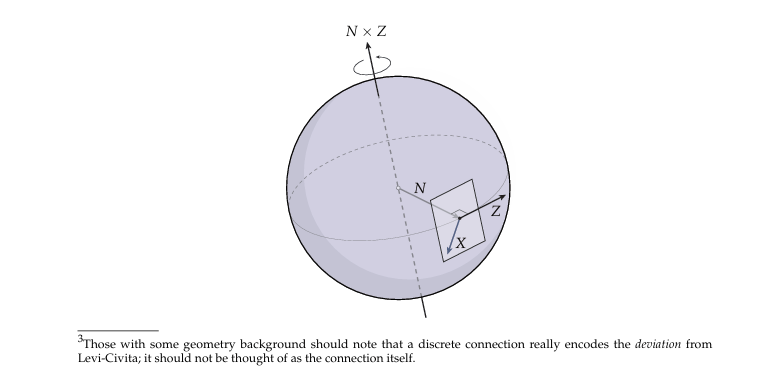

### 曲率

如果要定义曲面的曲率首先就要先了解曲线的曲率

**曲线的曲率**

Frenet坐标架

**曲面的曲率**

可以证明曲面上曲率最大和最小的方向是一定是彼此正交的

主曲率向量场

**曲率的计算**

主曲率是以下广义特征值问题的解

形状算子是矩阵

如何计算主曲率

曲面的第一基本型与第二基本型

曲面在局部可以看作一个**二次曲面**（如椭球、双曲面等），而这些二次曲面的主轴天然就是正交的。可以参加libigl中computeCurvature的实现

你有没有过这样的体验：把一张平整的纸卷成圆筒，它的“弯度”好像变了，但有些东西又没变？Gauss-Bonnet定理就是干这个的——**它在说，曲面的“局部弯曲程度”和“整体形状特征”之间，藏着一条永远打不破的数学铁律**！不管你怎么拉伸、扭曲一个曲面（只要不撕破、不粘连），把曲面上每一点的“弯曲脾气”（高斯曲率）加起来，结果永远等于一个只跟曲面“洞的数量”有关的数（欧拉示性数）乘以2π。听起来玄乎？别急，这可能是人类历史上最“跨界”的数学定理之一——左手牵着微积分（算曲率），右手拉着拓扑学（看洞数），硬生生把“局部”和“整体”焊死了！

**弯曲曲面的“身份证”——从高斯曲率说起**

要懂Gauss-Bonnet，得先认识“高斯曲率”这个脾气古怪的家伙。你摸过篮球和马鞍吗？篮球表面处处“向外鼓”，高斯曲率是正的；马鞍中间“向内凹”，曲率是负的；而桌面这种平面，曲率就是0。**但高斯曲率最神奇的地方在于——它是“内禀”的！** 啥意思？想象你是一只蚂蚁在球面上爬，你不用抬头看天空，光靠测量周围“三角形内角和”就能知道自己在“正曲率世界”（三角形内角和大于180°）；如果内角和小于180°，那你八成在马鞍面上。这种“不用跳出曲面就能感知的弯曲”，就是高斯曲率的灵魂。

蚂蚁视角下的曲面曲率：球面三角形内角和大于180°

那Gauss-Bonnet定理到底干了啥？它把整个曲面上的高斯曲率“加起来”（数学上叫积分），发现这个总和竟然只跟曲面的“拓扑结构”有关！拓扑是啥？就是不管你怎么揉、拉、扭（只要不撕、不粘），曲面不变的性质——比如球面不管捏成啥样，它“没有洞”的本质变不了；甜甜圈（环面）有一个洞，这也是它的“拓扑身份证”。**定理公式长这样：∫∫_S K dA = 2πχ(S)**，这里K是高斯曲率，dA是曲面面积元，χ(S)就是欧拉示性数——一个直接反映“洞的数量”的整数！比如球面的χ=2，环面的χ=0，双环面χ=-2……你看，左边是微积分算出来的“局部曲率总和”，右边是拓扑学的“整体特征数”，这俩八竿子打不着的东西，被Gauss-Bonnet定理死死捆在了一起！

从“局部弯曲”到“整体命运”：**定理推导**的神来之笔

别被“推导”吓跑！其实Gauss-Bonnet定理的核心思想超级朴素——**把曲面“拆碎”成无数小三角形，算每个小三角形的曲率贡献，加起来就是整个曲面的曲率总和**。就像你数一块拼图的总块数，不用一块块数，数每行有几块再乘以行数就行。

先从最简单的情况说起：平面上的三角形内角和是180°（π弧度），但在曲面上，三角形内角和会“跑偏”。比如球面上画个三角形，三个角都可能是直角，内角和就成了270°，比π多了π/2。高斯发现，这个“跑偏量”（内角和减去π）正好等于三角形内部的高斯曲率积分！这就是“高斯绝妙定理”的特殊情况：对一个测地三角形（三边都是“最短路”测地线），∫∫_Δ K dA = α+β+γ - π，其中α、β、γ是三角形的三个内角。

那如果把曲面分成N个这样的测地三角形呢？每个三角形的“跑偏量”加起来，就是整个曲面的曲率积分。但这时候要注意：三角形的边和顶点会重复计算，得想办法抵消。比如两个相邻三角形共享一条边，它们在这条边上的“外角”会互相抵消；顶点处所有三角形的内角加起来，正好是一个周角2π。一顿操作猛如虎，最后所有局部“跑偏量”的总和，竟然化简成了2π(顶点数V - 棱数E + 面数F)！而V - E + F，正是拓扑学的“祖师爷”——欧拉示性数χ(S)！**所以整个曲面的曲率积分∫∫_S K dA = 2πχ(S)**，这就是Gauss-Bonnet定理的“民间推导版”。你看，从一个小三角形的内角和，一路推到整个曲面的拓扑性质，这不就是数学界的“草船借箭”吗？用局部的“小数据”算整体的“大数据”！

前面我们计算出了主曲率，下面我们以此定义高斯曲率与平均曲率

l另外高斯曲率还有一个如下的定义

**高斯映射-曲面世界的GPS定位系统**

想象你站在一个崎岖的山坡上，手中的指南针不断摆动。Gauss映照就是这样一个"数学指南针"，它记录着曲面上每一点"朝哪个方向倾斜"。具体来说，对于曲面S上的每一点p，我们取其单位法向量n(p)，然后将这个向量平移到单位球面S²的对应位置。

想象你站在一个光滑曲面上，手中握着一个指向天空的法向量。Gauss映照就是将曲面上每一点的这个法向量对应到单位球面上的过程。**这个看似简单的操作，却蕴含着曲面形状的深刻信息**。

在局部坐标系(u,v)下，设曲面S的参数表示为x(u,v)。曲面的单位法向量场N(u,v)由下式给出： N(u,v) = (x_u × x_v)/|x_u × x_v|

Gauss映照g: S→S²定义为g(p) = N(p)，其中p∈S，S²表示单位球面。这个定义看似依赖曲面的嵌入方式，但神奇的是，**Gauss曲率作为内蕴量却与嵌入无关**。

为什么法向量的变化能反映曲面弯曲程度？直观上，平坦区域法向量几乎不变，而高度弯曲区域法向量变化剧烈。Gauss映照的微分dg_p: T_pS→T_g(p)S²正是量化这种变化的工具。

**这个从曲面到单位球面的映射φ:S→S²就是Gauss映照**。它把复杂的曲面信息"压缩"到了单位球面上，让我们可以通过研究球面上的图像来反推原始曲面的性质。就像把三维地形图投影到二维地图上，只不过这次是从曲面到球面。

曲面上每个点存在一个唯一的法向量N,垂直于其切平面上的所有向量，将这个法向量放缩到1那么就得到一个映射称为高斯映射				

高斯映射的导映射dN(X)称为Weingarten映射

让我们通过具体计算揭示Gauss映照的运作机制。考虑曲面在点p处的切空间T_pS，由{x_u,x_v}张成。Gauss映照的微分dg_p将切向量v∈T_pS映射为：

dg_p(v) = ∂N/∂v = -W_p(v)

其中W_p是Weingarten映射（形状算子）。这个负号告诉我们，**法向量的变化方向与曲面弯曲方向相反**。

在局部坐标下，Weingarten映射的矩阵表示为： W = [g^ij][h_jk] = I⁻¹·II

其中I是第一基本形式矩阵，II是第二基本形式矩阵。这个关系揭示了**Gauss映照微分与曲面基本形式的深刻联系**。

例题：计算旋转抛物面z=x²+y²在原点处的Gauss映照微分。

解：参数化曲面为x(u,v)=(u,v,u²+v²)。计算得： x_u=(1,0,2u), x_v=(0,1,2v) 在原点处，N(0,0)=(0,0,1) I = E=1, F=0, G=1 II = L=2, M=0, N=2 因此W = [2 0; 0 2]，dg_p将切向量(a,b)映射为(-2a,-2b)

这个结果说明原点处法向量变化率是切向量的-2倍，反映了抛物面在该点的均匀弯曲特性。

Gauss的伟大发现是：**曲面的总曲率等于Gauss映照的像集面积**。具体来说，对于曲面上的区域R，有：

∫∫_R K dA = Area(g(R))

其中K是Gauss曲率，dA是曲面面积元。这个等式揭示了局部几何性质与整体拓扑之间的深刻联系。

在局部坐标下，Gauss曲率可表示为： K = (LN-M²)/(EG-F²) = det(W)

这意味着**Gauss曲率就是Weingarten映射的行列式**，量化了Gauss映照对面积的"拉伸"程度。当K>0时，g保持局部定向；K<0时，g反转局部定向。

更惊人的是，Gauss曲率完全由第一基本形式决定（Theorema Egregium）。这解释了为何曲面上的生物（如蚂蚁）无需离开曲面就能感知其弯曲程度——**曲率是内蕴的，与外部观察者视角无关**。

要严格定义Gauss映照，我们需要一些准备工作。设S⊂ℝ³是一个正则曲面，对每点p∈S，存在邻域U和参数化x:U→S。我们可以计算xu=∂x/∂u和xv=∂x/∂v这两个切向量，它们的叉积给出了法向量方向。

单位法向量定义为： n(p) = (xu × xv)/||xu × xv||

**Gauss映照φ:S→S²就是将所有点的单位法向量收集起来，映射到单位球面上**。这个定义看似简单，却蕴含着曲面局部行为的全部信息。通过分析φ的微分dφp:TpS→Tφ(p)S²，我们可以提取曲面的曲率信息。

#### Gauss映照揭示的曲面密码

Gauss映照最神奇的地方在于它与曲面曲率的深刻联系。**Gauss曲率K(p)实际上等于映照φ在p点的Jacobian行列式**。这意味着：

当K(p)>0时，φ保持局部定向；当K(p)<0时，φ反转局部定向；当K(p)=0时，φ在该点退化。

更精确地说，我们有： K(p) = limA→0 Area(φ(A))/Area(A)

**这个关系表明，Gauss曲率衡量的是Gauss映照的"面积放大率"**。正曲率区域被映照放大，负曲率区域被映照反转并压缩，零曲率区域被映照成一条曲线。

Gauss的伟大发现是：**曲面的总曲率等于Gauss映照的像集面积**。具体来说，对于曲面上的区域R，有：

∫∫_R K dA = Area(g(R))

其中K是Gauss曲率，dA是曲面面积元。这个等式揭示了局部几何性质与整体拓扑之间的深刻联系。

在局部坐标下，Gauss曲率可表示为： K = (LN-M²)/(EG-F²) = det(W)

这意味着**Gauss曲率就是Weingarten映射的行列式**，量化了Gauss映照对面积的"拉伸"程度。当K>0时，g保持局部定向；K<0时，g反转局部定向。

更惊人的是，Gauss曲率完全由第一基本形式决定（Theorema Egregium）。这解释了为何曲面上的生物（如蚂蚁）无需离开曲面就能感知其弯曲程度——**曲率是内蕴的，与外部观察者视角无关**。

## 高斯曲率

如何度量曲面的不平整度，高斯曲率，甜甜圈里面的是负曲率外面的是正曲率，而根据高斯博内定理两者的和是零

**高斯曲率**对于内部点

对于拓扑空间，度量决定了曲率，所以我们要找到使得曲率为零的度量，局部度量的放缩变化是由共形因子决定的。下面我们将看到如何通过对度量进行放缩从而将曲面共形地展平。

对于参数化算法，网格内部点的目标高斯曲率$K^{new}$都是0

内部点高斯曲率：

边界点测地曲率，

映射的共形性等价于对于测度的放缩。局部形状的放缩变形仅由其放缩因子(scaling factor)决定。共形映射是几何内在属性与其几何嵌入无关

方向导数与协变导数

### 对LC的进一步解释

**高斯绝妙定理**

**高斯-博内定理**

对其直接离散化得到推导出三角网格的高斯曲率

Gauss映照在现代科技中的惊艳应用

**计算机图形学**中，Gauss映照被广泛用于曲面简化和法线贴图技术。通过分析Gauss映照的图像，可以智能地决定哪些曲面细节可以简化而不影响视觉效果。

**机器人路径规划**利用Gauss映照分析地形曲率，帮助机器人判断哪些表面可安全行走或抓取。**自动驾驶系统**也使用类似技术分析道路曲率变化。

**医学影像处理**中，Gauss映照帮助分析器官表面的复杂形变，辅助疾病诊断。例如肺部结节的Gauss映照模式与良性/恶性肿瘤有显著相关性。

**材料科学**通过Gauss映照研究纳米材料表面结构，预测其力学和化学性质。特定映照模式对应着更高的催化活性或强度。
