### 四边形网格

对于具有**各向异性表面结构**（如牛肉肌纤维呈现的纵横方向性纹理）的物体，采用**四边形网格**（quad mesh）相较于三角形网格（triangle mesh）更具优势：四边形网格天然支持定义**全局一致的局部坐标系**（u/v 方向），能够有效对齐并保持纹理或材料属性在主方向上的连续性与结构一致性，更好地捕捉到物体的几何特征，所以四边形网格的张量积结构也可以用于高阶表面建模，如用于CAD/CAM中的NURBS样条以及动画电影中的网格细分。

semi-regular

### 全局参数化与四边形网格化

四边形网格化可以直接导出全局无缝参数化，但是全局无缝参数化无法直接生成四边形网格化

### 如何生成四边形网格

最淳朴的方法自然是将三角网格中两个三角形拼在一起形成一个四边形。

**基于全局参数化的方法：**先把曲面展平到平面上，然后在平面上铺上四边形网格。全局映射化映射要满足网格自同构(grid automorphism)

无缝全局参数化条件

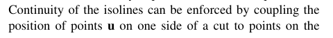

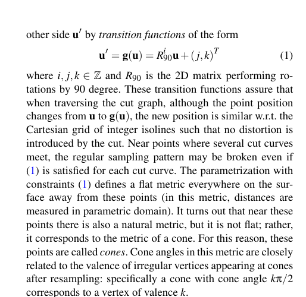

原始三角网格为M，沿割缝割开后的网格记为$M_c$，原始网格M的割缝上的一个顶点p被分为两个点p1和p2,如图中的两个绿色点

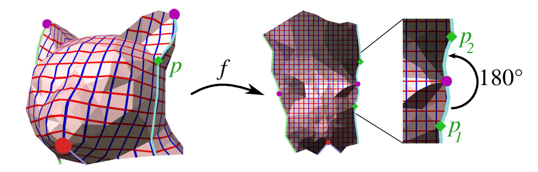

全局参数化诱导出映射的度量

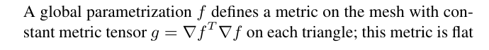

并且这个度量除了接缝的两端外也都是flat，这要求接缝在参数域种的两条像曲线是一个刚性变换(rigid transform)。反过来说，一个平展度量(flat metric)也能唯一确定参数化f

无缝全局参数化的要求

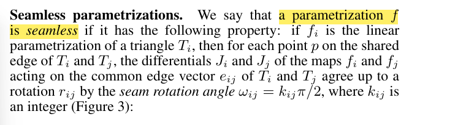

$J_j e_{ij} = r_{ij} J_ie_{ij}$,满足$\frac {\pi} 2$的整数倍旋转

,如图两个三角形Ti，Tj

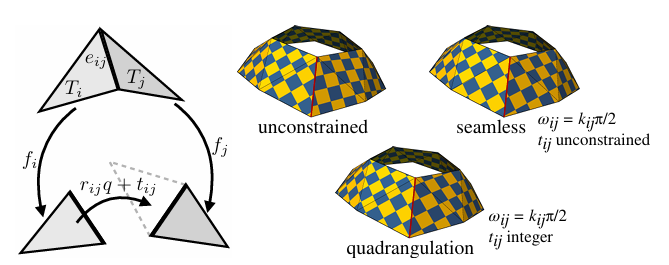

如果是需要四边形网格化，还需要$t_{ij}$是整数

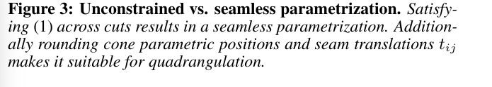

**基于标架场(cross field)诱导的四边形网格化**：让四边形网格的边与方向场中的向量相贴合，从而用户通过设计向量场从而让四边形网格的边贴合曲面的表面特征。

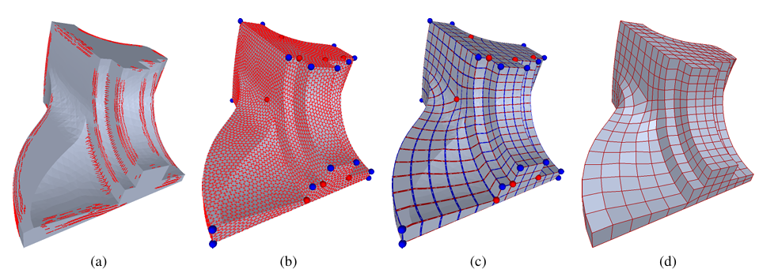

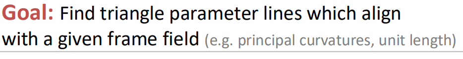

#### 全局几何的描述-向量场(Vector Field)

前面我们看到可以用Cauchy-Riemann方程以及对三角网格Jacobi矩阵的优化来得到共形映射(保角变换)，这些都是使用的是曲面局部的特性，而如果要进行全局的参数化那么就需要全局的几何，而用来描述全局几何的重要工具向量场(Vector Field)

向量场是定义在整体曲面上，由曲面的几何和拓扑所决定，所以是描述曲面全局几何的重要工具

动物身上包裹的毛发可以认为是一种向量场，每个人的头发就构成了一个向量场，这个向量场是因人而异的，有的人头上有发旋而有的人头上却没有。

地球上风的分布也是一个向量场，可以用于天气的仿真与预测

下节我们将介绍最基础的向量场-主曲率场

前面我们看到用来表达三维物体几何的三角形网格，不过三角网格是不规则的，

想象你站在操场上，手里握着一支箭头朝上的铅笔。沿着直线往前走，铅笔方向始终不变——这是平面上的平行移动，简单到不值一提。但如果换成球面呢？从赤道出发，铅笔箭头指向北方，沿着赤道走一圈回到起点，你会惊掉下巴：**铅笔箭头竟然歪了！** 它不再指向正北，而是悄悄转了一个角度。

这就是弯曲空间的“平行移动”：**向量在曲面上移动时，必须时刻“贴着”曲面，像被曲面的“地形”推着改变方向**。数学上，它的定义藏在“协变导数”里——简单说，就是让向量在移动中“不偏离”曲面的切平面，同时方向变化率为零。你可以把曲面想象成一块弹性布，向量移动时就像被布的褶皱“引导”，既不能“飞起来”，也不能“陷下去”，只能乖乖跟着曲面的“脾气”走。

为什么要折腾这个？因为它是打开弯曲空间的钥匙。比如地球磁场，磁力线在地表的分布就是一种平行移动的结果；再比如手机陀螺仪，它通过感知角速度来校正方向，本质上是在计算三维空间中的平行移动误差。下次玩体感游戏时，别忘了你正在和微分几何“贴贴”！

### 向量场的联络(Connection)

**平行移动(Parallel Transport)**即向量场中的向量从一个点到另外一个点的移动同时保持与某个标准参考系的角度，在平面上的平行移动是简单的，直接将一个向量从一个点滑向另外一个点即可。而对于曲面的情况就复杂了，因为我们根本无法定义一个全局一致的参考系，向量的方向会随着移动地进行发生完全的偏转。

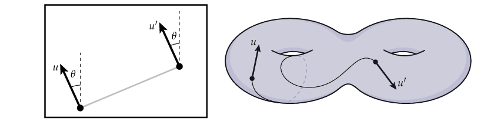

可以想象一个人在地球表面上沿着某条经线向北走，当过了北极点后其前进的方向就完全相反了。

从更加本质的角度进行思考，我们可以用映射的方式来推广“平行”的概念，定义一个特殊的映射”平行移动映射“Ppq,从p的切空间TpM到q的切空间TqM，如果两个向量X\inTpM与Y\in TqM是"平行的"，当且仅当Y = Ppq(X)。这样从逻辑上解决了没有全局一致坐标系的问题，虽然看起来要建立这样一个映射会很繁琐。

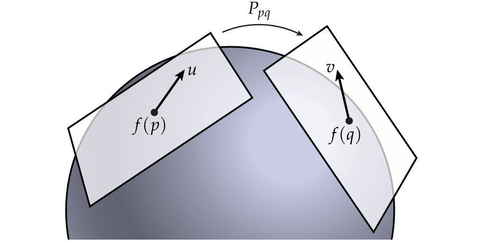

由于相邻点(如图中的p,q)上的向量是定义在各自切空间上的有各自的坐标系，所以要比较这两个向量需要先将两个切空间对齐(即建立平行移动映射)，然后再进行对比确定向量场的向量如何进行传播即**”联络(Connections)“**。可以认为平行移动是曲面(空间)本身的概念，而联络是向量场自己的特性。

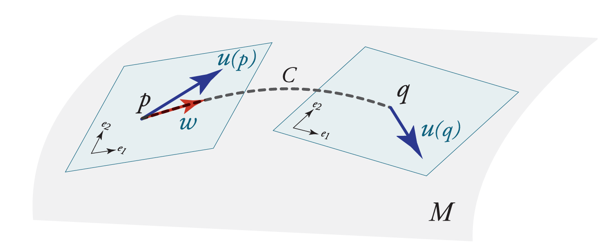

对于离散三角网格上的向量场这个过程可以是简单直观的，先将相邻三角面展平到一个平面上然后平移向量，再将平移后的向量旋转一个小角度$\theta_{ij}$，最后再沿着公共边折回去。

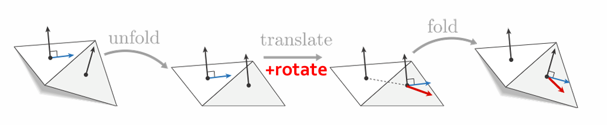

如果是**”只移动不旋转(just translate;don't rotate)“**，即旋转角度$\theta_{ij} = 0$移动过程中LC联络尽可能不扭转(twist)向量的方向，这种特殊联络称为**LC联络(The Levi-Civita Connection)**

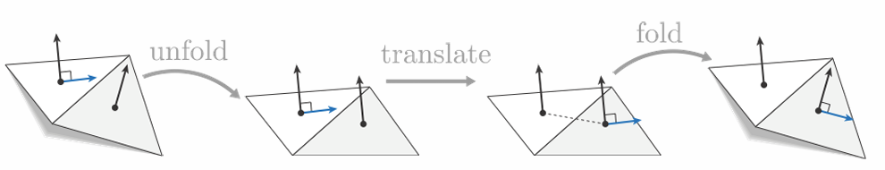

### 和乐(holonomy)

假设有某个联络每跨过一条边时向量逆时针旋转18°，那么转过一圈图中的环路(跨过5条边)后将逆时针旋转5x18°=90°，这样向量场中的方向就出现了二义性，所以定义**和乐(holonomy)**为绕环路旋转一周后角度的偏移值。

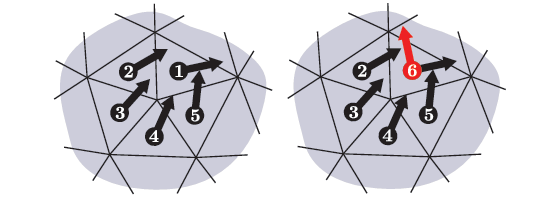

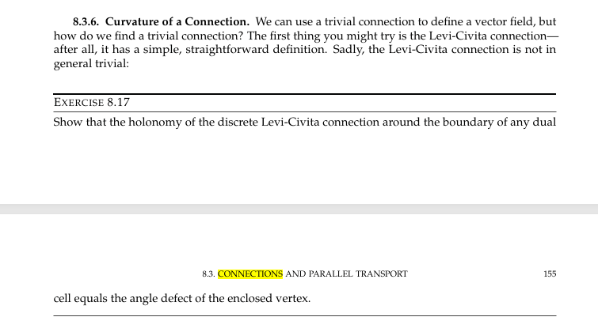

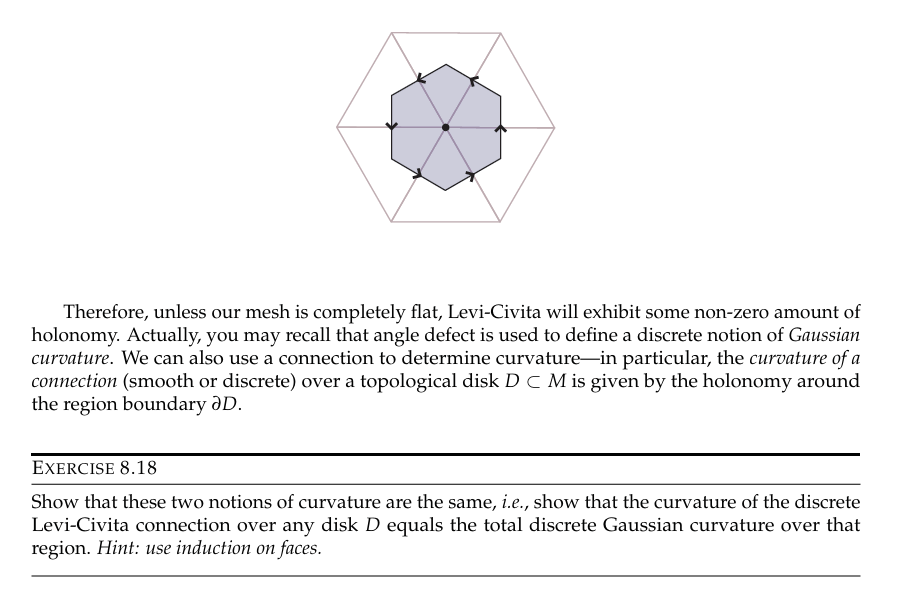

确定了向量场的联络后，那么我们只要一开始确定几个初始向量就可以将其”传播“到整个曲面向量场中(联络确定了如何将向量转移到相邻区域然后迭代进行)

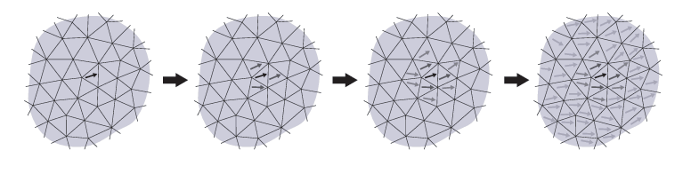

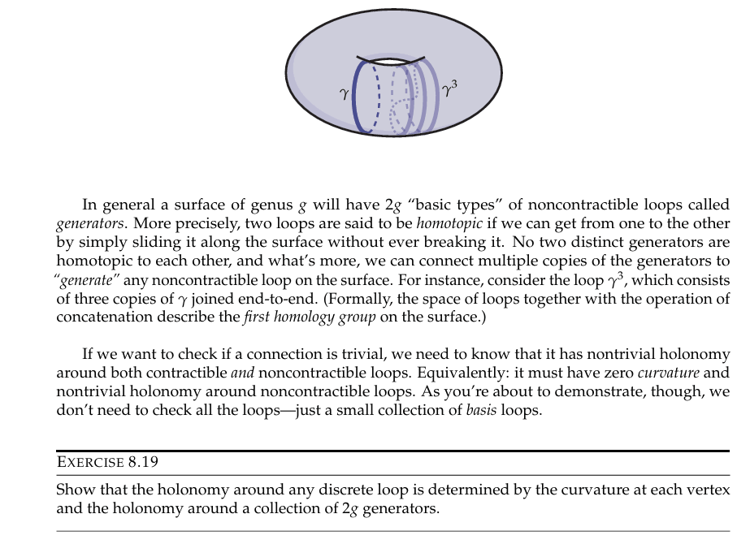

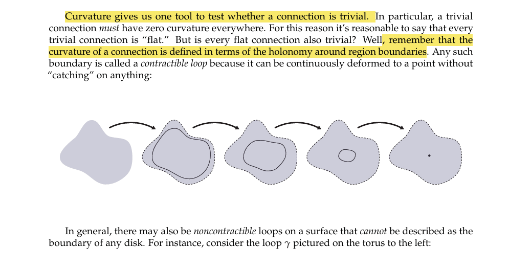

### 向量场的拓扑

向量场中某个点的指标(Index)是指向量沿着一条路径绕其一周后，向量改变的角度

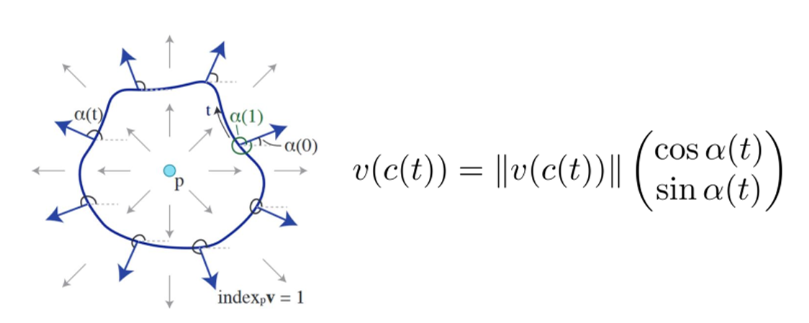

一些常见的指标

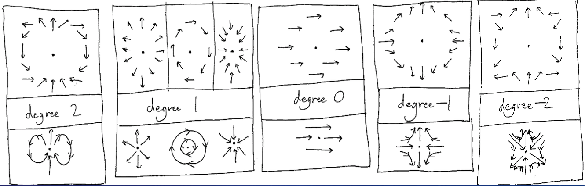

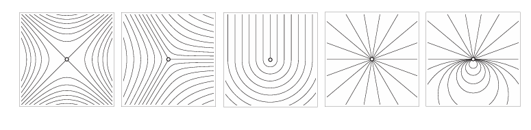

容易看到指标为0的点是平凡的点，奇异点(Singularity)是指标不为0的点。向量场的拓扑是由其上奇异点的分布决定的。

**指标定理**指出，曲面上所有奇异点的指标之和等于其欧拉示性数

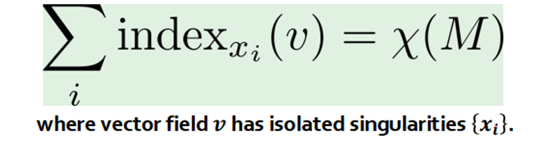

所以我们看到只要规定了向量场的联络以及其上的奇异点就可以确定整个向量场

对LC的进一步解释

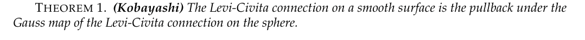

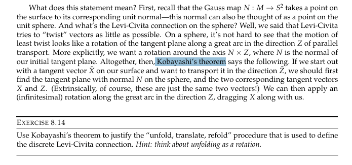

**向量场的分类**

按照向量场上的点搭载向量的不同，可以如下分类，后面会看到，其中标架场**cross  field(4-Rosy field)**将用于诱导生成全局参数化和四边形网格化

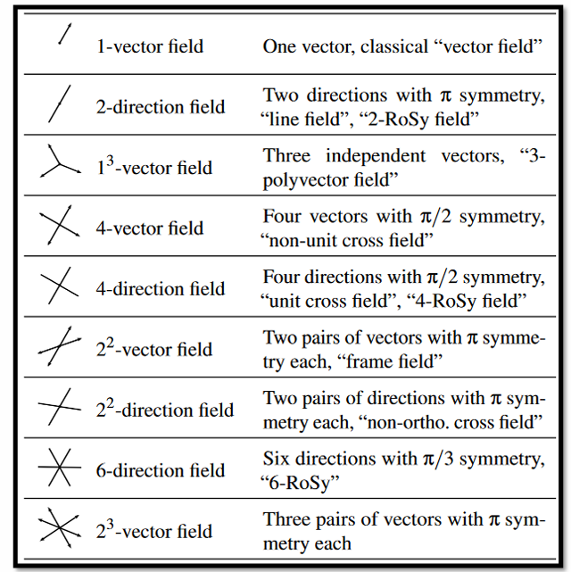

**向量场的表示**

基于角度

基于复数

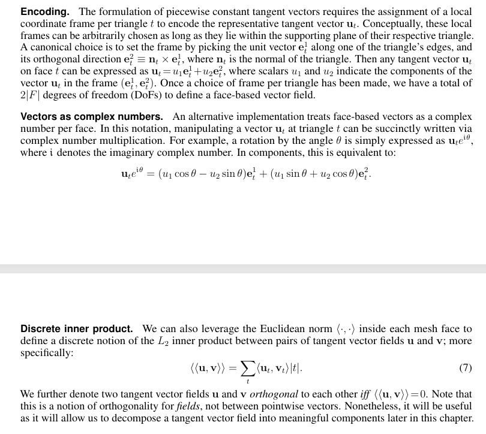

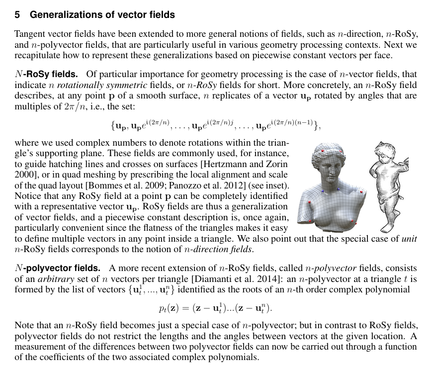

Period Jump

方向导数

协变导数

### 衡量四边形网格的质量

