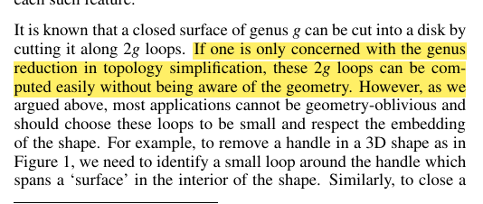
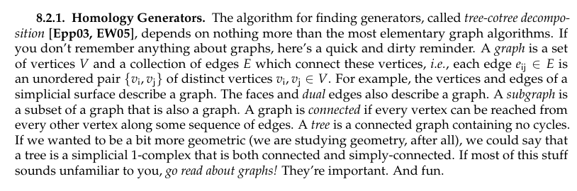
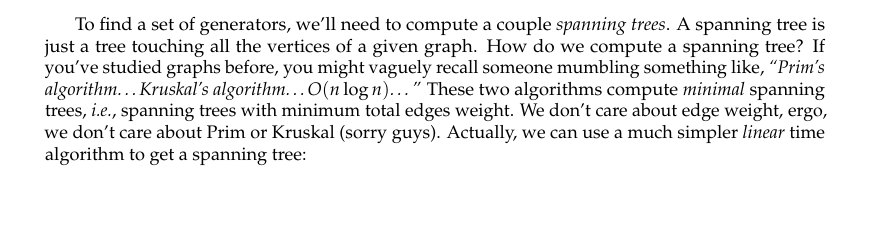
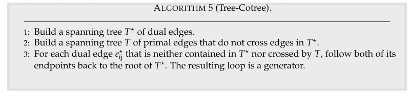
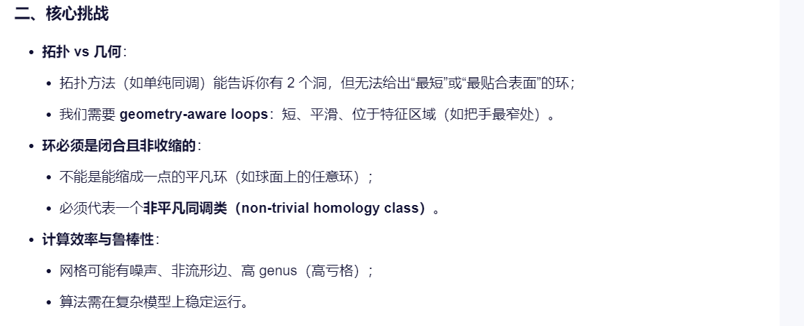
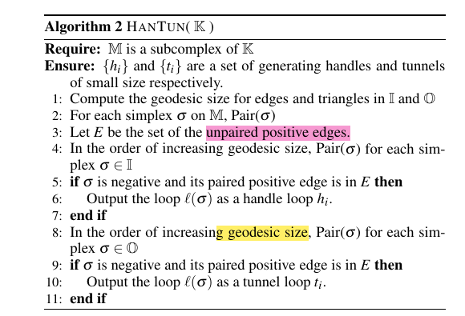

## 一、单纯复形：拓扑的"乐高积木"

### 1.1 基本概念

在拓扑学家的眼里，世界是由**橡皮泥**构成的。他们只关心物体在连续变形下保持不变的性质——比如，一个咖啡杯和一个甜甜圈，在拓扑上是"一样"的，因为它们都只有一个洞。

### 1.2 三角形网格与单纯复形（Simplicial Complex）

> **核心思想：用代数来捕捉几何的"洞"**

我们需要把几何对象"拆解"成简单的基本零件。这些零件就是**单形（Simplex）**：
- **0维单形**：一个点
- **1维单形**：一条线段
- **2维单形**：一个三角形
- **3维单形**：一个四面体

把这些单形按照规则"粘"在一起，就形成了一个**复形（Complex）**。你可以把它想象成一个用三角形（或更高维的单形）拼接起来的模型，就像3D建模中的网格。

> 任何"足够好"的拓扑空间（比如我们生活的三维空间中的物体形状），都可以用单纯复形来逼近和研究。把连续的空间离散化，用有限的、可计算的数据去捕捉无限复杂的拓扑信息，这就是其威力所在。

---

## 二、链群：研究拓扑的代数工具

### 2.1 边界算子：捕捉形状的轮廓

> **∂（边界算子）——最核心的拓扑操作**

有了这些"零件"（链），我们如何研究"洞"呢？需要一个关键操作：**边界算子**，记作 **∂**。

#### 边界算子的定义

| 对象 | 边界 ∂ |
|:---|:---|
| 一条线段 | 线段的终点 - 线段的起点 |
| 一个三角形 | 组成三角形的三条边的和（注意定向） |
| 一个四面体 | 组成四面体的四个三角形的和 |

更一般地，边界算子把一个 **k维单形**，映射到它的所有 **(k-1)维面的和（带定向）：

$$\partial: C_k \to C_{k-1}$$

并且，它可以线性地扩展到整个链群上：**∂: C_k → C_{k-1}**。

#### 边界算子的魔法性质

> **做两次边界，你总会得到零！**

$$\partial \circ \partial = 0$$

**直观解释**：想象一个三角形的边界是三条有向边。你再对这三条边分别求边界，每条边的边界是它的两个端点，但每个顶点都会被相邻的边以"一正一负"的方式各计算一次，最终全部抵消，结果为零。

写成公式就是：

$$\forall c \in C_k, \quad \partial(\partial(c)) = 0$$

这个性质是**同调理论的基石**！

---

### 2.2 链群：自由阿贝尔群

每个维度的链，在加法运算下，都构成一个**自由阿贝尔群**（粗略理解为系数为整数的线性组合构成的群）：

$$C_k = \{ \sum_i n_i \sigma_i \mid n_i \in \mathbb{Z} \}$$

其中 $\sigma_i$ 是 k维单形，$n_i$ 是整数系数。

**各维度链的含义**：
- **0维链**：顶点的形式线性组合（系数可以是整数）
- **1维链**：所有边的形式线性组合
- **2维链**：所有三角形的形式线性组合

---

### 2.3 闭链与边缘链

> **关键区分：洞在哪里？**

有了链群和边界算子，我们就可以定义两类重要的链：

#### 闭链（Cycle）

> **如果一个 k 维链 c，满足 ∂(c) = 0，我们就称 c 为一个闭链。** 它像是"没有边界"的图形。

**例子**：
- 一个三角形的边界（三条边组成的链）**不是**闭链，因为它有边界（三个顶点）
- 但是，**一个闭合环路上的所有边之和**，就是一个1维闭链

#### 边缘链（Boundary Chain）

> **如果一个 k 维链 c，可以表示为某个 (k+1) 维链的边界，即存在 d 使得 c = ∂(d)，那么 c 就是一个边缘链。**

**性质**：边缘链一定是闭链（因为 ∂∘∂ = 0）。

#### **"洞"在哪里？**

> **"洞"就出现在那些是闭链、但不是边缘链的链条中！**

一个闭合环路（闭链），如果它不能成为某个"面"（2维链）的边界，那就说明这个环路包围着一个"空洞"。

---

## 三、同调群：聆听空间的"空洞之声"

> **同调群：系统化地识别和计数这些"无法缩成一点的圈"的数学工具。它不关心空间的具体形状是圆是方，只关心一个核心问题：空间里有多少个"洞"？**

### 3.1 同调群的定义

让我们暂时忘掉公式，来一场思想实验。假设你是一只生活在二维曲面上的蚂蚁。

**思想实验**：
- 如果你在一个球面上，画任何一个闭合圈，都可以在不离开球面的情况下，把这个圈缩成一个点。球面没有"洞"。
- 但如果你在一个甜甜圈（环面）上，画一个绕着中心孔的圈，你会发现，无论如何也无法在不撕破曲面的情况下把这个圈缩成一个点。这个圈"卡"在了洞里。甜甜圈有一个"洞"。

**同调群的定义**：
> **第 k 维同调群 H_k = Ker(∂_k) / Im(∂_{k+1})**

> **第 k 维同调群 = （第 k 维闭链群） / （第 k 维边缘链群）**

这个商群中的每一个元素（等价类），就代表了一种特定类型的"k维洞"。群的秩（自由部分的维度），就是对应维度"洞"的个数。

### 3.2 同调群的具体含义

| 同调群 | 含义 | 例子 |
|:---|:---|:---|
| **H₀** | 衡量连通分支的数量 | 有几个"碎片" |
| **H₁** | 衡量一维"洞"或"环状洞"的个数 | 像甜甜圈中心那样的"隧道洞" |
| **H₂** | 衡量二维"空洞"或"腔体"的个数 | 像空心球内部的"腔体" |

**贝蒂数（Betti Number）**的例子：
- H₀的秩：连通分支的个数
- H₁的秩："一维洞"或"环状洞"的个数。对于球面是0，对于轮胎面（甜甜圈）是1，对于双环面是2
- H₂的秩："二维洞"或"空洞"的个数。对于球面是1（它包围着一个三维的空洞），对于轮胎面是0（它的"内部"不是空洞，因为中心有实体）

### 3.3 同调群的强大性质

> **同调群是一个强大的不变量。如果两个空间拓扑等价（同胚），那么它们的同调群必然同构。**

虽然反之不一定成立，但这足以区分绝大多数常见的形状。

---

## 四、上同调：当函数成为探测空间的尺子

### 4.1 直观理解

如果同调是"**由内向外**"地探测空间，那么**上同调**就是"**由外向内**"的观察。

**温度场比喻**：
> 想象在曲面上有一个温度场。你沿着一个小环路走一圈，测量温度的变化。如果回到起点时，温度累积的变化为零，那么这个温度场可能是某个更简单势场的梯度（比如高度场）。如果不是零，那就说明这个温度场本身有"漩涡"，无法由一个全局势函数导出。

### 4.2 上同调的核心思想

> **上同调群，本质上是在研究"全局函数与局部微分之间存在的障碍"。** 这些障碍，恰恰也反映了空间的拓扑性质。

> **对于单纯复形这类好的空间，上同调群与同调群包含了完全相同的拓扑信息——它们是一枚硬币的两面。**

### 4.3 De Rham 上同调

用同调群来表征曲面的拓扑性质。同调群的基底是曲面上的一组闭曲线，可以变形为曲面上任意的其他闭曲线。我们可以沿着同调群割开曲面后，可以将其展开为一个拓扑圆盘，这个拓扑圆盘也叫做这个曲面的**基本域（Fundamental Domain）**。

曲面的亏格为 g，则这组基底的个数为 2g，我们设为 $\{e_1, e_2, \ldots, e_{2g}\}$。

---

## 五、二维闭曲面的终极分类

> **掌握了同调与上同调这两把利器，数学家完成了拓扑学的一项里程碑式成就：完全分类所有紧致、连通的二维闭曲面。**

### 5.1 什么是二维闭曲面？

二维闭曲面就是**没有边界、有限大小**的曲面。球面、甜甜圈、双柄茶杯的表面都是。

### 5.2 分类定理

> **结论优美得令人窒息：任何这样的曲面，都只由两个基本不变量决定：可定向性，和亏格（或欧拉示性数）。**

#### 可定向曲面

**可定向曲面**，就是像球面、环面这样有内外之分的曲面。它们的标准模型是"带 g 个把手的球面"，g 就是**亏格**，直观理解就是洞的个数。

**同调群一目了然**：
$$H_0 = \mathbb{Z} \quad (\text{一个连通分支})$$

$$H_1 = \mathbb{Z}^{2g} \quad (\text{有 2g 个独立的"圈"})$$

$$H_2 = \mathbb{Z} \quad (\text{可定向，有一个"内部"})$$

#### 不可定向曲面

**不可定向曲面**，最著名的就是**莫比乌斯带**——但莫比乌斯带有边界。封闭的不可定向曲面包括**射影平面**和**克莱因瓶**。它们没有内外之分。任何不可定向曲面，都可以由球面上粘合若干个射影平面得到。

### 5.3 分类定理的意义

这个分类定理的意义何在？它告诉我们，在二维世界里，看似无限多样的曲面，其本质类型是**可数的、清晰的**。就像化学中的元素周期表，它为复杂的自然界提供了简洁的基本单元。这是数学追求统一与简洁之美的典范。

---

## 六、Tree-Cotree 算法

### 6.1 算法流程

Tree-Cotree 是计算曲面的同调基底的经典算法。

> **Tree-Cotree 将同调基底（割缝）显式地构造出来，为全局参数化和四边形网格化提供拓扑基础。**

---

## 七、持续同调（Persistent Homology）

在数据科学中，我们经常面对高维空间中的点云。这些点背后可能隐藏着复杂的形状。**持续同调**是TDA的核心工具。它通过逐渐增大“连接半径”，观察同调群（尤其是H₀, H₁）的诞生与消亡，来捕捉数据在不同尺度下的拓扑特征。比如，一群点的分布可能形成一个环形结构，通过计算H₁，我们可以发现这个“环”，即使数据点非常稀疏、噪声很大。这在天体物理学、生物信息学、材料科学中有广泛应用，用于发现数据中的**隐藏结构和模式**。

> **持续同调：从多尺度角度研究拓扑结构。**

持续同调是一种强大的拓扑分析工具，它不局限于单一尺度的同调计算，而是研究拓扑特征在不同分辨率下的"出生"和"消亡"过程。这使得我们能够：
1. 识别不同尺度的拓扑特征
2. 量化拓扑特征的重要性
3. 处理噪声数据

在参数化和网格处理中，持续同调可以用于：
- 自动选择合适的割缝位置
- 分析网格的拓扑稳定性
- 指导特征提取

---

## 总结

| 概念 | 核心作用 |
|:---|:---|
| **单纯复形** | 离散表示几何空间 |
| **链群 C_k** | 基本的代数结构 |
| **边界算子 ∂** | 核心操作，∂∘∂=0 |
| **同调群 H_k** | 计数"k维洞"的个数 |
| **上同调** | 研究函数障碍，与同调同构 |
| **Tree-Cotree** | 构造同调基底的实用算法 |
| **持续同调** | 多尺度拓扑分析 |

> **核心洞察**：代数拓扑将连续的几何问题转化为离散的代数问题，用链、边界算子、商群等工具，精确地捕捉空间的拓扑本质。这是参数化和网格处理中不可或缺的数学基础。
