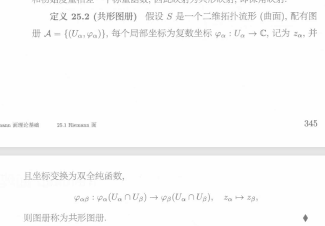
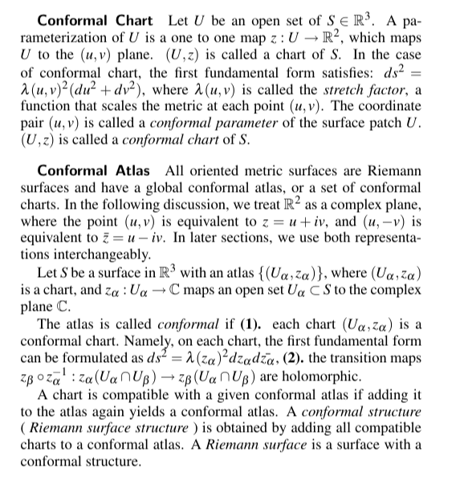
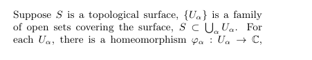
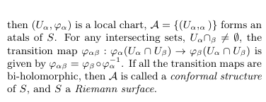
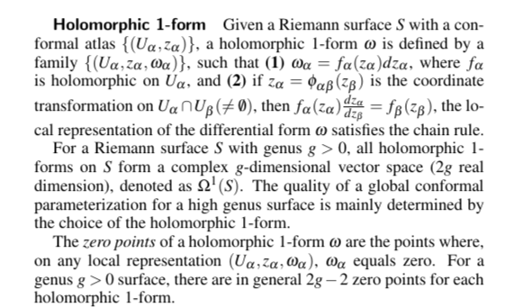

## 一、共形图册（Conformal Atlas）

### 1.1 图册的定义

要定义曲面上的分析结构，我们需要一种"局部坐标覆盖"的工具——**图册（Atlas）**。

设 $S$ 是一张光滑曲面。一个**图册** $\mathcal{A}$ 由一组**坐标卡（Chart）** 组成：

$$\mathcal{A} = \{(U_\alpha, \phi_\alpha)\}_{\alpha \in I}$$

其中：
- $U_\alpha \subset S$ 是曲面的**开覆盖**（即 $\bigcup_\alpha U_\alpha = S$）
- $\phi_\alpha : U_\alpha \to \mathbb{C}$（或 $\mathbb{R}^2$）是一个**同胚映射**，称为**坐标映射**或**参数化**

> **直观理解**：坐标卡就像是在曲面局部贴上的"地图"。每个 $U_\alpha$ 是曲面的一小块区域，$\phi_\alpha$ 把它展开到平面上。图册就是一组这样的局部地图的集合。

### 1.2 过渡函数与相容性

当两个坐标卡 $(U_\alpha, \phi_\alpha)$ 和 $(U_\beta, \phi_\beta)$ 的区域有重叠时（即 $U_\alpha \cap U_\beta \neq \emptyset$），我们可以定义**过渡函数（Transition Function）**：

$$\phi_{\beta\alpha} = \phi_\beta \circ \phi_\alpha^{-1} : \phi_\alpha(U_\alpha \cap U_\beta) \to \phi_\beta(U_\alpha \cap U_\beta)$$

> **过渡函数描述了在两个不同"地图"之间如何切换坐标。**

### 1.3 共形图册的定义

**共形图册**要求所有过渡函数都是**共形映射**（即全纯函数，或等价地，保持角度的映射）：

$$\phi_{\beta\alpha} : \phi_\alpha(U_\alpha \cap U_\beta) \to \phi_\beta(U_\alpha \cap U_\beta) \quad \text{是共形映射}$$

> **等价条件**：过渡函数满足**Cauchy-Riemann方程**，即它是全纯的（或反全纯的）。

**直观理解**：共形图册保证，无论你使用哪张"局部地图"来观察曲面，不同地图之间的"拼接"都是角度保持的。这意味着曲面上有一种内在的、不依赖于坐标系选择的"角度概念"。

---

## 二、共形结构与 Riemann Surface 的定义

### 2.1 共形结构

> **共形结构**定义了曲面上"角度"的一致性。

设曲面 $S$ 上有两个共形图册 $\mathcal{A}$ 和 $\mathcal{A}'$。如果 $\mathcal{A} \cup \mathcal{A}'$ 仍然是一个共形图册（即新加入的坐标卡与原有的所有坐标卡都共形相容），则称 $\mathcal{A}$ 和 $\mathcal{A}'$ 是**共形相容**的。

**共形结构**就是一个**共形相容类的极大共形图册**：

$$\text{共形结构} = \text{某个极大共形图册 } \overline{\mathcal{A}}$$

> **关键点**：
> - 共形结构只关心角度，不关心距离
> - 同一张曲面上可以有不同的共形结构
> - 共形结构确定了曲面的"共形等价类"

### 2.2 Riemann Surface 的定义

> **Riemann Surface = 带有共形结构的连通一维复流形**

**定义**：一个 **Riemann 面** $(S, \mathcal{A})$ 由以下部分组成：
1. 一个**连通的二维流形** $S$（通常是定向的）
2. 一个定义在 $S$ 上的**共形结构** $\mathcal{A}$

**等价定义**：Riemann 面就是一张配备了共形图册的曲面，其过渡函数都是全纯（或反全纯）的。

### 2.3 Riemann 面的例子

| Riemann 面 | 说明 |
|:---|:---|
| **复平面** $\mathbb{C}$ | 单个坐标卡就覆盖，最简单的 Riemann 面 |
| **单位圆盘** $\mathbb{D}$ | 黎曼映射定理的"标准域" |
| **黎曼球面** $\hat{\mathbb{C}} = \mathbb{C} \cup \{\infty\}$ | 用两个坐标卡（北极和南极）覆盖 |
| **环面** $\mathbb{C}/\Lambda$ | 复平面模掉一个格的商空间 |
| **超椭圆曲线** $y^2 = p(z)$ | 代数几何中重要的 Riemann 面 |

---

## 三、黎曼度量与等温坐标

### 3.1 黎曼度量

**黎曼度量** $g$ 是在曲面的每一点的切空间上定义的一个**正定二次型**。在局部坐标 $(u,v)$ 下，黎曼度量可以写成：

$$g = E \, du^2 + 2F \, du \, dv + G \, dv^2$$

其中 $E, F, G$ 是 $(u,v)$ 的函数，满足：
- $E > 0, \, G > 0$
- $EG - F^2 > 0$

> **黎曼度量使我们能够在曲面上定义长度、角度和面积。**

### 3.2 等温坐标

> **等温坐标是黎曼面的核心——它将共形结构与度量联系起来。**

**定义**：如果黎曼度量在局部坐标 $(u,v)$ 下满足 $E = G$ 且 $F = 0$，即：

$$g = \lambda(u,v)^2 (du^2 + dv^2)$$

其中 $\lambda(u,v) > 0$ 是一个正函数，称为**共形因子（Conformal Factor）**，则称 $(u,v)$ 为**等温坐标**。

> **在等温坐标下，度量的矩阵表示为对角矩阵，这意味着两个方向上的"缩放"是相同的——正是共形映射的特征。**

### 3.3 等温坐标的存在性

**关键定理**：在任何二维黎曼流形上，等温坐标**局部存在**。

更具体地：

> **在曲面的每一点附近，都存在一组局部坐标 $(u,v)$，使得黎曼度量在该坐标下取对角形式 $g = \lambda^2(du^2 + dv^2)$。**

这个定理的证明通常使用**PDE 方法**（求解 Beltrami 方程）或**移动标架法**。

### 3.4 共形因子的变换

如果通过共形因子 $e^{2u}$ 变换度量：

$$\tilde{g} = e^{2u} g$$

则新旧度量的高斯曲率满足 **Yamabe 方程**：

$$\Delta u = e^{2u} \tilde{K} - K$$

其中 $K$ 是原曲面的高斯曲率，$\tilde{K}$ 是新曲面的高斯曲率。

> **这说明：通过调整共形因子，我们可以控制曲面的曲率。这正是离散 Ricci 流的理论基础。**

---

## 四、微分 1-形式

### 4.1 定义

> **微分 1-形式是"函数的微分"的推广，是曲面上最基础的可积对象。**

设 $S$ 是一张光滑曲面。$S$ 上的一个**微分 1-形式** $\omega$，在局部坐标 $(x, y)$ 下可以表示为：

$$\omega = a(x,y) \, dx + b(x,y) \, dy$$

其中 $a, b$ 是 $(x,y)$ 的光滑函数。

### 4.2 微分 1-形式的运算

#### 外微分（Exterior Derivative）

对 0-形式（即函数 $f$），外微分就是普通的全微分：

$$df = \frac{\partial f}{\partial x} dx + \frac{\partial f}{\partial y} dy$$

对 1-形式 $\omega = a \, dx + b \, dy$，外微分得到一个 2-形式：

$$d\omega = \left(\frac{\partial b}{\partial x} - \frac{\partial a}{\partial y}\right) dx \wedge dy$$

#### 积分

1-形式沿着曲线 $\gamma$ 的**线积分**：

$$\int_\gamma \omega = \int_\gamma (a \, dx + b \, dy)$$

如果 $\omega = df$（即 $\omega$ 是某个函数 $f$ 的全微分），则由微积分基本定理：

$$\int_\gamma df = f(\gamma(1)) - f(\gamma(0))$$

### 4.3 闭形式与恰当形式

> **这是同调论在分析中的体现**

- **闭形式（Closed Form）**：满足 $d\omega = 0$ 的 1-形式
- **恰当形式（Exact Form）**：可以写成 $df$ 形式的 1-形式

**核心关系**：恰当形式一定是闭形式（因为 $d \circ d = 0$），但闭形式不一定是恰当形式。

$$\text{恰当形式} \subset \text{闭形式}$$

> **差集**（闭形式但不是恰当形式的那些形式）恰好反映了曲面的**拓扑**——即"洞"的存在！这与同调群 H₁ 的定义完全对应。

### 4.4 调和 1-形式

> **调和 1-形式是 Riemann 面上的"完美"微分形式**

**定义**：如果 1-形式 $\omega$ 同时是闭的和上闭的（即 $d\omega = 0$ 且 $d^*\omega = 0$），则称 $\omega$ 为**调和 1-形式**。

**关键定理**：在紧致 Riemann 面上，调和 1-形式的空间与第一同调群有深刻的联系：

$$\dim H^1_{\text{dR}}(S) = 2g$$

其中 $g$ 是曲面的亏格。这意味着亏格为 $g$ 的 Riemann 面上有 $2g$ 个线性无关的调和 1-形式。

> **调和 1-形式在全局参数化中有重要应用**——它们可以用来构造割缝，从而将高亏格曲面展开为拓扑圆盘。

---

## 五、总结

| 概念 | 核心作用 | 与参数化的关系 |
|:---|:---|:---|
| **共形图册** | 局部坐标覆盖 + 共形过渡函数 | 参数化的数学基础 |
| **共形结构** | 角度的一致定义 | 保证参数化的共形性 |
| **Riemann 面** | 共形结构的载体 | 参数化问题的理论框架 |
| **黎曼度量** | 定义长度、角度、面积 | 需要被"展平"的对象 |
| **等温坐标** | 使度量对角化的局部坐标 | 共形参数化的核心工具 |
| **共形因子** | 度量缩放函数 | 通过调整来实现展平 |
| **微分 1-形式** | 曲面上的可积对象 | 构造割缝的工具 |
| **调和 1-形式** | 闭 + 上闭 | 确定同调基底 |

> **核心洞察**：黎曼面的理论告诉我们，任何曲面都可以赋予共形结构，而等温坐标保证了共形参数化的存在性。通过共形因子变换度量（Yamabe 方程 / Ricci 流），我们可以将曲面"展平"到平面上。这就是全局参数化的理论基础。
