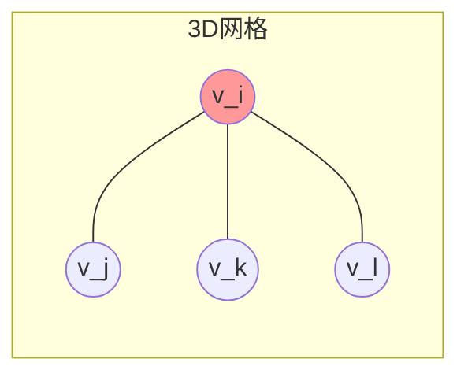
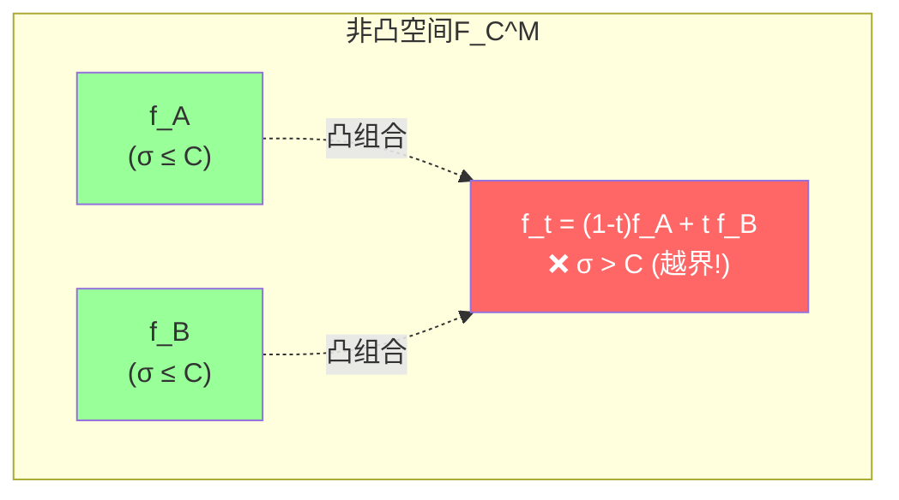
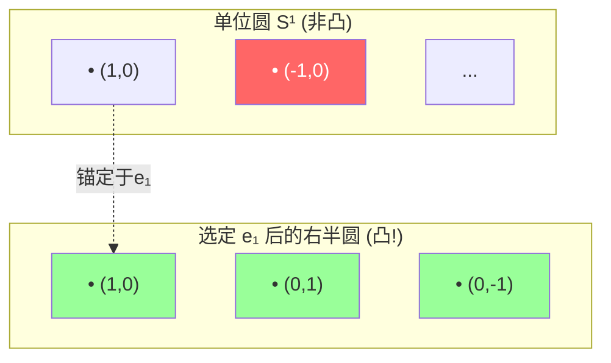
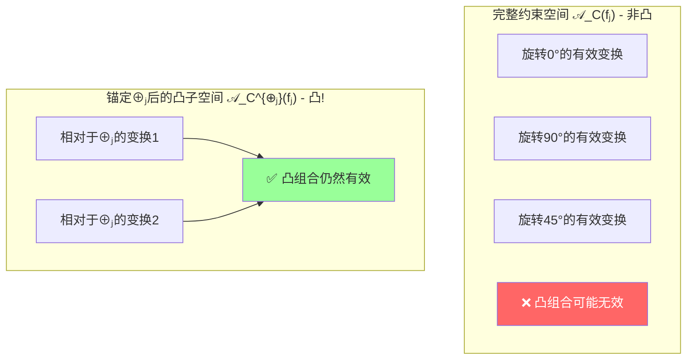
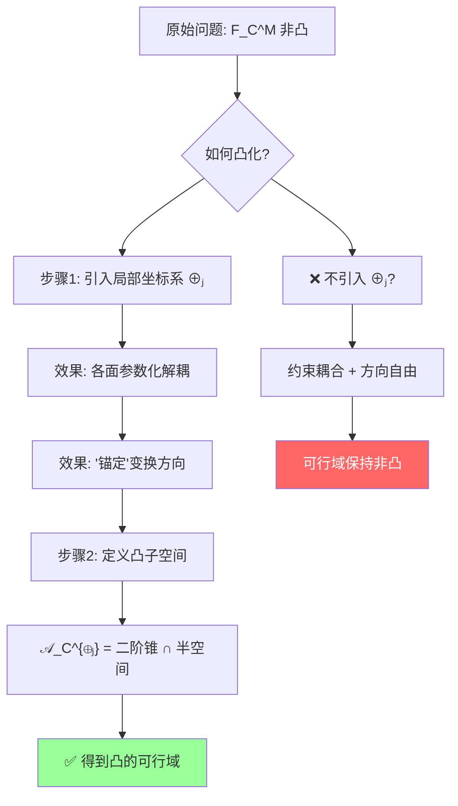

本文主要讲解的是如何控制三角网格(Mesh)上的分片线性映射$f$的共形扭曲(记为$\sigma$),并且同时确保$f$的局部单射性质，这个方法本身不是参数化方法而是对一般参数化方法(LSCM,ARAP等)进行加强。

### 对函数空间进行凸化

三角网格上$M = (V,F,E)$定义的映射可以认为是分片连续线性的（CPL continous Piecewise Linear ，每个三角面线性的同时，相邻两个三角面在边界保持连续）将所有这样的映射的空间定义为$F^M$ ,而我们需要的是共形扭曲$\sigma$有界的子空间

我们这样定义空间$F^M_C \subset F^M,常数C >=1,\sigma<=C$，不过麻烦的是$F^M_C $是**非凸的**，而我们要做的就是找它的最大凸子空间作为近似替代后续再进行凸优化。

我们通过在每个面上定义一个坐标加$\oplus$，从而可以简易表达出的映射空间$F^{M,\oplus}_C \subset F^M_C$

具体做法如下

1）研究使仿射变换无翻转的并且其$\sigma$不大于一个常数C(C>=1)的空间$\mathcal A_C(f_j) $

2）对其中最大凸子空间的描述 $\mathcal A^{\oplus_j}_C(f_j) \subset \mathcal A_C(f_j)$ ，其是由在每个面$f_j$上定义一个坐标架$\oplus_j$

3）对所有面$f_j \in F$ 考虑$\mathcal A^{\oplus_j}_C(f_j)$并且考虑边上的连续性的约束,从而得到映射空间$F^{M,\oplus}_C \subset F^M_C$

4）对得到的映射空间$F^{M,\oplus}_C$进行优化

#### 三角面上的仿射映射与局部坐标系

对每个三角面定义$f_j \in F $定义其上的一个局部坐标系 $\oplus_j := [o_j,e_1^j,e_2^j]$

那么对于$f_j$上的任意一点$p$，可以表示成 $p = o_j + x_1 e_1^j + x_2 e_2^j$

##### 🤔 为什么要引入局部坐标系？

这是一个非常关键的数学直觉问题。让我们深入解释**为什么要引入局部坐标系 $\oplus_j$**，以及它是如何实现凸化的。

---

###### 问题根源：为什么原始空间是非凸的？

**全局视角下的困境**

考虑三角网格上的分片线性映射 $f$，每个内部顶点 $v_i$ 被多个三角形共享：

顶点 $v_i$ 同时属于 $\triangle v_iv_jv_k$、$\triangle v_iv_kv_l$ 等多个面。当我们用**全局顶点坐标**来描述映射时：
- 每个面的 Jacobian $A_j = [u_1-u_0, u_2-u_0] \cdot [v_1-v_0, v_2-v_0]^{-1}$ 都依赖于共享顶点的位置
- **约束条件通过共享顶点相互耦合**
- 这导致整个可行域 $F^M_C$ 是**高度非凸的**

**直观理解：非凸性的来源**

假设我们有两个有效的（低扭曲）映射 $f_A$ 和 $f_B$：

$$\sigma(f_A) \leq C, \quad \sigma(f_B) \leq C$$

它们的凸组合 $f_t = (1-t)f_A + t f_B$ **通常不满足扭曲约束**：

**原因**：奇异值 $\sigma(A)$ 不是矩阵元素的线性（甚至不是凸）函数！两个低扭曲矩阵的平均可能产生高扭曲。

---

###### 引入局部坐标系的作用：解耦 + 锚定

**核心思想：逐面独立参数化**

Lipman 的做法是在每个三角面 $f_j$ 上定义**独立的局部坐标系**：

$$\oplus_j := [o_j, e_1^j, e_2^j]$$

这带来了两个关键效果：

**效果 1：参数化解耦**

| | 全局坐标系 | 局部坐标系 $\oplus_j$ |
|---|-----------|---------------------|
| 参数化变量 | 所有顶点位置 $\{u_i\}$ | 每个面独立的复数对 $(\alpha_j, \beta_j)$ |
| 面间关系 | 通过共享顶点强耦合 | **完全解耦** |
| Jacobian 表达 | $A_j$ 依赖邻居面 | $A_j$ 仅由 $(\alpha_j, \beta_j)$ 决定 |

**效果 2：提供"锚定方向"——这是凸化的关键！**

这是最微妙也最重要的点。让我们仔细看第 131 行的定义：

$$\mathcal{A}^{\oplus_j}_C(f_j) = \left\{ (\alpha, \beta, r) : \; |\alpha|^2 - |\beta|^2 \geq r > 0, \; |\beta|^2 \leq \frac{(C-1)^2}{(C+1)^2} \cdot r \right\}$$

**关键观察**：这个凸子空间的定义**显式依赖于 $\oplus_j$ 的选择**！

---

###### 几何直观：为什么"锚定"能产生凸性？

**类比：圆的非凸性与半平面的凸性**

考虑平面上所有**单位长度向量**的集合：
- 这是一个**圆** $S^1 = \{v : \|v\| = 1\}$ → **非凸**！

但如果我们**选定一个参考方向** $e_1$，然后考虑：
- 半平面 $\{v : v \cdot e_1 \geq 0\}$ 内的单位向量 → 这部分是**凸的**

**回到我们的问题**

仿射变换的约束集合 $\mathcal{A}_C(f_j)$ 就像那个"完整的圆"——**非凸的**，因为它包含围绕各种旋转方向的变换。

但一旦我们用 $\oplus_j$ **锁定了坐标架的方向**，就相当于只保留了其中**一个凸的"扇形区域"**：

**文中的图示印证**

第 135-137 行描述的正是这一思想：

> "蓝色内圆与灰色半平面是凸的，但是黄色锥的补区域却是非凸的，我们就是用**灰色区域代替黄色锥的补区域**的"

这里的"灰色区域"就是**由 $\oplus_j$ 锁定后得到的凸子空间**。

---

###### 更深层的数学解释

**为什么凸子空间是"最大"的？**

$\mathcal{A}^{\oplus_j}_C$ 被称为**最大凸子空间 (Maximal Convex Subspace)**，意味着：
1. 它是凸的 ✓
2. 你无法在不破坏凸性的前提下再扩大它

这是因为 $\oplus_j$ 的选择确定了 $(\alpha, \beta)$ 复平面上的一个**特定扇形区域**，这个区域的边界正好对应：
- 正定性边界：$|\alpha| = |\beta|$（退化/翻转）
- 扭曲上界：$|\beta|/\alpha| = (C-1)/(C+1)$

这两个边界的交集形成的区域恰好是**凸的**（二阶锥与半空间的交）。

**连续性约束如何处理？**

你可能会问：既然每面独立了，那相邻面之间的连续性怎么办？

答案在第 25 行：
> "对所有面 $f_j \in F$ 考虑 $\mathcal{A}^{\oplus_j}_C(f_j)$ 并且**考虑边上的连续性的约束**，从而得到映射空间 $F^{M,\oplus}_C$"

连续性作为**额外约束**加入优化问题，但不影响每个面内部的凸性结构。最终优化问题是：

$$\min_f E(f) \quad \text{s.t.} \quad 
\begin{cases}
(\alpha_j, \beta_j, r_j) \in \mathcal{A}_C^{\oplus_j}(f_j) & \forall j \\
\text{edge continuity constraints} & \forall \text{edges}
\end{cases}
$$

---

###### 总结

**一句话总结**：引入局部坐标系 $\oplus_j$ 的根本目的有二 —— **① 解耦**（让每个面的 Jacobian 可以独立参数化），以及更重要的 **② 锚定**（消除旋转自由度，从而将非凸的完整约束空间截断为一个**最大凸子空间**）。没有这个"锚定"，就无法得到凸的可行域，也就无法应用高效的凸优化方法。

---

我们可以定义在$f_j$上的仿射映射 $A_j : f_j \to \mathbb{R}^2$：

$$A_j(p) = \begin{pmatrix} a & b \\ c & d \end{pmatrix} (p - o_j) + t = A[p] + T$$

其中

$$A = \begin{pmatrix} a & b \\ c & d \end{pmatrix} \in \mathbb{R}^{2 \times 2}, \quad [p] = \begin{pmatrix} x_1 \\ x_2 \end{pmatrix}, \quad T = \begin{pmatrix} t_1 \\ t_2 \end{pmatrix}$$

从而就可以表达为如下的限制条件（无翻转 + 共形扭曲有界）：

$$\sigma_1(A_j) - \sigma_2(A_j) \geq 0 \tag{4.2}$$

$$\frac{\sigma_1(A_j)}{\sigma_2(A_j)} \leq C \tag{4.3}$$

**注意到**我们可以写成如下的矩阵形式，从而更方便后续的处理。将仿射映射用目标三角形与源三角形的顶点坐标表示：

$$A_j = [u_1 - u_0, \; u_2 - u_0] \cdot [v_1 - v_0, \; v_2 - v_0]^{-1}$$

其中 $v_0, v_1, v_2$ 是源三角形 $f_j$ 的三个顶点，$u_0, u_1, u_2$ 是映射后的目标顶点。

那样映射就可以表达成如下形式：

$$u_i - u_0 = A_j (v_i - v_0), \quad i = 1, 2$$

#### 复数域表示

在复数域上表达更为简洁。将仿射映射 $A_j$ 用复数表示为：

$$A_j(z) = \alpha z + \beta \bar{z} + \gamma$$

其中 $\alpha, \beta, \gamma \in \mathbb{C}$，而 $\gamma$ 是平移项（不影响 Jacobian 分析，通常忽略）。

可以求得矩阵 $A_j$ 与复数系数的关系：

$$\alpha = \frac{1}{2}\left(a + d + i(b - c)\right), \quad \beta = \frac{1}{2}\left(a - d + i(b + c)\right)$$

反过来：

$$a = \text{Re}(\alpha + \beta), \quad b = \text{Im}(\alpha + \beta), \quad c = \text{Im}(\alpha - \beta), \quad d = \text{Re}(\alpha - \beta)$$

#### 奇异值与共形扭曲

可以求得矩阵 $A_j(p)$ 的奇异值。由 $\alpha, \beta$ 的复数表示，$A_j$ 的 Jacobian 矩阵的奇异值为：

$$\sigma_1 = |\alpha| + |\beta|, \quad \sigma_2 = |\alpha| - |\beta|$$

（假设 $|\alpha| \geq |\beta|$，即无翻转。）

我们知道分片线性映射的扭曲 $\sigma$ 可以用其矩阵的奇异值表达：

$$\sigma(A_j) = \frac{\sigma_1}{\sigma_2} = \frac{|\alpha| + |\beta|}{|\alpha| - |\beta|}$$

#### 约束条件的转化

那么受限条件 (4.2)-(4.3) 就可以转化为如下形式：

$$|\alpha| - |\beta| \geq 0 \quad \text{(无翻转)} \tag{4.2'}$$

$$\frac{|\alpha| + |\beta|}{|\alpha| - |\beta|} \leq C \quad \text{(共形扭曲有界)} \tag{4.3'}$$

引入一个中间变量 $r_j \in \mathbb{R}$，令 $r_j = |\alpha|^2 - |\beta|^2 = \det(A_j)$，那么上式转为：

$$|\alpha|^2 - |\beta|^2 \geq r_j > 0$$

$$|\beta| \leq \frac{C-1}{C+1} |\alpha|$$

满足上面条件的三元组 $(\alpha, \beta, r) \in \mathbb{C} \times \mathbb{C} \times \mathbb{R}$ 构成的空间即为 $\mathcal{A}_C(f_j)$。

并注意到其最大凸子空间 $\mathcal{A}^{\oplus_j}_C(f_j) \subset \mathcal{A}_C(f_j)$：

$$\mathcal{A}^{\oplus_j}_C(f_j) = \left\{ (\alpha, \beta, r) : \; |\alpha|^2 - |\beta|^2 \geq r > 0, \; |\beta|^2 \leq \frac{(C-1)^2}{(C+1)^2} \cdot r \right\}$$

也就是如下图所示的（蓝色内圆与灰色半平面是凸的，但是黄色锥的补区域却是非凸的，我们就是用灰色区域代替黄色锥的补区域的）：

#### 凸子空间的元素

$\mathcal{A}_C^{\oplus_j}$ 是 $\mathcal{A}_C$ 的子空间，下面来看下具体 $A_C^{\oplus_j}$ 包含什么样的元素：

$$\mathcal{A}_C^{\oplus_j}(f_j) = \left\{ A_j = \begin{pmatrix} \text{Re}(\alpha+\beta) & \text{Im}(\alpha+\beta) \\ \text{Im}(\alpha-\beta) & \text{Re}(\alpha-\beta) \end{pmatrix} : (\alpha, \beta, r) \in \mathcal{A}_C^{\oplus_j} \right\}$$

#### 映射空间构造

通过在所有面上取 Union 从而构造出 $\mathcal{F}^{M,\oplus}_C \subset \mathcal{F}^M$：

$$\mathcal{F}^{M,\oplus}_C = \left\{ f \in \mathcal{F}^M : \; A_j(f) \in \mathcal{A}_C^{\oplus_j}(f_j), \; \forall f_j \in F \right\}$$

#### 双射性

可以定义 $C \geq 1$ 的保向空间 $F^+_M$：

$$F^+_M = \left\{ f \in F^M : \; \det(A_j) > 0, \; \forall f_j \in F \right\}$$

可以证明在保向空间中映射是双射的：

$$\text{若 } f \in F^+_M \cap \mathcal{F}^{M,\oplus}_C, \text{ 则 } f \text{ 是局部双射的。}$$

同时可以对上面的结论推广到多联通区域中：

$$\text{对多联通区域 } \Omega, \text{ 若 } f \in F^+_M \cap \mathcal{F}^{M,\oplus}_C, \text{ 则 } f: \Omega \to \mathbb{R}^2 \text{ 是全局双射。}$$

### 算法流程

可以用于优化平面变形（planar Morphing）和网格参数化（Parameterization）。

根据不同能量构造不同的优化式：

#### LSCM 能量

LSCM（Least Squares Conformal Maps）的离散能量为：

$$E_{LSCM}(f) = \sum_{f_j \in F} |\beta_j|^2 \cdot \text{area}(f_j)$$

即最小化每个面上的"反共形"部分 $\beta_j$。结合 Lipman 约束的优化问题为：

$$\min_{f} \; E_{LSCM}(f) \quad \text{s.t.} \quad (\alpha_j, \beta_j, r_j) \in \mathcal{A}_C^{\oplus_j}(f_j), \; \forall j$$

#### ARAP 能量

ARAP（As Rigid As Possible）的离散能量为：

$$E_{ARAP}(f) = \sum_{f_j \in F} \|A_j - R_j\|_F^2 \cdot \text{area}(f_j)$$

其中 $R_j$ 是 $A_j$ 的最近旋转矩阵（通过 SVD 或极分解求得）。结合 Lipman 约束的优化问题为：

$$\min_{f} \; E_{ARAP}(f) \quad \text{s.t.} \quad (\alpha_j, \beta_j, r_j) \in \mathcal{A}_C^{\oplus_j}(f_j), \; \forall j$$

#### 曲面展平

对于曲面展平问题，优化目标为：

$$\min_{f} \; E_{ARAP}(f) \quad \text{s.t.} \quad \sigma(A_j) \leq C, \; \forall f_j \in F$$

