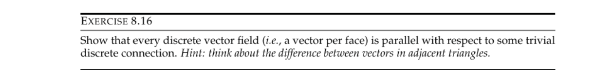

### **构建平滑的正交向量场(cross fields)**

一个正交向量场可以由赋予三角网格中每个三角面片一个角度值$\theta$,另外图中红色箭头的变动也是直观表示出了正交向量场的**period jumps**

可以将正交向量场的平滑度简单定义为相邻两个三角面的角度差值的平方和

展开可以得到

对上面的整数求导后，用前面介绍的混合整数求解器计算得到正交向量场的$\theta$以及$p_{ij}$

