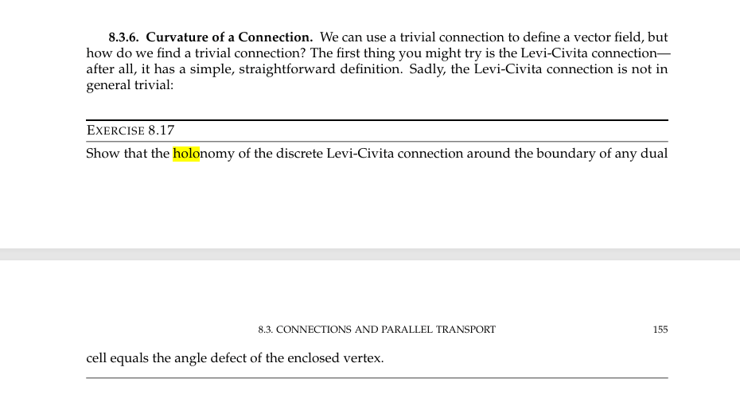
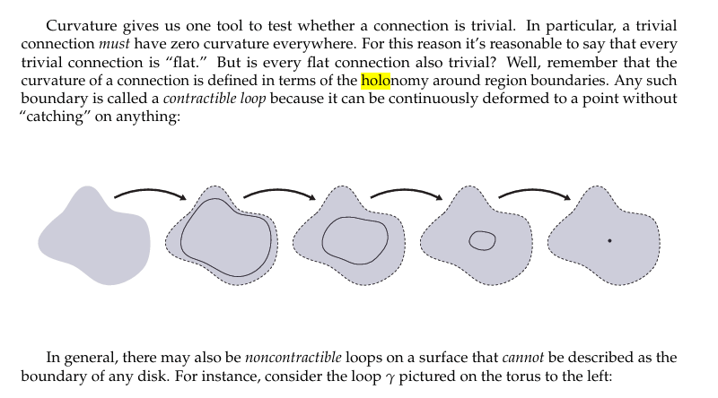
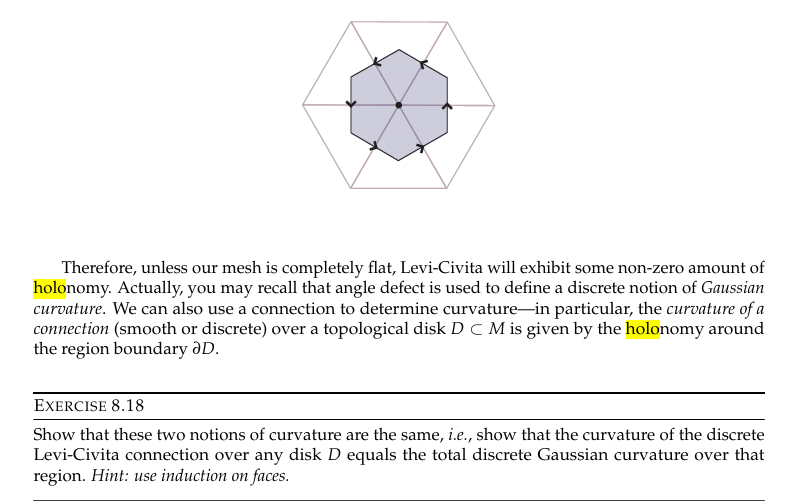

## 与曲率的关系

### 8.3.6. 联络的曲率（Curvature of a Connection）

我们可以用平凡联络来定义向量场，但**如何**找到一个平凡联络呢？你首先可能会尝试 Levi-Civita 联络——毕竟，它的定义简单直观。遗憾的是，Levi-Civita 联络**一般不是平凡的**：

> **练习 8.17**
>
> 证明：离散 Levi-Civita 联络沿**任意对偶单元边界**的**和乐（holonomy）**等于所包围顶点的**角度亏缺（angle defect）**。

---

#### 曲率与平凡性

曲率为我们提供了一个检验联络是否平凡的工具。具体而言，平凡联络**必须**处处具有零曲率。因此我们合理地称每个平凡联络为"**平坦（flat）**"联络。

但**每个平坦联络也都是平凡的吗？**

回想一下，联络的曲率是根据区域边界上的**和乐（holonomy）**来定义的。任何这样的边界都称为**可收缩环路（contractible loop）**，因为它可以连续地收缩为一个点而不会"卡住"任何东西：

一般来说，曲面上也可能存在**不可收缩环路（noncontractible loops）**，它们不能表示为任何圆盘的边界。例如，环面上的环路 $\gamma$ 就是不可收缩的。

> **关键洞察**：
> - **可收缩环路**上的和乐为零 → 该联络在这些区域上是平凡的
> - **不可收缩环路**上的和乐可能非零 → 即使曲率处处为零（平坦），联络仍可能不是平凡的
> - 因此：**平凡 ⇒ 平坦，但平坦 ⇏ 平凡**

---

因此，除非网格完全平坦，否则 Levi-Civita 联络会表现出非零的**和乐**。实际上，你可能还记得角度亏缺被用来定义离散的高斯曲率概念。我们也可以用联络来确定曲率——具体来说，拓扑圆盘 $D \subset M$ 上联络（光滑或离散）的**曲率**由区域边界 $\partial D$ 上的**和乐**给出：

> **练习 8.18**
>
> 证明这两种曲率的概念是一致的，即：证明离散 Levi-Civita 联络在任意圆盘 $D$ 上的曲率等于该区域上总的离散高斯曲率。
>
> **提示**：对面使用归纳法（use induction on faces）。

## 

## 一、共形图册（Conformal Atlas）

### 1.1 图册的定义

要定义曲面上的分析结构，我们需要一种"局部坐标覆盖"的工具——**图册（Atlas）**。

设 $S$ 是一张光滑曲面。一个**图册** $\mathcal{A}$ 由一组**坐标卡（Chart）** 组成：

$$\mathcal{A} = \{(U_\alpha, \phi_\alpha)\}_{\alpha \in I}$$

其中：

- $U_\alpha \subset S$ 是曲面的**开覆盖**（即 $\bigcup_\alpha U_\alpha = S$）
- $\phi_\alpha : U_\alpha \to \mathbb{C}$（或 $\mathbb{R}^2$）是一个**同胚映射**，称为**坐标映射**或**参数化**

> **直观理解**：坐标卡就像是在曲面局部贴上的"地图"。每个 $U_\alpha$ 是曲面的一小块区域，$\phi_\alpha$ 把它展开到平面上。图册就是一组这样的局部地图的集合。

### 1.2 过渡函数与相容性

当两个坐标卡 $(U_\alpha, \phi_\alpha)$ 和 $(U_\beta, \phi_\beta)$ 的区域有重叠时（即 $U_\alpha \cap U_\beta \neq \emptyset$），我们可以定义**过渡函数（Transition Function）**：

$$\phi_{\beta\alpha} = \phi_\beta \circ \phi_\alpha^{-1} : \phi_\alpha(U_\alpha \cap U_\beta) \to \phi_\beta(U_\alpha \cap U_\beta)$$

> **过渡函数描述了在两个不同"地图"之间如何切换坐标。**

### 1.3 共形图册的定义

**共形图册**要求所有过渡函数都是**共形映射**（即全纯函数，或等价地，保持角度的映射）：

$$\phi_{\beta\alpha} : \phi_\alpha(U_\alpha \cap U_\beta) \to \phi_\beta(U_\alpha \cap U_\beta) \quad \text{是共形映射}$$

> **等价条件**：过渡函数满足**Cauchy-Riemann方程**，即它是全纯的（或反全纯的）。

**直观理解**：共形图册保证，无论你使用哪张"局部地图"来观察曲面，不同地图之间的"拼接"都是角度保持的。这意味着曲面上有一种内在的、不依赖于坐标系选择的"角度概念"。

## 

### 2.1 共形结构

> **共形结构**定义了曲面上"角度"的一致性。

设曲面 $S$ 上有两个共形图册 $\mathcal{A}$ 和 $\mathcal{A}'$。如果 $\mathcal{A} \cup \mathcal{A}'$ 仍然是一个共形图册（即新加入的坐标卡与原有的所有坐标卡都共形相容），则称 $\mathcal{A}$ 和 $\mathcal{A}'$ 是**共形相容**的。

**共形结构**就是一个**共形相容类的极大共形图册**：

$$\text{共形结构} = \text{某个极大共形图册 } \overline{\mathcal{A}}$$

> **关键点**：
>
> - 共形结构只关心角度，不关心距离
> - 同一张曲面上可以有不同的共形结构
> - 共形结构确定了曲面的"共形等价类"

### 2.2 Riemann Surface 的定义

> **Riemann Surface = 带有共形结构的连通一维复流形**

**定义**：一个 **Riemann 面** $(S, \mathcal{A})$ 由以下部分组成：

1. 一个**连通的二维流形** $S$（通常是定向的）
2. 一个定义在 $S$ 上的**共形结构** $\mathcal{A}$

**等价定义**：Riemann 面就是一张配备了共形图册的曲面，其过渡函数都是全纯（或反全纯）的。

### 2.3 Riemann 面的例子

| Riemann 面                                                   | 说明                                  |
| :----------------------------------------------------------- | :------------------------------------ |
| **复平面** $\mathbb{C}$                                      | 单个坐标卡就覆盖，最简单的 Riemann 面 |
| **单位圆盘** $\mathbb{D}$                                    | 黎曼映射定理的"标准域"                |
| **黎曼球面** $\hat{\mathbb{C}} = \mathbb{C} \cup \{\infty\}$ | 用两个坐标卡（北极和南极）覆盖        |
| **环面** $\mathbb{C}/\Lambda$                                | 复平面模掉一个格的商空间              |
| **超椭圆曲线** $y^2 = p(z)$                                  | 代数几何中重要的 Riemann 面           |

---

## 三、

