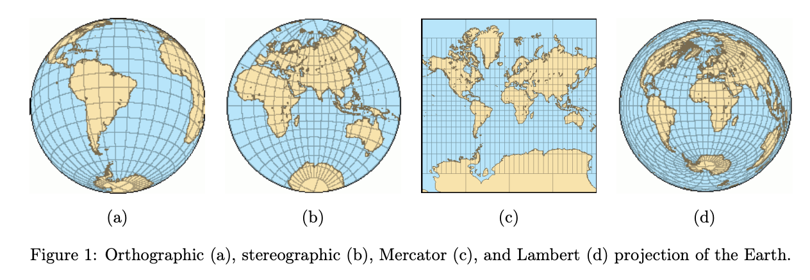
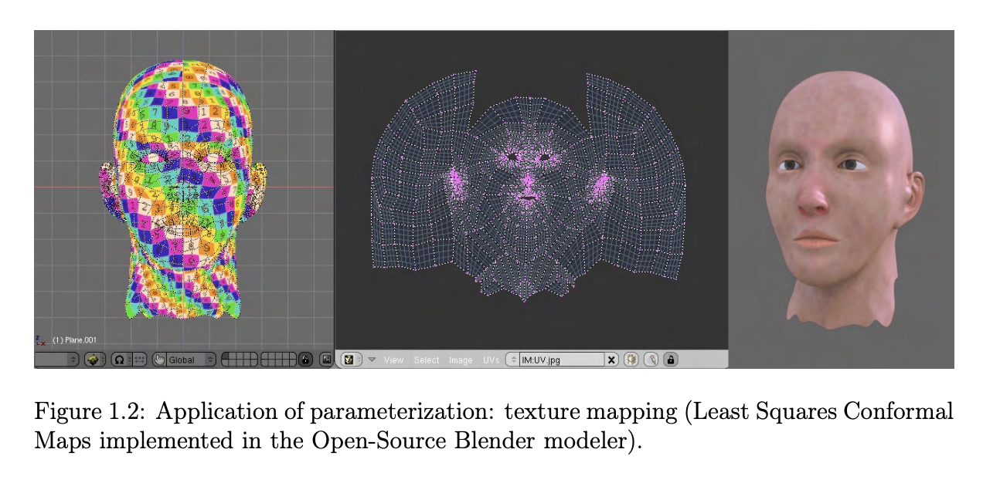
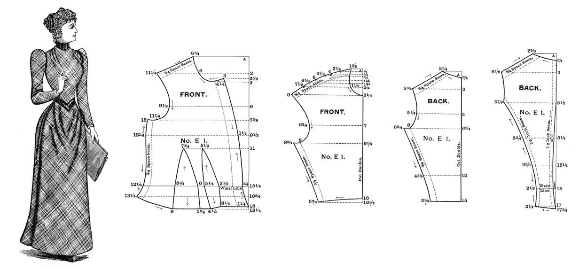
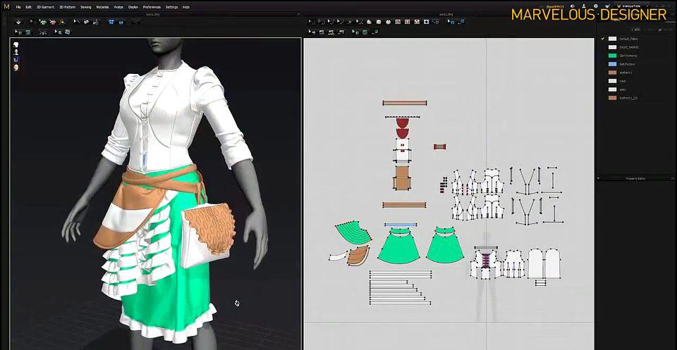

## 1.1 介绍

### 1.1.1 曲面展开(参数化)定义

**曲面展开（参数化 / Parameterization）**是指建立三维曲面与二维平面区域之间的一一对应映射。用数学语言描述：设 $S \subset \mathbb{R}^3$ 是一张三维曲面，$\Omega \subset \mathbb{R}^2$ 是平面区域（称为曲面的**参数域**），参数化即寻找**双射（一一对应）**：
$$
f: S \to \Omega
$$

下面我们看一个生活中常见的曲面展开例子—我们的世界地图。我们知道地球是球形的，为方便观察，我们要将地球表面的球面铺展到平面上也即将**球面上的点转换为平面上的点**，这就要用到曲面展开的方法了。

一般常见的地图展开方法使用的是**墨卡托投影法(Mercator Projection)**：假设球面内部有一个光源，球面外包围着一个圆柱面，光线将球面上的点投射到圆柱面上，再将圆柱面展开，就得到了我们熟悉的世界地图。

然而，墨卡托投影**必然引入扭曲**。比如我们在地图上看到的俄罗斯面积远大于非洲，但事实上俄罗斯的陆地面积只有非洲的一半左右。产生这种错觉的原因在于：墨卡托投影牺牲了面积精度以换取角度保持（即"共形映射"）。赤道附近的区域扭曲极小，越靠近两极面积膨胀越严重。

除了墨卡托投影还有许多其他投影方法，由于投影方式的不同，所形成的世界地图"长相"也大相径庭。

球面是很简单的曲面，对于复杂的肠道模型需要建立地图就要复杂得多了：通过CT扫描获取到腹部断层图像，然后用多视角几何的方法重建三维直肠曲面后，为了方便医生的观察，最后将这个直肠曲面平展到平面上，像看地球仪一样观察曲折的肠道。使用这种方法，设备和病患没有接触，不需要麻醉，不会诱导并发症。

游戏或动漫影视工业中3D模型的**纹理贴图(Texture Mapping)**：纹理贴图经常被用来对3D场景和对象进行上色及纹理填充等。设计师可以在二维空间进行模拟物体的表面纹理与细节信息的设计，再通过计算机手段将其投影到3D模型表面。

法线贴图(Normal Mapping)将细节信息存储到贴图上，从而简化面数

衣物制版将衣物拆分成不同部分并逐个摊平，然后确定每个部位的具体规格尺寸

