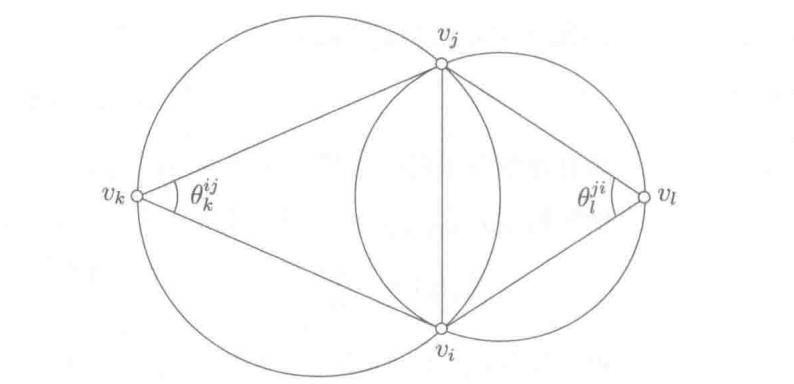

## 调和映射介绍

曲面参数化可以看作一个**变分问题**：在所有满足边界条件的映射中，选取使某个**能量泛函** $E[f]$ 最小的那一个。这里的"能量"并非物理意义上的热能，而是对映射**不良性质**的度量——拉伸越大、扭曲越严重，能量越高；极小化能量即寻找"最自然"的展开方式。

下面我们以 **Dirichlet 能量**（也称**调和能量**或**膜能量**）为例：它度量膜的拉伸变形程度，惩罚一切非均匀的伸缩。

其定义为映射梯度的 $L^2$ 范数(这是为严格表述，并不需要深究)

$$
E_D(f) = \int_S \|\nabla f\|^2 \,dA = \int_S <\nabla f,\nabla f >dA  \tag{1}
$$

对于曲面展开，我们考虑从曲面 $S$ 到平面 $\Omega$ 的映射 $f = (u,v)$，总Dirichlet 能量为两分量之和

$$
E_D = \int_S \left(\|\nabla u\|^2 + \|\nabla v\|^2\right) dA
$$

Dirichlet 能量极小化时得到**调和映射（Harmonic Mapping）**，等价于求解 **Laplace 方程**（即上述 Euler–Lagrange 方程）：
$$
\Delta u = 0, \Delta v = 0
$$

**Laplace算子**度量函数的"不规则程度"定义为其**梯度的散度** 
$$
\Delta f = \operatorname{div}\,\nabla f
$$

对于平整的2D平面 $\mathbb{R}^2$ 中，Laplace算子可以简化为
$$
\Delta f = f_{xx} + f_{yy}
$$
而在任意流形上定义的Laplace算子称为**Laplace-Beltrami算子**，下一节我们将研究离散(三角网格上)的Laplace-Beltrami算子。

调和映射试图去掉一切扭曲形变，可以认为是**"最平滑"**的映射。复分析理论中的**Rado 定理**（1924）是在连续情况下调和映射**存在唯一**性的理论保证。

### 调和映射理论保证:Rado定理

设 $\Omega \subset \mathbb{R}^2$ 为 **Jordan 域**（单连通、边界 $\partial\Omega$ 为简单闭曲线），$D = \{z : \lvert z\rvert < 1\}$ 为单位圆盘。

若给定边界同胚 $g : \partial\Omega \to \partial D$，则：

1. 存在唯一的调和映射 $u : \Omega \to D$，在边界上 $u\vert_{\partial\Omega} = g$
2. 若 $g$ 将 $\partial\Omega$ **单调地**映到 $\partial D$（保持边界遍历方向），则 $u$ 是 **$\Omega \to D$ 的同胚**（整体单射、无折叠）

关于调和映射理论详尽的理论说明请参考顾险峰老师的《 计算共形几何》，其调和映射章节严格论证了调和映射的存在唯一性。

##  离散调和映射

如果将网格看成是图(Graph)，借助图论的方法，**图的Laplace算子**用来定义三角网格的Laplace算子

$$
\Delta f(v_i) = \frac{1}{|\mathcal{N}_1(v_i)|} \sum_{v_j \in \mathcal{N}_1(v_i)} (f_j - f_i) \tag{2}
$$

实际上这正是我们上一节介绍的**uniform权重**。但是图是仅考虑网格的连接属性(或组合属性),没有考虑顶点的几何属性，所以使用起来会丢失许多几何信息，所以正好也说明了我们上一节的算法对于有较明显几何特征的模型效果不好。

下面离散(三角网格上)的方法主要来自Tutte和Floater，以下是一些参考对比

|          | 连续（Rado）                         | 离散（Tutte / Floater）                 |
| -------- | ------------------------------------ | --------------------------------------- |
| 域       | Jordan 域 $\Omega$                   | 3-连通平面三角网格                      |
| 边界条件 | $\partial\Omega \to \partial D$ 同胚 | 边界顶点固定到**严格凸**多边形          |
| 内部条件 | $\Delta u = 0$                       | $v_i = \sum_j w_{ij} v_j$，$w_{ij} > 0$ |
| 结论     | 调和映射是同胚                       | 平面嵌入无自交、三角面正面积            |

我们要研究的三角网格由一个个三角形构成，作用在其上的映射可以认为是分别作用在逐个三角形上，在每个三角形上都是一个简单的线性变换，所以可以认为我们要研究的映射是一个**分段线性映射(Piecewise Linear Mapping)**。

接下来为了定义三角网格上的调和映射，我们先定义分段线性映射的梯度算子然后再定义其上的散度算子。

### 离散梯度(Gradient)

分段线性映射给出了顶点的值后，三角形内部的函数值可以通过**重心坐标（Barycentric Coordinate）**进行线性插值求得，梯度算子是线性算子，所以我们也用重心坐标进行插值。

重心坐标 $\alpha$ 可以认为是小三角形与大三角形之间的**面积比**

$$
\alpha = \frac{A_i}{A_t} = \frac{\left( (\mathbf{x} - \mathbf{x}_j) \cdot \frac{(\mathbf{x}_k - \mathbf{x}_j)^\perp}{\|\mathbf{x}_k - \mathbf{x}_j\|} \right) \|\mathbf{x}_k - \mathbf{x}_j\|}{2 A_T} = \frac{(\mathbf{x} - \mathbf{x}_j) \cdot (\mathbf{x}_k - \mathbf{x}_j)^\perp}{2 A_T}
$$

其中 $A_t$ 是三角形有向面积
$$
A_t = \frac {1} {2}[ (x_iy_j - y_ix_j) + (x_jy_k - y_jx_k) + (x_ky_i - y_kx_i)]
$$
以重心坐标作为插值权重，分段线性映射可以表达为各顶点函数值关于重心坐标的线性组合

$$
f(x) = \alpha f_i + \beta f_j + \gamma f_k
$$

将**梯度算子 $\nabla$**作用于其上可得

$$
\begin{aligned}
\nabla f(\mathbf{x}) &= f_i \nabla \alpha + f_j \nabla \beta + f_k \nabla \gamma \\
\nabla \alpha &= \frac{(\mathbf{x}_k - \mathbf{x}_j)^\perp}{2A_T},\quad \nabla \beta = \frac{(\mathbf{x}_i - \mathbf{x}_k)^\perp}{2A_T},\quad \nabla \gamma = \frac{(\mathbf{x}_j - \mathbf{x}_i)^\perp}{2A_T}
\end{aligned}
$$

因此

$$
\nabla f(\mathbf{x}) = f_i \frac{(\mathbf{x}_k - \mathbf{x}_j)^\perp}{2A_T} + f_j \frac{(\mathbf{x}_i - \mathbf{x}_k)^\perp}{2A_T} + f_k \frac{(\mathbf{x}_j - \mathbf{x}_i)^\perp}{2A_T}
$$

### 离散散度(Divergence)

以下证明来自《Polygon Mesh Processing》,根据**散度定理(Divergence Theorem,又称高斯定理)**

$$
\int_{A_i} \operatorname{div} \mathbf{F}(\mathbf{u})\,\mathrm{d}A = \int_{\partial A_i} \mathbf{F}(\mathbf{u}) \cdot \mathbf{n}(\mathbf{u})\,\mathrm{d}s \tag{3}
$$

对于下面的顶点的小领域 $A_i$ 采用**Mixed Voronoi Cell**

Mixed Voronoi Cell可以认为是某个顶点所有相邻边的中垂线围成的该顶点的一个领域，下图为单个三角形 $T$ 局部的情况

那么对于Laplace算子则有

$$
\int_{A_i} \Delta f(\mathbf{u}) \,\mathrm{d}A = \int_{A_i} \operatorname{div} \nabla f(\mathbf{u}) \,\mathrm{d}A = \int_{\partial A_i} \nabla f(\mathbf{u}) \cdot \mathbf{n}(\mathbf{u}) \,\mathrm{d}s
$$

$\mathbf{n}$ 的朝向向外。

对每一个部分分别进行计算

$$
\begin{aligned}
\int_{\partial A_i \cap T} \nabla f(\mathbf{u}) \cdot \mathbf{n}(\mathbf{u})\,\mathrm{d}s
&= \nabla f(\mathbf{u}) \cdot (\mathbf{a} - \mathbf{b})^\perp
=\frac{1}{2}\, \nabla f(\mathbf{u}) \cdot (\mathbf{x}_j -\mathbf{x}_k)^\perp
\end{aligned}
$$

将之前计算的导数代入进去则有

$$
\begin{aligned}
\int_{\partial A_i \cap T} \nabla f(\mathbf{u}) \cdot \mathbf{n}(\mathbf{u})\,\mathrm{d}s
= &\, (f_j - f_i)\,\frac{(\mathbf{x}_i - \mathbf{x}_k)^\perp \cdot (\mathbf{x}_j - \mathbf{x}_k)^\perp}{4A_T}  + (f_k - f_i)\,\frac{(\mathbf{x}_j - \mathbf{x}_i)^\perp \cdot (\mathbf{x}_j - \mathbf{x}_k)^\perp}{4A_T}
\end{aligned} \tag{4}
$$

记 $\gamma_j,\gamma_k$ 分别为顶点 $v_j,v_k$ 处的内角。

由三角形面积公式

$$
A_t = \tfrac{1}{2}\sin\gamma_j \,\|\mathbf{x}_j - \mathbf{x}_i\|\,\|\mathbf{x}_j - \mathbf{x}_k\| = \tfrac{1}{2}\sin\gamma_k \,\|\mathbf{x}_i - \mathbf{x}_k\|\,\|\mathbf{x}_j - \mathbf{x}_k\|
$$

以及余弦定律

$$
\cos\gamma_j = \frac{(\mathbf{x}_j - \mathbf{x}_i)\cdot(\mathbf{x}_j - \mathbf{x}_k)}{\|\mathbf{x}_j - \mathbf{x}_i\|\,\|\mathbf{x}_j - \mathbf{x}_k\|}, \cos\gamma_k = \frac{(\mathbf{x}_i - \mathbf{x}_k)\cdot(\mathbf{x}_j - \mathbf{x}_k)}{\|\mathbf{x}_i - \mathbf{x}_k\|\,\|\mathbf{x}_j - \mathbf{x}_k\|}
$$

可得

$$
\int_{A_i} \Delta f(\mathbf{u})\,\mathrm{d}A = \frac{1}{2} \sum_{v_j \in \mathcal{N}_1(v_i)} (\cot \alpha^{ij} + \cot \beta^{ij})(f_j - f_i)
$$

从而我们最终得到**Laplace–Beltrami 算子**在三角网格上的离散化为(我们去掉前面常系数，并不影响结论)

$$
\Delta f(v_i) := \frac {1} {2 A_i} \sum_{v_j \in \mathcal{N}_1(v_i)} (\cot \alpha^{ij} + \cot \beta^{ij})(f_j - f_i) \tag{5}
$$

对于任意有向边$e_{ij}$,我们可以定义其**余切边权重$w_{ij}$(cotangent weight)**也称为**cot权重**

$$
w_{ij} = \cot\alpha_{ij} + \cot\beta_{ij} \tag{6}
$$

对于边界顶点少了一个外侧领居，所以会少一项。

## 数值求解

1. **内部点**：满足调和方程 $\Delta u = 0$，即 $u_i$ 为其邻域顶点的 **cot 加权平均**：

   $$
   \sum_{v_j \in N(v_i)} w_{ij}(\mathbf{u}_j - \mathbf{u}_i) = 0, \quad w_{ij} = \cot\alpha_{ij} + \cot\beta_{ij}
   $$
   
2. **边界点**：同上一节方法一样，将边界点映射到凸多边形(如圆或矩形)上（可以按照弧长比例映射）。

3. **求解**：将内部点方程与固定边界组合为一个稀疏线性方程组：

   $$
   \begin{aligned}
   \mathbf{L} \mathbf{U} &= \mathbf{0},\quad \mathbf{u}|_{\partial\Omega} = \mathbf{g}\\
   \end{aligned}
   $$
   
   其中 $\mathbf{L}$ 为 $\lvert V\rvert\times\lvert V\rvert$ 的 **cot-Laplace 矩阵**，$\mathbf{U}$ 为所有顶点的 $(u,v)$ 坐标。**$\mathbf{u}|_{\partial\Omega} = \mathbf{g}$**：$\partial\Omega$ 为网格边界顶点集，$\mathbf{g}$ 为边界上各顶点的目标 $(u,v)$（通常按弧长比例映射到圆或矩形等凸多边形）。边界顶点直接赋值，内部顶点由方程组决定。
   
   该式是连续情形 $\Delta u = \Delta v = 0$ 的离散写法，其中 cot-Laplace 矩阵 $\mathbf{L}$ 与内部调和条件分别为
   
   $$
   \begin{aligned}
   L_{ij} &= \begin{cases}
   w_{ij}, & v_j \in \mathcal{N}(v_i),\\
   -\displaystyle\sum_{k \in \mathcal{N}(v_i)} w_{ik}, & i = j,\\
   0, & \text{otherwise},
   \end{cases}
   & w_{ij} = \cot\alpha_{ij} + \cot\beta_{ij}\ \text{（式 (6)）},\\[6pt]
   (\mathbf{L}\mathbf{U})_i &= 0 \;\Leftrightarrow\; \Delta u(v_i) = \Delta v(v_i) = 0 \quad (v_i \in \mathrm{int}(\Omega)),
   \end{aligned}
   $$
   
   后者等价于 Dirichlet 能量在内部的极小化条件。
   
   **实际求解**：将顶点划分为内部集 $I$ 与边界集 $B$，对 $\mathbf{L}$ 分块后有
   
   $$
   \begin{bmatrix} \mathbf{L}_{II} & \mathbf{L}_{IB} \\ \mathbf{L}_{BI} & \mathbf{L}_{BB} \end{bmatrix}
   \begin{bmatrix} \mathbf{U}_I \\ \mathbf{U}_B \end{bmatrix} = \mathbf{0}
   $$
   
   代入已知边界 $\mathbf{U}_B = \mathbf{g}$，只求内部未知量：
   
   $$
   \mathbf{L}_{II}\,\mathbf{U}_I = -\mathbf{L}_{IB}\,\mathbf{g}
   $$
   
   施加 Dirichlet 边界后 $\mathbf{L}_{II}$ **对称正定SPD**，可用 Cholesky 分解或共轭梯度法高效求解。

### 固定边界与自由边界

两种做法的核心区别在于**边界顶点是否作为已知量**。

| | 固定边界 | 自由边界 |
|---|---|---|
| 边界顶点 | 按弧长比例预设到凸多边形，作为 Dirichlet 条件 | 与内部顶点一样，由方程组求解 |
| 未知量 | 仅内部顶点 | 除 pin 点外**全部**顶点（含边界） |
| 理论保证 | Tutte / Floater：3-连通 + 凸边界 → 无自交嵌入 | 无同胚保证，可能出现折叠 |
| 典型用途 | 快速、稳定的初始参数化 | 减少人为边界形变，边界形状由几何"自然"决定 |

**固定边界**：将所有边界顶点按弧长比例映射到凸多边形（圆/矩形）上并固定，作为 Dirichlet 边界条件。这保证了线性系统满秩（正定），但也引入了**人为的边界形变**——内部点被迫适应这个"外挂"的边界形状，局部角度保真性遭到破坏。

#### 自由边界：问题设定

固定边界把 $\partial\Omega$ 强行拉成圆/矩形，边界处的角度与长度往往与三维曲面不一致。自由边界的做法是：**不再预设边界形状**，只固定极少的 pin 点，让整张网格（含边界）共同极小化 Dirichlet 能量。

此时对所有**未 pin** 的顶点 $v_i$**（无论是否在边界上）全部**都施加调和条件：

$$
\sum_{v_j \in \mathcal{N}(v_i)} w_{ij}(u_j - u_i) = 0,\qquad
\sum_{v_j \in \mathcal{N}(v_i)} w_{ij}(v_j - v_i) = 0
$$

边界顶点不再"特殊"——它们同样满足 cot 加权平均，只是邻域少了一个外侧邻居。边界在参数域中的最终形状，是能量极小化的**结果**而非**输入**。

#### 为什么必须 pin 点？

无约束时 $\mathbf{L}$ 半正定，每列之和为 $0$，故 $\mathbf{L}\mathbf{1}=\mathbf{0}$：给所有 $u_i$ 同时加同一常数仍满足 $\mathbf{L}\mathbf{u}=\mathbf{0}$（$v$ 分量同理）。这对应参数域中的**平移**自由度（$u$、$v$ 各 $1$ 维，共 $2$ 维）。

把 $(u_i,v_i)$ 看成平面上的点集后，Dirichlet 能量 $\int(\|\nabla u\|^2+\|\nabla v\|^2)\,dA$ 对参数域的**刚体运动**（平移 + 旋转）不变，因此极小解仅在刚体变换意义下唯一，还需消除 **$1$ 维旋转**自由度。合计 **$3$ 维**冗余。

实践中固定 **$2$ 个顶点**的 UV 即可消去这 $3$ 维自由度，例如：

$$
v_a \mapsto (0,0),\qquad v_b \mapsto (d,0),\quad d>0
$$

第一个点消去平移，第二个点落在 $x$ 轴上消去旋转（$d$ 可任取，仅定尺度）。pin 点不必在边界上，但通常取**边界上相距最远的一对顶点**（如 LSCM 中取最长边界弦的两端），使 pin 间距与曲面尺度匹配，数值更稳定。

#### 矩阵形式与求解步骤

记 pin 顶点集为 $P$，自由顶点集为 $F$（含全部边界与内部，$|F|=|V|-2$）。将固定边界情形中的"边界已知"替换为"pin 点已知"，方程组写为

$$
\begin{cases}
(\mathbf{L}\mathbf{U})_i = 0, & v_i \in F,\\[4pt]
\mathbf{U}_p = \mathbf{g}_p, & v_p \in P,
\end{cases}
$$

自由边界的边界由曲面几何与能量共同决定，避免了"圆/矩形"带来的人为拉伸；但失去了 Tutte 嵌入定理的保护——**不保证无折叠、无自交**，pin 点位置也会影响结果。
