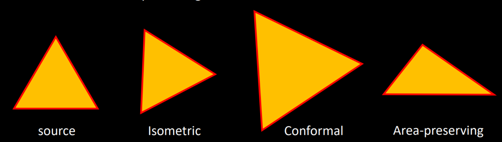
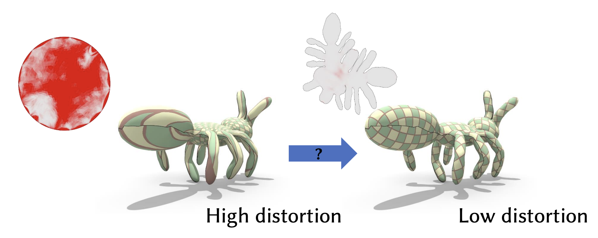

## 参数化映射的 Jacobian 矩阵

对于每一个三角面片，先建立局部坐标系以简化计算。如下图所示，选取三角形 $T = [x_i, x_j, x_k]$，以某顶点 $x_i$ 为原点、边 $[x_i, x_j]$ 为 $X$ 轴方向，按右手定则建立坐标系。

在每个三角面片 $t$ 上，假设映射 $f$ 退化为线性函数 $f_t(x) = J_t x + b_t$——其中 $J_t$ 是 Jacobian 矩阵，刻画了该三角形局部的缩放与旋转；平移量 $b_t$ 对参数化无影响，可直接设为零。

分片线性映射 $f$ 的 Jacobian 矩阵如下

$$
J_t =
\begin{pmatrix}
\frac{\partial u}{\partial x} & \frac{\partial u}{\partial y} \\[4pt]
\frac{\partial v}{\partial x} & \frac{\partial v}{\partial y}
\end{pmatrix}
:=
\begin{pmatrix}
u_j-u_i & u_k-u_i \\[4pt]
v_j-v_i & v_k-v_i
\end{pmatrix}
\begin{pmatrix}
x_j-x_i & x_k-x_i \\[4pt]
y_j-y_i & y_k-y_i
\end{pmatrix}^{-1}
$$

二阶矩阵可以直接求逆：

$$
A = \begin{pmatrix} a & b \\ c & d \end{pmatrix}, \quad
A^{-1} = \frac{1}{ad - bc} \begin{pmatrix} d & -b \\ -c & a \end{pmatrix}
\quad \text{（当 } ad - bc \ne 0 \text{）}
$$
对公式(1)代数变形可以得到下面的展开形式

$$
\begin{aligned}
{\begin{pmatrix}{\frac{\partial u}{\partial x}}\\{\frac{\partial u}{\partial y}}\end{pmatrix} }=\frac{1}{2A_t}{\begin{pmatrix}{y_j-y_k}&{y_k-y_i}&{y_i-y_j}\\{x_k-x_j}&{x_i-x_k}&{x_j-x_i}\end{pmatrix} }
{\begin{pmatrix}u_i\\u_j\\u_k\end{pmatrix} }\\
{\begin{pmatrix}{\frac{\partial v}{\partial x}}\\{\frac{\partial v}{\partial y}}\end{pmatrix} }=\frac{1}{2A_t}{\begin{pmatrix}{y_j-y_k}&{y_k-y_i}&{y_i-y_j}\\{x_k-x_j}&{x_i-x_k}&{x_j-x_i}\end{pmatrix} }
{\begin{pmatrix}v_i\\v_j\\v_k\end{pmatrix} }
\end{aligned}
$$

对分段线性映射 $f$ 的 Jacobian 矩阵 $J_t$ 可以进行 **SVD 分解**
$$
J_t=U\Sigma V^T ，\Sigma={\begin{pmatrix}{\sigma_1}&{0}\\{0}&{\sigma_2}\end{pmatrix} }
$$

奇异值 $\sigma_1, \sigma_2$ 分别描述映射在正交两个方向上的拉伸程度，如下图所示

映射局部将一个单位圆映射为一个椭圆，其中 $\sigma_1, \sigma_2$ 恰好是这个椭圆的长短半轴长度。因此，用 $\sigma_1, \sigma_2$ 定义能量可以精确地量化每一种扭曲形式并加以惩罚。

- $\sigma_1 = \sigma_2 = 1$ —— 圆还是圆，**等距映射**（无扭曲）
- $\sigma_1 = \sigma_2$ —— 圆还是圆（但等比例缩放），**共形映射**（保角）
- $\sigma_1 \neq \sigma_2$ —— 圆变椭圆，产生**各向异性拉伸**（角度扭曲）
- $\sigma_1 \cdot \sigma_2 = \det(J_t)$ —— 面积缩放因子
- $\sigma_1 / \sigma_2$ —— 拉伸各向异性程度（conformal distortion）

## 参数化变分能量

Jacobian 矩阵的奇异值 $\sigma_1, \sigma_2$ 完整地刻画了局部映射的行为。基于这两个奇异值，我们可以系统性地定义各类变形能量，每种能量对应不同的几何约束目标。后续我们将会看到下面这些**用奇异值来定义的变形能量**，并设计算法进行计算。

| 能量名称 | 公式 | 含义 |
|:--:|:---|:---|
| **Dirichlet 能量** | $E_D = \sigma_1^2 + \sigma_2^2$ | 膜能量，惩罚所有拉伸。极小化时得到调和映射 |
| **共形能量** | $E_C = (\sigma_1 - \sigma_2)^2$ | 惩罚各向异性拉伸，极小化时 $\sigma_1=\sigma_2$ |
| **等距(ARAP)能量** | $E_I = (\sigma_1-1)^2 + (\sigma_2-1)^2$ | 惩罚偏离恒等映射，尽可能刚性（As-Rigid-As-Possible），保持局部形状 |
| **MIPS 能量** | $E_{\text{MIPS}} = \frac{\sigma_1}{\sigma_2} + \frac{\sigma_2}{\sigma_1}$ | 最大/最小奇异值比，纯共形度量 |
| **对称 Dirichlet** | $E_{SD} = \sigma_1^2 + \sigma_2^2 + \sigma_1^{-2} + \sigma_2^{-2}$ | 双向惩罚拉伸和压缩，防止翻转 |

**尽可能减小扭曲**是我们寻找更优展开(参数化)方法的重要目标，我们使用**变分法**求解：定义一个能量 $E(f)$ 来度量映射 $f$ 的扭曲程度，从而将参数化建模为几何最优化问题。
$$
\min E(f)\\ f\text{ 满足约束条件}
$$

其他Dirichlet能量的最小就是调和映射，这个在前面已经介绍了。共形能量会在后一章关于共形参数化专门的讨论中进行更深入的研究。其他能量的梯度和Hessian矩阵不好求，凸性也不好判定，所以不能直接用非线性优化的方法。后面我们将介绍分别用什么优化方法来求解这些变分能量。

## 三角面翻转与MIPS能量

对于一些带有突出部分的曲面等复杂形状，如果参数化过程只是对共形能量或等距能量进行优化那么可能会造成**三角面的翻转**，而MIPS能量和对称Dirichlet能量都有对翻转进行惩罚。

其中MIPS（Most Isometric ParameterizationS）能量定义为奇异值之比：
$$
E_{\text{MIPS}} = \frac{\sigma_1}{\sigma_2} + \frac{\sigma_2}{\sigma_1}
$$

若直接对 $\sigma_1, \sigma_2$ 做优化，需要反复 SVD 分解且无法得到闭式梯度，难以高效求解。因此 MIPS 的关键在于**用 Jacobian 矩阵的代数不变量消去 SVD**。

利用恒等式 $\sigma_1^2 + \sigma_2^2 = \|J_t\|_F^2$ 和 $\sigma_1\sigma_2 = \det(J_t)$：

$$
E_{\text{MIPS}} = \frac{\sigma_1}{\sigma_2} + \frac{\sigma_2}{\sigma_1}
= \frac{\sigma_1^2 + \sigma_2^2}{\sigma_1 \sigma_2}
= \boxed{\frac{\|J_t\|_F^2}{\det(J_t)}}
$$

对每个三角形 $t$，$J_t$ 的分量是 UV 坐标的线性函数，因此 $E_{\text{MIPS}}$ 变为 UV 坐标的**有理函数**——分子是二次型，分母是三角形面积（亦为 UV 坐标的双线性形式）。

对三角网格，总能量为按面积加权的求和：

$$
E_{\text{MIPS}} = \sum_{t} A_t^{\text{3D}} \cdot \frac{\|J_t\|_F^2}{\det(J_t)}
$$

其中 $A_t^{\text{3D}}$ 是三角面片 $t$ 在原始 3D 曲面上的面积。$\det(J_t) > 0$ 保证无翻转，因此 MIPS 是**自障碍函数**（self-barrier）：翻转时 $\det(J_t) \to 0^+$ 导致能量趋于无穷大。

MIPS 与对称 Dirichlet 两者都充当翻转 barrier，但行为不同：

$$
E_{\text{MIPS}} = \frac{\sigma_1}{\sigma_2} + \frac{\sigma_2}{\sigma_1},\qquad
E_{\text{SD}} = \sigma_1^2 + \sigma_2^2 + \sigma_1^{-2} + \sigma_2^{-2}
$$

MIPS 仅阻止 $\sigma_i \to 0$（分母趋于零），而**对称 Dirichlet 同时阻止压缩（$\sigma_i \to 0$）和拉伸（$\sigma_i \to \infty$）**，因此对等距性的约束更强。在实践上，对称 Dirichlet 是更稳健的选择，但 MIPS 的化简形式 $\|J_t\|_F^2 / \det(J_t)$ 因其简洁性在教学中被广泛引用。
