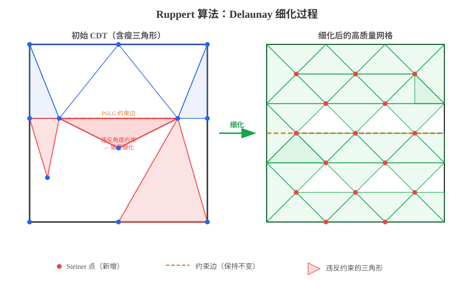
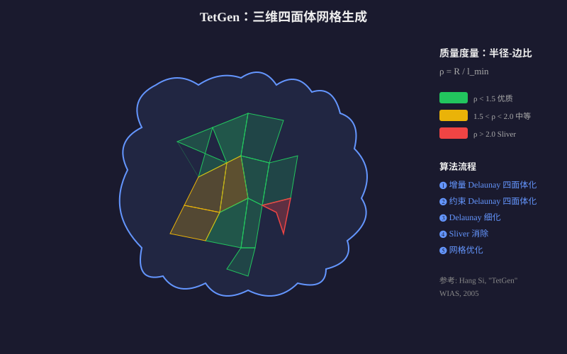
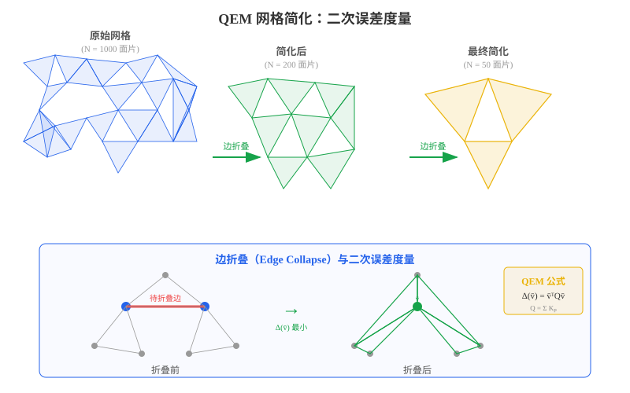

## 三角网格化

**Delaunay 三角剖分**是计算几何中最基础的三角网格生成方法之一。给定平面上的一个点集 $P = \{p_1, p_2, \ldots, p_n\}$，Delaunay 三角剖分满足以下核心性质：

> **空圆性质（Empty Circumcircle Property）**：对三角剖分中的任何一个三角形，其外接圆内部不包含点集中的任何其他点。

数学上，如果三角形 $\triangle p_i p_j p_k$ 的外接圆为 $C$，则：

$$\forall\, p_l \in P \setminus \{p_i, p_j, p_k\},\quad p_l \notin \text{int}(C)$$

**Delaunay 三角剖分的关键特性：**

| 特性 | 说明 |
|:---|:---|
| **唯一性** | 一般位置（无四点共圆）下，Delaunay 三角剖分唯一 |
| **最大化最小角** | 在所有三角剖分中，Delaunay 三角剖分最大化最小内角（避免"扁平"三角形） |
| **对偶性** | Delaunay 三角剖分与 Voronoi 图互为对偶 |
| **局部最优性** | 任何不满足 Delaunay 性质的四边形可通过边翻转变（edge flip）为 Delaunay |

**经典构造算法：**

1. **Incremental Insertion（增量插入法）**：逐点插入，每次插入后通过边翻转恢复 Delaunay 性质。时间复杂度 $O(n \log n)$（期望）
2. **Bowyer-Watson Algorithm**：通过外接圆检测找到需要删除的三角形，然后重新连接。时间复杂度 $O(n^2)$（最坏），$O(n \log n)$（期望）
3. **Divide and Conquer（分治法）**：将点集递归分成两半，分别三角剖分后合并。时间复杂度 $O(n \log n)$

**三维扩展**：Delaunay 三角剖分在三维空间中自然扩展为**四面体剖分**（Tetrahedralization），同样满足空球性质——每个四面体的外接球内部不包含其他点。

---

#### Ruppert 算法（Delaunay Refinement）

**Ruppert 算法**（1995，Jim Ruppert）是**二维质量网格生成**领域的里程碑工作。它从一个初始的约束 Delaunay 三角剖分（CDT）出发，通过**逐步插入 Steiner 点**来改善网格质量。

**核心思想**：给定一个**平面直线图（Planar Straight-Line Graph, PSLG）** 和一个角度约束 $\theta_{\min}$，算法通过 Delaunay 细化生成满足所有约束的高质量三角网格。



**算法流程：**

```
输入: PSLG G, 最小角度约束 θ_min
输出: 质量三角网格 T

1. 计算 G 的约束 Delaunay 三角剖分 (CDT)
2. while 存在质量不满足要求的三角形 do:
   a. 找到外接圆中包含其他点的"瘦"三角形（违反角度约束）
   b. 或找到外接圆直径过大且包含边界段的"大"三角形
   c. 在该三角形的外接圆圆心处插入 Steiner 点
   d. 更新 Delaunay 三角剖分（通过边翻转）
3. return T
```

**关键机制——保护圆（Encroachment）**：

为了防止边界段被"吞掉"，算法引入了**边界保护机制**：

> **子段保护**：如果一个三角形的外接圆圆心落在某个输入子段的"直径球"内，则不在该圆心插入点，而是**在该子段的中点处分裂子段**。

**理论保证：**

| 性质 | 说明 |
|:---|:---|
| **角度下界** | 所有三角形最小角 $\geq \min(20.7°, \theta_{\min})$ |
| **网格尺寸** | 生成顶点数 $O(n + m^2)$，其中 $n$ 为输入顶点数，$m$ 为输入子段数 |
| **终止性** | 算法必定终止（通过有界性证明） |
| **最优性** | 在最坏情况下网格规模接近最优 |

**Shewchuk 的改进**（2002）：

Jonathan Shewchuk 对 Ruppert 算法做了重要推广：
- 将角度下界提高到 **$26.5°$**（去掉子段交叉的假设后）
- 支持更复杂的输入（包括洞和非流形边）
- 提供了**精炼的理论分析框架**，统一了 Chew 和 Ruppert 的方法
- 实现为开源工具 **Triangle**，至今仍是最广泛使用的二维网格生成器

---

#### TetGen（三维 Delaunay 网格生成）

**TetGen**（Hang Si，2005）是**三维四面体网格生成**领域的标杆工具，由魏茨曼研究所（WIAS）开发。它将 Ruppert 的 Delaunay 细化思想扩展到三维空间，能够处理任意多面体域（Polyhedral Domain）。



**核心算法——三维 Delaunay 细化**：

三维情况比二维复杂得多，主要挑战包括：
- 二维中"瘦三角形"的概念在三维中需要新的质量度量（如**半径-边比**）
- **Sliver（扁平四面体）**是三维特有的退化单元——它们可能半径-边比很好，但体积接近零

**TetGen 的算法框架：**

1. **增量 Delaunay 四面体化**
   - 使用 Bowyer-Watson 算法的三维扩展
   - 时间复杂度 $O(n^2)$（最坏），实践中接近 $O(n \log n)$

2. **约束 Delaunay 四面体化**
   - 通过**边恢复（Edge Recovery）** 和**面恢复（Face Recovery）** 确保输入边界被保留
   - 引入 Steiner 点来恢复不可见的约束

3. **Delaunay 细化**
   - **质量指标**：使用**半径-边比**（radius-edge ratio）$\rho = R / l_{\min}$，其中 $R$ 为外接球半径，$l_{\min}$ 为最短边长度
   - **坏四面体检测**：$\rho > \rho_0$（通常 $\rho_0 = 2$）的四面体需要细化
   - **Sliver 消除**：通过额外的优化步骤（如**加权 Delaunay 细化**或**优化驱动的 Smoothing**）消除扁平四面体

4. **网格优化**
   - **Laplace Smoothing**：移动顶点以改善单元质量
   - **Edge/Face Swapping**：通过拓扑变换改善网格质量

**TetGen 的质量保证**：

$$\forall \text{ tetrahedron } T:\quad \frac{R}{l_{\min}} \leq \rho_0$$

| 特性 | 说明 |
|:---|:---|
| **输入格式** | PLY, OFF, STL, NODE/ELE, PLC |
| **输出格式** | 四面体网格、Voronoi 图、凸包 |
| **网格质量** | 有界的半径-边比，无 Sliver（优化后） |
| **规模限制** | 可处理数百万量级的四面体 |


## 三角网格简化

**QEM（Quadric Error Metrics）** 是 Garland 和 Heckbert（1997）提出的经典网格简化方法，通过**边折叠（Edge Collapse）** 迭代简化网格，每次折叠选择引入误差最小的边。



**核心思想——二次误差度量**：

对网格上的每个顶点 $v = [v_x, v_y, v_z, 1]^T$，定义其**二次误差**为到其所有相邻平面距离的平方和。

给定一个平面 $ax + by + cz + d = 0$（满足 $a^2 + b^2 + c^2 = 1$），点 $v$ 到该平面的距离平方为：

$$D^2(v, \mathbf{p}) = (\mathbf{p}^T v)^2$$

其中 $\mathbf{p} = [a, b, c, d]^T$。用齐次坐标表示为二次型：

$$D^2(v, \mathbf{p}) = v^T \mathbf{K}_p v$$

其中 $\mathbf{K}_p = \mathbf{p} \mathbf{p}^T$ 是一个 $4 \times 4$ 的对称矩阵（称为**基本二次型**）。

**顶点的累积二次误差**：

$$\mathbf{Q}(v) = \sum_{\mathbf{p} \in \text{planes}(v)} \mathbf{K}_p$$

**边折叠的代价**：

当折叠边 $(v_1, v_2)$ 到新顶点 $\bar{v}$ 时，误差为：

$$\Delta(\bar{v}) = \bar{v}^T (\mathbf{Q}_1 + \mathbf{Q}_2) \bar{v}$$

最优新顶点位置 $\bar{v}^*$ 通过解以下方程获得：

$$\frac{\partial \Delta}{\partial \bar{v}} = 2(\mathbf{Q}_1 + \mathbf{Q}_2) \bar{v} = 0$$

即求合并后矩阵的零空间。实践中常使用矩阵的伪逆。

**算法流程：**

```
1. 对所有顶点计算初始 Q
2. 对所有边 (v1, v2) 计算折叠代价 Δ = v̄ᵀ(Q1+Q2)v̄
3. 将所有边按代价从小到大放入优先队列
4. while 优先队列非空 and 需要继续简化:
   a. 取出代价最小的边
   b. 折叠该边，更新相邻边的代价
   c. 重新插入优先队列
5. return 简化后的网格
```

**QEM 的优势**：
- 时间复杂度 $O(n \log n)$，效率极高
- 误差度量具有几何意义——面积加权的距离平方和
- 能较好地保持网格的全局形状特征

---

#### 三角网格作为信号通过用谱分解方法进行三角网格简化

将三角网格视为定义在图上的信号，利用**图信号处理（Graph Signal Processing）** 和**谱图理论（Spectral Graph Theory）** 的方法进行简化，是近年来网格处理的重要方向。


**从网格到图信号**：

给定三角网格 $M = (V, E, F)$，构造其**图 Laplacian 矩阵** $\mathbf{L}$：

$$\mathbf{L} = \mathbf{D} - \mathbf{W}$$

其中 $\mathbf{D}$ 是度矩阵，$\mathbf{W}$ 是邻接权重矩阵。常用**余切 Laplacian**：

$$L_{ij} = \begin{cases} -\frac{1}{2}(\cot \alpha_{ij} + \cot \beta_{ij}) & \text{if } (i,j) \in E \\ \sum_{k \in N(i)} \frac{1}{2}(\cot \alpha_{ik} + \cot \beta_{ik}) & \text{if } i = j \\ 0 & \text{otherwise} \end{cases}$$

**特征值分解**：

对 Laplacian 矩阵进行特征值分解：

$$\mathbf{L} \mathbf{f}_k = \lambda_k \mathbf{f}_k, \quad k = 1, 2, \ldots, |V|$$

其中 $0 = \lambda_1 \leq \lambda_2 \leq \cdots \leq \lambda_{|V|}$。

**特征值的几何含义**：

| 特征值                         | 含义       | 对应的网格特征               |
| :----------------------------- | :--------- | :--------------------------- |
| $\lambda_1 = 0$                | 常量信号   | 平移（无几何意义）           |
| $\lambda_2$                    | Fiedler 值 | 网格的"刚度"，大尺度形状变化 |
| $\lambda_3 \sim \lambda_k$     | 中低频     | 全局弯曲、扭转等宏观几何特征 |
| $\lambda_k \sim \lambda_{|V|}$ | 高频       | 局部细节、噪声、微小凹凸     |

这类似于傅里叶分析——低频分量对应平滑的全局结构，高频分量对应局部细节和噪声。

**谱简化方法**：

**核心思想**：保留低频特征向量（编码全局几何结构），丢弃高频特征向量（编码局部细节），从而实现网格简化。

具体步骤：

1. **特征值分解**：计算 $\mathbf{L}$ 的前 $k$ 个最小特征值及其特征向量 $\{\mathbf{f}_1, \ldots, \mathbf{f}_k\}$
2. **信号投影**：将网格顶点坐标矩阵 $\mathbf{X} \in \mathbb{R}^{|V| \times 3}$ 投影到低频子空间
   $$\mathbf{X}_{\text{approx}} = \sum_{i=1}^{k} \mathbf{f}_i (\mathbf{f}_i^T \mathbf{X})$$
3. **重建简化网格**：利用投影后的信号重建几何形状
4. **重网格化（可选）**：在简化后的几何上重新生成均匀三角网格

**谱方法的变体**：

- **Spectral Mesh Simplification**（Karni & Gotsman, 2000）：将网格坐标投影到低维 Laplacian 特征空间，在频域中截断后重建
- **Spectral Compression**（Karni & Gotsman, 2000）：利用前几个非平凡特征向量作为编码基底，实现有损压缩
- **Spectral Geometry Processing**（Vallet & Lévy, 2008）：统一的谱域网格处理框架，支持滤波、简化、去噪等操作

**谱方法的优势与局限**：

| 优势                         | 局限                                 |
| :--------------------------- | :----------------------------------- |
| 理论优美，有坚实的数学基础   | 特征值分解计算量大（$O(n^3)$）       |
| 能自动区分全局结构和局部细节 | 需要全局计算，不支持增量式处理       |
| 多尺度分析能力强             | 对非均匀网格效果可能不理想           |
| 可与压缩、去噪等操作统一处理 | 大规模网格（>100K 顶点）需要近似方法 |
