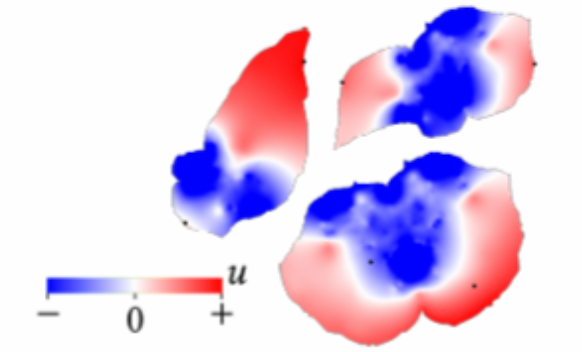

## 1.6 网格的谱处理 SCP

### 1.6.1 SCP 方法

SCP（Spectral Conformal Parameterization，Mullen et al.）是 LSCM 的谱方法变体。LSCM 需手工指定两个 pin 点以消除平凡解；SCP **不必指定 pin 点**，从而避免 pin 点带来的额外扭曲。

SCP 的核心思想是：在所有**单位范数**的非平凡解中，求能量最小者，等价于求能量矩阵的**主特征向量**（Mullen et al., 2008）。

### 1.6.2 离散共形能量

SCP 所优化的正是 1.5.3 节建立的 LSCM 共形能量。连续情形下，它与 Dirichlet 能量、参数域有向面积满足：

$$
E_C(\mathbf{u}) = E_D(\mathbf{u}) - \mathcal{A}(\mathbf{u})
$$

参数域有向面积可写为边界边的求和：

$$
\mathcal{A}(\mathbf{u}) = \sum_{e_{ij} \in \partial \mathcal{U}} \frac{1}{2}(u_i v_j - u_j v_i)
$$

离散化后，共形能量成为对 **(u,v) 堆叠向量** $\mathbf{x} = (u_1,\ldots,u_n,v_1,\ldots,v_n)^{\mathsf T}$ 的二次型：

$$
E_C(\mathbf{x}) = \frac{1}{2}\mathbf{x}^{\mathsf T} L_C \mathbf{x}
$$

其中 $L_C$ 为稀疏对称矩阵。记 Dirichlet 能量的 Hessian 为 $L_D$，向量面积矩阵为 $A$，则有：

$$
L_C = L_D - A
$$

在三角网格上，$L$ 为 cotan 拉普拉斯，$L_D = \mathrm{diag}(L,L)$。向量面积矩阵 $A$ 仅由边界边贡献（与 libigl 的 `vector_area_matrix` 一致），对边界边 $(i,j)$ 有：

$$
A_{i,\,j+n} = A_{j+n,\,i} = \tfrac{1}{4}, \qquad
A_{i+n,\,j} = A_{j,\,i+n} = -\tfrac{1}{4}
$$

因此实现中常用：

$$
L_C = -\mathrm{diag}(L,L) + 2A
$$

**注意**：不要把它与「单独对 cotan 拉普拉斯 $L$ 求最小特征值」混为一谈——后者是另一套谱问题。

### 1.6.3 谱求解

SCP 等价于如下约束优化问题：

$$
\mathbf{x}^* = \underset{\substack{\mathbf{x}^{\mathsf T}\mathbf{e}=0 \\ \mathbf{x}^{\mathsf T}\mathbf{x}=1}}{\arg\min}\ \mathbf{x}^{\mathsf T} L_C \mathbf{x}
$$

其中 $\mathbf{e}$ 为常数模态向量。极小值即 $L_C$ 的最小特征值 $\lambda$，对应特征向量 $\mathbf{x}^*$ 即为参数化坐标。

在**去掉边界常数模态**（投影算子 $P = B - EE^{\mathsf T}$）后，用**逆幂迭代**求解：

$$
L_C \mathbf{x}_{k+1} = P \mathbf{x}_k
$$

**幂迭代**（正向）反复左乘矩阵，收敛到最大特征值对应的特征向量：

$$
\mathbf{y} \leftarrow A\mathbf{y}, \qquad \mathbf{y} \leftarrow \mathbf{y}/\|\mathbf{y}\|
$$

**逆幂迭代**则通过求解线性方程组，收敛到最小特征值对应的特征向量：

1. 给定初值 $\mathbf{y}_0$
2. **while** $\mathrm{Residual}(L_C, \mathbf{y}_{i-1}) > \varepsilon$ **do**
3. 解 $L_C \mathbf{y}_i = \mathbf{y}_{i-1}$
4. $\mathbf{y}_i \leftarrow \mathbf{y}_i / \|\mathbf{y}_i\|$
5. **end while**

几何上，反复左乘矩阵会把单位球沿最大特征向量方向"压扁"为细纺锤形：

**与 Fiedler 向量的区别**：图论中 Fiedler 向量常指**标量**拉普拉斯第二小特征值对应的特征向量；SCP 处理的是 **2|V| 维堆叠系统** $L_C$ 的谱，二者概念相近但矩阵与约束并不相同。
