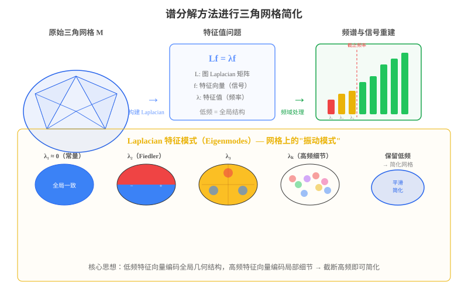

#### 三角网格作为信号通过用谱分解方法进行三角网格简化

将三角网格视为定义在图上的信号，利用**图信号处理（Graph Signal Processing）** 和**谱图理论（Spectral Graph Theory）** 的方法进行简化，是近年来网格处理的重要方向。

**从网格到图信号**：

给定三角网格 $M = (V, E, F)$，构造其**图 Laplacian 矩阵** $\mathbf{L}$：

$$\mathbf{L} = \mathbf{D} - \mathbf{W}$$

其中 $\mathbf{D}$ 是度矩阵，$\mathbf{W}$ 是邻接权重矩阵。常用**余切 Laplacian**：

$$L_{ij} = \begin{cases} -\frac{1}{2}(\cot \alpha_{ij} + \cot \beta_{ij}) & \text{if } (i,j) \in E \\ \sum_{k \in N(i)} \frac{1}{2}(\cot \alpha_{ik} + \cot \beta_{ik}) & \text{if } i = j \\ 0 & \text{otherwise} \end{cases}$$

**特征值分解**：

对 Laplacian 矩阵进行特征值分解：

$$\mathbf{L} \mathbf{f}_k = \lambda_k \mathbf{f}_k, \quad k = 1, 2, \ldots, |V|$$

其中 $0 = \lambda_1 \leq \lambda_2 \leq \cdots \leq \lambda_{|V|}$。

**特征值的几何含义**：

| 特征值 | 含义 | 对应的网格特征 |
|:---|:---|:---|
| $\lambda_1 = 0$ | 常量信号 | 平移（无几何意义） |
| $\lambda_2$ | Fiedler 值 | 网格的"刚度"，大尺度形状变化 |
| $\lambda_3 \sim \lambda_k$ | 中低频 | 全局弯曲、扭转等宏观几何特征 |
| $\lambda_k \sim \lambda_{|V|}$ | 高频 | 局部细节、噪声、微小凹凸 |

这类似于傅里叶分析——低频分量对应平滑的全局结构，高频分量对应局部细节和噪声。

**谱简化方法**：

**核心思想**：保留低频特征向量（编码全局几何结构），丢弃高频特征向量（编码局部细节），从而实现网格简化。

具体步骤：

1. **特征值分解**：计算 $\mathbf{L}$ 的前 $k$ 个最小特征值及其特征向量 $\{\mathbf{f}_1, \ldots, \mathbf{f}_k\}$
2. **信号投影**：将网格顶点坐标矩阵 $\mathbf{X} \in \mathbb{R}^{|V| \times 3}$ 投影到低频子空间
   $$\mathbf{X}_{\text{approx}} = \sum_{i=1}^{k} \mathbf{f}_i (\mathbf{f}_i^T \mathbf{X})$$
3. **重建简化网格**：利用投影后的信号重建几何形状
4. **重网格化（可选）**：在简化后的几何上重新生成均匀三角网格

**谱方法的变体**：

- **Spectral Mesh Simplification**（Karni & Gotsman, 2000）：将网格坐标投影到低维 Laplacian 特征空间，在频域中截断后重建
- **Spectral Compression**（Karni & Gotsman, 2000）：利用前几个非平凡特征向量作为编码基底，实现有损压缩
- **Spectral Geometry Processing**（Vallet & Lévy, 2008）：统一的谱域网格处理框架，支持滤波、简化、去噪等操作

**谱方法的优势与局限**：

| 优势 | 局限 |
|:---|:---|
| 理论优美，有坚实的数学基础 | 特征值分解计算量大（$O(n^3)$） |
| 能自动区分全局结构和局部细节 | 需要全局计算，不支持增量式处理 |
| 多尺度分析能力强 | 对非均匀网格效果可能不理想 |
| 可与压缩、去噪等操作统一处理 | 大规模网格（>100K 顶点）需要近似方法 |