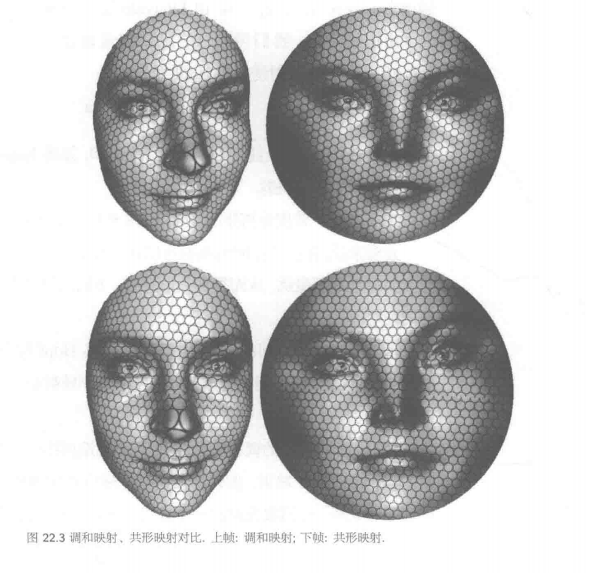

## 共形映射介绍

如图将一个三维人脸曲面映射到平面圆盘上。我们在人脸曲面任意画两条相交曲线，这两条曲面上的曲线被映射到平面上的两条曲线，空间曲线的交点被映成平面曲线的交点，在交点处，空间曲线的夹角等于平面曲线的夹角。这两条空间曲线任意选取，其夹角都被映射完美保持。

这种能保持局部角度的映射称为**保角映射**（Angle Preserving），在高等数学理论中称这类保持角度的映射为**共形映射(Conformal Mapping)**，它能最大程度地维持几何细节的形状不失真——因此是参数化算法中极具价值的研究方向。

前面介绍的墨卡托映射就是一种共形映射：各国面积虽被扭曲，但局部形状得以保持——对地图导航而言，角度保真度远比面积保真度重要，否则按地图导航将导致方向错误。

我们看到这类映射有非常良好的性质(具有直观和谐的美感，以及良好的物理属性)，事实上这类映射也具有良好的数学性质，对它们的研究归属于现代数学分支中的复分析以及黎曼几何理论。经过经年累月的研究可以说数学家们对共形映射的研究已经是颇为充分的了。首先是如下存在性的保证。

**黎曼映照定理(Riemann Mapping Theorem)**保证了数学上任意两个平面区域之间都是存在共形映射。

 设 $$\Omega \subset \mathbb{C}$$ 是单连通开集，$$\Omega \neq \mathbb{C}$$。对任意 $$z_0 \in \Omega$$，存在唯一全纯双射 $$f : \Omega \to \mathbb{D}$$ 

满足：  $$f(z_0) = 0 , f'(z_0) > 0$$ 其中$$\mathbb{D} = \{ z \in \mathbb{C} , |z|<1 \}$$。

理论上的存在性已经由黎曼映照定理保证，接下来的任务是通过变分的方法，构造一个能量泛函 $$E(f)$$ 然后通过最优化的方法来求解，从而得到具体的映射。

**调和 vs 共形**：共形映射一定是调和的，但调和映射一般**不共形**——它最小化拉伸能量，不保持角度。

