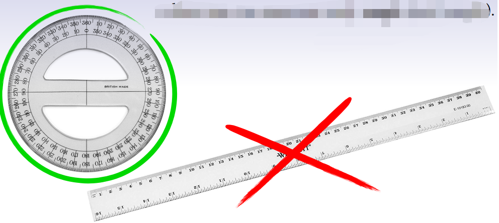
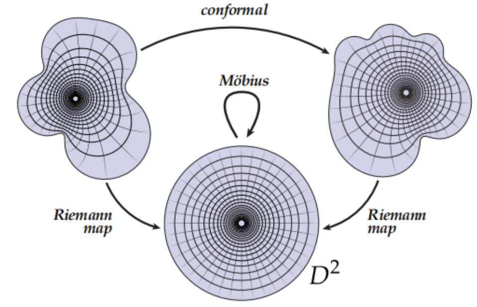
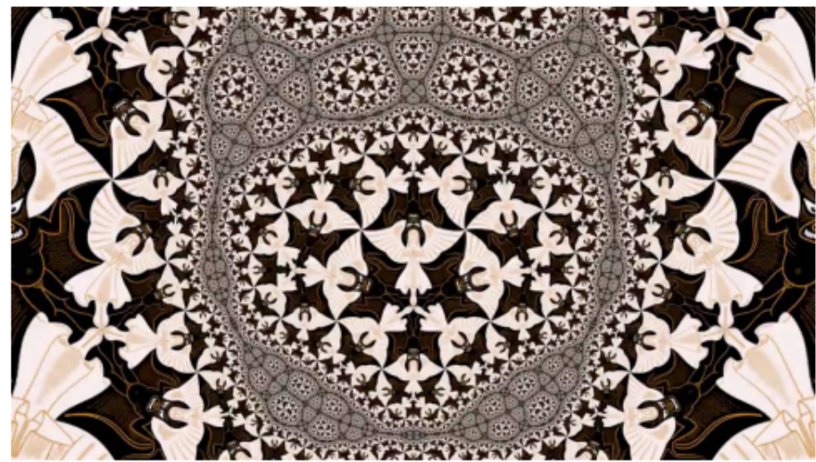
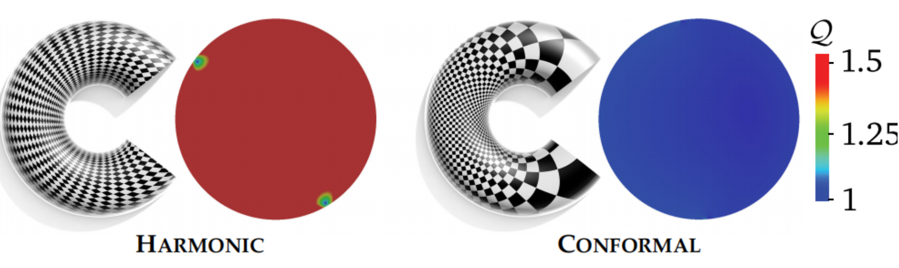

共形几何**只考虑角度**，而不需要考虑长度或距离的度量，这种能保持局部角度的映射称为**保角映射**（Angle Preserving），在高等数学理论中称这类保持角度的映射为**共形映射 (Conformal Mapping)**。

从共形几何的视角看来，我们初中所学的相似三角形可以认为是完全一样

## 平面到平面的共形映射

### CR 公式

设 $f:\mathbb{C}\to\mathbb{C}$，$f$ 为共形映射当且仅当对一切切向量 $X$ 与复数 $z$，微分满足

$$
df(zX)=z\,df(X)
\qquad (1)
$$

即在映射前或后对切向量做旋转/伸缩（乘以 $z$），结果一致。

将 $f=u+iv$ 写出，(1) 等价于 **Cauchy–Riemann 方程**：

$$
\frac{\partial u}{\partial x}=\frac{\partial v}{\partial y},\qquad
\frac{\partial u}{\partial y}=-\frac{\partial v}{\partial x}
\qquad (2)
$$

### 复平面黎曼映射定理（$g=0$，单连通）

**黎曼映照定理 (Riemann Mapping Theorem)**：设 $U\subsetneq\mathbb{C}$ 为单连通真子集，则存在共形映射

$$
f:U\xrightarrow{\text{共形}}\mathbb{D},\quad \mathbb{D}=\{z\in\mathbb{C}\mid|z|<1\}
$$

**唯一性（模 Möbius 变换）**：若 $f_1,f_2$ 均为 $U\to\mathbb{D}$ 的共形映射，则存在 $a\in\mathbb{D}$、$\theta\in\mathbb{R}$ 使
$$
f_2(z)=e^{i\theta}\,\frac{f_1(z)-a}{1-\bar{a}\,f_1(z)}
$$

单位圆盘到自身的共形自映射恰为上述 Möbius 变换（三个自由度：反演中心 $a$ 与旋转 $\theta$）。

理论上的存在性已经由黎曼映照定理保证，接下来的任务是通过变分的方法，构造能量泛函 $E(f)$，再通过最优化求解具体映射。

二维 **Möbius 变换**是保定向、将圆/直线映为圆/直线的共形映射，代数形式为

$$
z\mapsto \frac{az+b}{cz+d},\qquad ad-bc\neq 0
\qquad (3)
$$

Möbius 变换可视化可参考 [Möbius transformations revealed](https://www-users.cse.umn.edu/~arnold/moebius/)。

## 从曲面到平面的共形映射

如图将一个三维人脸曲面映射到平面圆盘上：任意两条相交曲线映到平面后，交点处夹角保持不变。

它能最大程度地维持几何细节的形状不失真。

墨卡托投影是共形映射的典型例子：面积虽被扭曲，局部形状与角度得以保持——对导航而言，角度保真远比面积保真重要。

## 共形映射的优势

共形映射在几何、物理与计算上性质良好，相关理论归属复分析与黎曼几何。

数值上，共形参数化只要求保角，离散后往往化为 Laplace 方程或线性最小二乘（LSCM、调和映射、ABF++ 等），一次线性求解即可。几何优化（BDHM/Lipman、ARAP 等）还需控制扭曲上界与无翻转，约束含 Jacobian 比值与范数，通常需 **SOCP** 或交替非线性迭代——共形计算更轻，几何优化换取对畸变的显式控制。

**调和 vs 共形**：共形映射一定是调和的，但调和映射一般**不共形**——它最小化 Dirichlet 能量（拉伸），不保持角度。

若强制指定边界上每点的像，一般得到**调和映射**，未必保角——边界被"钉死"后，内部为平滑插值，角度不再保持。

## 共形的离散化

三角网格上共形映射有两条路线（**Discretized** vs **Discrete**）：

| | Discretized（离散化） | Discrete（离散） |
|---|----------------------|-----------------|
| 保什么 | 细化极限下保角（如角度） | 粗网格上**精确**保某离散量（如 length cross ratio） |
| 视角 | 有限元 / 科学计算 | 离散微分几何 (DDG) |
| 计算 | 多为线性问题 | 可能需凸优化 |
| 代表算法 | LSCM、调和映射等 | 圆填充、CETM、inversive distance |

共形等价在连续和离散上的定义

这个定义是离散共形变换的核心。它并不是给每条边一个独立缩放系数，而是让边 $e_{ij}$ 的缩放由两个端点共同决定。这样做的好处是变量数只有 $|V|$ 个，并且每个三角形内部仍然可以由新的三条边长唯一确定新的角度。

保交比但不保角

