曲面参数化里，**度量**是连接几何与算法的核心对象：参数域里一个很小的向量，经映射到曲面或平面后，其长度、角度和面积如何变化，都由度量编码。本文沿 **正则性 → 诱导度量与基本型 → 参数化目标 → 理论背景** 这条线展开。

## 1. 正则性：Immersion、Embedding 与 Regular Homotopy

在讨论度量前，首先要保证映射局部不退化。设 $f:M\to N$ 光滑，若每点 $p$ 处微分 $df_p:T_pM\to T_{f(p)}N$ 是单射，即 $\operatorname{rank}(df_p)=\dim M$，则称 $f$ 为 **immersion（浸入）**。等价地，

$$
\left.df(X)\right|_p=0 \Longleftrightarrow \left.X\right|_p=0.
$$

**Embedding（嵌入）** 更强：除局部满秩外，还要求 $f:M\to f(M)$ 是同胚，从而排除全局自交。对二维曲面 $f:U\to\mathbb R^3$，局部 immersion 等价于 Jacobian $\nabla f$ 满列秩，即 $\det g>0$（$g=(\nabla f)^{\mathsf T}(\nabla f)$ 正定）；$\det g=0$ 处出现退化（坍缩或翻转），度量不再良定义。

| | Immersion | Embedding |
|:---|:---|:---|
| 局部条件 | 微分单射，Jacobian 满列秩 | 同左 |
| 全局条件 | 允许自交 | 全局单射，无自交 |
| 参数化意义 | 不翻转、不坍缩 | 不翻转且不重叠 |

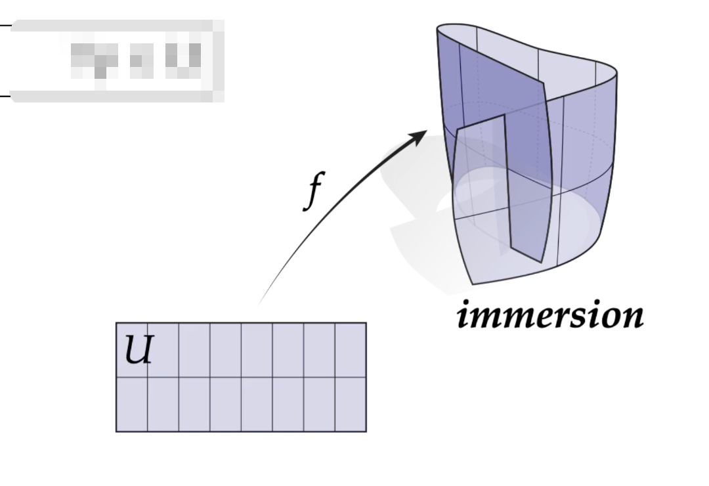

对曲面参数化 $f:M\to\Omega\subset\mathbb R^2$，局部 immersion 对应三角形不翻转（$\det J_f$ 同号），全局 embedding 对应参数域无重叠。LSCM、ARAP 等主要控制局部畸变，全局无重叠通常还需 Tutte embedding、MIPS 边界约束或 seam 处理等额外手段。

离散实现上，三角形 $T$ 上 $f$ 为仿射映射，$J_f$ 为 $2\times 2$ 常矩阵；$\det J_f>0$ 保证定向保持，$\det J_f<0$ 则三角形翻转。这是网格参数化中最早检查的合法性条件。

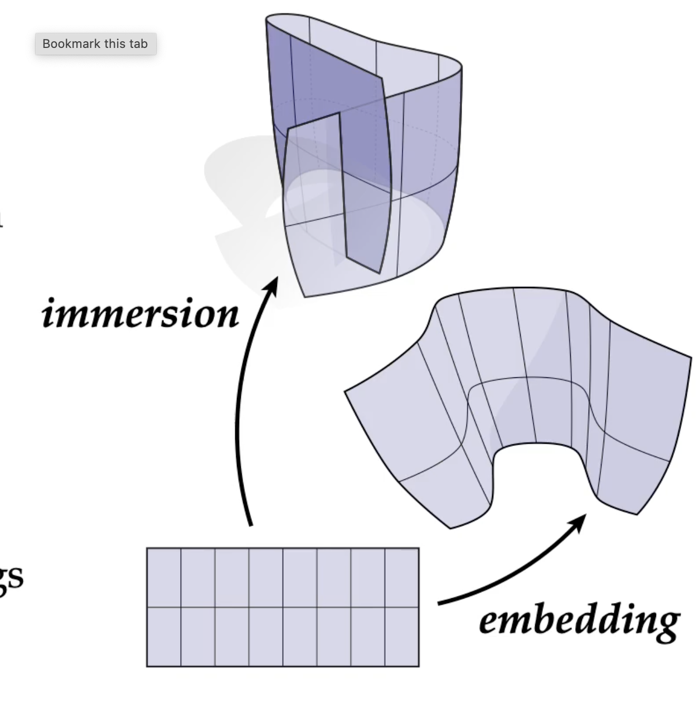

**Regular homotopy** 描述一族始终保持 immersion 的连续变形：若 $h:U\times[0,1]\to\mathbb R^3$ 满足 $h(\cdot,0)=f_0$、$h(\cdot,1)=f_1$，且每个 $h(\cdot,t)$ 都是 immersion，则 $f_0$ 与 $f_1$ regular homotopic。二维闭曲线的 Whitney-Graustein 定理说明其 regular homotopy 类由转数 $k$ 决定（$k=\pm1$ 对应两种取向的圆），故圆不能在保持 immersion 下翻转；三维中球面外翻则允许中间自交。Regular homotopy 与 isotopy 的区别在于：前者只要求每时刻局部不退化，后者还要求每时刻全局无自交——参数化优化中从初始解到目标解的连续路径，通常只保证局部合法性。

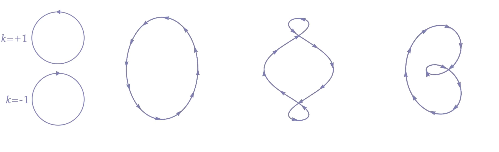

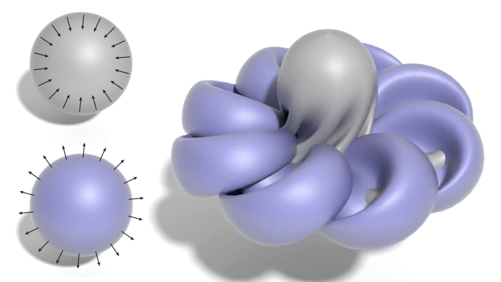

## 2. 诱导度量、第一基本型与第二基本型

参数域切向量 $X,Y$ 不能直接用平面欧氏内积测量，而应先用微分推到曲面切空间，再在环境空间中取内积：

$$
g_p(X,Y):=\langle df_p(X),df_p(Y)\rangle_{\mathbb R^3}.
$$

这就是**诱导度量**（pullback metric），记作 $f^*g_{\mathbb R^m}$，本质是环境空间 $\mathbb R^m$ 标准内积经 $f$ 拉回到 $M$ 上。坐标下 $df(X)=J_fX$，故

$$
g=J_f^{\mathsf T}J_f.
$$

直观上，$g$ 把参数域里"多长的向量"变成曲面/像空间里"实际有多长"。

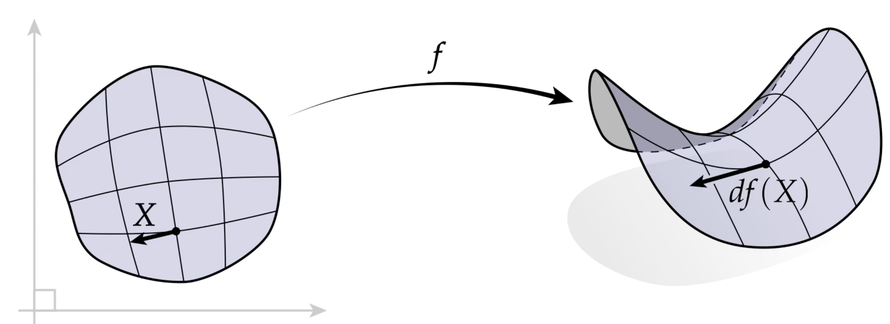

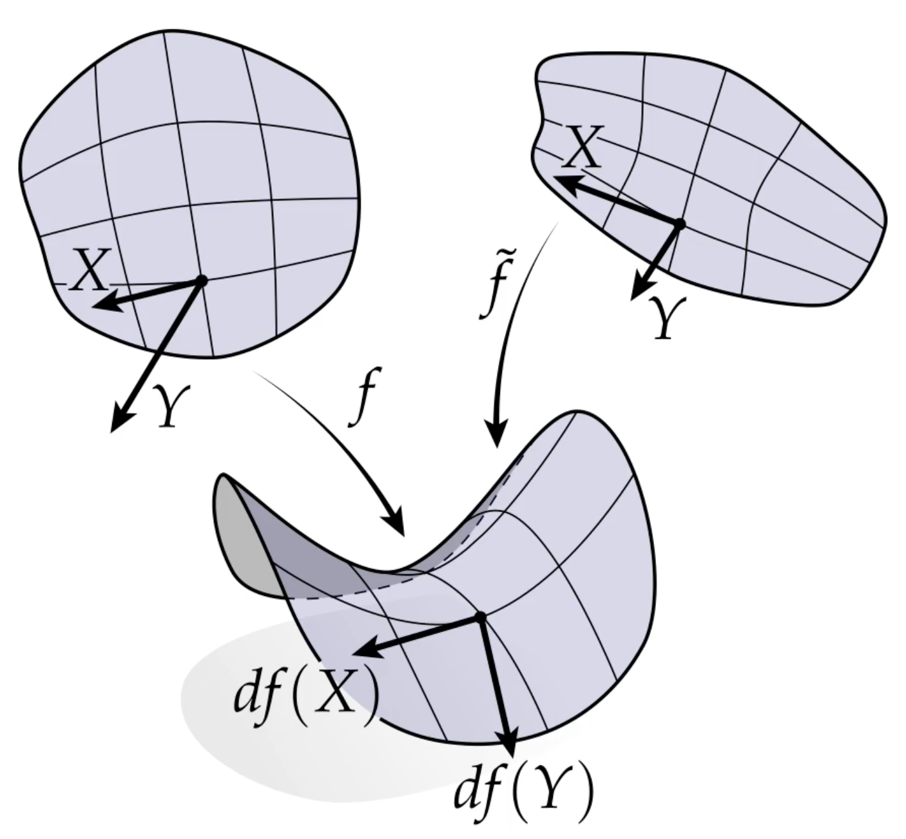

设 $f:\mathbb{R}^n\to\mathbb{R}^m$，$x_1,\ldots,x_n$ 为 $\mathbb{R}^n$ 上的坐标，$f^1,\ldots,f^m$ 为 $f$ 在 $\mathbb{R}^m$ 某一坐标系下的分量，则 **Jacobian 矩阵** 定义为

$$
J_f:=\begin{bmatrix}
\dfrac{\partial f^1}{\partial x^1} & \cdots & \dfrac{\partial f^1}{\partial x^n} \\
\vdots & \ddots & \vdots \\
\dfrac{\partial f^m}{\partial x^1} & \cdots & \dfrac{\partial f^m}{\partial x^n}
\end{bmatrix},
$$

它是微分的矩阵表示：$df(X)=J_fX$。

设曲面嵌入 $\mathbf r(u,v):U\to\mathbb R^3$，$\nabla\mathbf r=[\mathbf r_u\;\;\mathbf r_v]$，则

$$
g=(\nabla\mathbf r)^{\mathsf T}(\nabla\mathbf r)
=\begin{bmatrix}E&F\\F&G\end{bmatrix},
\qquad
I=E\,du^2+2F\,du\,dv+G\,dv^2,
$$

其中 $E=\|\mathbf r_u\|^2$，$F=\mathbf r_u\cdot\mathbf r_v$，$G=\|\mathbf r_v\|^2$。$F\neq 0$ 表示坐标线不正交；正交参数化下 $F=0$，度量对角化。

**第一基本型就是黎曼度量在局部坐标下的表达**，决定内蕴几何量：

$$
\|w\|_g^2=w^{\mathsf T}gw,
\qquad
\cos\theta=\frac{g(X,Y)}{\|X\|_g\|Y\|_g},
\qquad
dA=\sqrt{\det g}\,du\,dv.
$$

例如单位球面 $\mathbf r(\theta,\phi)=(\sin\theta\cos\phi,\sin\theta\sin\phi,\cos\theta)$，得 $E=1$，$F=0$，$G=\sin^2\theta$，面积元 $dA=\sin\theta\,d\theta\,d\phi$，与立体角公式一致。

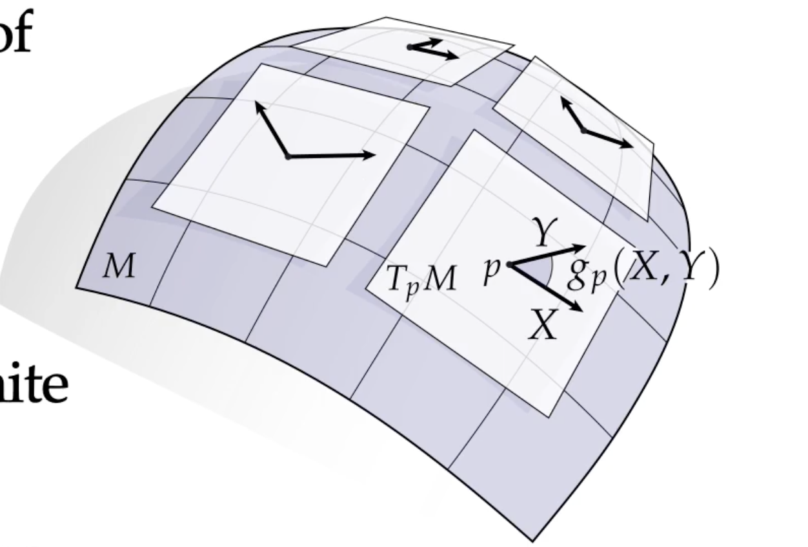

第二基本型则编码嵌入信息，描述曲面如何弯曲离开切平面。单位法向 $\mathbf n=(\mathbf r_u\times\mathbf r_v)/\|\mathbf r_u\times\mathbf r_v\|$，系数

$$
L=\mathbf r_{uu}\cdot\mathbf n,\quad
M=\mathbf r_{uv}\cdot\mathbf n,\quad
N=\mathbf r_{vv}\cdot\mathbf n,
\qquad
I\!I=L\,du^2+2M\,du\,dv+N\,dv^2.
$$

$I\!I$ 衡量切向量沿曲面法向方向的二阶偏离：$L,N$ 为 $u,v$ 方向的法曲率，$M$ 为扭率项。形状算子 $S=-d\mathbf n$ 把切向量映到法向曲率，其特征值为两主曲率 $\kappa_1,\kappa_2$，平均曲率 $H=(\kappa_1+\kappa_2)/2$，高斯曲率 $K=\kappa_1\kappa_2$。

平面弯成圆柱时第一基本型不变（内蕴几何相同），第二基本型改变——这正是"内蕴"与"外在"几何的分野。高斯曲率

$$
K=\frac{LN-M^2}{EG-F^2}
$$

虽由 $I$ 与 $I\!I$ 组合而成，却仅依赖第一基本型及其导数（高斯绝妙定理），是内蕴不变量。

**曲面基本定理（Bonnet 定理）**。第一基本型 $I$ 和第二基本型 $I\!I$ 并非独立——它们必须满足 **Gauss–Codazzi 方程**（可积性条件）：

- **Gauss 方程**：将高斯曲率 $K$ 表达为 $E,F,G$ 及其导数的函数，等价于绝妙定理；
- **Codazzi–Mainardi 方程**（两条）：
  $$
  L_v - M_u = L\,\Gamma_{12}^1 + M(\Gamma_{12}^2-\Gamma_{11}^1) - N\,\Gamma_{11}^2,
  $$
  $$
  M_v - N_u = L\,\Gamma_{22}^1 + M(\Gamma_{22}^2-\Gamma_{12}^1) - N\,\Gamma_{12}^2,
  $$
  其中 $\Gamma_{ij}^k$ 为 Christoffel 符号（由 $E,F,G$ 及其导数决定）。

若单连通域上给定 $I$（正定）和 $I\!I$（对称）满足 Gauss–Codazzi 方程，则存在**唯一**曲面（除刚体运动外）以它们为第一、第二基本型。这意味着：**第一+第二基本型完全决定曲面在 $\mathbb R^3$ 中的形状**——$I$ 给内蕴几何，$I\!I$ 给嵌入弯曲方式，两者通过 Gauss–Codazzi 方程耦合，不独立。

这是一个存在性与唯一性兼具的定理：给定度量（$I$）和弯曲方式（$I\!I$），只要 Gauss–Codazzi 条件满足，曲面就存在且唯一。它与前文的 Nash 嵌入定理互补：Nash 只从度量出发构造嵌入（不管 $I\!I$ 的具体形式），而 Bonnet 则精确刻画了 $I$ 与 $I\!I$ 配对实现为曲面的充要条件。

## 3. 参数化中的度量：目标、离散实现与共形

曲面处理中有两个方向相反的映射：

- **嵌入**：$\mathbf r:U\to M\subset\mathbb R^3$，诱导 $g_M=(\nabla\mathbf r)^{\mathsf T}(\nabla\mathbf{r})$；
- **展平**：$f:M\to\Omega\subset\mathbb R^2$，拉回 $f^*g_{\mathbb R^2}=J_f^{\mathsf T}J_f$。

参数化质量即比较 $f^*g_{\mathbb R^2}$ 与 $g_M$ 的差异：

| 类型 | 度量条件 | 保持性质 |
|:---|:---|:---|
| 等距 | $f^*g_{\mathbb R^2}=g_M$ | 长度、角度、面积 |
| 共形 | $f^*g_{\mathbb R^2}=\lambda g_M$ | 角度，面积可缩放 |
| 保面积 | 面积形式保持 | 面积，角度可扭曲 |

一般曲面不能无畸变展平（除非可展曲面 $K\equiv 0$），算法通常在三者间折中。常用畸变度量包括：

- **面积畸变**：$\det(J_f^{\mathsf T}J_f)$ 与 $\det g_M$ 之比；
- **角度畸变**：$\|J_f^{\mathsf T}J_f-\lambda I\|_F$，或 Cotan/LSCM 能量；
- **长度畸变**：$\|J_f^{\mathsf T}J_f-I\|_F$（ARAP 局部项）。

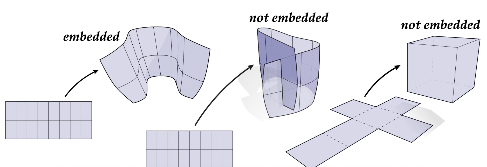

三角网格上 $f$ 分段线性，三角形 $T_i$ 上 Jacobian $J_i$ 为常，拉回度量 $g|_{T_i}=J_i^{\mathsf T}J_i$。若 $J_i^{\mathsf T}J_i=s_iI$（$s_i>0$），则局部相似、角度保持，即离散共形条件；若 $J_i^{\mathsf T}J_i=I$ 则局部等距。实际网格上 $s_i$ 往往仅近似相等，此时称**拟共形**（quasi-conformal），畸变由 Beltrami 系数 $\mu=\dfrac{\partial_{\bar z}f}{\partial_z f}$ 刻画。

两个度量 $g'=\lambda g$（$\lambda>0$）称**共形等价**，夹角公式中 $\lambda$ 分子分母相消。等温坐标下 $g=\lambda I$，即 $F=0,\;E=G=\lambda$——LSCM、Circle Patterns、Ricci 流、CETM 等算法本质上都在离散网格上寻找这样的坐标。共形映射下面积按 $\det J_f$ 缩放，故共形参数化天然允许面积变化，只强制角度一致。

**Enneper 曲面**是共形参数化的典型算例：

$$
f(u,v)=
\begin{bmatrix}
uv^2+u-\frac13u^3\\
\frac13v(v^2-3u^2-3)\\
(u-v)(u+v)
\end{bmatrix},
\qquad
J_f^{\mathsf T}J_f=(u^2+v^2+1)^2 I.
$$

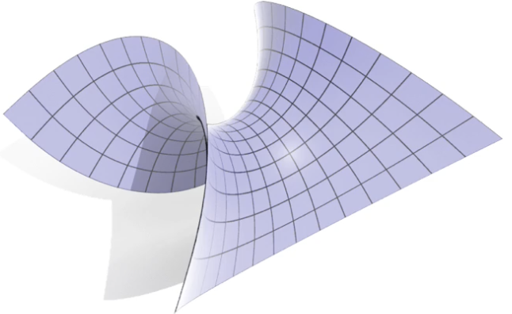

共形因子 $\phi(u,v)=u^2+v^2+1$，度量即 $\phi^2 I$。

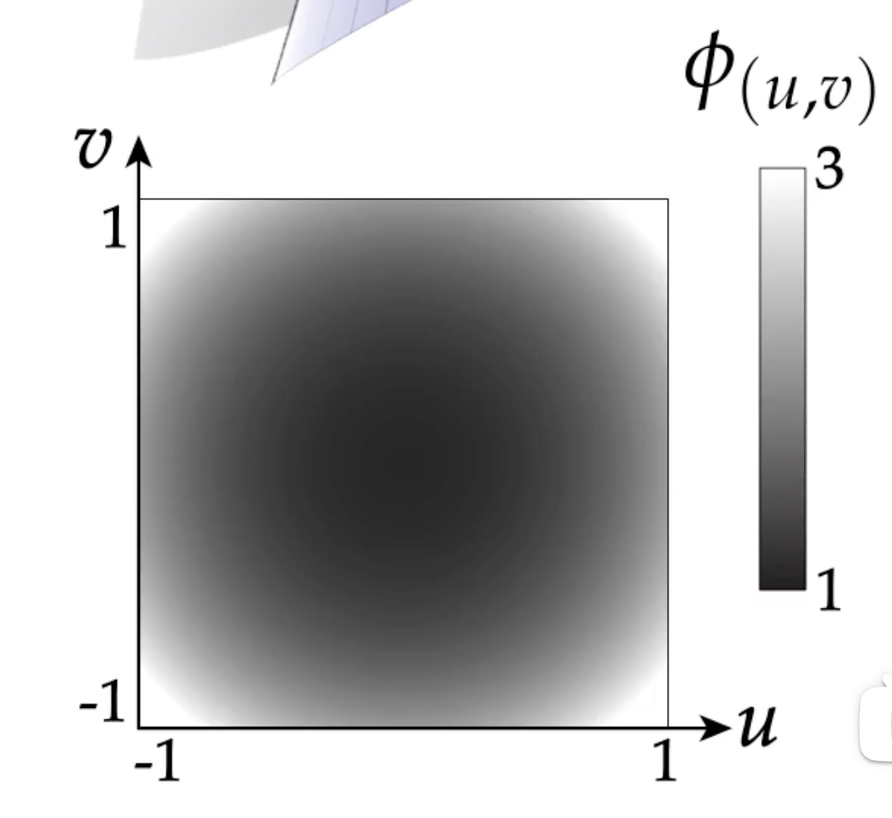

## 4. 理论背景：内蕴度量、图册与嵌入定理

度量不必来自具体嵌入——只要在每点切空间给定光滑正定内积 $g_p$，就得到黎曼流形 $(M,g)$，从而定义曲线长度、夹角、面积与测地距离。这与第一基本型 $I$ 的角色完全一致：$I$ 就是嵌入曲面上的内蕴度量。

### Poincaré 双曲度量

双曲平面 $\mathbb H^2$ 是常负曲率（$K\equiv -1$）的二维黎曼流形。**庞加莱圆盘模型**将 $\mathbb H^2$ 共形地放到单位圆盘 $\mathbb D=\{z\in\mathbb C:|z|<1\}$ 上。切向量 $X,Y\in T_p\mathbb D\cong\mathbb R^2$ 上的度量为

$$
g_p(X,Y)=\frac{4}{(1-\|p\|^2)^2}\langle X,Y\rangle,
\qquad
ds^2=\frac{4\,|dz|^2}{(1-|z|^2)^2}
=\frac{4\,(dx^2+dy^2)}{(1-x^2-y^2)^2}.
$$

这是欧氏度量的正标量倍，共形因子 $\lambda(z)=\dfrac{2}{1-|z|^2}$，故庞加莱圆盘是**共形模型**：双曲角与圆盘上的欧氏角一致，但长度被 $\lambda$ 非均匀拉伸。

几个关键性质：

1. **曲率**：可验证 $K\equiv -1$（常负曲率）。
2. **边界行为**：$|z|\to 1$ 时 $\lambda\to\infty$，靠近边界圆的单位切向量在双曲意义下长度趋于无穷——边界是"无穷远"，盘内任意点与边界的双曲距离为 $\infty$。
3. **测地距离**：两点 $z_1,z_2$ 的双曲距离
   $$
   d(z_1,z_2)=\operatorname{arcosh}\!\left(1+\frac{2|z_1-z_2|^2}{(1-|z_1|^2)(1-|z_2|^2)}\right).
   $$
   圆心附近近似欧氏距离，越靠边界增长越快。
4. **三角形**：双曲三角形内角和 $<180^\circ$；在圆盘可视化中，越靠外的三角形在欧氏视角下显得越"瘦"，但双曲意义下与内侧三角形相似。
5. **与嵌入的关系**：Hilbert 定理指出，完备的常负曲率曲面不能 $C^2$ 等距嵌入 $\mathbb R^3$。庞加莱圆盘因此不是等距模型，而是共形模型——它完整表示整个 $\mathbb H^2$，但边界处度量发散；这与 Enneper 曲面等正曲率嵌入形成对照。

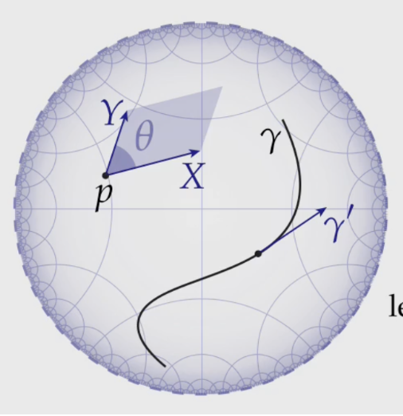

庞加莱圆盘可看作双曲平面的"地图投影"：像墨卡托投影保角不保面积一样，它保角而强烈扭曲长度与面积，却能在有限画面里表达无穷空间——后文圆填充、Ricci 流等算法在离散曲面上构造双曲结构时，本质上就是在寻找类似的共形坐标。

### 图册与度量相容

大多数曲面无法单 patch 参数化，需图册（atlas）$\{(U_i,\phi_i)\}$ 覆盖：每个 chart $\phi_i:U_i\to M$ 诱导局部度量

$$
g_i(X,Y)=\langle d\phi_i(X),d\phi_i(Y)\rangle_{\mathbb R^3},
$$

重叠区域上的坐标变换 $\phi_{ij}=\phi_j^{-1}\circ\phi_i$ 须满足相容条件

$$
g_j(d\phi_{ij}(X),d\phi_{ij}(Y))=g_i(X,Y).
$$

等价地，换坐标时度量张量按 $g'=(J_{\phi_{ij}}^{-1})^{\mathsf T}gJ_{\phi_{ij}}^{-1}$ 变换。全局参数化常需 seam：同一几何点在不同 chart 中坐标不同，但诱导的 $g$ 必须一致——这正是 UV 展开中 seam 处连续性约束的几何来源。

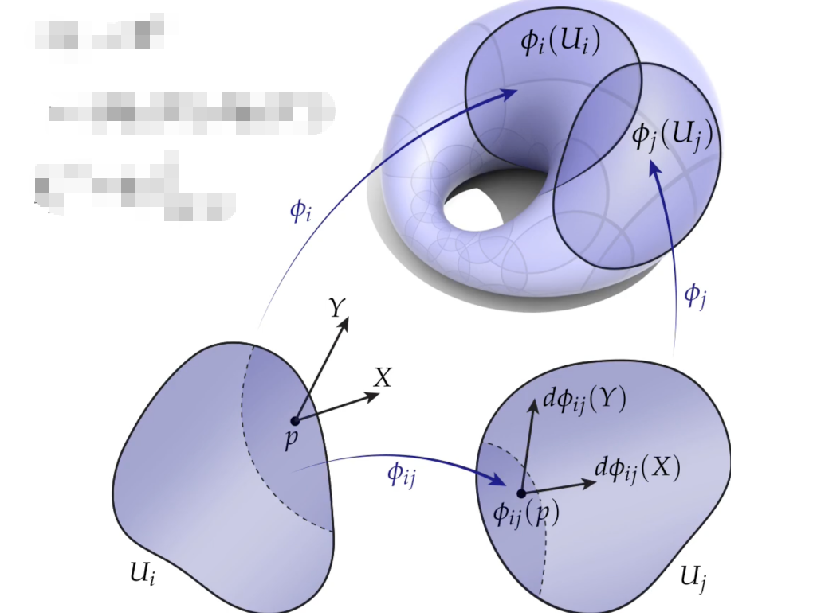

上图是两个 chart 的情形。$\phi_i:U_i\to M$ 把参数域 $U_i\subset\mathbb R^2$（或 $\mathbb C$）映到曲面上，重叠区 $U_i\cap U_j$ 上定义**转移函数**（transition map）

$$
\phi_{ij}=\phi_j^{-1}\circ\phi_i:\ U_i\cap U_j\ \longrightarrow\ \phi_j(U_j)\cap\phi_i(U_i)\subset\mathbb C.
$$

它在两个局部坐标之间换底：同一切向量 $X\in T_pM$ 在 $U_i$ 中坐标为 $X$，在 $U_j$ 中坐标为 $d\phi_{ij}(X)$。度量相容即要求两种坐标下内积一致：

$$
g_i(X,Y)=g_j\!\bigl(d\phi_{ij}(X),d\phi_{ij}(Y)\bigr)
\quad\Longleftrightarrow\quad
g_i=\phi_{ij}^{*}g_j.
$$

矩阵形式即 $g_i=J_{\phi_{ij}}^{\mathsf T}g_j J_{\phi_{ij}}$。因此"图册相容"不只是拓扑上能拼起来，更是**度量（或共形结构）在重叠区上相同**。

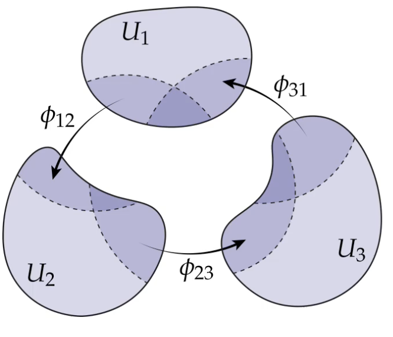

三个 chart $U_1,U_2,U_3$ 两两重叠时，转移函数还须满足**上循环条件**（cocycle condition）：在 $U_1\cap U_2\cap U_3$ 上有

$$
\phi_{13}=\phi_{23}\circ\phi_{12},
\qquad\text{等价地}\qquad
\phi_{31}\circ\phi_{23}\circ\phi_{12}=\mathrm{id}.
$$

沿 $U_1\to U_2\to U_3\to U_1$ 换坐标一圈应回到恒等——否则局部坐标无法定义全局一致的几何对象。图册 $\{(U_i,\phi_i)\}$ 加上所有满足 cocycle 的转移函数，才构成良定义的流形结构。

对**黎曼曲面**，还要求每个 $\phi_{ij}$ 为**全纯**（holomorphic）映射；由 C.R. 方程，全纯等价于共形，故转移函数自动保角。此时相容性有两层：

| 层次 | 条件 | 含义 |
|:---|:---|:---|
| 拓扑/光滑 | $\phi_{ij}\in C^\infty$，cocycle 成立 | 曲面可光滑拼接 |
| 共形/黎曼 | $\phi_{ij}$ 全纯，cocycle 成立 | 复结构全局一致，可谈共形参数化 |

参数化实践中，seam 两侧 UV 坐标即两个 chart 的重叠区；纹理、法线贴图要求 seam 处 $C^0$ 连续，而共形参数化（如 LSCM 加 seam 约束）则进一步要求两侧坐标通过某个 $\phi_{ij}$ 共形等价——这正是离散图册相容性在算法里的体现。
