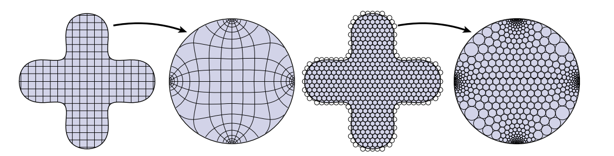
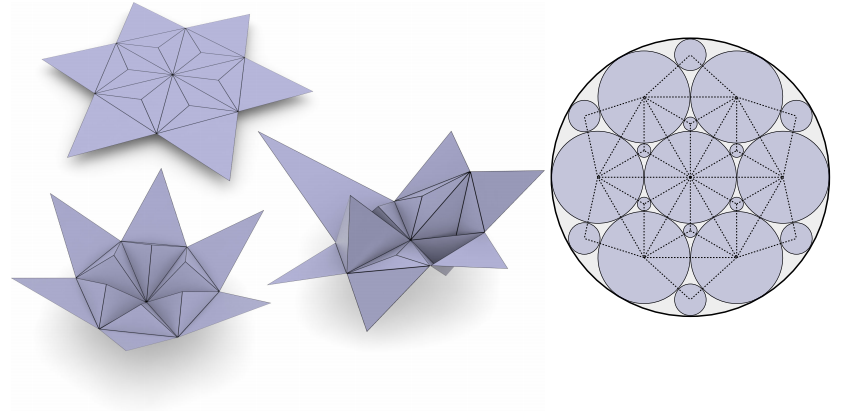

Thurston等人证明了可以通过圆形填充来对共形映射进行逼近，如图，左边是连续的共形映射，右边通过圆形填充将这个共形映射的局部作用用小圆来进行表现。

## Circle Packing与Circle Pattern

Circle Packing 有一个本质局限：**它只考虑了三角网格的连接性质，而没有充分考虑其几何性质（如原始三角形的角度信息）。**也就是说，Circle Packing 的参数化结果仅由图的拓扑结构决定，对原始几何的还原精度有限。

而**圆图案（Circle Pattern）** 是 Circle Packing 的推广，与 Circle Packing 要求圆与圆**相切**不同，Circle Pattern 允许相邻圆以**任意给定角度$\theta_e$ 相交**，从而因此**还需要角度可行性条件**。

每个三角形有一个外接圆，相邻三角形的外接圆以一定角度相交，相交角度称为**边权值（edge weight）$\theta_e$**，其与内角关系如下

$$
\forall e_{ij} \in E:\, \theta_e = \begin{cases} \displaystyle \pi - \alpha_{ij}^k - \alpha_{ij}^l & \text{for interior edges} \\[8pt] \displaystyle \pi - \alpha_{ij}^k & \text{for boundary edges} \end{cases}
\tag{1}
$$

通过保留圆之间的相交角度，将原始三角网格的几何信息（内角）编码进圆的配置中，从而得到更好的平面结构重建效果。

**求边权值(相交角度)以及对应的圆半径**，从而得到完整的圆配置，即参数化结果。

### 相干角系统（Coherent Angle System）约束

对于给定的**抽象三角网格**（只有顶点间连接关系，即单纯复形Simplicial Complex）和**一组边权值 $\{\theta_e\}$**，其 Circle Pattern 存在当且仅当 **Coherent Angle System（相干角系统）** 存在；

Coherent Angle System 是对每个三角形角的**一组赋值** $\{\hat\alpha_{ij}^k\}$，满足：

1. **正性**：$\hat\alpha_{ij}^k > 0$；
2. **三角形内角和**：每个三角形 $\hat\alpha_{ij}^k + \hat\alpha_{jk}^i + \hat\alpha_{ki}^j = \pi$；
3. **与边权一致**：将 $\hat\alpha$ 代入上式 (1)，恢复的 $\theta_e$ 等于给定的边权。

此外，边权 $\theta_e$ 本身须满足：

- **有界性**：$0 < \theta_e < \pi$；
- **内部顶点闭合**：$\displaystyle\sum_{e\ni v_i}\theta_e = 2\pi$（$v_i$ 为内部顶点）；
- **局部 Delaunay**：内部边 $e$ 两侧对角满足 $\hat\alpha_{ij}^k + \hat\alpha_{ij}^l < \pi$（等价于空外接圆 / 圆不相交“穿入”）。

原始角度值不一定能满足约束，我们通过优化手段找一个“最接近”的相干角系统

## 展开算法求解

需要在**尽量接近原始角度值**的前提下，寻找满足**相干角系统**约束的可行 $\hat\alpha$，并由此得到边权 $\theta_e$。这就导出如下**线性条件约束的二次优化(QP)问题**：

$$
Q(\hat{\alpha}) = \sum \left| \hat{\alpha}_{ij}^k - \alpha_{ij}^k \right|^2
$$

- **positivity（正性约束）**：$\displaystyle \forall \hat{\alpha}_{ij}^k : \hat{\alpha}_{ij}^k >0$
- **local Delaunay condition（局部 Delaunay 条件）**：$\displaystyle \forall e_{ij} \in E_\text{int} : \hat{\alpha}_{ij}^k + \hat{\alpha}_{ij}^l < \pi$
- **triangle sum condition（三角形内角和条件）**：$\displaystyle \forall t_{ijk} \in T : \hat{\alpha}_{ij}^k + \hat{\alpha}_{jk}^i + \hat{\alpha}_{ki}^j = \pi$
- **vertex sum condition（顶点角度和条件）**：$\displaystyle \forall v_k \in V_\text{int} : \sum_{t_{ijk}\ni v_k} \hat{\alpha}_{ij}^k = 2\pi$

上面约束等价于求解一个具有 $3|F|$ 个变量、$|F|+|E|$ 个等式约束的线性可行域，优化目标是一个二次函数。这是**第一步**：在相干角系统约束下求最接近原角的 $\hat\alpha$，得到边权 $\theta_e$。

### 变分法求圆半径（第二步）

令 $r_{ijk}$ 是顶点 $i$ 在三角形 $(i,j,k)$ 中的对应圆半径,我们在后续计算中,对圆半径取对数 $\rho_{ijk} = \log r_{ijk}$（取对数是为了保证 $r_i >0$ 并可以改善数值稳定性）

下面我们先看下**平坦性约束**与**kite 角度 $\varphi_e^k$ **：

$$
\varphi_e^k = \begin{cases} \displaystyle f_e(x) = \operatorname{atan2}(\sin\theta_e,\, e^x - \cos\theta_e) & e \in E_\text{int} \\[8pt] \displaystyle \pi - \theta_e & e \in E_\text{bdy} \end{cases}
$$

其中 $x = \rho_{ijk} - \rho_{jil}$，每个三角形中三个 kite 角之和等于 $2\pi$（绕一圈）：

$$
\forall t \in T:\, 0 = 2\pi - \sum_{e \in t} 2\varphi_e^t
$$

即是对圆半径的**平坦性约束**。记面 $t$ 的平坦性缺陷

$$
\Delta_t(\rho):=2\pi-\sum_{e\in\partial t}2\varphi_e^t(\rho).
$$

合法圆图案要求 $\Delta_t(\rho)=0$ 对每个三角形 $t$ 成立；内部边 $e=(k,\ell)$ 两侧 kite 角还需满足 $\varphi_e^{k}+\varphi_e^{\ell}=\theta_e$（外交角等于第一步给出的边权）。

#### 平坦性方程为何难解？

把上述条件对 $\rho$ 直接写成方程组 $\mathbf{F}(\rho)=\mathbf{0}$，会遇到以下困难：

1. **超越非线性**：内部边的 $\varphi_e^t=f_e(\rho_t-\rho_{t'})$ 含 $\operatorname{atan2}$ 与 $e^{\rho_t-\rho_{t'}}$，不是多项式，无法像第一步 QP 那样化为线性方程或闭式消元。
2. **全局耦合**：每条内部边连接两个三角形，变量 $\rho_t$ 同时出现在多个面的 $\Delta_t$ 与多条边的 kite 角中；$|T|$ 个面的平坦性方程共享 $|T|$ 个（面半径）或 $|V|$ 个（顶点半径）未知量，方程彼此缠绕，不能逐面独立求解。
3. **规模大、无闭式解**：未知数与方程数均为 $O(|T|)$ 或 $O(|V|)$，一般三角网格上只能数值求根；不存在用初等函数把 $\rho$ 用 $\theta_e$ 表出的公式。
4. **朴素数值法不稳**：若用「最小化 $\sum_t \Delta_t(\rho)^2$」等非凸残差平方，或对联立方程做无结构 Newton，可能陷入局部极小、对初值敏感；且难以先验判断解的唯一性。

因此第二步不能沿用第一步「线性约束 + 二次目标」的 QP 套路，需要另找结构。

**变分法间接求**：Bobenko–Springborn 构造凸能量 $S(\rho)$，使无约束极值的一阶条件 $\partial S/\partial\rho_t=0$ **等价于** $\Delta_t(\rho)=0$——平坦性与目标交角都不出现在 $S$ 的式子里，而落在极值条件中（见下文推导）。这是把「解非线性方程组 $\mathbf{F}(\rho)=\mathbf{0}$」转化为「求凸函数极小点」；**凸性**保证临界点即全局极小（模尺度），Newton 类方法数值可靠。

给定边权 $\theta_e$（第一步输出），求 $\rho=\log r$ 使几何与边权一致。通过几何关系，三角形内角可写为

$$
\alpha_{ij}^k = \alpha(\rho_i, \rho_j, \rho_k) = \arccos\left(\frac{r_i^2 + r_j^2 - r_k^2}{2r_i r_j}\right)
$$

有了角度构造能量泛函：

$$
E(\rho) = \sum_{t} \left(\mathcal{L}(\alpha_{ij}^k) + \mathcal{L}(\alpha_{jk}^i) + \mathcal{L}(\alpha_{ki}^j)\right) - \sum_e \theta_e \cdot \log r
$$

其中 $\mathcal{L}(\cdot)$ 是 **Lobachevsky 函数**：

$$
\mathcal{L}(x) = -\int_0^x \log|2\sin t| \, dt
$$

**为何选「双曲体积 + 线性项」？** Rivin 对偶把圆图案与理想双曲多面体对应；Milnor 定理给出每个三角形的 $\mathcal{L}(\alpha)$ 之和等于对应理想四面体体积。体积项对 $\rho$ 求导时，$\mathcal{L}'(\theta)=-\log|2\sin\theta|$ 自然串联圆半径、kite 角与三角形角，并在顶点处累加成离散曲率；线性项 $-\sum_e\theta_e\log r$ 则把第一步求出的目标交角 $\theta_e$ 写入能量。二者在极值处平衡，使「当前几何」与「目标边权」一致。

可以证明该能量关于 $\rho$ 是**凸的**；对**面半径**变量，一阶导数给出**面平坦性缺陷**（见下节推导）：

$$
\frac{\partial S}{\partial\rho_t}=\Phi_t-2\sum_{e\in\partial t}\varphi_e^t=0
\quad\Longleftrightarrow\quad
\sum_{e\in\partial t}2\varphi_e^t=2\pi.
$$

若以顶点变量 $\rho_i$ 书写，$\partial E/\partial\rho_i=K_i=0$ 对应**顶点**角和 $=2\pi$；在合法圆图案解上，面级 kite 平坦性与顶点级展平同时成立。三类几何要求在能量中的落点：**kite 面平坦**不在 $S(\rho)$ 中显式出现，而由 $\partial S/\partial\rho_t=0$ 保证；**交角 $=\theta_e$** 编入 $F_e$ 与线性项 $-\theta_e^{*}(\rho_k+\rho_\ell)$，极值时自动满足；**$r>0$** 由 $\rho=\log r$ 参数化保证。

### kite 平坦性与能量极值的等价（推导）

以下在**面半径** $\rho_t=\log r_t$（每个三角形外接圆一个变量，与代码 `CirclePatterns` 一致）下推导。记法跟随 Kharevych–Springborn–Schröder (2006) 与 Bobenko–Springborn (2004)。

#### 1. 平坦性缺陷

对三角形 $t$，其三边 $e\in\partial t$ 上的 kite 角 $\varphi_e^t$ 由式 (6) 给出（$x=\rho_t-\rho_{t'}$）。**kite 平坦性**即

$$
\Delta_t(\rho):=2\pi-\sum_{e\in\partial t}2\varphi_e^t=0.
$$

#### 2. 能量分解

定义（每条内部边 $e$，两侧面为 $k,\ell$）

$$
F_e(x):=\operatorname{Im}\,\mathrm{Li}_2\!\bigl(e^{x+i\theta_e}\bigr)
=\int_{-\infty}^{x} f_e(\xi)\,d\xi,
\qquad
f_e(x):=\operatorname{atan2}\!\bigl(\sin\theta_e,\;e^{x}-\cos\theta_e\bigr).
$$

当 $x=\rho_k-\rho_\ell$ 时 $f_e(x)=\varphi_e^{k}$。欧氏圆图案能量（内部面取 $\Phi_t=2\pi$）为

$$
S(\rho)=\sum_{e=(k,\ell)\in E_{\mathrm{int}}}
\Bigl[
F_e(\rho_k-\rho_\ell)+F_e(\rho_\ell-\rho_k)
-\theta_e^{*}(\rho_k+\rho_\ell)
\Bigr]
+\sum_{t\in T}\Phi_t\,\rho_t,
\qquad \theta_e^{*}:=\pi-\theta_e,
$$

其中 $\theta_e$ 为外交角（边权），$\theta_e^{*}$ 为内交角。第一项为两侧 kite 的双曲体积势；$-\theta_e^{*}(\rho_k+\rho_\ell)$ 为线性项；$\sum_t\Phi_t\rho_t$ 在内部面即 $\sum_t 2\pi\rho_t$。

#### 3. 三个引理

**引理 A（$F_e'=f_e$）** $\dfrac{d}{dx}\operatorname{Im}\,\mathrm{Li}_2(e^{x+i\theta_e})=f_e(x)$。（Bobenko–Springborn 附录式 (38)。）

**引理 B（kite 内角和）** 对内部边 $e$ 两侧面 $k,\ell$：

$$
f_e(\rho_k-\rho_\ell)+f_e(\rho_\ell-\rho_k)=\theta_e^{*}.
$$

即两圆心处 kite 角 $\varphi_e^{k}+\varphi_e^{\ell}=\pi-\theta_e^{*}=\theta_e$（外交角）。

**引理 C（单边对两面的梯度）** 记 $W_e:=F_e(\rho_k-\rho_\ell)+F_e(\rho_\ell-\rho_k)-\theta_e^{*}(\rho_k+\rho_\ell)$，则

$$
\frac{\partial W_e}{\partial\rho_k}+\frac{\partial W_e}{\partial\rho_\ell}=-2\theta_e^{*}.
$$

*证*：由引理 A，

$$
\frac{\partial W_e}{\partial\rho_k}=f_e(\rho_k-\rho_\ell)-f_e(\rho_\ell-\rho_k)-\theta_e^{*},
\quad
\frac{\partial W_e}{\partial\rho_\ell}=-f_e(\rho_k-\rho_\ell)+f_e(\rho_\ell-\rho_k)-\theta_e^{*}.
$$

相加并用引理 B 得 $-2\theta_e^{*}$。□

#### 4. 主命题：$\partial S/\partial\rho_t=-\Delta_t$

**命题（Bobenko–Springborn, Prop. 1）** 对内部面 $t$（$\Phi_t=2\pi$），

$$
\frac{\partial S}{\partial\rho_t}
=\Phi_t-2\sum_{e\in\partial t}\varphi_e^t
=-\,\Delta_t(\rho).
$$

*证*：$\dfrac{\partial}{\partial\rho_t}(\Phi_t\rho_t)=2\pi$。面 $t$ 的每条边 $e$ 只出现在唯一一项 $W_e$ 中；对该边求 $\partial/\partial\rho_t$，由引理 A 并在有向边界上取 $\varphi_e^t=f_e(\rho_t-\rho_{t'})$，三边累加得

$$
\frac{\partial S}{\partial\rho_t}=2\pi-2\sum_{e\in\partial t}\varphi_e^t.
$$

（与 Kharevych 式 (9) 及 `computeGradient` 中 `2π − Σ 2fe` 一致。）□

#### 5. 极值 ⟺ kite 平坦性

$$
\frac{\partial S}{\partial\rho_t}=0\;\forall t
\quad\Longleftrightarrow\quad
\Delta_t(\rho)=0\;\forall t
\quad\Longleftrightarrow\quad
\sum_{e\in\partial t}2\varphi_e^t=2\pi.
$$

因此 **kite 平坦性不在 $S(\rho)$ 中作为约束出现，而是无约束极值的一阶必要条件**；边权 $\theta_e$ 已编入 $F_e$ 与 $-\theta_e^{*}(\rho_k+\rho_\ell)$，极值时自动满足。

> **注**：$S$ 在整体缩放 $\rho\mapsto\rho+h\mathbf{1}$ 下不变需满足 $\sum_t\Phi_t$ 与 $\sum_e\theta_e^{*}$ 的相容性；数值上常固定 $\sum_t\rho_t=0$ 去除尺度自由度。$S$ 在可行域内严格凸（差一缩放方向），故临界点即全局极小，半径解在缩放意义下唯一。

实际上，上式体积项是各三角形对应**双曲理想四面体（Hyperbolic Ideal Tetrahedron）**体积之和（见 [双曲几何介绍]()）。实现中常用 Bobenko–Springborn 的边/kite 形式（`ImLi2Sum`），与 $\mathcal{L}(\alpha)$ 写法等价。 

