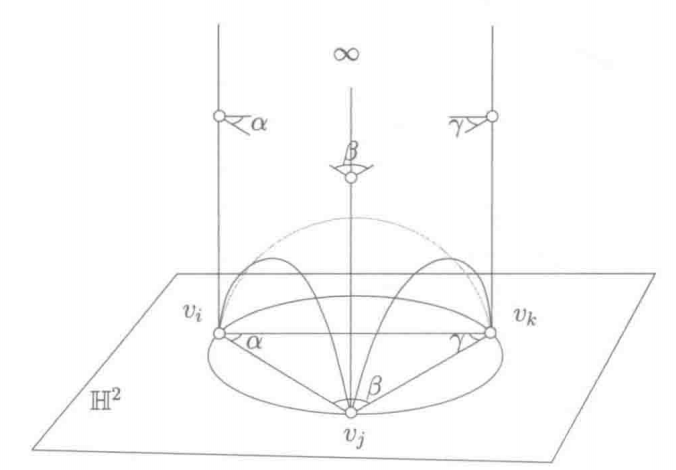

## Circle Packing与Circle Pattern

Circle Packing 有一个本质局限：**它只考虑了三角网格的连接性质，而没有充分考虑其几何性质（如原始三角形的角度信息）。**也就是说，Circle Packing 的参数化结果仅由图的拓扑结构决定，对原始几何的还原精度有限。

而**圆图案（Circle Pattern）** 是 Circle Packing 的推广，与 Circle Packing 要求圆与圆**相切**不同，Circle Pattern 允许相邻圆以**任意给定角度$\theta_e$ 相交**，从而因此**还需要角度可行性条件**。

每个三角形有一个外接圆，相邻三角形的外接圆以一定角度相交，相交角度称为**边权值（edge weight）$\theta_e$**

$$
\forall e_{ij} \in E:\, \theta_e = \begin{cases} \displaystyle \pi - \alpha_{ij}^k - \alpha_{ij}^l & \text{for interior edges} \\[8pt] \displaystyle \pi - \alpha_{ij}^k & \text{for boundary edges} \end{cases}
$$

通过保留圆之间的相交角度，将原始三角网格的几何信息（内角）编码进圆的配置中，从而得到更好的平面结构重建效果。

**求边权值(相交角度)以及对应的圆半径**，从而得到完整的圆配置，即参数化结果。

## 展开算法求解

对于空间中给定的三维三角网格，对于给定边权值 $\theta_e$（共形变换下保持不变）和一个抽象三角网格即单纯复形（Simplicial Complex），其 Circle Pattern 存在当且仅当 **Coherent Angle System（相干角系统）** 存在；在得到可行边权后，再通过变分法求解圆半径，从而确定完整的圆配置。

### Coherent Angle System（相干角系统）

**直观含义**：圆图案问题先指定每条边的**外交角** $\theta_e$（两相邻外接圆的外夹角），再求半径使配置在平面可展。但并非任意一组 $\theta_e$ 都能实现——需要存在一组**三角形内角** $\hat\alpha_{ij}^k$，在局部「看起来像」一个合法的平面三角剖分，且与 $\theta_e$ 通过圆的几何关系一致。这样一组 $\hat\alpha$ 称为相干角系统。

**边权与内角的关系**（Kharevych et al. 式 (1)）：对边 $e_{ij}$，

$$
\theta_e = \begin{cases}
\pi - \hat\alpha_{ij}^k - \hat\alpha_{ij}^l & e\in E_{\mathrm{int}} \\
\pi - \hat\alpha_{ij}^k & e\in E_{\mathrm{bdy}}
\end{cases}
$$

即内部边权 = 两侧三角形在该边处的**对角**之和的补角；边界边权 = 外接圆与边界直线（视为无穷大圆）的外交角。

**形式定义**（Rivin 1994; Bobenko–Springborn 2004）。相干角系统是对每个三角形角的一个赋值 $\{\hat\alpha_{ij}^k\}$，满足：

1. **正性**：$\hat\alpha_{ij}^k > 0$；
2. **三角形内角和**：每个三角形 $\hat\alpha_{ij}^k + \hat\alpha_{jk}^i + \hat\alpha_{ki}^j = \pi$；
3. **与边权一致**：将 $\hat\alpha$ 代入上式 (1)，恢复的 $\theta_e$ 等于给定的边权。

此外，边权 $\theta_e$ 本身须满足：

- **有界性**：$0 < \theta_e < \pi$；
- **内部顶点闭合**：$\displaystyle\sum_{e\ni v_i}\theta_e = 2\pi$（$v_i$ 为内部顶点）；
- **局部 Delaunay**：内部边 $e$ 两侧对角满足 $\hat\alpha_{ij}^k + \hat\alpha_{ij}^l < \pi$（等价于空外接圆 / 圆不相交「穿入」）。

由 (1) 与三角形内角和可推出：内部顶点处 $\hat\alpha$ 绕一圈和为 $2\pi$；边界顶点处和为 $\pi - \kappa_i$，其中 $\kappa_i = 2\pi - \sum_{e\ni v_i}\theta_e$ 为边界**离散曲率角**（多边形外角）。边界曲率总和须满足 Gauss–Bonnet：$\sum_{v_i\in\partial V}\kappa_i = 2\pi$。

**核心定理**：对拓扑圆盘上的三角剖分与满足上述条件的边权 $\theta$，圆图案问题有解（差一相似变换唯一）**当且仅当**相干角系统存在 [Rivin 1994; Bobenko–Springborn 2004]。

> **重要辨析：相干角系统 $\neq$ 圆图案本身**  
> 条件 (1)–(3) 只保证存在**一组正的内角**，使边权在代数上自洽；每个三角形仍只确定到**相似**，一般无法先画出各自大小的三角形再拼成平面网格（边长全局不兼容）。这正是 ABF 需要额外正弦积约束、而圆图案改在**半径空间**用 Bobenko–Springborn 能量求解的原因。相干角系统是**半径变分**的可解性前提，不是最终 UV。

Bobenko–Springborn 在**有向边**上还有等价表述：$\varphi_e + \varphi_{-e} = \theta_e^{*}$（$\theta_e^{*}=\pi-\theta_e$ 为内交角），每个面 $f$ 上 $\sum_{e\in\partial f} 2\varphi_e = \Phi_f$（平面情形 $\Phi_f=2\pi$）。这与下文 kite 角绕面一周 $2\pi$ 的平坦性在极值处一致。

**在算法中的位置**：原始网格角 $\alpha_{ij}^k$ 通常不能直接作 $\hat\alpha$（曲面非平坦，式 (1) 的 $\theta_e$ 会破坏顶点角和）。第一步在相干角系统约束下，求最接近 $\alpha$ 的可行 $\hat\alpha$，再读出 $\theta_e$；第二步固定 $\theta_e$ 极小化半径能量 $S(\rho)$。

### 相交角度求解

需要在尽量接近原始角度值的前提下，寻找满足**相干角系统**约束的可行 $\hat\alpha$，并由此得到边权 $\theta_e$。这导出如下**二次优化问题**：

**二次优化目标函数**：
$$
Q(\hat{\alpha}) = \sum \left| \hat{\alpha}_{ij}^k - \alpha_{ij}^k \right|^2
$$

约束即上节相干角系统的 (1)–(3) 及边权可行性条件，展开为：
- **positivity（正性约束）**：$\displaystyle \forall \hat{\alpha}_{ij}^k : \hat{\alpha}_{ij}^k >0$
- **local Delaunay condition（局部 Delaunay 条件）**：$\displaystyle \forall e_{ij} \in E_\text{int} : \hat{\alpha}_{ij}^k + \hat{\alpha}_{ij}^l < \pi$
- **triangle sum condition（三角形内角和条件）**：$\displaystyle \forall t_{ijk} \in T : \hat{\alpha}_{ij}^k + \hat{\alpha}_{jk}^i + \hat{\alpha}_{ki}^j = \pi$
- **vertex sum condition（顶点角度和条件）**：$\displaystyle \forall v_k \in V_\text{int} : \sum_{t_{ijk}\ni v_k} \hat{\alpha}_{ij}^k = 2\pi$

上面约束等价于求解一个具有 $3|F|$ 个变量、$|F|+|E|$ 个等式约束的线性可行域，优化目标是一个二次函数。

### 变分法求圆半径

令 $r_{ijk}$ 是顶点 $i$ 在三角形 $(i,j,k)$ 中的对应圆半径,对圆半径取对数 $\rho_{ijk} = \log r_{ijk}$（取对数是为了保证 $r_i >0$ 并改善数值稳定性）

**kite 角度 $\varphi_e^k$ 的计算**：

$$
\varphi_e^k = \begin{cases} \displaystyle f_e(x) = \operatorname{atan2}(\sin\theta_e,\, e^x - \cos\theta_e) & e \in E_\text{int} \\[8pt] \displaystyle \pi - \theta_e & e \in E_\text{bdy} \end{cases}
$$

其中 $x = \rho_{ijk} - \rho_{jil}$，每个三角形中三个 kite 角之和等于 $2\pi$（绕一圈），即**平坦性约束**：

$$
\forall t \in T:\, 0 = 2\pi - \sum_{e \in t} 2\varphi_e^t
$$

这是圆图案在平面可展的**几何语言**：直接求 $\rho$ 时，需同时满足上述平坦性与交角 $=\theta_e$。Bobenko–Springborn 变分法则把这一问题改写为**无约束凸极小化**——平坦性与目标交角都不出现在 $E(\rho)$ 的式子里，而体现在极值条件 $\partial E/\partial\rho_i=0$ 中（见下文）。

通过几何关系，角度可以表示为：

$$
\alpha_{ij}^k = \alpha(\rho_i, \rho_j, \rho_k) = \arccos\left(\frac{r_i^2 + r_j^2 - r_k^2}{2r_i r_j}\right)
$$

给定边权 $\theta_e$，目标是求圆半径 $r_i$，使相邻圆的交角等于 $\theta_e$。直接解半径方程很非线性。构造一个以 $\rho =\log r$ 为变量的凸能量，使用变分法来求解。

> **两阶段分工**：上文 QP 在角度空间求可行 $\theta_e$（显式 Coherent Angle System 约束）；下文在固定 $\theta_e$ 后求 $\rho$，改用无约束能量极小化，不再单独列出 kite 平坦性。

构造能量泛函：

$$
E(\rho) = \sum_{t} \left(\mathcal{L}(\alpha_{ij}^k) + \mathcal{L}(\alpha_{jk}^i) + \mathcal{L}(\alpha_{ki}^j)\right) - \sum_e \theta_e \cdot \log r
$$

其中 $\mathcal{L}(\cdot)$ 是 **Lobachevsky 函数**：

$$
\mathcal{L}(x) = -\int_0^x \log|2\sin t| \, dt
$$

**为何选「双曲体积 + 线性项」？** Rivin 对偶把圆图案与理想双曲多面体对应；Milnor 定理给出每个三角形的 $\mathcal{L}(\alpha)$ 之和等于对应理想四面体体积。体积项对 $\rho$ 求导时，$\mathcal{L}'(\theta)=-\log|2\sin\theta|$ 自然串联圆半径、kite 角与三角形角，并在顶点处累加成离散曲率；线性项 $-\sum_e\theta_e\log r$ 则把第一步求出的目标交角 $\theta_e$ 写入能量。二者在极值处平衡，使「当前几何」与「目标边权」一致。

可以证明该能量关于 $\rho$ 是**凸的**；对**面半径**变量，一阶导数给出**面平坦性缺陷**（见下节推导）：

$$
\frac{\partial S}{\partial\rho_t}=\Phi_t-2\sum_{e\in\partial t}\varphi_e^t=0
\quad\Longleftrightarrow\quad
\sum_{e\in\partial t}2\varphi_e^t=2\pi.
$$

若以顶点变量 $\rho_i$ 书写，$\partial E/\partial\rho_i=K_i=0$ 对应**顶点**角和 $=2\pi$；在合法圆图案解上，面级 kite 平坦性与顶点级展平同时成立。目标交角 $\theta_e$ 不是显式约束，而由线性项在极值时自动满足。

| 几何要求 | 在 $S(\rho)$ 中？ | 实际落点 |
|:---|:---|:---|
| kite 面平坦 | 否 | $\partial S/\partial\rho_t=0$（§推导） |
| 交角 $=\theta_e$ | 否 | 线性项 $-\theta_e^{*}(\rho_k+\rho_\ell)$ |
| $r>0$ | 否 | $\rho=\log r$ 参数化 |
实际上，上式体积项是各三角形对应**双曲理想四面体（Hyperbolic Ideal Tetrahedron）**体积之和（见 [双曲几何介绍]()）。实现中常用 Bobenko–Springborn 的边/kite 形式（`ImLi2Sum`），与 $\mathcal{L}(\alpha)$ 写法等价。

### kite 平坦性与能量极值的等价（推导）

以下在**面半径** $\rho_t=\log r_t$（每个三角形外接圆一个变量，与代码 `CirclePatterns` 一致）下推导。记法跟随 Kharevych–Springborn–Schröder (2006) 与 Bobenko–Springborn (2004)。

#### 1. 平坦性缺陷

对三角形 $t$，其三边 $e\in\partial t$ 上的 kite 角 $\varphi_e^t$ 由式 (6) 给出（$x=\rho_t-\rho_{t'}$）。**kite 平坦性**即

$$
\Delta_t(\rho):=2\pi-\sum_{e\in\partial t}2\varphi_e^t=0.
$$

#### 2. 能量分解

定义（每条内部边 $e$，两侧面为 $k,\ell$）

$$
F_e(x):=\operatorname{Im}\,\mathrm{Li}_2\!\bigl(e^{x+i\theta_e}\bigr)
=\int_{-\infty}^{x} f_e(\xi)\,d\xi,
\qquad
f_e(x):=\operatorname{atan2}\!\bigl(\sin\theta_e,\;e^{x}-\cos\theta_e\bigr).
$$

当 $x=\rho_k-\rho_\ell$ 时 $f_e(x)=\varphi_e^{k}$。欧氏圆图案能量（内部面取 $\Phi_t=2\pi$）为

$$
S(\rho)=\sum_{e=(k,\ell)\in E_{\mathrm{int}}}
\Bigl[
F_e(\rho_k-\rho_\ell)+F_e(\rho_\ell-\rho_k)
-\theta_e^{*}(\rho_k+\rho_\ell)
\Bigr]
+\sum_{t\in T}\Phi_t\,\rho_t,
\qquad \theta_e^{*}:=\pi-\theta_e,
$$

其中 $\theta_e$ 为外交角（边权），$\theta_e^{*}$ 为内交角。第一项为两侧 kite 的双曲体积势；$-\theta_e^{*}(\rho_k+\rho_\ell)$ 为线性项；$\sum_t\Phi_t\rho_t$ 在内部面即 $\sum_t 2\pi\rho_t$。

#### 3. 三个引理

**引理 A（$F_e'=f_e$）** $\dfrac{d}{dx}\operatorname{Im}\,\mathrm{Li}_2(e^{x+i\theta_e})=f_e(x)$。（Bobenko–Springborn 附录式 (38)。）

**引理 B（kite 内角和）** 对内部边 $e$ 两侧面 $k,\ell$：

$$
f_e(\rho_k-\rho_\ell)+f_e(\rho_\ell-\rho_k)=\theta_e^{*}.
$$

即两圆心处 kite 角 $\varphi_e^{k}+\varphi_e^{\ell}=\pi-\theta_e^{*}=\theta_e$（外交角）。

**引理 C（单边对两面的梯度）** 记 $W_e:=F_e(\rho_k-\rho_\ell)+F_e(\rho_\ell-\rho_k)-\theta_e^{*}(\rho_k+\rho_\ell)$，则

$$
\frac{\partial W_e}{\partial\rho_k}+\frac{\partial W_e}{\partial\rho_\ell}=-2\theta_e^{*}.
$$

*证*：由引理 A，

$$
\frac{\partial W_e}{\partial\rho_k}=f_e(\rho_k-\rho_\ell)-f_e(\rho_\ell-\rho_k)-\theta_e^{*},
\quad
\frac{\partial W_e}{\partial\rho_\ell}=-f_e(\rho_k-\rho_\ell)+f_e(\rho_\ell-\rho_k)-\theta_e^{*}.
$$

相加并用引理 B 得 $-2\theta_e^{*}$。□

#### 4. 主命题：$\partial S/\partial\rho_t=-\Delta_t$

**命题（Bobenko–Springborn, Prop. 1）** 对内部面 $t$（$\Phi_t=2\pi$），

$$
\frac{\partial S}{\partial\rho_t}
=\Phi_t-2\sum_{e\in\partial t}\varphi_e^t
=-\,\Delta_t(\rho).
$$

*证*：$\dfrac{\partial}{\partial\rho_t}(\Phi_t\rho_t)=2\pi$。面 $t$ 的每条边 $e$ 只出现在唯一一项 $W_e$ 中；对该边求 $\partial/\partial\rho_t$，由引理 A 并在有向边界上取 $\varphi_e^t=f_e(\rho_t-\rho_{t'})$，三边累加得

$$
\frac{\partial S}{\partial\rho_t}=2\pi-2\sum_{e\in\partial t}\varphi_e^t.
$$

（与 Kharevych 式 (9) 及 `computeGradient` 中 `2π − Σ 2fe` 一致。）□

#### 5. 极值 ⟺ kite 平坦性

$$
\frac{\partial S}{\partial\rho_t}=0\;\forall t
\quad\Longleftrightarrow\quad
\Delta_t(\rho)=0\;\forall t
\quad\Longleftrightarrow\quad
\sum_{e\in\partial t}2\varphi_e^t=2\pi.
$$

因此 **kite 平坦性不在 $S(\rho)$ 中作为约束出现，而是无约束极值的一阶必要条件**；边权 $\theta_e$ 已编入 $F_e$ 与 $-\theta_e^{*}(\rho_k+\rho_\ell)$，极值时自动满足。

> **注**：$S$ 在整体缩放 $\rho\mapsto\rho+h\mathbf{1}$ 下不变需满足 $\sum_t\Phi_t$ 与 $\sum_e\theta_e^{*}$ 的相容性；数值上常固定 $\sum_t\rho_t=0$ 去除尺度自由度。$S$ 在可行域内严格凸（差一缩放方向），故临界点即全局极小，半径解在缩放意义下唯一。

