## 曲面的第一基本型与第二基本型

设曲面参数化为 $\mathbf{r}(u,v)$，记偏导数 $\mathbf{r}_u = \frac{\partial \mathbf{r}}{\partial u}$，$\mathbf{r}_v = \frac{\partial \mathbf{r}}{\partial v}$，二阶偏导 $\mathbf{r}_{uu}, \mathbf{r}_{uv}, \mathbf{r}_{vv}$。单位法向量为：

$$
\mathbf{n} = \frac{\mathbf{r}_u \times \mathbf{r}_v}{\|\mathbf{r}_u \times \mathbf{r}_v\|}
$$

**第一基本形式（First Fundamental Form）**
$$
I = E\,du^2 + 2F\,du\,dv + G\,dv^2\\
E = \mathbf{r}_u \cdot \mathbf{r}_u,\quad
F = \mathbf{r}_u \cdot \mathbf{r}_v,\quad
G = \mathbf{r}_v \cdot \mathbf{r}_v
$$

**第二基本形式（Second Fundamental Form）**的系数为法向量在曲面弯曲方向上的投影
$$
L = \mathbf{r}_{uu} \cdot \mathbf{n},\quad
M = \mathbf{r}_{uv} \cdot \mathbf{n},\quad
N = \mathbf{r}_{vv} \cdot \mathbf{n}\\
I\!I = L\,du^2 + 2M\,du\,dv + N\,dv^2
$$

**第一基本型与度量的关系**。第一基本形式 $I$ 的系数矩阵

$$
g = \begin{bmatrix} E & F \\ F & G \end{bmatrix}
$$

正是曲面在参数化 $(u,v)$ 下的**黎曼度量（Riemannian metric）**。它完全决定了曲面的内蕴几何——长度、角度、面积均由此导出：切向量 $v = (du,dv)$ 的长度平方为 $v^{\mathsf T}g\,v$，面积元素为 $\sqrt{\det g}\,du\,dv$。简言之，**第一基本型 = 度量**。

**嵌入如何生成度量**。度量并非凭空定义——它由曲面 $\mathbf{r}$ 在 $\mathbb R^3$ 中的**嵌入方式**诱导。设映射 $\mathbf{r}:(u,v)\to\mathbb R^3$，$\mathbb R^3$ 自带标准欧氏内积（单位矩阵 $I_3$）。通过拉回（pullback）操作：

$$
g = \mathbf{r}^* I_3 = (\nabla\mathbf{r})^{\mathsf T}(\nabla\mathbf{r}),
\qquad \nabla\mathbf{r} = [\mathbf{r}_u\;\; \mathbf{r}_v] \in \mathbb R^{3\times 2}.
$$

展开即 $E=\mathbf{r}_u\cdot\mathbf{r}_u$, $F=\mathbf{r}_u\cdot\mathbf{r}_v$, $G=\mathbf{r}_v\cdot\mathbf{r}_v$——度量 $g$ 无非是把 $\mathbb R^3$ 的空间内积"拉回"到参数域上。**脱离嵌入就没有这个具体的度量**：同一个参数域配上不同的嵌入 $\mathbf{r}$，即使 $(u,v)$ 坐标网相同，度量系数 $E,F,G$ 也会随之改变。度量是嵌入的"指纹"——它记住了曲面在空间中的拉伸与剪切模式。

反过来说，**Nash 嵌入定理**断言：任意抽象黎曼流形（仅给定光滑对称正定度量 $g$）都可以等距嵌入到足够高维的欧氏空间中。因此，**度量定义于内、诱导自外**——它是内蕴几何的载体，却又由嵌入在 $\mathbb R^3$（或更高维空间）中的位置与弯曲完全决定。

**第二基本型取决于空间的嵌入**。第二基本形式 $ I\!I $ 的系数 $L,M,N$ 定义为曲面二阶导数在**法向量 $\mathbf{n}$** 上的投影：$L=\mathbf{r}_{uu}\cdot\mathbf{n}$ 等。因此 $ I\!I $ 并非内蕴量——它依赖于曲面在 $\mathbb R^3$ 中的弯曲方式（嵌入）。如果改变曲面的嵌入（例如将平面弯曲为柱面），第一基本型不变（内蕴几何相同），但第二基本型会随之改变。

高斯曲率 $K = \det(I^{-1}I\!I) = \frac{LN-M^2}{EG-F^2}$ 虽然由 $I$ 和 $ I\!I $ 组合而成，却最终仅依赖于 $E,F,G$ 及其导数——它是一个**内蕴不变量**（**高斯绝妙定理**），不随嵌入改变。

## 嵌入与参数化映射

曲面处理中有两个方向相反的映射，需要区分清楚：

- **嵌入（Embedding）**：$\mathbf{r}:(u,v)\to\mathbb R^3$，将二维参数域"嵌入"到三维空间，赋予曲面其空间形状。嵌入诱导度量 $g_{\text{embed}} = (\nabla\mathbf{r})^{\mathsf T}(\nabla\mathbf{r})$。
- **参数化（Parameterization）**：$f:M\to\Omega\subset\mathbb R^2$，将三维曲面"展平"到二维参数域。它定义了一个"拉平"度量 $g_{\text{param}} = (\nabla f)^{\mathsf T}(\nabla f)$。

对于单连通曲面片（拓扑圆盘），$f$ 本质上可视为 $\mathbf{r}$ 的逆映射。两者的 Jacobian 在切空间上互逆：$(\nabla f)(\nabla\mathbf{r}) = I_{2\times 2}$ 或差一个旋转，因此它们的度量通过

$$
g_{\text{param}} = (\nabla\mathbf{r})^{-\mathsf T}\,g_{\text{embed}}\,(\nabla\mathbf{r})^{-1}
$$

相关联。参数化 $f$ 的质量标准就取决于 $g_{\text{param}}$ 与某个目标度量（通常是单位矩阵 $I$ 或缩放版本 $sI$）的差异：

| 参数化类型 | 条件 | 保持的性质 |
|:---|:---|:---|
| **等距（Isometric）** | $g_{\text{param}} = I$ | 长度、角度、面积全不变 |
| **共形（Conformal）** | $g_{\text{param}} = s\,I$ | 角度不变，面积可缩放 |
| **保面积（Authalic）** | $\det g_{\text{param}} = 1$ | 面积不变，角度可扭曲 |

一般曲面不能同时等距展平（除非可展曲面，如柱面、锥面），因此参数化通常是以上目标的折中。

## Embedding与Immersion

在微分几何中，**Immersion（浸入）** 与 **Embedding（嵌入）** 是描述映射"局部—整体"性质的重要区分。

**Immersion（浸入）**。映射 $f:M\to N$ 为浸入，若在每点 $p\in M$ 处其微分 $df_p:T_pM\to T_{f(p)}N$ 是**单射**（即 Jacobian 满列秩，秩 $=\dim M$）。直观上，浸入局部地像是一个嵌入——在充分小的邻域内曲面不会自交或折叠。但**整体上允许自交**：例如平面上的"8字形"曲线是 $\mathbb R\to\mathbb R^2$ 的浸入，却在交叉点发生了全局自交。

**Embedding（嵌入）**。嵌入是浸入 + 拓扑条件：$f$ 是浸入，且 $f:M\to f(M)$ 是**同胚**（连续双射且逆连续）。这意味着曲面不仅局部平坦，而且**全局无双重点、无边界面接触**。嵌入 = 局部浸入 + 全局单射。

| | Immersion | Embedding |
|:---|:---|:---|
| 局部 | 微分单射，每点邻域内无折叠 | 同左 |
| 全局 | **允许自交** | **禁止自交**，是 $M$ 与像集间的同胚 |
| 例子 | Klein 瓶在 $\mathbb R^3$ 中可浸入不可嵌入 | 球面 $S^2$ 在 $\mathbb R^3$ 中为嵌入 |
| rank 条件 | $\operatorname{rank}(df_p) = \dim M$ | 同左 + 单射 |

**与曲面参数化的关系**。参数化 $f:M\to\mathbb R^2$ 的理想性质是成为**嵌入**：三角形不应翻转（局部浸入条件满足），也不应发生全局重叠（全局单射条件满足）。四边形网格化对 cross field 的参数化要求尤为严格——若 $f$ 仅为浸入而非嵌入，等值线会在自交处产生歧义的参数值，破坏四边形网格的拓扑正确性。因此参数化算法（如 Tutte、LSCM、ARAP）通常需要显式保证 $f$ 为嵌入。

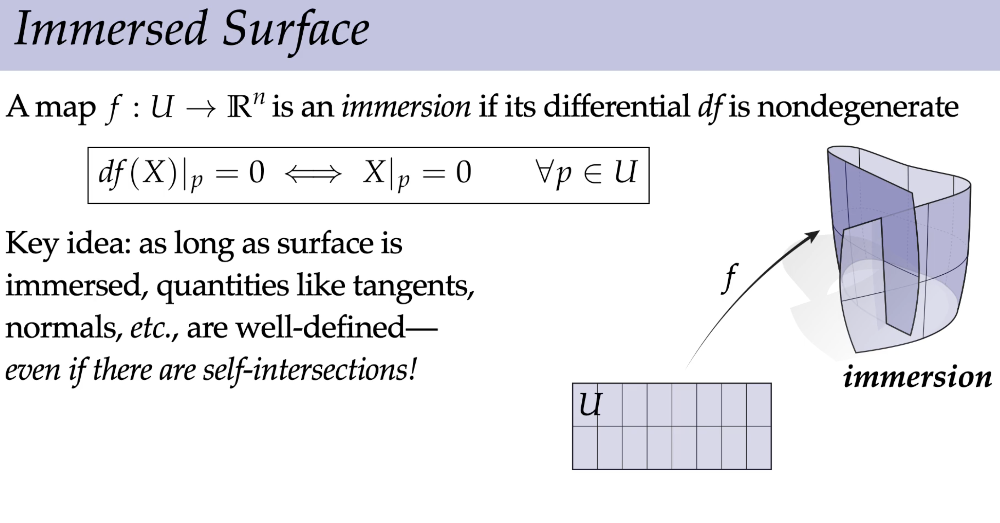

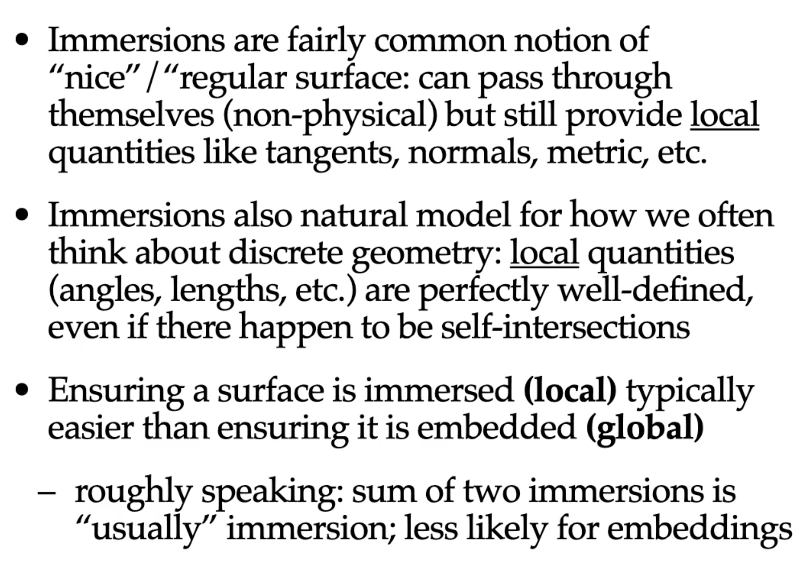

## 曲面的黎曼度量

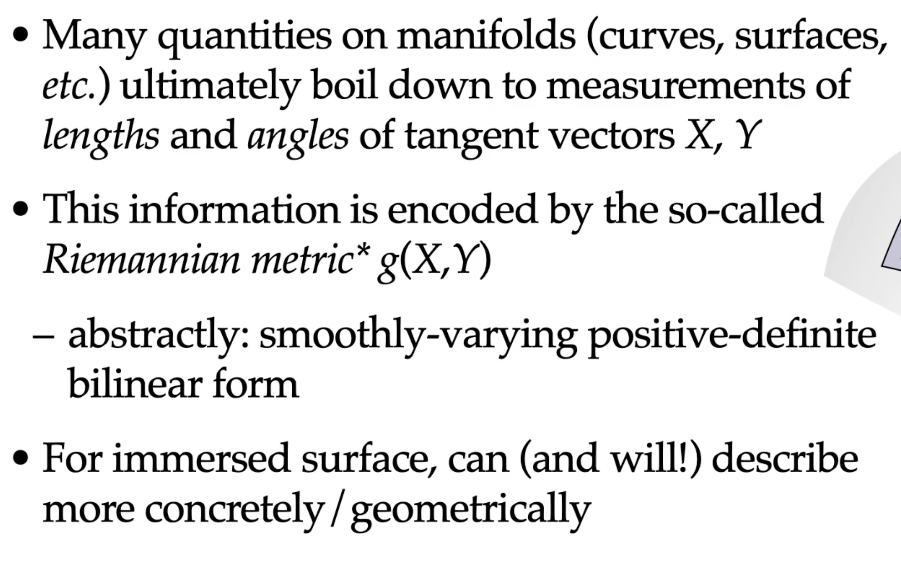

**黎曼度量**是曲面上一个**逐点定义的光滑正定对称双线性型**——在每点 $p$ 的切空间 $T_pM$ 上赋予一个内积 $g_p(\cdot,\cdot)$，使得可以测量切向量的长度与夹角，进而定义曲线弧长、面积、角度等所有内蕴几何量。

在局部坐标 $(u,v)$ 下，度量表示为 $2\times 2$ 对称正定矩阵：

$$
g = \begin{bmatrix} g_{11} & g_{12} \\ g_{12} & g_{22} \end{bmatrix},
\qquad g_{ij} = \left\langle\frac{\partial}{\partial u_i},\frac{\partial}{\partial u_j}\right\rangle.
$$

这正是前文的第一基本形式系数 $E=g_{11}$, $F=g_{12}$, $G=g_{22}$。**度量是第一基本型的现代微分几何语言**——两者是同一物体的不同名称。

**从嵌入到抽象度量**。前面已说明，曲面在 $\mathbb R^3$ 中的嵌入 $\mathbf{r}$ 通过拉回操作 $g = (\nabla\mathbf{r})^{\mathsf T}(\nabla\mathbf{r})$ 自然携带一个度量。但黎曼度量的概念可以**脱离嵌入独立存在**：只需在拓扑流形上指定一个光滑的正定对称 $2$-张量场，就定义了一个**抽象黎曼曲面（Riemannian manifold）**——它有自己的内在几何，不必嵌入任何外围空间。

## 嵌入定理 (Embedding Theorem)

嵌入定理回答了一个根本问题：**什么条件下一个抽象的几何对象可以在某个空间里"坐实"为一个具体的子流形？** 这对曲面参数化尤为重要——我们处理的三角网格就是抽象曲面在 $\mathbb R^3$ 中的一个离散嵌入。

**Nash 嵌入定理（1954/1956）**。任意 $n$ 维光滑黎曼流形 $(M,g)$ 可**等距地**嵌入到欧氏空间 $\mathbb R^k$ 中，即存在光滑映射 $\iota:M\to\mathbb R^k$ 使 $g = \iota^* I_k$（嵌入的拉回度量等于原度量）。经典版本中 $k$ 较高：$C^k$ 流形需 $k \le n(3n+11)/2$；Gromov 等后续工作将此大幅改进。核心信息：**任何度量都有几何实现**——抽象定义的度量 $g$ 永远对应某个高维欧氏空间里的具体曲面形状。前文"度量定义于内、诱导自外"正是此定理的直接推论。

**Whitney 嵌入定理（1936）**。任意光滑 $n$ 维流形可（拓扑地）嵌入到 $\mathbb R^{2n}$ 中；若 $n>1$ 且紧致，则可浸入 $\mathbb R^{2n-1}$。对曲面（$n=2$），Whitney 要求 $\mathbb R^4$；但实践中几乎所有模型曲面都可嵌入到 $\mathbb R^3$ 中（亏格不受限，仅需无交叉 cap 等）。

**单值化定理（Uniformization Theorem）**。任意单连通黎曼曲面**共形等价**于三者之一：黎曼球面 $S^2$、复平面 $\mathbb C$、或单位圆盘 $\mathbb D$。这是曲面参数化的理论根基：
- $S^2$ 对应闭曲面球面参数化
- $\mathbb C$ 对应平面参数化（如无边网格的 LSCM、CP）
- $\mathbb D$ 对应有边界曲面的单位圆盘参数化（如 Tutte 嵌入）

从实现角度，单值化定理将参数化问题转化为：**给定三角网格，如何构造从网格到其中之一标准域的离散共形映射？** 本系列的所有共形参数化算法（LSCM、Circle Patterns、Ricci 流、CETM 等）均为此问题的不同解决路线。

## Regular Homotopy

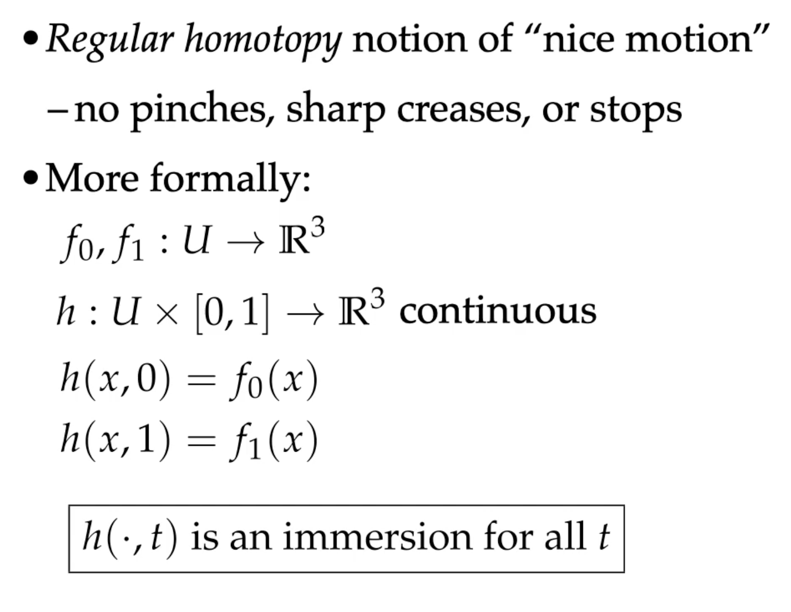

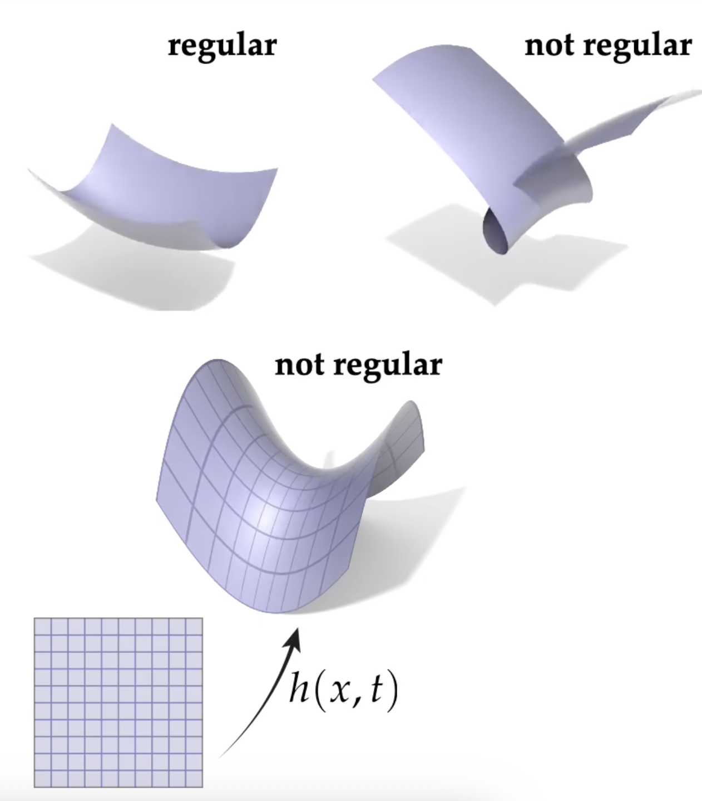

2D Circle无法翻转

#### 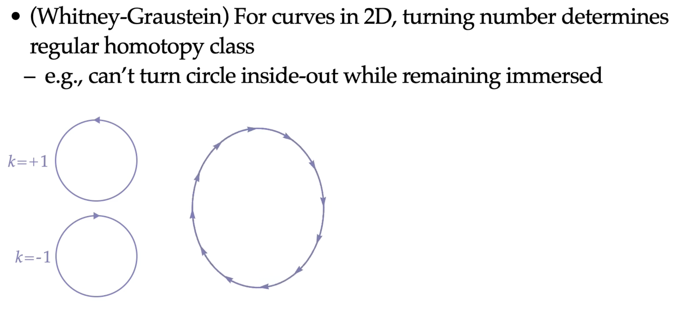

但是3维情况下球面可以外翻

## 微分诱导的度量

#### 微分可以认为是一个小箭头从参数域push到曲面上

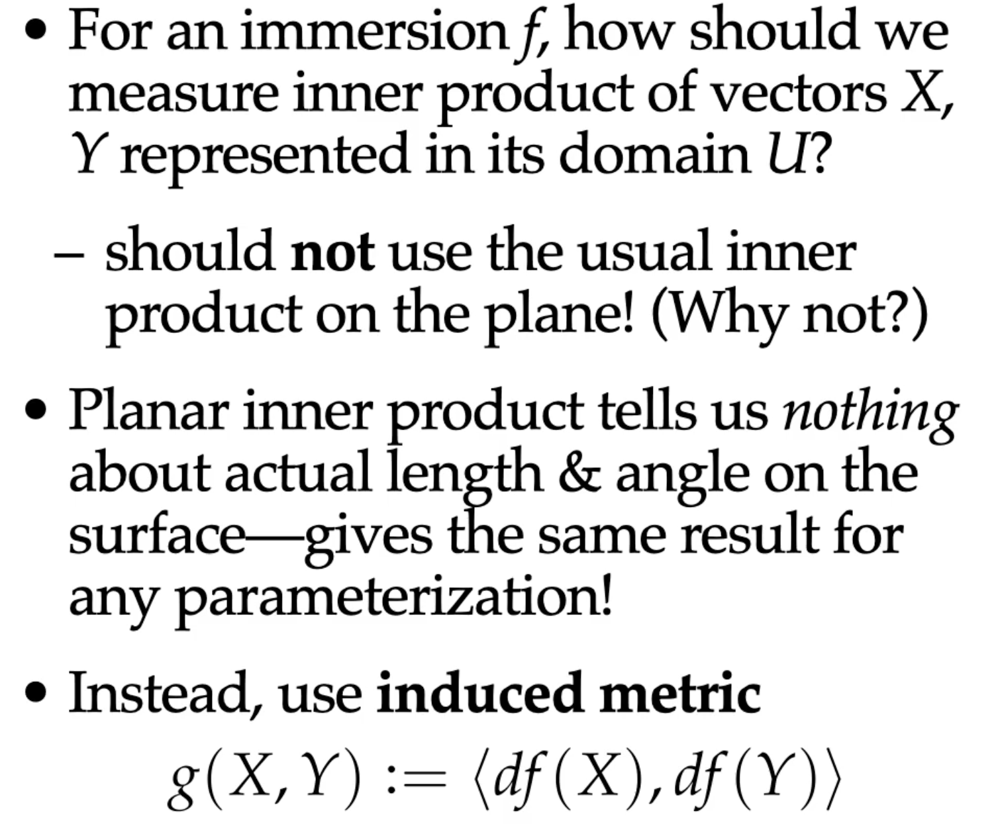

#### 微分矩阵表示即Jacobian矩阵

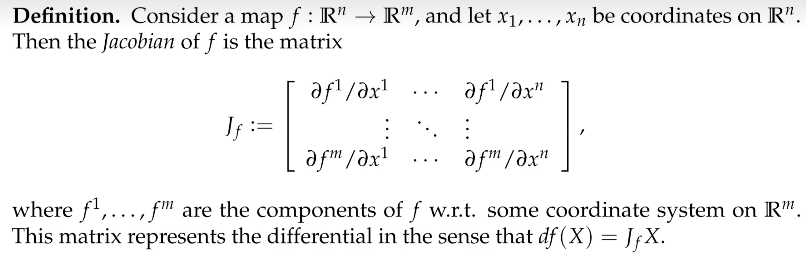

分段线性映射 $f:M_c\to\mathbb R^2$ 在每个三角形 $T_i$ 上可导，Jacobian 记为 $J_i\in\mathbb R^{2\times 2}$。它诱导平面度量：

$$
g=\nabla f^{\mathsf T}\nabla f.
$$

**度量与 Jacobian 的关系**。在三角形 $T_i$ 上 $f$ 是仿射变换，故 $\nabla f$ 为常数，度量退化为常矩阵：
$$
g|_{T_i}=J_i^{\mathsf T}J_i.
$$

称 $g|_{T_i}$ 为 $T_i$ 上的**拉回度量**（pullback metric）。它将平面坐标系下的向量长度映射为曲面上的弧长：对切向量 $v$，有 
$$
\|df(v)\|^2 = v^{\mathsf T}(J_i^{\mathsf T}J_i)v
$$
**共形条件**。若 $J_i^{\mathsf T}J_i = s_i\,I$（某标量 $s_i > 0$ 乘以单位矩阵），则 $J_i$ 为相似变换——即 $f$ 在 $T_i$ 上保角。此时度量退化为纯缩放，向量长度在各方向按相同比例 $s_i$ 伸缩，**角度不变**。全部三角形满足此条件时 $f$ 为共形映射。

## 示例Enneper曲面

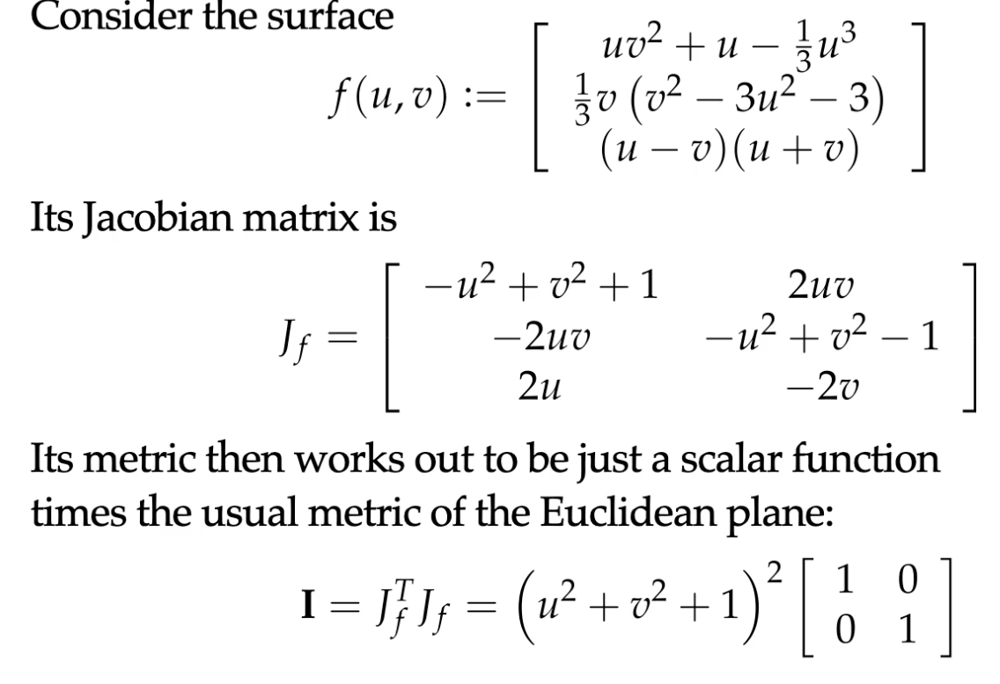

### 共形因子

## 内蕴视角

只需要度量就能测算空间的几何量

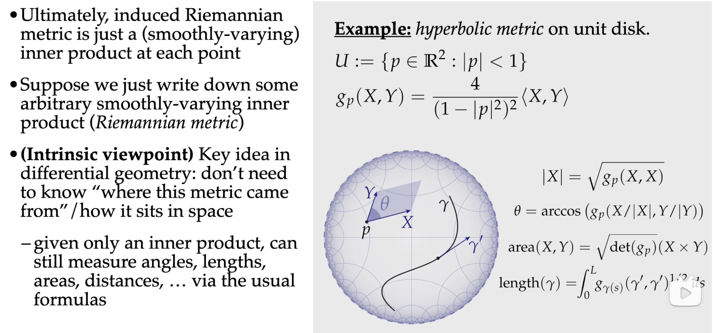

双曲圆盘

## 黎曼曲面的图册Atlas

多个chart，每个chart有自己的局部坐标，

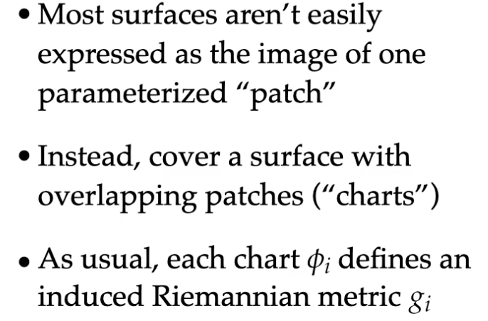

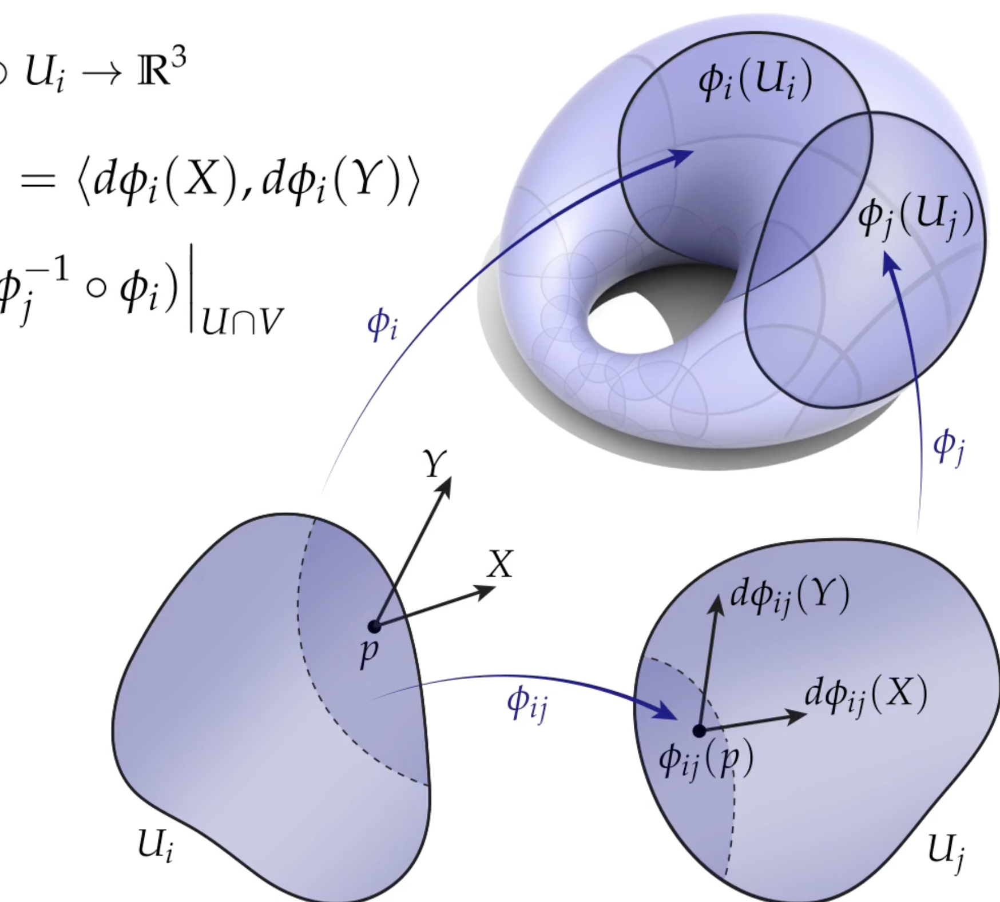

全局曲面从局部chart观察

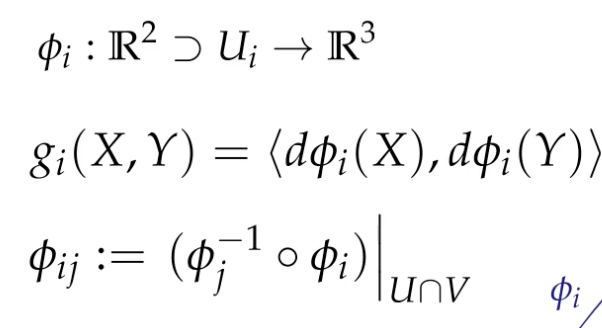

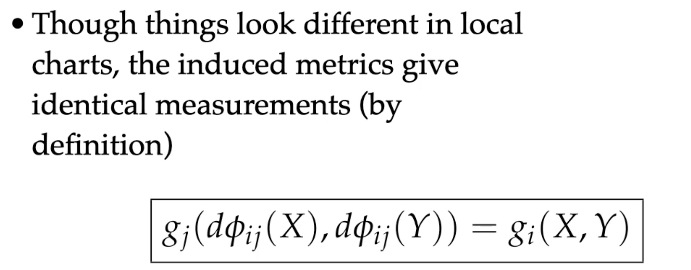

## **度量与共形等价**

若存在正值函数 $\lambda(p)>0$ 使两个度量满足 $g' = \lambda\,g$，则称它们是**共形等价**的。共形等价的度量保持**角度不变**（长度按 $\lambda$ 缩放，但两向量的夹角 $\theta = \arccos\frac{g(v,w)}{\sqrt{g(v,v)g(w,w)}}$ 因分子分母同乘 $\lambda$ 而消去）。这正是共形参数化的本质：寻找一个映射使拉回度量 $f^*g_{\mathbb R^2}$ 与曲面的内蕴度量 $g_M$ 共形等价。

在局部等温坐标（isothermal coordinates）下，度量可对角化为 $g = \lambda\,I$，即 $F=0,\; E=G=\lambda$——这意味着坐标网正交且各向同性伸缩。共形参数化的所有算法（LSCM、Circle Patterns、Ricci 流等）本质上都是在离散网格上构造这样的等温坐标。

在离散网格上，参数化 $\mathbf{r}$ 并非全局光滑，而是分段线性映射。将曲面片局部展平到二维参数域，映射的 Jacobian $J$ 是 $3\times 2$ 矩阵（$\mathbb R^3\to\mathbb R^2$ 或相反），则拉回度量（pullback metric）为
$$
g = J^{\mathsf T}J.
$$

展开即 $E=\|\mathbf{r}_u\|^2$, $F=\mathbf{r}_u\cdot\mathbf{r}_v$, $G=\|\mathbf{r}_v\|^2$——与上面第一基本型一致。反之，若已知度量 $g$ 并希望找映射使 $J^{\mathsf T}J=g$，即为**保距（isometric）参数化**问题；退一步要求 $J^{\mathsf T}J = s\,I$（度量与单位矩阵只差标量），则为**共形（conformal）参数化**，即保角。
