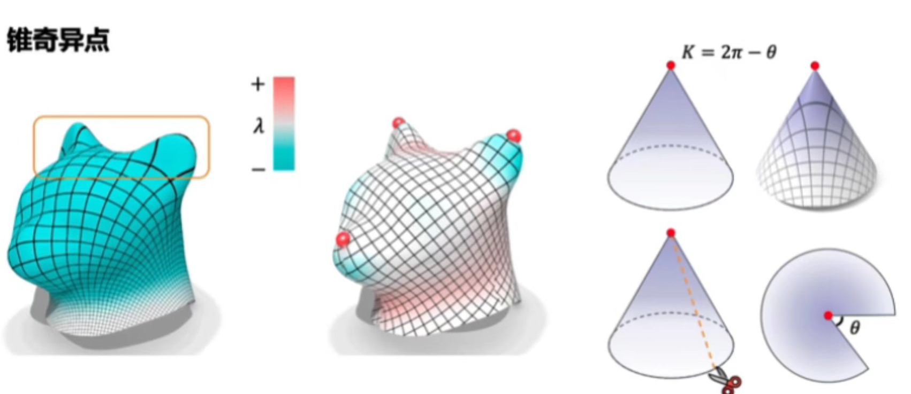

<!-- ---
layout: post
title: "第2章 §2.4 增量参数化与全局参数化"
category: Parameterization
categories: ["Parameterization", "Parameterization-ConformalMapping"]
--- -->

### **锥奇异点的计算**

**锥度量 (Cone Metric)**：三角网格 $M$ 上的锥度量 $g$ 是具有零离散高斯曲率的度量（除了一组称为 **锥点 (cones)** 的顶点 $C = \{c_i\}$ 外），其锥角 $\alpha_i > 0$。在锥点的邻域内，曲面等价于一个以 $c_i$ 为顶点、锥角为 $\alpha_i$ 的锥面。关于该度量的高斯曲率是 delta 函数 $K_i \delta(p - c_i)$，其中 $K_i = 2\pi - \alpha_i$。

### 基于 Poisson 方程的自动锥点选取

手动指定锥奇异点的位置和锥角需要经验和反复试验。**Ben-Chen 等人**提出了一个优雅的方法：通过求解曲面上的 **Poisson 方程** 自动确定锥点的最优位置和锥角。

#### 基本思路

将锥奇异点选取问题看作"曲率重分配"问题。设曲面当前的高斯曲率场为 $K$，我们希望将其集中到少数锥点上，即让目标曲率场 $\widetilde K$ 在锥点位置有非零值、其余位置为零，且满足 Gauss-Bonnet 约束 $\sum K_i = \sum \widetilde K_i = 2\pi\chi$。

为了找到从 $K$ 到 $\widetilde K$ 的最光滑过渡，考虑求解以下 **Poisson 方程**：

$$
\boxed{\Delta \phi = K - \widetilde K}
$$

其中 $\Delta$ 是曲面上的 Laplace-Beltrami 算子（离散形式即为 cotan-Laplace 矩阵），$\phi$ 是一个"曲率势函数"（curvature potential）。

#### 为什么 Poisson 方程能给出锥点位置

Poisson 方程的解 $\phi$ 指示了曲率"如何流动"：$\phi$ 在曲率盈余区域（$K > \widetilde K$）取极小值，在曲率不足区域（$K < \widetilde K$）取极大值。因此，**$\phi$ 的局部极值点**就是曲率最集中的顶点，也就自然成为锥奇异点的最佳候选位置。

算法的典型流程如下：

1. **计算曲率**：对网格每个顶点计算离散高斯曲率 $K_i$。
2. **初选候选锥点**：求解 $\Delta \phi^{(0)} = K$（即 $\widetilde K = 0$），取 $\phi^{(0)}$ 的 $m$ 个最大正极值点和 $m$ 个最小负极值点作为初始锥点集合。
3. **分配目标曲率**：在选定的锥点上按 Gauss-Bonnet 约束分配目标锥角 $\widehat\Theta_i$（或等价地，目标曲率 $\widehat K_i = 2\pi - \widehat\Theta_i$）。其余顶点设目标曲率为零。
4. **验证并迭代**：如有必要，通过 $\Delta \phi = K - \widehat K$ 重新求解，根据新 $\phi$ 的极值微调锥点位置，直到曲率分布满足要求。

###  锥奇异点

在 Circle Pattern 算法中，只需在变分能量中加入对锥奇异点处目标角度的额外约束：

$$
\sum_{f \ni i} \alpha_i^f = 2\pi k_i\\
  其中 k_i 为目标角度亏量系数（通常 k_i \in \mathbb{Z}^+）。
$$

引入锥奇异点后，可用 Dijkstra 算法将锥奇异点与边界点连接，得到曲面的割线。