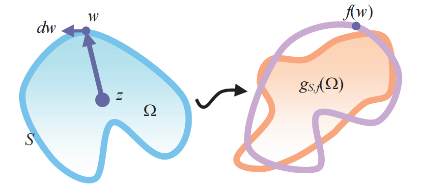
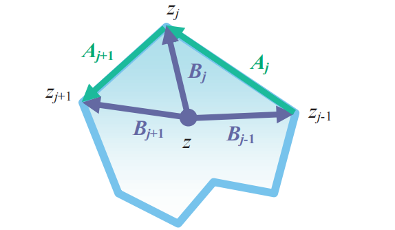

前文介绍调和映照时已经用过普通重心坐标：在一个三角形内，函数值由三个顶点值线性插值得到，

$$
f(x)=\alpha f_i+\beta f_j+\gamma f_k.
$$

这种实值重心坐标适合分片线性网格映射；随后通过梯度、cot-Laplace 和边界条件求解离散调和映照。本文讨论的 Cauchy 重心坐标可以看作这个思路在复分析中的延伸：仍然用边界自由度控制内部映射，但不再逐三角形做实值线性插值，而是用 Cauchy 积分公式把边界上的复值数据延拓成区域内部的全纯/调和基函数。

### 平面调和映射

在平面变形中，我们希望有一种表示方式满足：

- 给定一个 cage / polygon 边界；
- 边界移动后，内部点自动平滑移动；
- 映射足够光滑；
- 最好能直接控制局部翻转和扭曲。

全纯函数自动满足 Cauchy-Riemann 方程，因此其实部和虚部都是调和函数。

因此它和“扭曲有界调和映射”的关系非常直接：

1. Cauchy 坐标给出一个调和映射空间；
2. 调和性被写进基函数里，不需要额外求解 Laplace 方程；
3. 映射的复导数可以解析计算；
4. 局部单射和扭曲界可以通过 $f_z, f_{\bar z}$ 写成约束。

下面的逻辑按四步展开：先说明为什么需要这种坐标；再从 Cauchy kernel 构造离散坐标；然后把坐标用于调和映射表示；最后用复导数解释局部单射和扭曲约束。

## 基本原理

如果边界上给定一个复值函数 $F(\zeta)$，Cauchy 积分公式启发我们定义：

$$
h(z)=\frac{1}{2\pi i}\oint_{\partial\Omega}
\frac{F(\zeta)}{\zeta-z}\,d\zeta,
\qquad z\in\Omega.
$$

这称为 **Cauchy transform**，它把边界数据变成内部全纯函数。只要 $z$ 在区域内部，$h(z)$ 对 $z$ 是全纯函数。

Cauchy 重心坐标（Cauchy / Complex Barycentric Coordinates）是一类用复分析构造的二维坐标函数。它们最早用于平面形状变形，核心特点是：用 Cauchy 积分公式把边界上的复值数据延拓到区域内部，得到全纯函数

### 复重心坐标

复重心坐标仍然遵循“用边界控制内部”的思路。设原始 cage 顶点为$z_j$，变形后的顶点为 $f_j$，如果一组复值坐标函数 $k_j(z)$ 满足
$$
\sum_j k_j(z)=1,\qquad
\sum_j k_j(z)z_j=z,
$$

那么由

$$
g(z)=\sum_j k_j(z)f_j
$$

定义的映射就至少能精确复现平移、旋转和一致缩放，也就是相似变换。换句话说，如果目标顶点本身来自某个相似变换 $f$，即 $f_j=f(z_j)$，那么内部映射也会恢复出同一个 $f$。

这里和实值重心坐标有一个重要差别：复重心坐标通常不要求复现所有仿射变换。若要精确复现一般仿射变换，不仅 $k_j(z)$ 本身要有线性精度，坐标的共轭也必须满足相应的线性精度：

$$
\sum_j \overline{k_j(z)}\,z_j=\overline{z}.
$$

实值重心坐标天然满足这一点，因此通常可以复现仿射变换；复值坐标一般不满足。这个限制在变形里反而常常是优点，因为一般仿射变换包含非一致缩放和剪切，而这些形变容易带来不自然的局部拉伸。Cauchy 坐标更偏向保留共形结构，优先表达旋转与一致缩放。

另一个差别是插值性。传统 Lagrange 型坐标常要求

$$
g(z_j)=f_j,
$$

也就是 cage 顶点必须严格插值到目标顶点。复重心坐标不一定强制这个条件；它更关注由边界数据诱导出的内部映射是否平滑、自然，并在整体上贴近目标边界。放松严格插值后，映射空间更柔和，也更适合和扭曲控制结合。

### 复核函数

从连续角度看，设 $\Omega$ 是一个单连通平面区域，边界为光滑闭曲线 $S=\partial\Omega$。对内部点 $z\in\Omega$ 和边界点 $w\in S$，可以引入**复核函数**

$$
k(w,z):S\times\Omega\to\mathbb C.
$$

它是连续版的“坐标函数”。为了让它像重心坐标一样工作，需要满足两个基本精度条件：

$$
\oint_S k(w,z)\,dw=1,
\qquad
\oint_S k(w,z)w\,dw=z.
$$

注意这里的积分是复积分，其中

$$
dw=T(w)\,ds,
$$

$T(w)$ 是边界在 $w$ 处的单位切向量，$ds$ 是弧长微元。给定边界上的复值目标函数 $f:S\to\mathbb C$ 后，内部映射可以写成

$$
g_{s,f}(z)=\oint_S k(w,z)f(w)\,dw.
$$

因此，构造 Cauchy 重心坐标的核心问题就变成：找到合适的**核函数** $k(w,z)$，使它满足**常数精度条件**和**线性精度条件**，并且产生的内部映射具有全纯/调和结构。

### Cauchy kernel 

连续情形中最自然的核函数是 **Cauchy kernel**：

$$
C(w,z)=\frac{1}{2\pi i}\frac{1}{w-z}.
$$

它满足前面要求的常数精度和线性精度：

$$
\oint_S C(w,z)\,dw=1,
\qquad
\oint_S C(w,z)w\,dw=z,
$$

因为这正是 Cauchy 积分公式在 $h(w)=1$ 和 $h(w)=w$ 两个特殊函数上的结果。

更一般地，如果 $h$ 在区域内全纯且边界上可取值，那么
$$
h(z)=\frac{1}{2\pi i}\oint_S \frac{h(w)}{w-z}\,dw.
$$

所以 Cauchy kernel 不只是满足重心坐标的两个精度条件，它实际上能复现所有全纯函数。把边界上的目标函数 $f:S\to\mathbb C$ 代入，就得到

$$
g(z)=\frac{1}{2\pi i}\oint_S \frac{f(w)}{w-z}\,dw.
$$

这里要区分两件事：Cauchy 积分公式中的 $h$ 是已经定义在整个区域内的全纯函数；而变形问题中的 $f$ 通常只在边界上给定。

Cauchy transform 的作用，就是从边界函数 $f$ 生成区域内部的全纯函数 $g$。

### 离散化

实际形状变形中，边界 $S$ 通常是一个多边形 cage。设顶点为

$$
v_0,v_1,\ldots,v_{n-1},
$$

目标边界函数在顶点上的值为 $w_j=f(v_j)$，并在每条边上线性插值。于是连续积分可以拆成逐边积分：

$$
g(z)=\frac{1}{2\pi i}
\sum_j\int_{e_j}\frac{f(w)}{w-z}\,dw.
$$

由于每条边上的 $f(w)$ 对端点值 $w_j,w_{j+1}$ 是线性的，整个 $g(z)$ 对所有顶点目标值也是线性的。因此它可以整理成

$$
g(z)=\sum_j C_j(z)w_j.
$$

这就是离散 Cauchy 重心坐标的来源：每个 $C_j(z)$ 都来自与顶点 $v_j$ 相邻的两条边积分贡献。下一节给出这个逐边积分的闭式形式。

## 从积分形式到顶点坐标

上一节已经说明：当边界函数沿多边形每条边线性插值时，Cauchy transform 可以按顶点目标值分解。本节把这个分解单独写清楚，方便后面进入闭式计算。

设源区域 $\Omega\subset\mathbb{C}$ 的边界是一个逆时针多边形：

$$
\partial\Omega=(v_0,v_1,\ldots,v_{n-1}).
$$

在边界上定义一个分段线性的复值函数 $F$，并令其在顶点处的值为：

$$
F(v_j)=w_j.
$$

其中 $w_j$ 可以理解为目标 cage 顶点或待优化的复系数。

由于 $F$ 沿每条边线性变化，Cauchy transform 对 $w_j$ 也是线性的，因此可以写成：

$$
h(z)=\sum_{j=0}^{n-1} C_j(z) w_j.
$$

这里的 $C_j(z)$ 就是 Cauchy 重心坐标。

换句话说：

> 先用 Cauchy transform 延拓边界函数，再把延拓结果按顶点值 $w_j$ 分解，得到的系数就是 Cauchy 坐标。

它和普通重心坐标一样，也有“线性组合重构函数”的形式；区别在于 $C_j(z)$ 是复值、全纯的。

因此前几节完成的是“坐标怎么来”的部分：从连续 Cauchy 积分，经过多边形边界离散化，得到顶点系数 $C_j(z)$。下一步只剩下计算问题：如何把每条边的积分写成可实现的闭式公式。

## 边积分的闭式形式

令第 $j$ 条边为：

$$
e_j=[v_j,v_{j+1}],
$$

边向量为：

$$
a_j=v_{j+1}-v_j.
$$

对边上的点做参数化：

$$
\zeta(t)=v_j+t a_j,\qquad t\in[0,1].
$$

记：

$$
b_j=v_j-z,\qquad b_{j+1}=v_{j+1}-z=b_j+a_j.
$$

边上的边界函数是：

$$
F(\zeta(t))=(1-t)w_j+t w_{j+1}.
$$

代入 Cauchy transform：

$$
\frac{1}{2\pi i}
\int_{e_j}
\frac{F(\zeta)}{\zeta-z}\,d\zeta
=
\frac{a_j}{2\pi i}
\int_0^1
\frac{(1-t)w_j+t w_{j+1}}{b_j+t a_j}\,dt.
$$

因此该边对两个端点 $w_j,w_{j+1}$ 的坐标贡献可以解析算出。

定义：

$$
R_j(z)=\log\frac{b_{j+1}}{b_j}.
$$

则：

$$
\int_0^1 \frac{dt}{b_j+t a_j}
=
\frac{R_j}{a_j},
$$

$$
\int_0^1 \frac{t\,dt}{b_j+t a_j}
=
\frac{a_j-b_jR_j}{a_j^2},
$$

$$
\int_0^1 \frac{(1-t)\,dt}{b_j+t a_j}
=
\frac{b_{j+1}R_j-a_j}{a_j^2}.
$$

所以边 $e_j$ 对 $w_j$ 和 $w_{j+1}$ 的贡献分别是：

$$
\frac{a_j}{2\pi i}
\frac{b_{j+1}R_j-a_j}{a_j^2}w_j,
$$

$$
\frac{a_j}{2\pi i}
\frac{a_j-b_jR_j}{a_j^2}w_{j+1}.
$$

把相邻两条边对同一个顶点的贡献相加，就得到每个 $C_j(z)$。

实现时需要注意：

- 复数 $\log$ 有分支问题；
- 查询点 $z$ 不能落在边界上；
- 多边形边界要保持一致方向；
- 数值上要处理 $z$ 接近边界或顶点的情况。

到这里，Cauchy 坐标已经从抽象积分变成了可计算的离散基函数。接下来讨论它为什么适合做平面变形，以及为什么后文会把它和 bounded distortion 放在一起。

7. Cauchy 坐标的关键性质

### 7.1 全纯性

对固定边界数据 $F$，函数：

$$
h(z)=\frac{1}{2\pi i}\oint_{\partial\Omega}
\frac{F(\zeta)}{\zeta-z}\,d\zeta
$$

在 $\Omega$ 内是全纯的。

因此每个坐标函数 $C_j(z)$ 也是全纯函数。

### 7.2 调和性

全纯函数的实部和虚部都是调和函数：

$$
\Delta \operatorname{Re} C_j=0,\qquad
\Delta \operatorname{Im} C_j=0.
$$

所以任何线性组合：

$$
h(z)=\sum_j C_j(z)\phi_j
$$

仍然是全纯函数。
