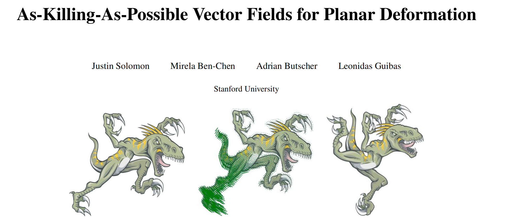

> **论文**：Justin Solomon, Mirela Ben-Chen, Adrian Butscher, Leonidas Guibas. [*As-Killing-As-Possible Vector Fields for Planar Deformation*](https://doi.org/10.1111/j.1467-8659.2011.02028.x). Computer Graphics Forum (SGP), 30(5), 1543–1552, 2011.

## 附录：相关变形方法（AKAP）


详见专文 [AKAP — As-Killing-As-Possible 平面变形](KVF_Animation.md)。上图来自 **As-Killing-As-Possible (AKAP) Vector Fields for Planar Deformation**（Solomon et al., SGP 2011）：通过逼近 **Killing 向量场**（刻画等距运动）来驱动平面变形，与本文"基函数 + 配准点凸约束"的路线不同，但同属**用变分/几何结构控制变形质量**的研究脉络。AKAP 侧重向量场与近似 Killing 性；Provably Good Mappings 侧重无网格基上的可证明单射与畸变界。

## 概述

卡通动画、图像变形等二维图形任务，都可归结为**平面形状变形**：给定初始形状，拖动少量控制点，得到自然、低畸变的整体变形。理想变形应尽量**保距（isometric）**——局部像刚体运动，不引入剪切与拉伸。

传统 **ARAP**、**MLS** 等方法直接对**变形映射** $f:\Omega\to\mathbb{R}^2$ 做非线性能量最小化，迭代求解、收敛性与鲁棒性都不理想。**AKAP**（As-Killing-As-Possible）换了一条路：

| 步骤 | 内容 | 性质 |
| :--- | :--- | :--- |
| **1. 求速度场** | 在约束下最小化 **Killing 能量**，得到近似 Killing 向量场（AKVF）$\vec{U}^*$ | **线性**优化（一次稀疏求解） |
| **2. 积分轨迹** | 把 $\vec{U}^*$ 当作各点初速度，沿**对数螺线**等轨迹推进 | 非线性留在**逐点 ODE** |

核心思想：先在线性空间里找"最像刚体流"的速度场，再用几何上合适的轨迹把速度积成变形——把变形问题的非线性从"全局能量迭代"转移到"沿流线的积分"。



---

## 1. 动机：等距变形为何难？

平面等距变形希望映射 $f$ 的 Jacobian $J_f$ 处处正交（$J_f^T J_f = I$）。这给出**三个**偏微分方程约束两个未知函数，一般是**超定**的——只有刚体运动（平移 + 旋转）在全局上精确成立。

因此实际做法都是**近似**：

| 路线 | 代表 | 特点 |
| :--- | :--- | :--- |
| 直接最小化非线性能量 | ARAP、MLS、调和映射 | 需迭代；不保证全局最优；大变形时不稳定 |
| 基函数 + 凸约束 | [Provably Good Mappings](几何变形2-Provably good mapping.md) | 可证明单射/畸变界；与 AKAP 思路不同 |
| **向量场 + Killing 能量** | **AKAP**（本文） | 速度场一步线性解；与 ARAP **一阶**等价 |

AKAP 的 AKVF 可理解为：在无穷小意义下，使 ARAP 能量尽可能小的**方向场**（论文称 "minimizing ARAP energy to first order"）。

---

## 2. Killing 向量场（KVF）

### 2.1 无穷小等距流

设 $\vec{U}:\Omega\to\mathbb{R}^2$ 为光滑向量场。由 $\vec{U}$ 生成的**形变流** $\phi_t:\Omega\to\Omega$ 满足

$$
\frac{\mathrm{d}}{\mathrm{d}t}\phi_t(\mathbf{p}) = \vec{U}(\phi_t(\mathbf{p})), \quad \phi_0(\mathbf{p}) = \mathbf{p}.
$$

若对所有 $t$、所有点对 $\mathbf{p},\mathbf{q}$ 都有 $\|\phi_t(\mathbf{p})-\phi_t(\mathbf{q})\| = \|\mathbf{p}-\mathbf{q}\|$（保距），则称 $\vec{U}$ 为 **Killing 向量场**。

### 2.2 平面上的刻画：反对称 Jacobian

欧氏平面 endowed 标准度量时，KVF 等价于 Jacobian **反对称**：

$$
J_{\vec{U}}(\mathbf{p}) + J_{\vec{U}}(\mathbf{p})^T = 0, \quad \forall \mathbf{p}\in\Omega.
$$

经典例子——绕原点旋转的速度场：

$$
\vec{U}(\mathbf{p}) = (-y,\, x)^T, \quad \mathbf{p}=(x,y).
$$

其 $J_{\vec{U}} = \begin{pmatrix}0&-1\\1&0\end{pmatrix}$ 恰为反对称矩阵。平移场 $\vec{U}\equiv\mathbf{c}$ 的 Jacobian 为零，同样是 KVF。

> 精确 KVF 构成**三维**线性空间（2 个平移 + 1 个旋转）。一般域上用户约束无法同时满足，需要**近似** KVF（AKVF）。

更系统的曲面理论（Lie 导数、协变导数、DEC 离散化）见 Ben-Chen 等 [BCBSG10] 的 *On Discrete Killing Vector Fields and Patterns on Surfaces*。

---

## 3. Killing 能量

当 $\vec{U}$ 不是精确 KVF 时，用 Jacobian 对称部分的平方积分度量"偏离等距"的程度：


即

$$
\boxed{
E_K(\vec{U}) = \int_{\mathbf{p}\in\Omega} \bigl\| J_{\vec{U}}(\mathbf{p}) + J_{\vec{U}}(\mathbf{p})^T \bigr\|_F^2 \,\mathrm{d}\mathbf{p}
}
\tag{2}
$$

- $E_K(\vec{U})=0$ 当且仅当 $\vec{U}$ 为精确 KVF；
- $E_K$ 是 $\vec{U}$ 的**二次泛函**（只含 $\vec{U}$ 的一阶导数），离散后为 $\vec{u}^T\mathbf{A}_K\vec{u}$ 的稀疏二次型。

### 3.1 平面上的散度–旋度形式

在平面域上，[BCBSG10] 证明（边界项为零时）$E_K$ 可写为

$$
E_K(\vec{U}) = \int_\Omega \bigl( |\nabla\cdot\vec{U}|^2 + |\nabla\times\vec{U}|^2 \bigr)\,\mathrm{d}\mathbf{p},
$$

即同时惩罚**散度**（体积变化）与**旋度**（剪切）。这与"尽量刚体"的直觉一致：刚体运动的散度、旋度均为零（平移散度为零；旋转散度为零、旋度为常数——纯旋转场 $E_K=0$）。

---

## 4. 带控制点约束的 AKVF

用户在一组控制点 $C=\{p_i\}$ 上指定目标速度（或位移方向）$\vec{u}_i$。求**尽可能 Killing** 又满足约束的向量场：

$$
\boxed{
\vec{U}^* = \arg\min_{\vec{U}} \left(
E_K(\vec{U}) + \lambda \sum_{p_i\in C} \|\vec{U}(p_i) - \vec{u}_i\|^2
\right)
}
\tag{3}
$$

- $\lambda>0$：约束权重；$\lambda\to\infty$ 时强制 $\vec{U}(p_i)=\vec{u}_i$；
- 这是**线性最小二乘**（Tikhonov 正则化）：离散后
  $$
  (\mathbf{A}_K + \lambda\,\mathbf{C}^T\mathbf{C})\,\vec{u}^* = \lambda\,\mathbf{C}^T\vec{u}_{\text{target}},
  $$
  $\mathbf{C}$ 在控制点插值 $\vec{U}$；$\mathbf{A}_K$ 对称正定 → **一次 Cholesky 分解**即得全局 AKVF。

**与 ARAP 的关系**：ARAP 在每步局部拟合旋转矩阵，全局交替迭代；AKAP 在 $t=0$ 处把"局部尽量刚性"写成 $\|J+J^T\|^2$，一次解出速度场。大变形时 AKAP 不保证 $E_{\text{ARAP}}=0$，但小变形下与 ARAP 一阶一致，且无需局部–全局循环。

---

## 5. 从速度场到变形：对数螺线轨迹

解出 $\vec{U}^*$ 后，还需把**初速度**积成**有限位移**。朴素 Euler 积分 $\mathbf{p}(t)=\mathbf{p}+\int_0^t \vec{U}^*(\mathbf{p}(s))\,\mathrm{d}s$ 会积累畸变。

AKAP 的关键观察：**线性全纯向量场**的流线是对数螺线，而局部 AKVF 可视为这类场的拼接。

### 5.1 线性全纯场

把 $\mathbb{R}^2$ 与 $\mathbb{C}$ 等同。线性全纯场

$$
\frac{\mathrm{d}z}{\mathrm{d}t} = \alpha\, z, \quad \alpha = a + i\omega \in \mathbb{C}
$$

的解为 $z(t) = e^{\alpha t}\,z(0)$。极坐标下

$$
r(t) = r(0)\,e^{at}, \qquad \theta(t) = \theta(0) + \omega t,
$$

即**对数螺线**（$a\neq 0$ 时半径指数变化；$a=0$ 退化为圆弧）。对应实向量场 Jacobian 为 $\begin{pmatrix}a&-\omega\\\omega&a\end{pmatrix}$；仅当 $a=0$ 时为精确 KVF（纯旋转）。

### 5.2 实现策略

对每个点 $\mathbf{p}$：

1. 用 $\vec{U}^*(\mathbf{p})$ 及其局部梯度估计复系数 $\alpha(\mathbf{p})$；
2. 沿以 $\mathbf{p}$ 为起点的对数螺线推进时间 $t$（用户交互控制 $t$）；
3. 变形映射 $\phi_t(\mathbf{p})$ 即为螺线上的位置。

这样，**全局非线性**只出现在逐点轨迹参数化中，而**耦合**的速度场仍由线性系统一次求得——兼顾效率与近等距性。

---

## 6. 离散化与算法流程

### 6.1 空间离散

- 在三角网格（或平面 FEM 剖分）上，用**分片二次有限元**表示 $\vec{U}$；
- $E_K$ 离散为顶点/结点上的稀疏二次型 $\vec{u}^T\mathbf{A}_K\vec{u}$（涉及相邻结点的一阶导数耦合）；
- 控制点约束通过插值矩阵 $\mathbf{C}$ 加入；用 CHOLMOD 等解 SPD 系统。

曲面情形下的 DEC 离散（边上一形式、Hodge Laplacian）见 [BCBSG10]；平面 AKAP 实现更简单，直接用平面 Jacobian 形式 (2)。

### 6.2 完整管线

```
用户拖动控制点 → 目标速度 {u_i}
        ↓
线性求解 (3) → AKVF U*
        ↓
逐点拟合 α(p)，沿对数螺线积分时间 t
        ↓
变形后形状 / 动画帧
```

---

## 7. 与其他变形方法的对比

| 方法 | 优化对象 | 求解 | 等距性 |
| :--- | :--- | :--- | :--- |
| **ARAP** | 顶点位置 | 局部–全局迭代 | 强（大变形需多轮） |
| **MLS** | 每点局部变换 | 闭式/轻量 | 可选相似/刚性 |
| **Provably Good** | 基函数系数 | 凸规划 | 可证明畸变界 |
| **AKAP** | 向量场 $\vec{U}$ | **一次线性** + 螺线积分 | 近等距（Killing 最优） |

AKAP 特别适合**交互式卡通变形**与**图像 warping**：速度场实时更新，轨迹积分可 GPU 并行。局限在于大变形、强约束时仍可能偏离全局等距；且不像 Provably Good 那样有单射性的硬性保证。

---

## 8. 小结

| 概念 | 含义 |
| :--- | :--- |
| **KVF** | 无穷小等距流；平面等价于 $J+J^T=0$ |
| **$E_K$** | $\int\|J+J^T\|_F^2$；AKVF 为其（加约束的）极小元 |
| **线性性** | $E_K$ 二次 → 控制点约束下一次求解 |
| **对数螺线** | 线性全纯流的积分曲线；局部推进变形 |
| **与 ARAP** | 一阶等价；把非线性推迟到轨迹积分 |

相关笔记：[平面变形概述（MLS）](几何变形1-MLS.md)、[Provably Good Mappings](几何变形2-Provably good mapping.md)、[ARAP 类能量（AQP / SLIM）](几何优化-AQP.md)。

---

## 参考文献

- Solomon J., Ben-Chen M., Butscher A., Guibas L. *As-Killing-As-Possible vector fields for planar deformation*. CGF (SGP), 2011. [doi:10.1111/j.1467-8659.2011.02028.x](https://doi.org/10.1111/j.1467-8659.2011.02028.x)
- Ben-Chen M., Butscher A., Solomon J., Guibas L. *On discrete Killing vector fields and patterns on surfaces*. CGF, 29(5), 2010.
- Sorkine O., Alexa M. *As-rigid-as-possible surface modeling*. SGP, 2007.
- Schaefer S., McPhail T., Warren J. *Image deformation using moving least squares*. SIGGRAPH, 2006.

