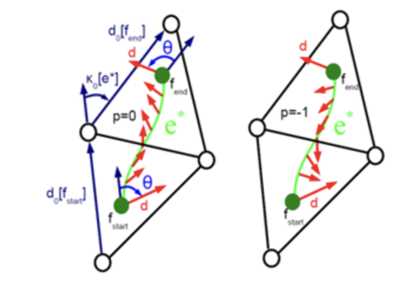

## 向量场的拓扑

向量场中某个没有明确向量的点即奇异点，奇异点决定了向量场的拓扑，向量场的联络以及其上的奇异点就可以确定整个向量场。奇异点的**指标(Index)**是指**向量沿着一条路径绕该点一周后，向量改变的角度**。具体来说，在奇异点附近取一个小环路，统计方向场相对参考方向的净旋转角，再除以$ 2\pi$，就得到这个点的 index。 

一些常见的指标，源点，汇点都是

## 向量场指标定理(Poincare—Hopf)

曲面上所有奇异点的指标之和等于其欧拉示性数

再看全局约束：

闭曲面上所有奇异点指标之和，必须等于曲面的 Euler 示性数。

标架场(cross-field)的指标是普通向量场奇异点指标**除以4**,所以会出现分数指标。

## 方向场的跳变

 **Turning number** 是沿一条闭合曲线统计方向场总共“转了多少圈”，当你沿着一条闭合曲线走一圈时，方向场相**对于曲线切向到底净旋转了多少**。  

$$
T_{\vec d}(\gamma)=\frac{1}{2\pi}\oint_\gamma (\kappa_{\vec d}-\kappa_\gamma)\,ds
$$

如果两个定义在同一个曲面上的方向场，在一组同调基 `H(S)` 的所有环上都有相同的 turning number，那么它们就是同伦等价的。
它说明要**控制方向场的全局拓扑，并不需要记住每个点的方向，只需要控制若干代表性闭环上的 turning number** 即可。

方向场的 turning number在离散数据结构中由表达 **period jumps(整数离散变量)** 

1. 在每个三角形面上选一个**参考方向 $\vec d_0$**。
2. 用一个角度标量 $\theta$ 表示实际方向 $\vec d$ 相**对参考方向转了多少**。
3. 在每条对偶边上引入一个整数 `p`，表示由于 `N` 重对称造成的**周期跳变(Period Jump)**。

离散曲率满足

$$
\kappa_{\vec d}=\kappa_0+d\theta+\frac{2\pi p}{N}.
$$

它表示方向场在**跨越离散单元时，允许发生一个整周期的“跳层”**；

从此以后，方向场拓扑不再是抽象的“绕一圈转几次”，而是被编码进了离散整数变量 `p`。  这也就为后面的混合整数方法做好了准备。

只要我们控制好Period Jumps，就等于控制了方向场的拓扑。

