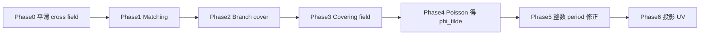

### 3.2.4 MIQ 与 QuadCover 的关系

区别主要在于处理四重对称带来的离散跳变：

- `QuadCover` 更强调拓扑与解析结构，把多值场提升到 covering space 中处理；
- `MIQ` 更强调直接把整数跳变放进优化器，通过 mixed-integer 方式求出可用结果。

因此，二者可以看成是同一问题的两种表达方式：  

前面我们看到用来表达三维物体几何的三角形网格，不过三角网格是不规则的，**四边形网格(Quad Mesh)**天然支持定义**全局一致的局部坐标系**（u/v 方向），能够有效对齐并保持纹理或材料属性在主方向上的连续性与结构一致性，更好地捕捉到物体的几何特征。


## **分支覆盖(branch cover)介绍**

黎曼面(Riemann Surface)是为了让多值复函数,如$\sqrt z,log(z)$,在其上成为单值全纯函数而构造的“自然定义域”。它是一个**一维复流形(Complex Manifold)**

设$M$是一个曲面,我们定义$M$的一个**分支覆盖(branch cover)$M'$**是一个这样的黎曼面:

其与$M$存在局部存在同胚映射$\pi:M' \to M$，对任意一个$M'$上的点$p' \in M'$,存在一个$p'$的领域$U'$,在其上可以定义局部坐标$z':U' \to \mathbb{C}$,并且以点$p'$为坐标架的中心,即$z'(p') = 0$。

同样也可以在像点的领域$U(\pi(p') \in U)$,定义局部坐标$z: U \to \mathbb{C},z(\pi(p'))=0$,存在一个整数$n_p > 0$,在$p$的局部有如下坐标变换关系成立$z = (z')^{n_p}$，如果$n_p > 1$,那么$p$点即为$M$的一个分支点。


在普通点附近，覆盖映射就像把几张完全一样的小纸片平铺在一起，每一层都局部等同于原曲面；  

而在分支点附近，多张 sheet 会像螺旋一样缠绕到同一个点上。局部模型 $z=(z')^{n_p}$ 正是在描述这种"绕一圈会跨 layer"的行为。

分支覆盖把原曲面上难以处理的奇异点，转写成覆盖空间里局部可控的分支结构。


## QuadCover算法

有了**标架场(cross filed)**之后，我们要基于它来构造全局参数化，那么就需要解决它的**多值性**和**不可积性**。 

原曲面上的标架场往往带有奇异点，沿着这些奇异点绕一圈之后，方向会发生非平凡的旋转，导致参数函数无法直接作为一个普通单值函数定义在原曲面上。  

将原曲面上**带奇异点的标架场**提升到一个更大的无奇异点的**覆盖空间(covering space)**上,在这个覆盖空间上，原来绕一圈产生的多值展开到不同的叶片(sheet)上，于是**标架场可以被看成一个简单的向量场**，参数化问题也就重新变回了一个更熟悉的**求可积向量场/求标量势函数**的问题。

大致实施思路如下：先用**匹配(matching)** 构造覆盖空间，再把 **标架场提升为覆盖空间**，随后通过 **Hodge 分解**得到局部可积、全局无缝的参数化。


### **匹配(matching)**

设光滑的2维流形$M$,有局部图集(charts)$\{U_i,\phi_i\}$
$$
\phi_i:U_i \sub M \to \Omega_i \sub \mathbb{R}^2
$$

在离散实现中，我们取每个三角面片 $T_i$ 作为一个 chart，通过重心坐标建立到 $\mathbb{R}^2$ 的仿射映射 $\phi_i: T_i \to \Omega_i \subset \mathbb{R}^2$。这是计算机图形学中离散微分几何的标准做法——将连续流形上的局部同胚替换为网格上的逐片线性映射。

$M$上的**参数化栅格**定义为单位栅格线$\mathbb{Z} \times \mathbb{R}$以及$\mathbb{R} \times \mathbb{Z}$在映射$\phi_i$下的原像**（拉回，pullback）**。

这个变换不能是任意旋转，而只能来自正方格的对称群，也就是 $90^\circ$ 的整数倍旋转加上整数平移。matching 就是在离散网格上记录这种关系的量。

全局连续的参数化，即找到这样连续一致的图集$\{U_i,\phi_i\}$,相邻两个区域$U_i$与$U_j$重合的地方，有如下的转移函数

$$
D\phi_i(p) = J^{r_{ij}} D\phi_j(p), \quad J := \begin{pmatrix} 0 & 1 \\ -1 & 0 \end{pmatrix}, \quad p \in U_i \cap U_j
$$

进一步定义 **匹配(matching)** 就是离散曲面$M$上的一个如下的映射
$$
r: \{ \text{edges } e_{ij} \mid T_i \cap T_j = e_{ij} \} \to \{0,1,2,3\}
$$

这里$r_{ij} \in \{0,1,2,3\}$定义为两个区域间的匹配(matching),对于离散三角网格,我们定义所有局部的图卡(chart)是三角面片,区域重合的地方就是三角面片的公共边，所以匹配是定义在边$E$上的。

可以把 $r_{ij}$ 直观理解为:当我们从 $U_i$ 走到 $U_j$ 时，局部坐标系需要额外旋转多少个四分之一圈，才能让两边的网格方向重新对齐。$r_{ij}=0$ 表示方向一致；$r_{ij}=1$ 表示逆时针转 $90^\circ$；其余情况类似。

如图,两个chart之间的匹配$r_{ij}$ = 3


对于如下的正方体展开,$r_{01}=r_{12} = 0,r_{20} = 1$


这样一来，每个三角形携带一个局部坐标系，而每条边告诉我们相邻两个三角形的坐标系之间差了多少个 quarter-turn。后面构造 covering space 时，正是把这些边上的 matching 当作"粘接规则"来使用。

具体计算步骤如下：

1. **估计局部方向**：在每个三角形上估计局部主方向（principal curvature directions）或其他满足 4-RoSy 对称性的 cross/frame field，每个三角形 $T_i$ 得到一组正交参考方向 $\vec{d}_i$。

2. **Quarter-turn 对齐**：对于共享边 $e_{ij}$ 的相邻三角形 $T_i, T_j$，由于 cross field 具有 4 重对称性，$\vec{d}_j$ 有 4 个等价表示 $\{\vec{d}_i,\; J\vec{d}_i,\; J^2\vec{d}_i,\; J^3\vec{d}_i\}$（$J$ 为 $90^\circ$ 旋转矩阵）。计算 $\vec{d}_i$ 与这 4 个方向的偏差，选择最小偏差对应的旋转次数：

$$r_{ij} = \arg\min_{k \in \{0,1,2,3\}} \angle(\vec{d}_i,\; J^k \vec{d}_j)$$

直观含义：$r_{ij}=0$ 表示方向一致；$r_{ij}=1$ 表示 $T_j$ 需逆时针转 $90^\circ$ 才与 $T_i$ 对齐，其余类推。

### 由匹配诱导覆盖空间

对$M$的每个局部子集(图卡chart)$U$，可以定义其平凡覆盖$U'$,其由多个层(layer)构成。(在这里是4层的覆盖，4-layer sheets cover)

 

通过定义一致的转移函数$\rho$，将流形M的相邻两个部分$U_i,U_j$粘合在一起(glue together),而这里我们可以由三角网格的匹配(matching )来定义这个转移函数。这称为**由匹配诱导覆盖**


匹配告诉我们跨边时**应该跳到哪一层 sheet、旋转多少**；把所有边都按这个规则粘起来以后，就得到一个能"展开"标架场多值性的覆盖空间 ,可以把它理解成：先有离散的旋转不一致信息，再由这些不一致信息反推出一个全局一致的提升空间。


#### 顶点的**层偏移(layer shift)$ls(v)$**

对于一个顶点v，设其相邻三角形为T0,T1...Tn,Tn=T0对于边的matching有rij


显然ls=0就意味着一个普通的四边形点，而对于非零的情况layer shift 可以理解为"沿着顶点绕一圈以后，总共跨了多少层"。  如果绕一圈回来层号没有变化，那么局部上是平凡的，没有奇异性。否则就说明在该顶点周围发生了净旋转，这正对应了参数化中的奇异点。


#### 分支覆盖的核心作用：消除 Holonomy

分支覆盖的根本作用是**将"多值的场 + 带奇点的拓扑"转化为"单值的场 + 分支覆盖空间"**。具体而言有三大作用：

**1. 消去 Holonomy（和乐）**

离散 setting 中，matching $r_{ij}$ 本质上编码了一个 $\mathbb{Z}_4$-值 1-cocycle（赋值群为四分之一旋转）。顶点 $v$ 的 layer shift 应取**沿顶点一环的面环 holonomy**，而不是简单地把所有关联边的 $r$ 直接相加：

1. 将 $v$ 的邻接三角形按绕 $v$ 的角序排列为 $T_0,T_1,\ldots,T_n,T_{n+1}=T_0$；
2. 对相邻面 $T_i\to T_{i+1}$，取有向 matching $r_i\in\{0,1,2,3\}$（跨边方向与 $T_i\to T_{i+1}$ 一致时为 $+r$，反向时为 $-r$）；
3. 累加 holonomy 并归一化到 $(-\tfrac12,\tfrac12]$：

$$
h(v)=\Big(\sum_{i=0}^{n} r_i\Big)\bmod 4, ls(v)=\frac{h(v)}{4}.
$$

当 $h(v)=0$ 时 $ls(v)=0$，对应普通四边形点；$h(v)\neq 0$ 时对应奇异点/分支点。上式与"沿顶点绕一圈的净 quarter-turn"一致，等价于闭合环路 $\gamma$ 周围的 **holonomy** 除以 $\pi/2$。在覆盖空间上，holonomy 循环被"展开"到不同的 sheet 上，原本有 holonomy 的环路在覆盖空间中变成开路径——也就是说，holonomy 被消除了。

**2. 将多值场提升为单值场**

cross field 的 4-RoSy 对称性使得它在基空间上是"多值"的（绕一圈可能旋转 $k \cdot 90^\circ$）。覆盖空间中的提升将每个可能的"分支值"展开到独立的 sheet 上，使其成为一个普通的（单值）向量场。

在离散实现中，对每个三角形 $T_i$ 复制 4 份（sheet $s=0,1,2,3$），在共享边 $e_{ij}$ 上按 matching 粘接：sheet $s$ 上的角点与相邻面 sheet $(s+r_{ij})\bmod 4$ 上的对应角点合并。合并后的三角网格即为显式 **branch cover**；普通顶点保留 4 个独立 preimage，$ls(v)\neq 0$ 的顶点处 sheet 环不闭合，形成分支点。

**3. 将 Singularities 转化为分支点**

$ls(v) \neq 0$ 的顶点成为分支点，其 geometry 对应锥奇异点（锥角为 $ls(v) \cdot \pi/2$）。在分支覆盖空间中，这些奇点不再是场的奇点，而是空间的拓扑特征（分支点）。

**总结关系链**：

$$
\text{matching} \;\longrightarrow\; \text{covering} \;\longrightarrow\; \text{holonomy elimination} \;\longrightarrow\; \text{single-valued field}
$$

> 举个具体例子：对于立方体的展开（上文图示 $r_{01}=r_{12}=0, r_{20}=1$），基空间上沿闭合环路 $T_0 \to T_1 \to T_2 \to T_0$ 绕一圈，方向旋转了 $1 \times 90^\circ$。在 4-sheet 分支覆盖中，$T_0, T_1, T_2$ 被展开到不同的 sheet 上，环路由闭合变为开路径，方向旋转的"累计效果"被编码为 sheet 编号的跳变——于是向量场在覆盖空间中是单值的。

### 覆盖空间中的标量函数空间

一旦在覆盖空间上找到了满足对称约束的标量函数 $f$，其梯度 $\nabla f$ 就会自动给出一个与 frame field 对齐、并且具有全局一致性的方向场。 只有当一个向量场是某个标量函数的梯度时，我们才能把它解释成参数坐标的微分，也就是
$$
\hat X = \nabla u \quad \text{或} \quad \hat X = \nabla v.
$$
如果场里还残留旋度，那么沿不同路径积分会得到不同结果，参数值就会依赖路径，最终不可能形成单值且全局一致的 UV 参数化。


从对称covering函数中可以引导出二维参数化


下面对这个空间进行研究，求得这个空间的基

 
满足约束的函数空间实际上是可计算的、有限维的，并且可以用一组基函数来表示。  一旦拿到了这组基，后面的优化就从"在无限维函数空间里找解"变成了"在有限个系数上做线性/二次优化"。


## **算法流程**

### **算法输入**

QuadCover 的输入有两项：

| 输入                 | 含义                                                         | 代码中的来源                                                 |
| -------------------- | ------------------------------------------------------------ | ------------------------------------------------------------ |
| **三角网格**         | 三角化曲面 $M$，每个面 $T_i$ 为一张 chart                    | 构造函数 `QuadCover(Mesh& mesh)`；`mesh` 由 OBJ 等读入       |
| **初始 cross field** | 每个三角形上一个 4-RoSy 参考方向 $\vec d_i$（切平面内单位向量） | `setCrossField(dirs)`，`dirs` 为 `nFaces × 3`；未设置时由主曲率方向自动估计 |

主曲率方向是最常用、也最自然的 cross field 来源：它与几何特征对齐，生成的四边形网格往往更贴合形状。算法本身**不强制**方向场必须来自主曲率——只要提供满足四重旋转对称的 frame field（例如 MIQ 优化结果、用户手绘方向、曲率场等），都可以作为目标场去构造参数化。


典型调用方式：

```cpp
Mesh mesh;
mesh.read("model.obj");

// 方式 A：外部 cross field（如 libigl 主曲率、MIQ 结果等）
Eigen::MatrixXd crossField = ...;  // nFaces x 3, 每行是面内单位方向
QuadCover qc(mesh);
qc.setCrossField(crossField);

// 方式 B：不显式传入 —— 内部用 Weingarten 算子估计主曲率方向
QuadCover qc(mesh);

qc.setSmoothIterations(3);
qc.parameterize();   // 输出写入 mesh.vertices[i].uv
```

#### **算法预处理（Phase 0）**：对输入 cross field 做平滑

脐点区域附近，两个主曲率趋于相等，主方向会失去稳定定义，数值上非常容易抖动。  如果直接把这些不稳定方向送进后续优化，会把大量高频噪声误认为真实几何信号。  因此 Phase 0 在**已有初始 cross field 之上**做 matching 感知平滑，目的是得到拓扑结构更合理、奇异点更可控的方向场。

**离散实现（Phase 0）** 分三步：

1. **读入方向场**：使用 `setCrossField()` 传入的 $\vec d_i$；若未设置，则对每个三角形用 Weingarten 算子 $W=I^{-1}\cdot II$ 的特征分解估计主曲率方向。将 $\vec d_i$ 转为局部角 $\theta_i\in[0,\pi/2)$。
2. **首次 matching**：按上文 quarter-turn 对齐公式计算每条内部边的 $r_{ij}$。
3. **matching 感知平滑**：迭代更新

$$
\theta_i \leftarrow \text{normalize}\Big(\tfrac12\,\theta_i + \tfrac12\big(\theta_j + \tfrac{\pi}{2}\,r_{ij}\big)\Big),
$$

其中 $T_i,T_j$ 共享边且 $r_{ij}$ 为从 $T_i$ 到 $T_j$ 的 matching。默认迭代 3 次。平滑后重建 $\vec d_i$，并**重新计算 matching**，再进入 layer shift 与 branch cover 构造。

### 主要流程

完整离散流水线（对应 `QuadCover::runFullPipeline()`）如下：

| Phase | 名称                       | 主要操作                                                     |
| ----- | -------------------------- | ------------------------------------------------------------ |
| 0     | 预处理                     | 输入 cross field → $\theta_i$；matching；matching 感知平滑   |
| 1     | Matching                   | 4-RoSy quarter-turn 对齐，得 $r_{ij}\in\{0,1,2,3\}$          |
| 2     | Layer shift & Branch cover | 面环 holonomy 得 $ls(v)$；4-sheet DSU 粘接构造 branch cover  |
| 3     | Covering field             | 每个 $(T_i,s)$ 上旋转 $\vec d_i$ 得正交方向场 $(\vec X,\vec Y)$ |
| 4     | Hodge / Poisson            | 在 cover 上解 $L\tilde u=\mathrm{div}(\vec X),\;L\tilde v=\mathrm{div}(\vec Y)$，得 $\tilde\phi=(\tilde u,\tilde v)$ |
| 5     | 全局连续性                 | 构造 cut paths；舍入 $\mu_j$ 到 $2\mathbb Z$；加 harmonic 修正 $\psi$ |
| 6     | 投影输出                   | branch 顶点取 sheet 平均；归一化 UV 写回网格                 |



#### Phase 2–3：Branch cover 与方向场提升

对每个三角形 $T_i$ 取参考方向 $\vec d_i$，其正交补为 $\vec d_i^\perp=\vec n_i\times \vec d_i$。在 sheet $s$ 上令

$$
\vec X_{i,s}=\cos(s\pi/2)\,\vec d_i+\sin(s\pi/2)\,\vec d_i^\perp,
\vec Y_{i,s}=-\sin(s\pi/2)\,\vec d_i+\cos(s\pi/2)\,\vec d_i^\perp.
$$

这样在 cover 上得到单值正交标架场，供 Phase 4 积分。

#### 求最优化


通过对K进行**Hodge分解**可以解上面的最优化。

$$
K = P_K + C_K+ H_K
$$
Curl导致不可积,为使得K可积，所以K要无璇，所以$\hat X = P_K + H_K$是（9）式积分的最小化

这里的想法可以理解成"把原始场中妨碍积分的部分剔除掉"。  $C_K$ 是带来旋度的那一部分，它会让路径积分产生不一致；  $P_K + H_K$ 则保留了最接近原场、同时又满足可积性的部分，因此是一个很自然的最优修正结果。  

通过Hodge分解变为可积

Hodge 分解在这里把"**尽量贴近输入方向场"**和**"必须能积分成参数函数"**这两个目标统一起来的工具。


**离散 Poisson 求解（Phase 4）**：在 branch cover 三角网格上构造 cotangent Laplacian $L$，对 $\vec X,\vec Y$ 用离散散度算子得右端项，分别求解

$$
L\,\tilde u = \mathrm{div}(\vec X), L\,\tilde v = \mathrm{div}(\vec Y).
$$

每个连通分量固定一个 anchor 顶点（$\tilde u=\tilde v=0$）以消除常数零空间。解 $(\tilde u,\tilde v)$ 即为 Hodge 分解中去掉旋度部分后的最优可积逼近 $\tilde\phi=(\tilde u,\tilde v)$。


#### 全局连续性的处理


关键是 $\mu_j(\phi)$ 落在整数格上。这一步把"局部上能积分"进一步提升为"全局上能无缝拼接"：仅仅 curl-free 还不够，还必须保证沿拓扑环路走一圈后，参数 period 落在允许的整数格结构中；只有这样，最终 UV 才对应真正的 seamless parameterization。

**Step 1：构造 cut graph 与同调路径**

- 欧拉示性数 $\chi=V-E+F$，边界分量数 $n_b$，亏格 $g=(2-\chi-n_b)/2$；
- 在面邻接图上做 spanning tree，每条 **cotree 边**对应一条同调生成环 $\gamma_j$；
- 有多个边界分量时，还需连接各边界分量的路径。路径数 $n_p=2g+n_b-1$（闭曲面 $n_b=0$ 时 $n_p=2g$）。

**Step 2：计算 period 系数 $\mu_j$**

将 $\tilde\phi$ 在 cover 上的值沿有向路径 $\gamma_j$ 积分（离散为边差分之和）：

$$
\mu_j^u(\tilde\phi)=\sum_{e\in\gamma_j}\big(\tilde u(v_b)-\tilde u(v_a)\big),
\mu_j^v(\tilde\phi)=\sum_{e\in\gamma_j}\big(\tilde v(v_b)-\tilde v(v_a)\big).
$$

全局连续要求 $\mu_j(\phi)\in\mathbb Z$；若要求**纯四边形网格**（分支点落在格点而非格心），则需 $\mu_j(\phi)\in 2\mathbb Z$。

**Step 3：harmonic 修正 $\psi$**

令目标 period 为舍入值

$$
\Delta\mu_j = \mathrm{round}_{2\mathbb Z}\big(\mu_j(\tilde\phi)\big)-\mu_j(\tilde\phi),
$$

在 cover 上构造 harmonic 基 $\{h_j\}$，满足 $\mu_k(h_j)=\delta_{kj}$（通过 KKT 系统：$\Delta h_j=0$ 且 period 约束）。令

$$
\psi=\sum_j \Delta\mu_j\, h_j, \phi=\tilde\phi+\psi.
$$

对 $u,v$ 分量分别做上述修正，则修正后 period 落入 $2\mathbb Z$，参数线全局无缝。

**Step 4：投影回原曲面（Phase 6）**

- 普通顶点（$ls=0$）：取 sheet $0$ 上的 cover UV；
- 分支顶点（$ls\neq 0$）：对所有 sheet preimage 的 UV 取平均；
- 最后将 $(u,v)$ 线性归一化到 $[0,1]^2$。


### 代码实现

C++ 完整实现位于 `cpp/conformal-parameterization/uv_unwrap_field/QuadCover.cpp` 与 `QuadCover.h`，主要接口：

```cpp
Mesh mesh;
mesh.read("model.obj");

QuadCover qc(mesh);              // 输入 1：三角网格
qc.setCrossField(crossField);    // 输入 2：每面一个 4-RoSy 方向（nFaces×3）；可省略，则用主曲率
qc.setSmoothIterations(3);       // Phase 0：对 cross field 平滑
qc.setRequirePureQuads(true);    // μ_j 舍入到 2Z（纯四边形）
qc.parameterize();               // 完整 Phase 0–6，UV 写入 mesh.vertices[i].uv
```

| 论文章节               | 代码函数                                                     |
| ---------------------- | ------------------------------------------------------------ |
| 输入 cross field       | `setCrossField` / `setFaceDirections`；缺省则 `estimatePrincipalCurvature` |
| Phase 0 平滑           | `smoothCrossField`                                           |
| Phase 1 Matching       | `computeMatching`                                            |
| Phase 2 Layer shift    | `computeLayerShift`                                          |
| Phase 2 Branch cover   | `buildBranchCover`                                           |
| Phase 3 Covering field | `buildBranchCover` 内 per-sheet 旋转                         |
| Phase 4 Poisson        | `integrateOnCover` / `solveCoverPoisson`                     |
| Phase 5 全局连续性     | `buildCutGraphAndPaths`, `enforceGlobalContinuity`           |
| Phase 6 投影           | `projectCoverUVToMesh`                                       |

独立演示程序 `cpp/conformal-parameterization/uv_unwrap_field/quad_cover_complete.cpp` 为 libigl 简化版（无 branch cover 与 Phase 5）；生产路径应使用 `QuadCover` 类。

### QuadCover 中使用分支覆盖具体作用是什么？

在离散 setting 中，matching $r_{ij}$ 本质上编码了一个 $\mathbb{Z}_4$-值 1-cocycle（赋值群为四分之一旋转）。顶点 $v$ 的 layer shift：

$$
ls(v) = \frac{1}{4} \sum_{e \ni v} r_e
$$

**等价于**闭合环路 $\gamma$ 周围的 holonomy 除以 $\pi/2$。分支覆盖的关键作用有三点：

1. **消去 holonomy**：在覆盖空间上，holonomy 循环被"展开"到不同的 sheet 上，原本有 holonomy 的环路在覆盖空间中变成开路径
2. **将多值场提升为单值场**：cross field 的 4-RoSy 对称性使得它在基空间上是"多值"的，覆盖空间中的提升使其成为普通向量场
3. **将 singularities 转化为分支点**：$ls(v) \neq 0$ 的顶点成为分支点，其 geometry 对应锥奇异点

**总结关系链**：matching → covering → holonomy elimination，三步将"多值的场 + 带奇点的拓扑"转化为"单值的场 + 分支覆盖空间"。

参数线不能全局拆成独立的两组曲线——frame field 本质上是带 $\mathbb{Z}_4$ 对称性的对象，跨 chart 时发生 quarter-turn 跳变。QuadCover 的分支覆盖正是把多值 cross field 展开为覆盖空间上的单值场：

$$
\text{matching} \;\to\; \text{covering} \;\to\; \text{holonomy elimination} \;\to\; \text{single-valued field}.
$$