## 介绍

用最优传输来做弹性配准

我们的方法基于流体和连续性

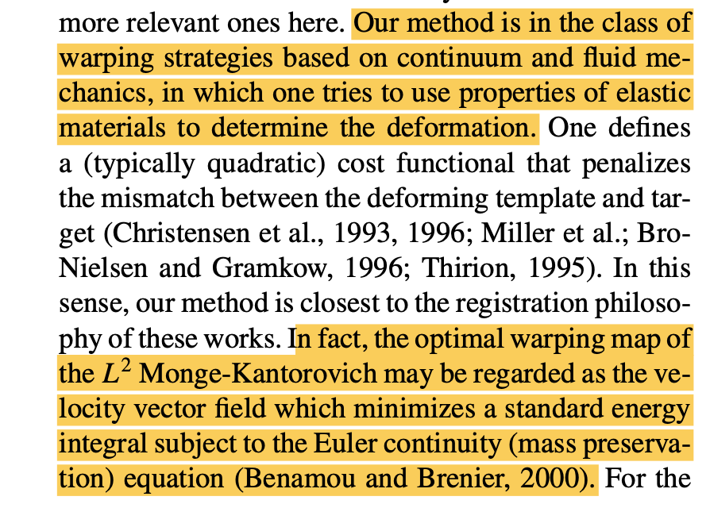

映射$\tilde u$需要是保质量的(质量守恒),并有如下的Jacobi方程

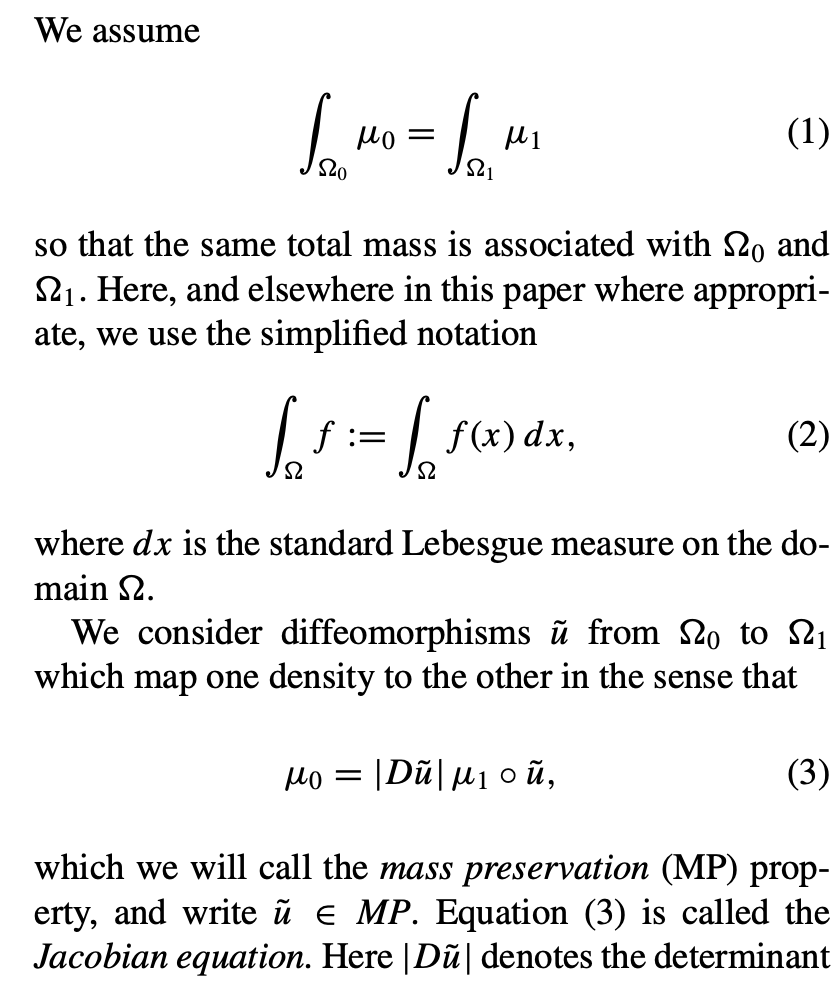

而代价如下定义

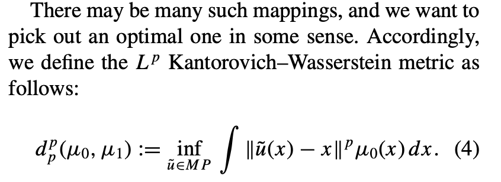

我们要找的最右传输映射就是如下代价最小的保面积映射

由Brenier证明，这个最有传输映射是存在且唯一的，并且是某个凸函数(势函数)的微分，所以最后就变成求解如下一个偏微分方程

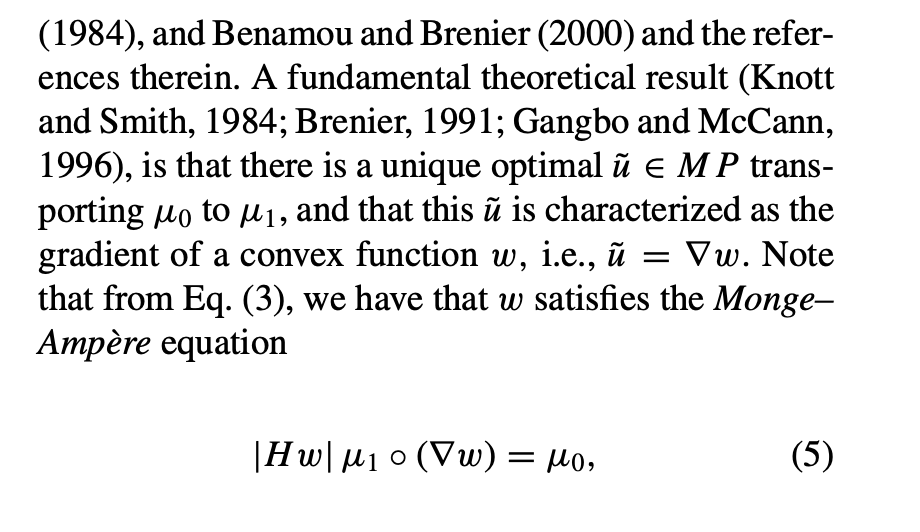

## 算法求解

对于映射u可以做如下的极分解(Polar factorization)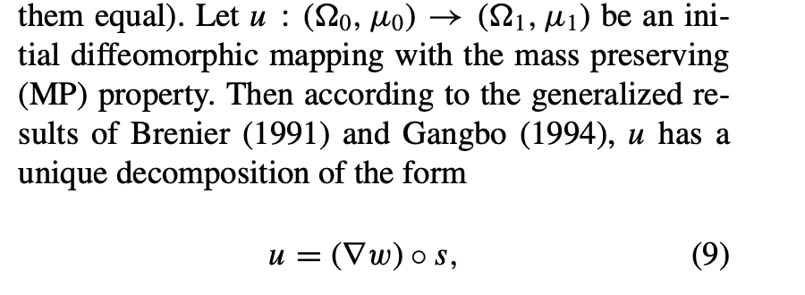

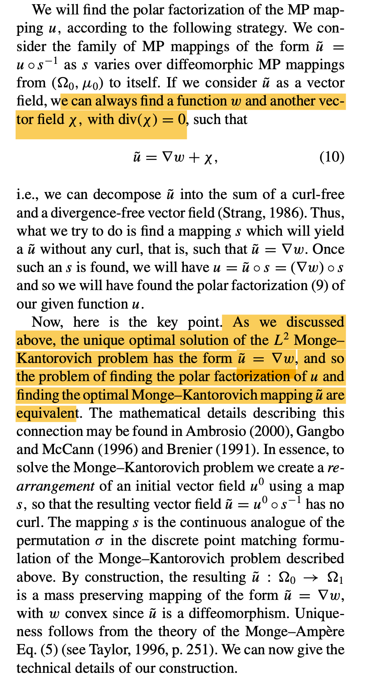

### 求一个初始映射

对$\mathbb{R}^2$上分别在横轴和纵轴上求解

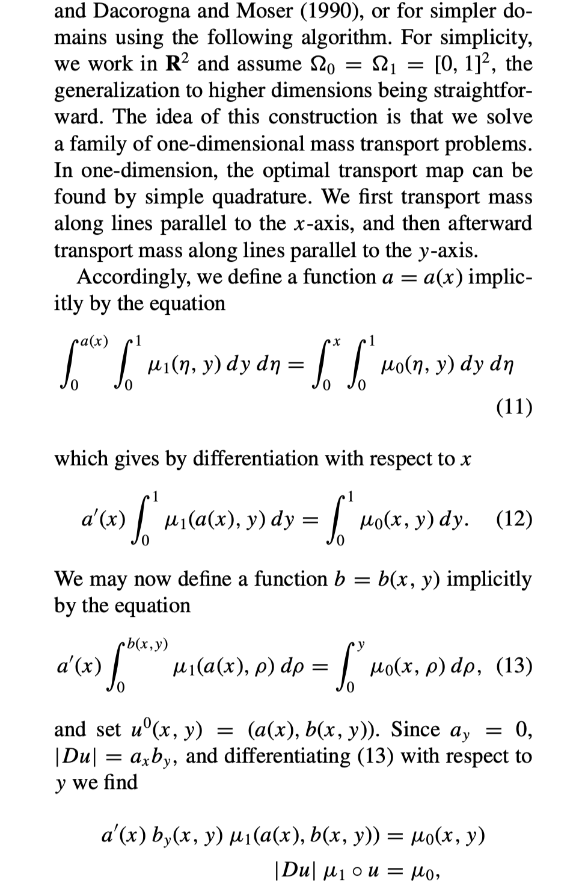

### 去除旋度

交替进行极分解与梯度下降

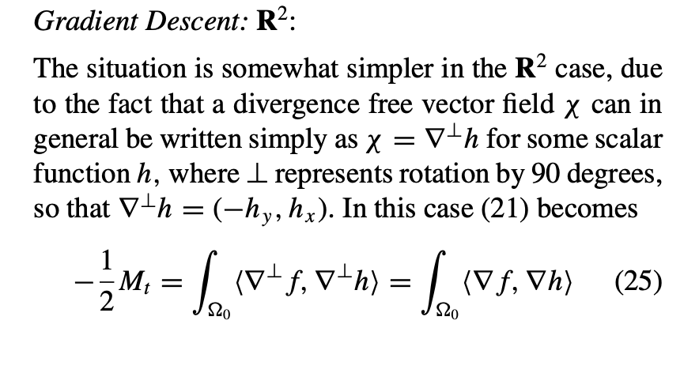

进行极分解后转化为求一个Dirichelet问题

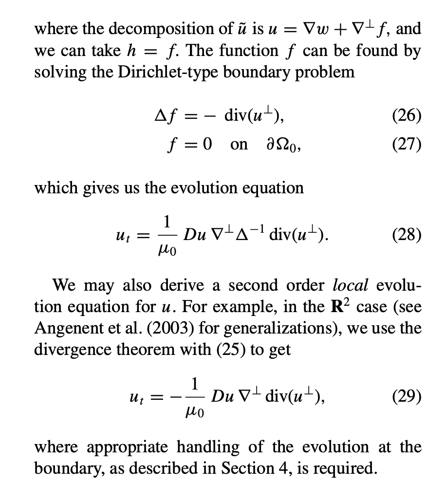

## 算法

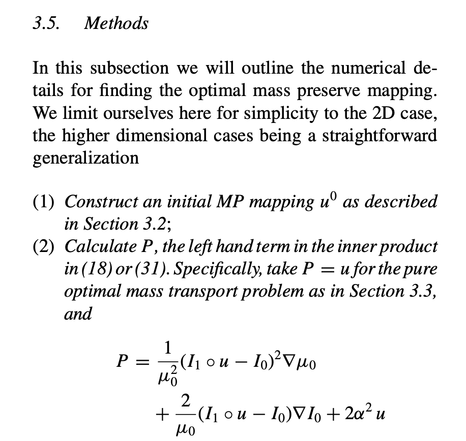

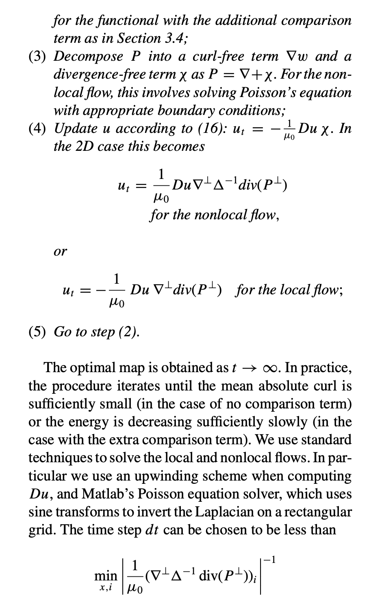

定义流体方程

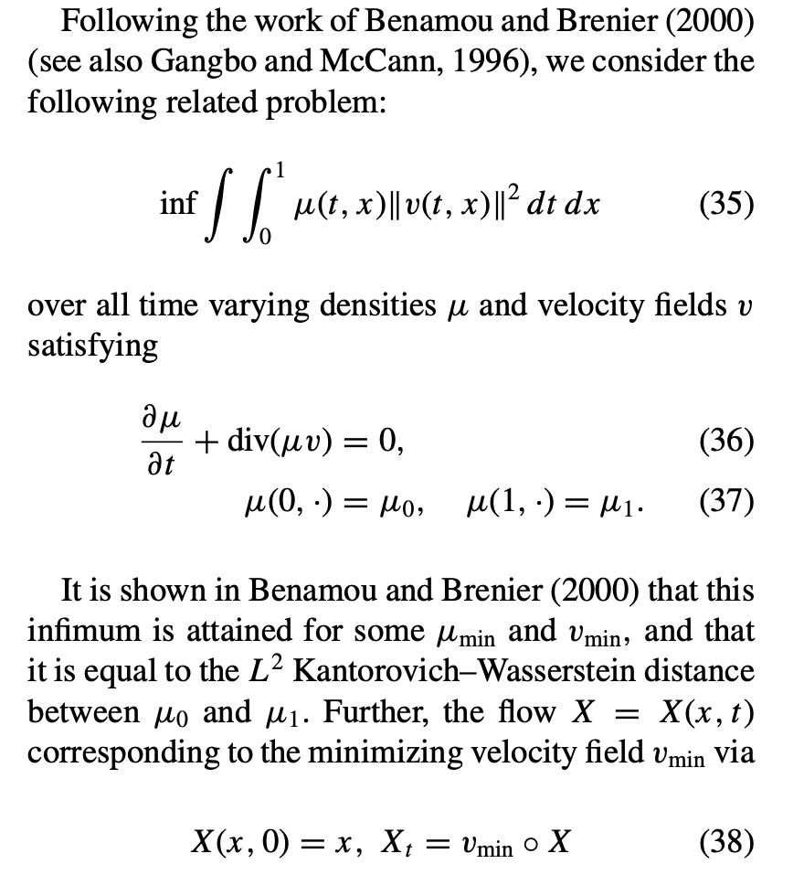

## 参考文献

- Villani, C. (2009). *Optimal Transport: Old and New*. Springer.
- Peyre, G., & Cuturi, M. (2019). *Computational Optimal Transport*. Foundations and Trends in Machine Learning.
- Brenier, Y. (1991). *Polar factorization and monotone rearrangement of vector-valued functions*.
- Benamou, J.-D., & Brenier, Y. (2000). *A computational fluid mechanics solution to the Monge-Kantorovich mass transfer problem*.
- Cuturi, M. (2013). *Sinkhorn distances: Lightspeed computation of optimal transport*.
